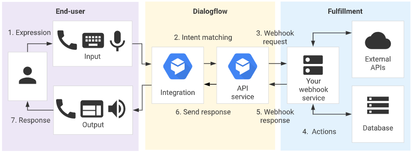

# Chat Bot

> 챗봇은 아직 발전하기엔 갈길이 멀다
>
> 하지만 웹사이트와 같다고 보면된다.
>
> 향후에는 모든회사가 챗봇을 도입할 거다.

## 챗봇의 핵심원리 

### intent classification 

- 동사인식 , 말하는 사람의 의도의 이해

### entity extraction 
- 핵심어 추출, 목적어를 인식

### slot filling

- 부족한 정보 재정의, 

## 문자를 음성으로 바꾸는 모듈 설치

gtts 설치

pip install gtts

## Fulfillment

1. 최종 사용자가 표현을 입력하거나 말합니다.
2. Dialogflow가 최종 사용자 표현을 인텐트와 일치시키고 매개변수를 추출합니다.
3. Dialogflow가 웹훅 서비스에 [웹훅 요청](https://cloud.google.com/dialogflow/docs/fulfillment-how?hl=ko#webhook_request) 메시지를 보냅니다. 이 메시지에는 일치하는 인텐트, 작업, 매개변수, 인텐트에 정의된 응답에 대한 정보가 포함됩니다.
4. 서비스가 필요에 따라 데이터베이스 쿼리 또는 외부 API 호출과 같은 작업을 수행합니다.
5. 서비스에서 Dialogflow에 [웹훅 응답](https://cloud.google.com/dialogflow/docs/fulfillment-how?hl=ko#webhook_response) 메시지를 보냅니다. 이 메시지에는 최종 사용자에게 전송되어야 하는 응답이 포함됩니다.
6. Dialogflow가 이 응답을 최종 사용자에게 보냅니다.
7. 최종 사용자가 응답을 보거나 듣습니다.

## 사용자별 웹 세션 만들기

