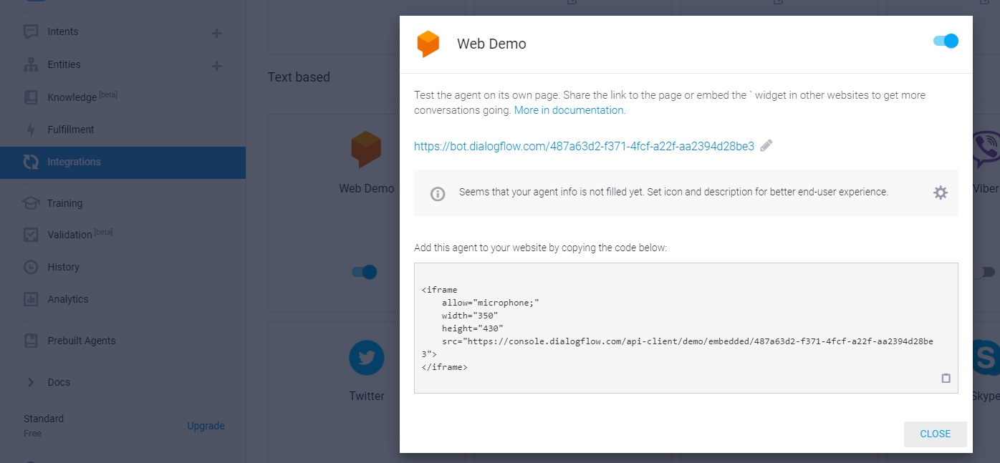
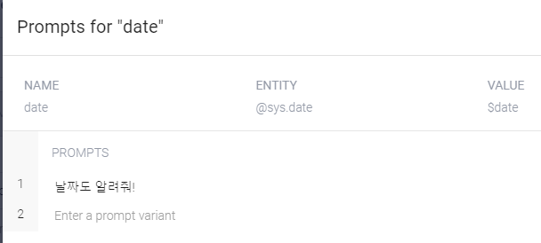

## google dialogflow

> 구글에서 제공하는 챗봇 서비스


## 절차

> 다이얼로그플로우 가입하고 `create agent`를 통해 챗봇생성


`Welcome Intent` 항목을 보면 초기에 제공해주는 응답이 몇개 있따.


`Training phrases`에 데이터가 많을 경우 `기계학습`을 수행, 많이 없으면 일반적인 phrases 에 list 참조


`Integrations`에서는 다른 SNS와 통합 가능하다. 다음에서는 연동이 안된다. `web demo`를 한번 써보자!



> 도메인을 변경해서 다음과 같이 변경하였다.
>
> 나는 `https://bot.dialogflow.com/madfalconweb `이라고 적었다.


> 해당 주소 접속시 다음과 같이 테스트를 해볼 수 있다.


> 안드로이드 폰에서도 가능


## entity 설정

>  시스템 엔티티가 있고 사용자 엔티티가 있다.
>
> 시스템은 구글에서 지정해놓은거 사용자는 사용자가 직접 수동으로 만들어야 하는거


> 이건 구글에서 제공하는 엔티티를 사용, 예를들어 `sys.date` 에 속하는 부분의 경우 오늘 뿐만 아니라 내일이나 어제 등등 date 관련 단어는 다 같은 명령어로 처리


> 응답에 `$data` 와 `$geo-city`를 입력하면 응답시 매칭해줌


> 파라미터 name 앞에 `$` 붙여서 사용


> 위 intent는 2개의 파라미터가 들어가있고 항상 2개의 파라미터 질문이 들어가야 함.
>
> 하나만들어갈 경우 에러가 발생


> `Required` 기능을 체크하여 핵심 문장이 빠진 경우 다시 물어보도록 설정 가능


> `Action and parameters` 항목에서 `Required` 설정 체크



> PROMPTS 설정에서 응답줄 문장 설정


## 계층적 Intent 생성

> 계층적 Intent를 생성하고 싶은경우 Intent 항목에서 해당 인텐트에 커서를 위치하고 `Add follow0up intent ` 클릭 후 `Custom` 클릭


- 계층적 구조를 통해 아래처럼 만들어보자!

```markdown
인텐트 3개(계층적 구조를 적용)

나: 메뉴판 주세요 음식주문할게요.
직원: 어떤 음식을 주문하실건가요?
	나: 짜장면 주세요.
	직원: 짜장면 주문 할까요?
        나: 네 주세요.
        직원: 짜장면 주문이 완료 되었습니다.
```


## 시나리오 예제(응용)

- 계층 구조에서  마지막 Intent(`orderfood_menu_confirm`)에서 처음 Intent(`orderfood`)의 parameter(홍길동) 값 호출하기

- 처음 Intent 인 `orderfood`에는 다음의 파라미터가 설정되어 있다.


- 마지막 Intent에서 해당 파라미터(`name`)를 호출하기 위해서는 아래의 과정을 거친다.


> 1. `orderfood_menu_confirm`에서 Input 받아올 Contexts를 추가한다(`orderfood`).
> 2. 추가 후 출력 값에 `#orderfood-followup.name` 을 지정


## 복합 변수 입력받고 출력하기

> 파라미터에 `IS LIST` 체크하면 해당 파라미터는 복수로 입력받고 출력 가능


## 엔트리간 연결 설정 및 적용

> 아래와 같이 엔트리 설정, 
>
> - value 설정 시`@엔트리:변수명` 로 설정
> - 변수명은 추후 리스트형식으로 반환 됨
>   - ex)`[ {"foodname": "짜장면" , "foodnumber": 2} ]`


