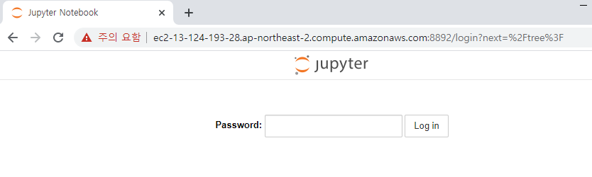
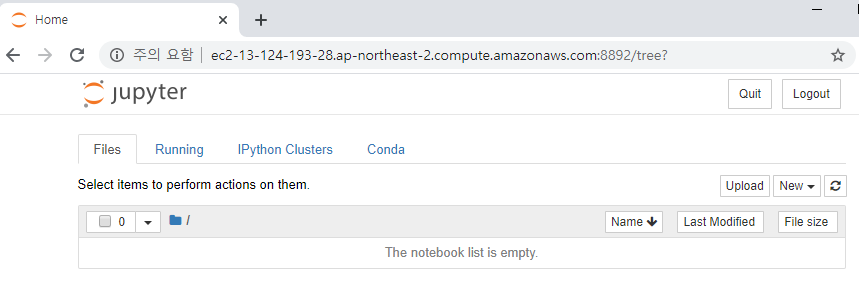

# AWS 이용방법

## Jupyter Notebook 이용하기

### 0. ssh 를 통해 쉘 접속

- AWS 할당받은 IP와 ppk 파일을 통해 쉘 접속

### 1. conda activate 활성

```bash
#쉘 접속 후 activate
lab03@ip-172-31-40-104:~$ conda activate tensorflow_p36
```

### 2. jupyter notebook install and config

```bash
#프로젝트 폴더 생성
(tensorflow_p36) lab03@ip-172-31-40-104:~$ mkdir detection
(tensorflow_p36) lab03@ip-172-31-40-104:~$ cd detection/

#jupyter notebook 생성
(tensorflow_p36) lab03@ip-172-31-40-104:~/detection$ jupyter notebook --generate-config
Writing default config to: /home/lab03/.jupyter/jupyter_notebook_config.py

#파이선 접속
(tensorflow_p36) lab03@ip-172-31-40-104:~/detection$ python
Python 3.6.5 |Anaconda, Inc.| (default, Apr 29 2018, 16:14:56)
[GCC 7.2.0] on linux
Type "help", "copyright", "credits" or "license" for more information.

#접속용 암호 생성
>>> from notebook.auth import passwd # 암호를 통해 접속 허용 설정
>>> passwd()
Enter password: 비밀번호 입력
Verify password: 비밀번호 재입력
'sha1:51d2ebfdf7b8:efb8df2872e01648fbe56dbbdd1571546084c18c' # 주피터 노트북 접속용 토큰 값
>>>

(tensorflow_p36) lab03@ip-172-31-40-104:~/.jupyter$ vi jupyter_notebook_config.py
# 아래의 명령어를 복사 및 붙여넣기
c.NotebookApp.password = u'sha1:51d2ebfdf7b8:efb8df2872e01648fbe56dbbdd1571546084c18c'
```

### 3. jupyter notebook start

```bash
#jupyter-notebook --ip [들여보낼ip] --port [포트번호] 입력
(tensorflow_p36) lab03@ip-172-31-40-104:~/detection$ jupyter-notebook --ip 0.0.0.0 --port 8892
[I 09:39:31.970 NotebookApp] [nb_conda_kernels] enabled, 26 kernels found
[I 09:39:31.978 NotebookApp] Writing notebook server cookie secret to /run/user/1004/jupyter/notebook_cookie_secret
[I 09:39:32.135 NotebookApp] Loading IPython parallel extension
[I 09:39:32.156 NotebookApp] JupyterLab beta preview extension loaded from /home/ubuntu/anaconda3/envs/tensorflow_p36/lib/python3.6/site-packages/jupyterlab
[I 09:39:32.156 NotebookApp] JupyterLab application directory is /home/ubuntu/anaconda3/envs/tensorflow_p36/share/jupyter/lab
[I 09:39:32.296 NotebookApp] [nb_conda] enabled
[I 09:39:32.298 NotebookApp] Serving notebooks from local directory: /home/lab03/detection
[I 09:39:32.298 NotebookApp] 0 active kernels
[I 09:39:32.298 NotebookApp] The Jupyter Notebook is running at:
[I 09:39:32.298 NotebookApp] http://ip-172-31-40-104:8892/
[I 09:39:32.298 NotebookApp] Use Control-C to stop this server and shut down all kernels (twice to skip confirmation).
[W 09:39:32.299 NotebookApp] No web browser found: could not locate runnable browser.
```

### 4. connect jupyter notebook

- 웹에서 aws 주소:포트번호 입력 후 접속

  

  


## Darknet 사용

1. `git clone https://github.com/pjreddie/darknet.git` 입력 후 clone 받기
2. `cd darknet` 후 `vi Makefile` 입력 후 다음과 같이 설정 변경

    ```
    CUDA 사용 GPU=1
    opencv 사용 OPENCV=1
    ```

3. `make` 입력 후 설정 컴파일 진행

4. `wget https://pjreddie.com/media/files/yolov3.weights` 입력 후 학습이 적용된 weight 파일 다운로드

5. `./darknet detect cfg/yolov3.cfg yolov3.weights data/dog.jpg` 입력 후  테스트 진행