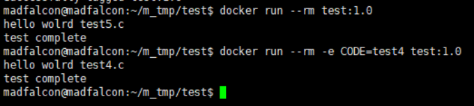

# Docker Advanced Manual

응용메뉴얼


```
docker \
  run \
  --detach \
  --env MYSQL_ROOT_PASSWORD=default \
  --env MYSQL_DATABASE=madfalcon_db \
  --name m_mysql \
  --publish 3306:3306 \
  --rm \
mysql;


docker \
  run \
  --name python_test \
  -it \
  -p 7000-7009:7000-7009 \
  --rm \
  -v "/home/madfalcon/m_tmp/python:/usr/django/app" \
python:3.6 /bin/bash 


FROM python:3.6
  
RUN apt-get update \
    && apt-get install -y --no-install-recommends \
        postgresql-client \
    && rm -rf /var/lib/apt/lists/*

COPY . /app
RUN chmod 755 /app/start.sh
WORKDIR /app
RUN pip install django

EXPOSE 7000
ENTRYPOINT ["/app/start.sh"]


start.sh
#!/bin/bash

python manage.py makemigrations
python manage.py migrate

python manage.py runserver 0.0.0.0:7000


이미지 빌드
docker build -t dockerdjango .


docker run -it --rm -d -p 7000:7000 --name m_web dockerdjango:1.0  
```


### C언어 파일 gcc 이용해서 docker run 명령어에 따른 코드 컴파일




```
C언어 파일 docker run 명령어에 따른 컴파일

Dockerfile
--------------------------------------------
FROM gcc
COPY . /usr/src/myapp
WORKDIR /usr/src/myapp
ENV CODE=test5
#RUN gcc -c ${CODE}.c
#RUN gcc -o myapp ${CODE}
#RUN chmod 755 myapp
#CMD echo $CODE
RUN chmod 755 runc.sh
CMD echo "create ${CODE}.c"
ENTRYPOINT ["./runc.sh"]
#CMD ["./myapp"]
#RUN rm myapp
--------------------------------------------


runc.sh
--------------------------------------------
#!/bin/bash
#gcc -c ${CODE}.c
#gcc -o myapp ${CODE}.o
gcc -o myapp ${CODE}.c
./myapp
echo 'test complete'
#rm myapp ${CODE}.o
rm myapp
--------------------------------------------      

```

