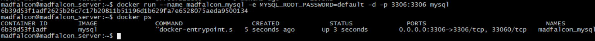
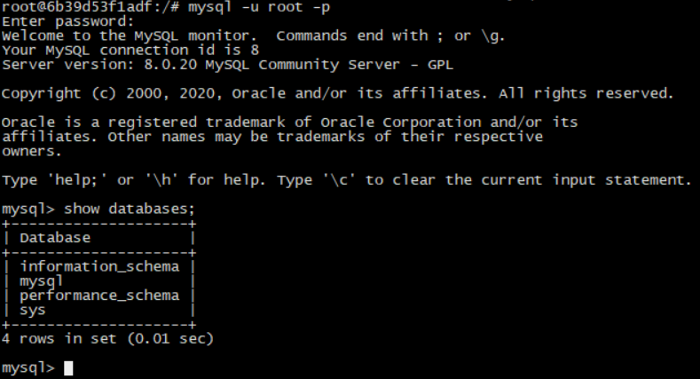
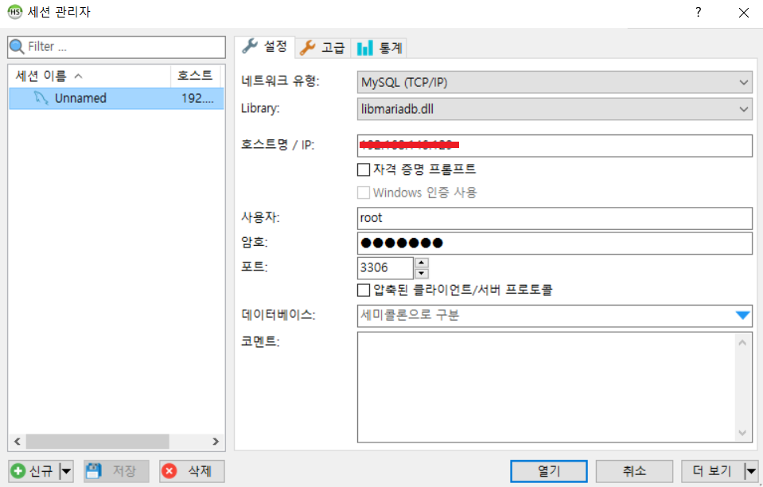
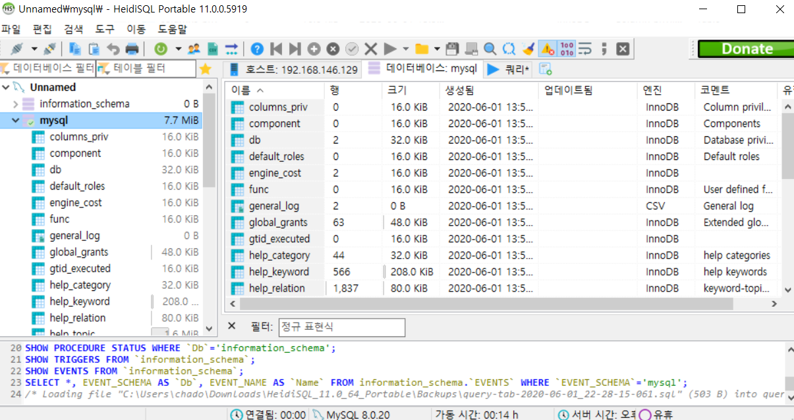

# Docker Mysql Manual

Docker 를 이용하여 mysql 를 설치하고 사용해보자!

## 1. Docker Hub에서 Mysql image 가져오기

[Docker Hub](https://hub.docker.com/)에서 대부분의 어플리케이션 이미지를 제공한다.

아래의 명령어를 이용하여 `mysql` 이미지를 가져오자!

- `docker pull mysql`

```bash
madfalcon@madfalcon_server:~$ docker pull mysql
Using default tag: latest
latest: Pulling from library/mysql
afb6ec6fdc1c: Pull complete 
0bdc5971ba40: Pull complete 
97ae94a2c729: Pull complete 
f777521d340e: Pull complete 
1393ff7fc871: Pull complete 
a499b89994d9: Pull complete 
7ebe8eefbafe: Pull complete 
597069368ef1: Pull complete 
ce39a5501878: Pull complete 
7d545bca14bf: Pull complete 
211e5bb2ae7b: Pull complete 
5914e537c077: Pull complete 
Digest: sha256:a31a277d8d39450220c722c1302a345c84206e7fd4cdb619e7face046e89031d
Status: Downloaded newer image for mysql:latest
docker.io/library/mysql:latest

madfalcon@madfalcon_server:~$ docker images
REPOSITORY          TAG                 IMAGE ID            CREATED             SIZE
mysql               latest              30f937e841c8        11 days ago         541MB
madfalcon@madfalcon_server:~$ 
```


## 2. run 명령어를 통해 mysql 실행하기

Docker run 명령어를 이용하여 mysql image를 실행시킨다.

- `docker run --name madfalcon_mysql -e MYSQL_ROOT_PASSWORD=[mypass] -d -p 3306:3306 mysql`
  - `--name madfalcon_mysql` : image 실행 후 저장할 컨테이너 이름, 생성하면 `madfalcon_mysql`로 저장된다.
  - `-e MYSQL_ROOT_PASSWORD=[mypass]` : mysql에 접속하기 위한 root 패스워드를 지정한다. 필수로 기입해주어야 한다. `[mypass]`에는 원하는 패스워드로 설정한다.
  - `-e MYSQL_DATABASE=[your_db]` : 컨테이너 실행시 `your_db`라는 데이터베이스를 생성한다.
  - `-d` : 백그라운드로 실행하기 위한 옵션이다.
  - `-p` : 포트포워딩을 하기위한 옵션이다. 앞의 3306은 외부에서 접속하는 포트이고 뒤의 3306은 내부로 연결해주는 포트이다. DB경우 default 포트가 3306이다.  만약 8888:3306으로 지정되어 있다면 외부에서는 8888로 요청할 경우 3306 포트로 매핑시켜준다.
  - `mysql` : docker mysql 이미지이다.



> docker ps를 이용하여 실행중인 프로세스 상태를 확인할 수 있다.

## 3. exec 명령어를 이용하여 mysql 접속하기

Docker exec 명령어를 이용하여 외부에서 컨테이너 안의 명령을 실행할 수 있다. 우리는 이 기능을 이용하여 쉘 모드로 진입 후 mysql에 접속해보자!

- `docker exec -it mysql /bin/bash`
  - `-i` : 표준 입력(stdin)을 활성화하며 컨테이너와 연결되어 있지 않더라도 표준 입력을 유지한다.
  - `-t` : TTY 모드(pseudo-TTY)를 사용한다. Bash를 사용하려면 이 옵션을 필수적으로 설정해야 하는데 이 옵션을 설정하지 않으면 명령을 입력할 수는 있지만 셀이 표시되지 않는다.
  - `/bin/bash` : 컨테이너안의 접속할 경로, bash 셸에 연결한다고 보면된다.

```bash
madfalcon@madfalcon_server:~$ docker exec -it madfalcon_mysql /bin/bash
root@6b39d53f1adf:/# 
```

`root@6b39d53f1adf`를 설명하자면 root 계정으로 해당 컨테이너(6b39d53f1adf)를 접속한 상태라고 생각하면 된다. 이제 mysql을 접속해보자! 이후는 mysql 명령어와 같다.

- `mysql -u root -p`



> password는 아까 docker run에서 입력했던 password를 작성 후 접속하면 된다.

## 4. 외부에서 내부 mysql(컨테이너) 접속하기

외부에서 정상적으로 접속이 되는지 테스트하기 위해선 별도의 sql 접속 툴이 필요하다. 나는 [heidisql](https://www.heidisql.com/)을 이용하여 접속해 보겠다. 해당 프로그램은 무료이고 별도의 설치가 필요없이 zip 파일을 다운받아 실행하면 된다.



> IP는 현재 docker가 실행중인 IP를 입력하고 포트는 docker run에서 입력했던 외부용 포트(3306)를 입력해주면된다.



> 정상적으로 접속시 각종 db 정보를 확인할 수 있다.