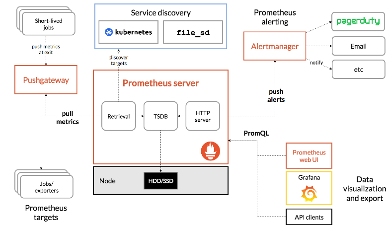

# Prometheus

해당 내용들은 [프로메테우스 공식문서](https://prometheus.io/docs/introduction/overview/)를 기반으로 작성되었다.

오픈소스 기반의 모니터링 시스템으로 Kubernetes상에서 가장 많이 사용한다. [Cloud Native Computing Foundation](https://cncf.io/)에 소속되어 있다.

## 1. 특징

이건 내가 번역한 것이다....100% 신뢰는 하지말자

- a multi-dimensional [data model](https://prometheus.io/docs/concepts/data_model/) with time series data identified by metric name and key/value pairs
  - metric name과 key-value 쌍으로 식별되는 다차원 시계열 데이터 모델이다.
- PromQL, a [flexible query language](https://prometheus.io/docs/prometheus/latest/querying/basics/) to leverage this dimensionality
  - 유연한 쿼리 언어인 PromQL을 이용하여 활용한다
- no reliance on distributed storage; single server nodes are autonomous
  - 분산 저장 장치에 의존하지 않는다.
- time series collection happens via a pull model over HTTP
  - HTTP를 통한 pull 모델을 통해 시계열 형식으로 데이터를 수집한다.

- [pushing time series](https://prometheus.io/docs/instrumenting/pushing/) is supported via an intermediary gateway
  - push time series는 중간 게이트웨이를 통해 지원된다.
- targets are discovered via service discovery or static configuration
  - 서비스 검색 또는 정적 구성을 통해 타겟을 검색한다.
- multiple modes of graphing and dashboarding support
  - graph와 dashboard같은 다양한 모드를 지원한다.

## 2. 다른 모니터링 시스템과의 차이점

여러 모니터링 시스템의 동작방식은 클라이언트가 여러 metric 데이터를 수집하여 서버에 보내주는(push) 방식이다. 

하지만 프로메테우스는 서버가 클라이언트에 주기적으로 접속하여 데이터를 가져오(pull)는 방식이다(push 방식도 지원). 

이러한 차이점에서 프로메테우스는 push 과정에서 서버에 부하가 몰리는 현상을 피할 수 있다는 장점이 있다. 

## 3. 아키텍쳐

우선 구성은 크게 4가지로 나눌 수 있다.

1. exporters : 모니터링 대상의 Metric 데이터를 수집하고 Prometeus가 접속 했을 때 정보를 알려주는 역할을 수행

2. Prometheus server : expoter가 열어놓은 HTTP 엔드포인트에 접속해서 Metric을 수집

3. Grafana : 수집된 데이터를 기반으로 GUI를 통해 시각화 해줌

4. alertmanager : 알람규칙에 정의된 대로 알람 서비스 제공

   

출처 : [프로메테우스 공식 문서](https://prometheus.io/docs/introduction/overview/)

## 참고

1. [프로메테우스 공식 문서](https://prometheus.io/docs/introduction/overview/)

2. [프로메테우스 설치 및 개념](https://hyunki1019.tistory.com/127)

3. [오픈소스 모니터링 시스템 Prometheus #1](https://blog.outsider.ne.kr/1254)

