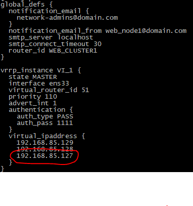
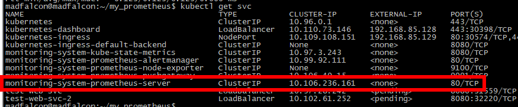
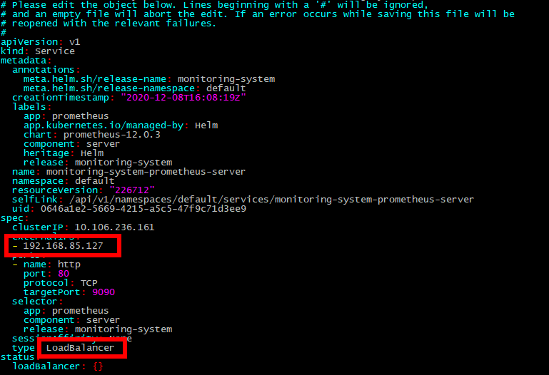
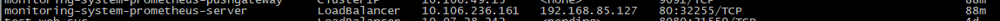
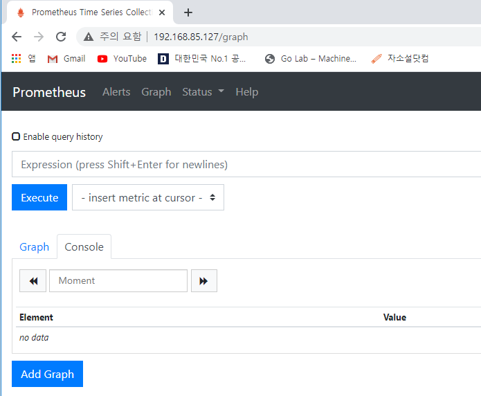
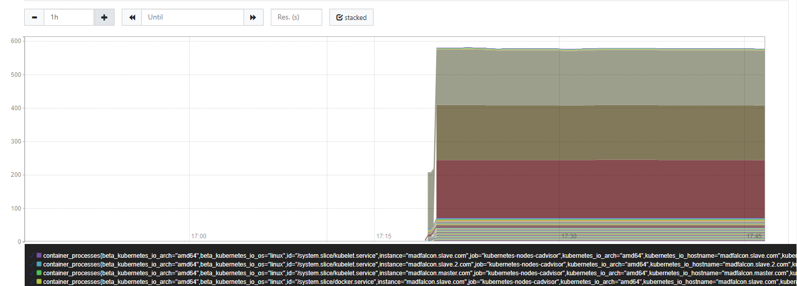

# Prometheus Install via Helm

Helm을 이용하여 프로메테우스를 설치해보자!


## 1. 사전환경

1. 쿠버네티스 클러스터 구성된 환경(master-worker)
2. helm([Helm](https://helm.sh/)공식 홈페이지에서 절차를 통해 설치하면 된다.)


## 2. 설치

1. 아래 명령어를 입력하여 helm에 프로메테우스 차트를 추가해준다.

   - `helm repo add prometheus-community https://prometheus-community.github.io/helm-charts`

     ```bash
     #helm search repo prometheus-community를 입력하여 repo 확인
     madfalcon@madfalcon:~/my_dashboard$ helm search repo prometheus-community
     NAME                                                    CHART VERSION   APP VERSION     DESCRIPTION                                       
     prometheus-community/alertmanager                       0.2.0           v0.21.0         The Alertmanager handles alerts sent by client ...
     prometheus-community/kube-prometheus-stack              12.7.0          0.44.0          kube-prometheus-stack collects Kubernetes manif...
     prometheus-community/prometheus                         12.0.3          2.22.1          Prometheus is a monitoring system and time seri...
     prometheus-community/prometheus-adapter                 2.9.0           v0.8.2          A Helm chart for k8s prometheus adapter           
     prometheus-community/prometheus-blackbox-exporter       4.10.1          0.18.0          Prometheus Blackbox Exporter                      
     ...............
     .............
     ..........
     madfalcon@madfalcon:~/my_dashboard$ 
     ```

2. 프로메테우스를 설치한다.

   - `helm install monitoring-system prometheus-community/prometheus`

     ```bash
     madfalcon@madfalcon:~/my_dashboard$ helm install monitoring-system prometheus-community/prometheus
     W1208 16:08:19.566068  221899 warnings.go:67] rbac.authorization.k8s.io/v1beta1 ClusterRole is deprecated in v1.17+, unavailable in v1.22+; use rbac.authorization.k8s.io/v1 ClusterRole
     W1208 16:08:19.574381  221899 warnings.go:67] rbac.authorization.k8s.io/v1beta1 ClusterRoleBinding is deprecated in v1.17+, unavailable in v1.22+; use rbac.authorization.k8s.io/v1 ClusterRoleBinding
     W1208 16:08:19.708626  221899 warnings.go:67] rbac.authorization.k8s.io/v1beta1 ClusterRole is deprecated in v1.17+, unavailable in v1.22+; use rbac.authorization.k8s.io/v1 ClusterRole
     W1208 16:08:19.759074  221899 warnings.go:67] rbac.authorization.k8s.io/v1beta1 ClusterRoleBinding is deprecated in v1.17+, unavailable in v1.22+; use rbac.authorization.k8s.io/v1 ClusterRoleBinding
     NAME: monitoring-system
     LAST DEPLOYED: Tue Dec  8 16:08:19 2020
     NAMESPACE: default
     STATUS: deployed
     REVISION: 1
     TEST SUITE: None
     NOTES:
     The Prometheus server can be accessed via port 80 on the following DNS name from within your cluster:
     monitoring-system-prometheus-server.default.svc.cluster.local
     
     
     Get the Prometheus server URL by running these commands in the same shell:
       export POD_NAME=$(kubectl get pods --namespace default -l "app=prometheus,component=server" -o jsonpath="{.items[0].metadata.name}")
       kubectl --namespace default port-forward $POD_NAME 9090
     
     
     The Prometheus alertmanager can be accessed via port 80 on the following DNS name from within your cluster:
     monitoring-system-prometheus-alertmanager.default.svc.cluster.local
     
     
     Get the Alertmanager URL by running these commands in the same shell:
       export POD_NAME=$(kubectl get pods --namespace default -l "app=prometheus,component=alertmanager" -o jsonpath="{.items[0].metadata.name}")
       kubectl --namespace default port-forward $POD_NAME 9093
     #################################################################################
     ######   WARNING: Pod Security Policy has been moved to a global property.  #####
     ######            use .Values.podSecurityPolicy.enabled with pod-based      #####
     ######            annotations                                               #####
     ######            (e.g. .Values.nodeExporter.podSecurityPolicy.annotations) #####
     #################################################################################
     
     
     The Prometheus PushGateway can be accessed via port 9091 on the following DNS name from within your cluster:
     monitoring-system-prometheus-pushgateway.default.svc.cluster.local
     
     
     Get the PushGateway URL by running these commands in the same shell:
       export POD_NAME=$(kubectl get pods --namespace default -l "app=prometheus,component=pushgateway" -o jsonpath="{.items[0].metadata.name}")
       kubectl --namespace default port-forward $POD_NAME 9091
     
     For more information on running Prometheus, visit:
     https://prometheus.io/
     madfalcon@madfalcon:~/my_dashboard$ 
     ```

3. 설치된 프로메테우스 pods들을 확인해보자

   ```bash
   madfalcon@madfalcon:~/my_dashboard$ kubectl get pods
   NAME                                                        READY   STATUS    RESTARTS   AGE
   monitoring-system-kube-state-metrics-6849d4cc9-m2s8r        1/1     Running   0          39m
   monitoring-system-prometheus-alertmanager-5fc74dcf5-4ktpp   0/2     Pending   0          39m
   monitoring-system-prometheus-node-exporter-6jspl            1/1     Running   0          39m
   monitoring-system-prometheus-node-exporter-94l4k            1/1     Running   0          39m
   monitoring-system-prometheus-pushgateway-7b8768f885-h2q7t   1/1     Running   0          39m
   monitoring-system-prometheus-server-6cdc9c8c49-wtjb7        0/2     Pending   0          39m
   
   # 프로메테우스의 Pods 중에서 Pending상태로 되어 있는데 describe를 통해 에러 내용을 확인해보면  PersistentVolumeClaims 설정을 추가적으로 진행해주어야 한다. 
   #이유는 k8s클러스터에 StorageClass가 정의되어있지 않기 때문이다(pvc의 요청을 받아줄 provisioner가 없기 때문). 그래서 일단 pv옵션을 false로 변경해주어 EmptyDir을 사용하게 해야 한다.
   ```

4. 수정하기 위한 yaml 파일을 생성한다.

   ```
   pv.yaml
   ```

   ```yaml
   alertmanager:
       persistentVolume:
           enabled: false
   server:  
       persistentVolume:
           enabled: false
   pushgateway: 
       persistentVolume:
           enabled: false
   ```

5. 해당 yaml 파일을 적용한다.

   - `helm upgrade -f pv.yaml monitoring-system prometheus-community/prometheus`

6. 확인결과

```bash
madfalcon@madfalcon:~/my_prometheus$ kubectl get pods
NAME                                                        READY   STATUS              RESTARTS   AGE
monitoring-system-kube-state-metrics-6849d4cc9-m2s8r        1/1     Running             0          70m
monitoring-system-prometheus-alertmanager-5fc74dcf5-4ktpp   0/2     Pending             0          70m
monitoring-system-prometheus-alertmanager-d997bfd89-dwrqh   0/2     ContainerCreating   0          18s
monitoring-system-prometheus-node-exporter-6jspl            1/1     Running             0          70m
monitoring-system-prometheus-node-exporter-94l4k            1/1     Running             0          70m
monitoring-system-prometheus-pushgateway-7b8768f885-h2q7t   1/1     Running             0          70m
monitoring-system-prometheus-server-6cdc9c8c49-wtjb7        0/2     Pending             0          70m
monitoring-system-prometheus-server-966775b65-tj86h         0/2     ContainerCreating   0          18s

#시간이 지나면 ContainerCreating 이 Running으로 변환된 것을 확인할 수 있다. 또한 이전 버전에 대한 pending pod는 삭제된다.
madfalcon@madfalcon:~/my_prometheus$ kubectl get pods
NAME                                                        READY   STATUS    RESTARTS   AGE
monitoring-system-kube-state-metrics-6849d4cc9-m2s8r        1/1     Running   0          71m
monitoring-system-prometheus-alertmanager-d997bfd89-dwrqh   2/2     Running   0          54s
monitoring-system-prometheus-node-exporter-6jspl            1/1     Running   0          71m
monitoring-system-prometheus-node-exporter-94l4k            1/1     Running   0          71m
monitoring-system-prometheus-pushgateway-7b8768f885-h2q7t   1/1     Running   0          71m
monitoring-system-prometheus-server-6cdc9c8c49-wtjb7        0/2     Pending   0          71m
monitoring-system-prometheus-server-966775b65-tj86h         1/2     Running   0          54s
```


## 3. 설정

### 3-1. Keepalived 를 통한 VIP 셋팅

프로메테우스 web을 접속하기 위해 새로운 VIP를 할당하고자 한다. VIP는 Keepalived를 통해 새로운 IP를 하나 할당한다.

keepalived 설정 관련 내용은 [링크](https://github.com/madfalc0n/TIL/blob/master/Cloud/k8s/docs/Kubernetes_deploy_web_service.md#1-keepalived-%EC%84%A4%EC%B9%98-%EB%B0%8F-%EC%85%8B%ED%8C%85)를 참고해서 설정하면 된다.



### 3-2. 접속 서버 설정

web 접속은 프로메테우스 서버를 통해 접속할 예정이다. edit 명령어를 이용하여 프로메테우스 서버의 설정을 다음과 같이 변경해주자.



```
kubectl edit svc monitoring-system-prometheus-server
```






### 3-3. 접속 확인

웹에서 http://[VIP] 로 접속을 하면 아래와 같이 화면이 나온다.






## 4. 삭제

helm 명령어를 이용하여 깔끔하게 삭제할 수 있다.

```
helm uninstall monitoring-system
```


## 5. 참고

1. [Helm 3 설치 & 기본 사용방법](https://gruuuuu.github.io/cloud/l-helm-basic/#)