# Prometheus with Grafana

Grafana는 수집된 데이터를 시각화하여 대시보드로 보여주는 오픈소스 툴이다.


## 1. 사전환경

아래 항목들이 설치되어 있어야 한다.

1. 쿠버네티스 클러스터 환경
2. helm
3. Prometheus


## 2. 설치

1. 아래 명령어를 입력하여 grafana 차트를 추가해준다.

   - `helm repo add grafana https://grafana.github.io/helm-charts`

     ```bash
     madfalcon@madfalcon:~/my_prometheus$ helm search repo grafana
     NAME                                            CHART VERSION   APP VERSION     DESCRIPTION                                       
     grafana/grafana                                 6.1.13          7.3.3           The leading tool for querying and visualizing t...
     prometheus-community/kube-prometheus-stack      12.7.0          0.44.0          kube-prometheus-stack collects Kubernetes manif...
     prometheus-community/prometheus-druid-exporter  0.9.0           v0.8.0          Druid exporter to monitor druid metrics with Pr...
     ```

2. grafana를 설치하자.

   - `helm install grafana grafana/grafana`

     ```bash
     madfalcon@madfalcon:~/my_prometheus$ helm install grafana grafana/grafana
     NAME: grafana
     LAST DEPLOYED: Tue Dec  8 18:28:12 2020
     NAMESPACE: default
     STATUS: deployed
     REVISION: 1
     NOTES:
     1. Get your 'admin' user password by running:
     
        kubectl get secret --namespace default grafana -o jsonpath="{.data.admin-password}" | base64 --decode ; echo
     
     2. The Grafana server can be accessed via port 80 on the following DNS name from within your cluster:
     
        grafana.default.svc.cluster.local
     
        Get the Grafana URL to visit by running these commands in the same shell:
     
          export POD_NAME=$(kubectl get pods --namespace default -l "app.kubernetes.io/name=grafana,app.kubernetes.io/instance=grafana" -o jsonpath="{.items[0].metadata.name}")
          kubectl --namespace default port-forward $POD_NAME 3000
     
     3. Login with the password from step 1 and the username: admin
     #################################################################################
     ######   WARNING: Persistence is disabled!!! You will lose your data when   #####
     ######            the Grafana pod is terminated.                            #####
     #################################################################################
     madfalcon@madfalcon:~/my_prometheus$ 
     ```

3. 설치된 grafana pod과 service를 확인해보자

   ```bash
   madfalcon@madfalcon:~/my_prometheus$ kubectl get pods
   NAME                                                        READY   STATUS    RESTARTS   AGE
   grafana-899b48bc8-cgwzp                                     1/1     Running   0          45s
   
   madfalcon@madfalcon:~/my_prometheus$ kubectl get svc
   NAME                                         TYPE           CLUSTER-IP       EXTERNAL-IP      PORT(S)                                     AGE
   grafana                                      ClusterIP      10.106.178.143   <none>           80/TCP                                      48s
   ```

   

## 3. 설정

### 3-1. Keepalived 를 통한 VIP 셋팅

Grafana web을 접속하기 위해 새로운 VIP를 할당하고자 한다. VIP는 Keepalived를 통해 새로운 IP를 하나 할당한다.

keepalived 설정 관련 내용은 [링크](https://github.com/madfalc0n/TIL/blob/master/Cloud/k8s/docs/Kubernetes_deploy_web_service.md#1-keepalived-%EC%84%A4%EC%B9%98-%EB%B0%8F-%EC%85%8B%ED%8C%85)를 참고해서 설정하면 된다.

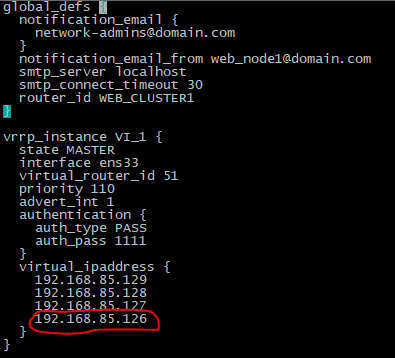

### 3-2. 접속 서버 설정

web 접속은 Grafana 서버를 통해 접속할 예정이다. edit 명령어를 이용하여 Grafana 서버의 설정을 다음과 같이 변경해주자.

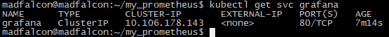

```
kubectl edit svc grafana
```

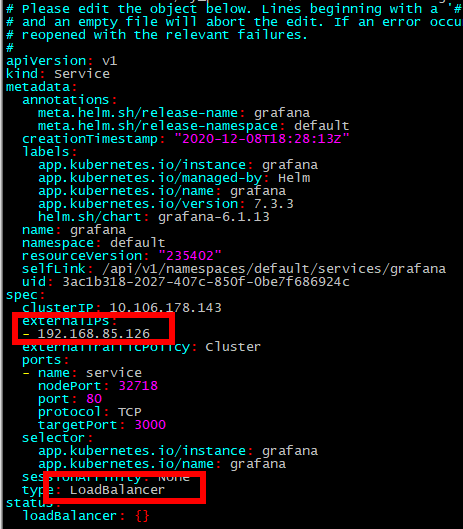

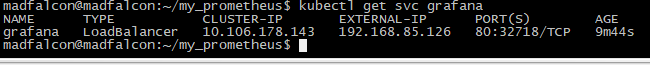


### 3-3. 접속 확인

웹에서 http://[VIP]로 접속을 하면 아래와 같은 화면이 나온다.


비밀번호는 아래 명령어를 입력하여 나온 값이다. 아이디는 admin이다.

```
kubectl get secret grafana -o jsonpath="{.data.admin-password}" | base64 --decode ; echo
```

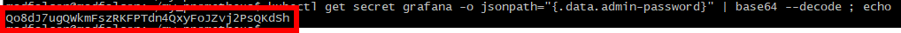

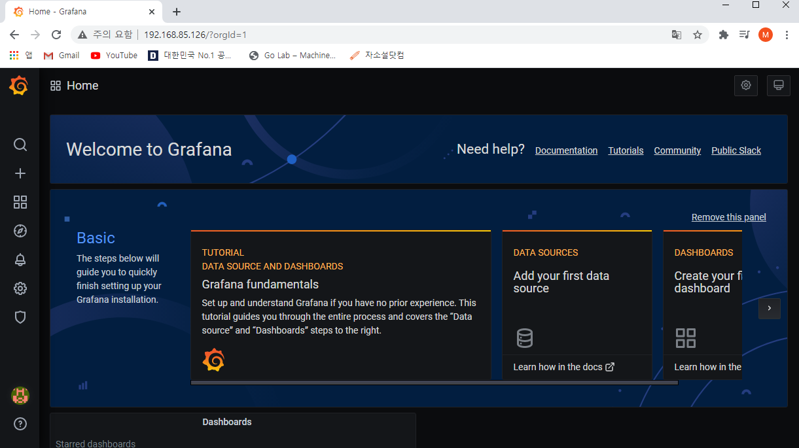


## 4. 설정2

### 4-1. Data Source 연동

Grafana를 성공적으로 설정했다면 다음은 data를 연동하는 것이다.

메인 페이지에서 data source를 추가하는 버튼을 눌러서 Time series databases를 Prometheus로 설정해준다.

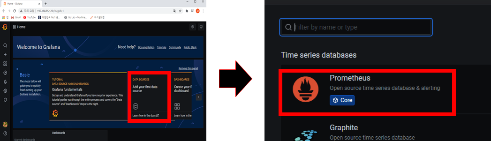

URL은 프로메테우스 서버의 주소와 포트를 기입해준다(포트가 80번일 경우 생략).

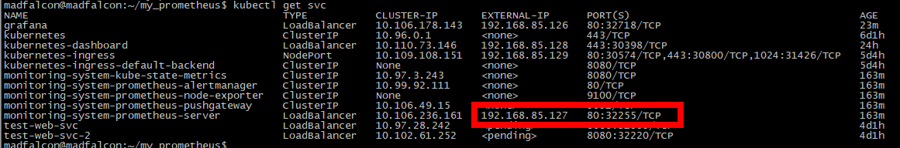

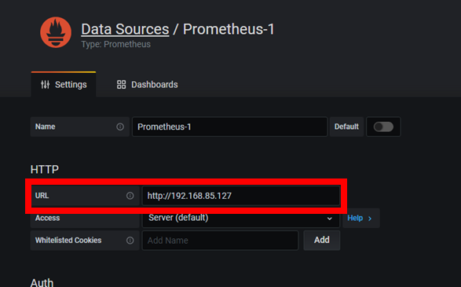

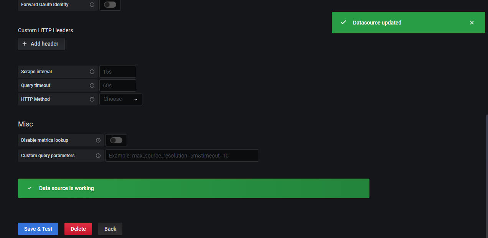

메인 페이지로 돌아오면 Data 연동이 완료 된것을 볼 수 있다.

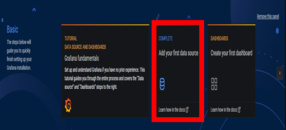


### 4-2. DashBoard 생성

데이터를 연동했으니 데이터를 기반으로 대시보드를 만들어보자!

메인메뉴 좌측 사이드에서 `+`버튼을 눌러 Add  new panel을 눌러보자

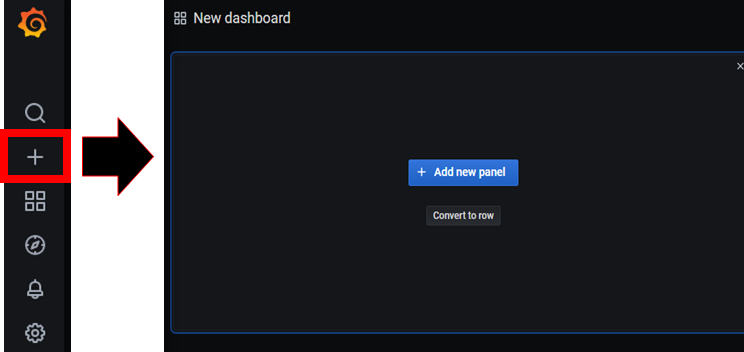

다음과 같이 직접 데이터를 불러와서 커스텀하게 대시보드를 생성할 수 있다. 자세한 내용은 [grafana 공식문서](https://grafana.com/docs/grafana/latest/)를 보자.

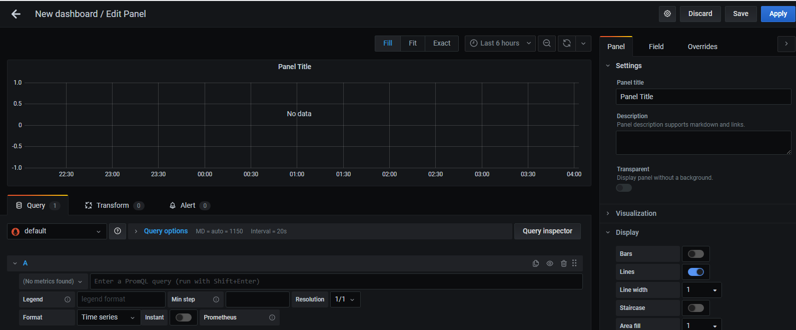


### 4-3. DashBoard 호출

대시보드를 생성할 수 있을 뿐만 아니라 다른 사람들이 만든 대시보드를 가져와서 import 할 수 있다. [Grafana 공식 사이트](https://grafana.com/grafana/dashboards)에서 찾을 수 있다.

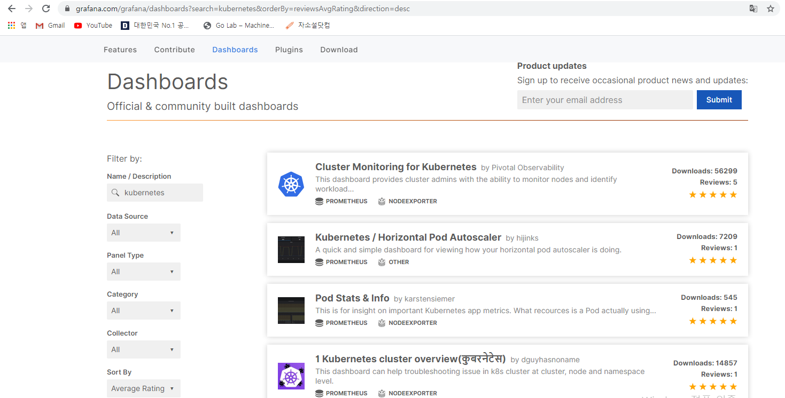

마음에 드는 대시보드를 하나 골라 ID를 복사해서 Grafana에 붙여넣어 준다. 테스트용으로 10000번 ID의 대시보드를 import 해보고자 한다. Load를 해주자.

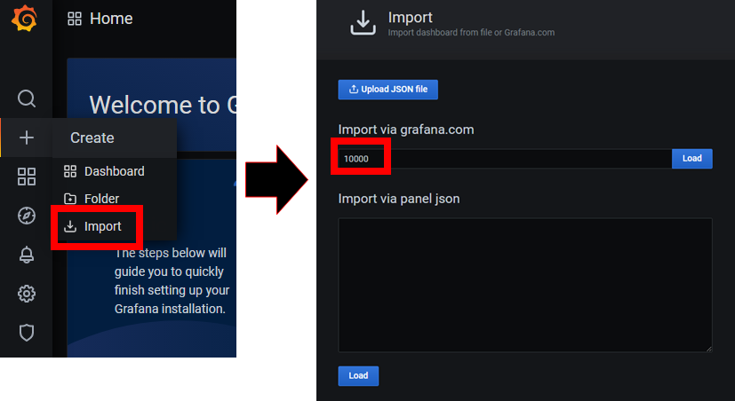

생성했던 Data Source를 지정해주고 Import 해주면 끝이다.

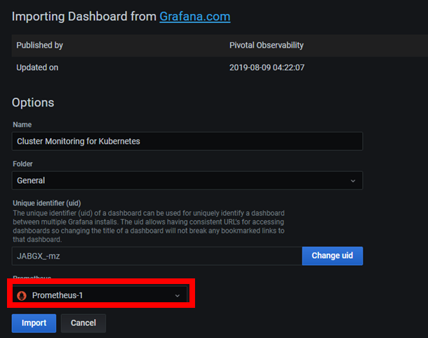

대시보드~~~

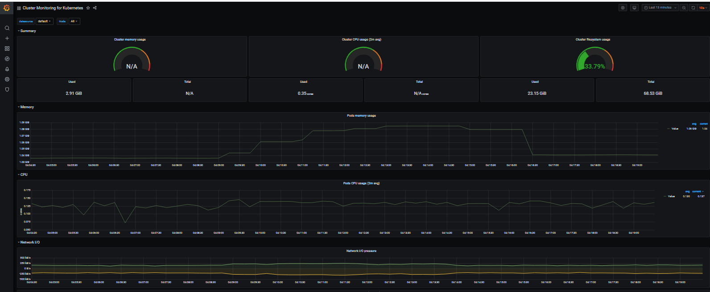


## 5. 삭제

helm 명령어를 이용하여 깔끔하게 삭제할 수 있다.

```
helm uninstall grafana
```


## 6. 참고

1. [Install Prometheus and Grafana Using Helm](https://ystatit.medium.com/install-prometheus-and-grafana-using-helm-b83b5018a1c4)