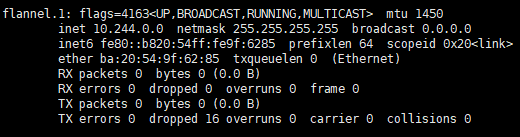

# K8s Clustering Master node and Worker node

쿠버네티스를 통해 마스터노드와 워커노드를 구성하고 클러스터링 시켜보자


## 사전환경

|        | OS               | CPU core | RAM  |
| ------ | :--------------- | :------- | :--- |
| Master | ubuntu 18.04 LTS | 2        | 2    |
| Worker | ubuntu 18.04 LTS | 1        | 1    |

시작하기 전에 Docker 및 K8s 가 우선적으로 설치되어 있어야 한다. 또한 각 환경에서 hostname 형식이 domain(test.server1.com) 형식으로 되어 있어야 한다.

hostname을 변경하는 방법은 다음과 같이 변경하면 된다.

```bash
madfalcon@madfalcon_master:~$ hostname
madfalcon_master
madfalcon@madfalcon_master:~$ sudo hostname madfalcon.master.com
madfalcon@madfalcon_master:~$ hostname
madfalcon.master.com

```


## Master node 구성

1. sudo swapoff -a

```bash
madfalcon@madfalcon_master:~/m_tmp$ free
              total        used        free      shared  buff/cache   available
Mem:        1951580      278808      585128        1256     1087644     1511800
Swap:       2097148           0     2097148
madfalcon@madfalcon_master:~/m_tmp$ sudo swapoff -a
madfalcon@madfalcon_master:~/m_tmp$ free
              total        used        free      shared  buff/cache   available
Mem:        1951580      278236      585580        1256     1087764     1512388
Swap:             0           0           0
```

2. sudo systemctl enable docker.service

   해당 명령어를 실행해야 클러스터링 된 node에 대한 정보를 확인 할 수 있다.

```bash
madfalcon@madfalcon_master:~/m_tmp$ sudo systemctl enable docker.service
Synchronizing state of docker.service with SysV service script with /lib/systemd/systemd-sysv-install.
Executing: /lib/systemd/systemd-sysv-install enable docker
```

3. sudo sysctl net.bridge.bridge-nf-call-iptables=1

   설정하지 않을 경우 bridge 네트워크 구성에서 iptables 에서 패킷 카운터가 되지 않는다. 

   CentOS 같은 리눅스 배포판은 net.bridge.bridge-no-call-iptables 값이 0(default)이다. 값이 0일 때 bridge 네트워크를 통해 송수신되는 패킷이 iptables 설정을 우회한다는 의미이며 컨테이너의 네트워크 패킷이 호스트머신의 iptables 설정에 따라 제어되도록 값을 1로 설정한다.

```bash
madfalcon@madfalcon_master:~/m_tmp$ sudo sysctl net.bridge.bridge-nf-call-iptables=1
net.bridge.bridge-nf-call-iptables = 1
```

4. sudo kubeadm init --pod-network-cidr=10.244.0.0/16

   Pod들이 사용할 네트워크 대역대를 설정한다(무조건 10.244.0.0/16 이어야 한다는데 이유는 찾아봐야 할 듯하다).

```bash
madfalcon@madfalcon_master:~/m_tmp$ sudo kubeadm init --pod-network-cidr=10.244.0.0/16
W0528 13:11:06.174544    8347 configset.go:202] WARNING: kubeadm cannot validate component configs for API groups [kubelet.config.k8s.io kubeproxy.config.k8s.io]
[init] Using Kubernetes version: v1.18.3
[preflight] Running pre-flight checks
	[WARNING IsDockerSystemdCheck]: detected "cgroupfs" as the Docker cgroup driver. The recommended driver is "systemd". Please follow the guide at https://kubernetes.io/docs/setup/cri/
[preflight] Pulling images required for setting up a Kubernetes cluster
[preflight] This might take a minute or two, depending on the speed of your internet connection
[preflight] You can also perform this action in beforehand using 'kubeadm config images pull'
[kubelet-start] Writing kubelet environment file with flags to file "/var/lib/kubelet/kubeadm-flags.env"
[kubelet-start] Writing kubelet configuration to file "/var/lib/kubelet/config.yaml"
[kubelet-start] Starting the kubelet
[certs] Using certificateDir folder "/etc/kubernetes/pki"
[certs] Generating "ca" certificate and key
[certs] Generating "apiserver" certificate and key
[certs] apiserver serving cert is signed for DNS names [madfalcon.master.com kubernetes kubernetes.default kubernetes.default.svc kubernetes.default.svc.cluster.local] and IPs [10.96.0.1 70.12.50.64]
[certs] Generating "apiserver-kubelet-client" certificate and key
[certs] Generating "front-proxy-ca" certificate and key
[certs] Generating "front-proxy-client" certificate and key
[certs] Generating "etcd/ca" certificate and key
[certs] Generating "etcd/server" certificate and key
[certs] etcd/server serving cert is signed for DNS names [madfalcon.master.com localhost] and IPs [70.12.50.64 127.0.0.1 ::1]
[certs] Generating "etcd/peer" certificate and key
[certs] etcd/peer serving cert is signed for DNS names [madfalcon.master.com localhost] and IPs [70.12.50.64 127.0.0.1 ::1]
[certs] Generating "etcd/healthcheck-client" certificate and key
[certs] Generating "apiserver-etcd-client" certificate and key
[certs] Generating "sa" key and public key
[kubeconfig] Using kubeconfig folder "/etc/kubernetes"
[kubeconfig] Writing "admin.conf" kubeconfig file
[kubeconfig] Writing "kubelet.conf" kubeconfig file
[kubeconfig] Writing "controller-manager.conf" kubeconfig file
[kubeconfig] Writing "scheduler.conf" kubeconfig file
[control-plane] Using manifest folder "/etc/kubernetes/manifests"
[control-plane] Creating static Pod manifest for "kube-apiserver"
[control-plane] Creating static Pod manifest for "kube-controller-manager"
W0528 13:11:51.403427    8347 manifests.go:225] the default kube-apiserver authorization-mode is "Node,RBAC"; using "Node,RBAC"
[control-plane] Creating static Pod manifest for "kube-scheduler"
W0528 13:11:51.405424    8347 manifests.go:225] the default kube-apiserver authorization-mode is "Node,RBAC"; using "Node,RBAC"
[etcd] Creating static Pod manifest for local etcd in "/etc/kubernetes/manifests"
[wait-control-plane] Waiting for the kubelet to boot up the control plane as static Pods from directory "/etc/kubernetes/manifests". This can take up to 4m0s
[apiclient] All control plane components are healthy after 24.503732 seconds
[upload-config] Storing the configuration used in ConfigMap "kubeadm-config" in the "kube-system" Namespace
[kubelet] Creating a ConfigMap "kubelet-config-1.18" in namespace kube-system with the configuration for the kubelets in the cluster
[upload-certs] Skipping phase. Please see --upload-certs
[mark-control-plane] Marking the node madfalcon.master.com as control-plane by adding the label "node-role.kubernetes.io/master=''"
[mark-control-plane] Marking the node madfalcon.master.com as control-plane by adding the taints [node-role.kubernetes.io/master:NoSchedule]
[bootstrap-token] Using token: k3tjms.lu28af6rost7rqcc
[bootstrap-token] Configuring bootstrap tokens, cluster-info ConfigMap, RBAC Roles
[bootstrap-token] configured RBAC rules to allow Node Bootstrap tokens to get nodes
[bootstrap-token] configured RBAC rules to allow Node Bootstrap tokens to post CSRs in order for nodes to get long term certificate credentials
[bootstrap-token] configured RBAC rules to allow the csrapprover controller automatically approve CSRs from a Node Bootstrap Token
[bootstrap-token] configured RBAC rules to allow certificate rotation for all node client certificates in the cluster
[bootstrap-token] Creating the "cluster-info" ConfigMap in the "kube-public" namespace
[kubelet-finalize] Updating "/etc/kubernetes/kubelet.conf" to point to a rotatable kubelet client certificate and key
[addons] Applied essential addon: CoreDNS
[addons] Applied essential addon: kube-proxy

Your Kubernetes control-plane has initialized successfully!

To start using your cluster, you need to run the following as a regular user:

  mkdir -p $HOME/.kube
  sudo cp -i /etc/kubernetes/admin.conf $HOME/.kube/config
  sudo chown $(id -u):$(id -g) $HOME/.kube/config

You should now deploy a pod network to the cluster.
Run "kubectl apply -f [podnetwork].yaml" with one of the options listed at:
  https://kubernetes.io/docs/concepts/cluster-administration/addons/

Then you can join any number of worker nodes by running the following on each as root:

kubeadm join 70.12.50.64:6443 --token k3tjms.lu28af6rost7rqcc \
    --discovery-token-ca-cert-hash sha256:3073b43d4eb932fcb33112112e35a2dff15788880a58cc61134412c6b39fef45 

```

5. cluster 시작하기위한 설정

   1. mkdir -p $HOME/.kube
   2. sudo cp -i /etc/kubernetes/admin.conf $HOME/.kube/config
   3. sudo chown $(id -u):$(id -g) $HOME/.kube/config
   
   
```bash
madfalcon@madfalcon_master:~/m_tmp$ mkdir -p $HOME/.kube
madfalcon@madfalcon_master:~/m_tmp$ sudo cp -i /etc/kubernetes/admin.conf $HOME/.kube/config
madfalcon@madfalcon_master:~/m_tmp$ sudo chown $(id -u):$(id -g) $HOME/.kube/config
madfalcon@madfalcon_master:~/m_tmp$
```

6. cluster에 사용할 Pod Network 플러그인 설치

   [Link](https://kubernetes.io/docs/concepts/cluster-administration/addons/)에 들어가면 네트워크 플러그인을 제공하는 업체가 많이 있다. ACI, Calio, Canal 등 많이 있는데 [Flannel](https://github.com/coreos/flannel/blob/master/Documentation/kubernetes.md)을 사용할까 한다. 아래 명령어를 입력하고 플러그인을 설치하자.

   1. `sudo kubectl apply -f https://raw.githubusercontent.com/coreos/flannel/master/Documentation/kube-flannel.yml`


```bash
madfalcon@madfalcon_master:~/m_tmp$ sudo kubectl apply -f https://raw.githubusercontent.com/coreos/flannel/master/Documentation/kube-flannel.yml
podsecuritypolicy.policy/psp.flannel.unprivileged created
clusterrole.rbac.authorization.k8s.io/flannel created
clusterrolebinding.rbac.authorization.k8s.io/flannel created
serviceaccount/flannel created
configmap/kube-flannel-cfg created
daemonset.apps/kube-flannel-ds-amd64 created
daemonset.apps/kube-flannel-ds-arm64 created
daemonset.apps/kube-flannel-ds-arm created
daemonset.apps/kube-flannel-ds-ppc64le created
daemonset.apps/kube-flannel-ds-s390x created
```

`ifconfig`를 입력해보면 다음과 같은 네트워크 플러그인이 설치되어 있음을 확인할 수 있다.




`sudo kubectl get nodes`를 입력하면 cluster 된 노드들의 정보가 출력된다.

```bash
madfalcon@madfalcon_master:~/m_tmp$ sudo kubectl get nodes
NAME                   STATUS     ROLES    AGE   VERSION
madfalcon.master.com   NotReady   master   38m   v1.18.3
madfalcon@madfalcon_master:~/m_tmp$ sudo kubectl get nodes
NAME                   STATUS   ROLES    AGE   VERSION
madfalcon.master.com   Ready    master   39m   v1.18.3
```

##  Worker node 구성

1. Master node에서 구성한것과 같이 메모리와 docker.service를 활성화 시켜준다.
   1. `sudo swapoff -a`
   2. `sudo systemctl enable docker.service`

```bash
madfalcon@madfalcon_slave_1:~$ sudo swapoff -a
madfalcon@madfalcon_slave_1:~$ sudo systemctl enable docker.service
Synchronizing state of docker.service with SysV service script with /lib/systemd/systemd-sysv-install.
Executing: /lib/systemd/systemd-sysv-install enable docker
madfalcon@madfalcon_slave_1:~$
```

2. Master node에서 마지막에 생성된 join 명령어를 입력한다.

```bash
madfalcon@madfalcon_slave_1:~$ sudo kubeadm join 70.12.50.64:6443 --token k3tjms.lu28af6rost7rqcc     --discovery-token-ca-cert-hash sha256:3073b43d4eb932fcb33112112e35a2dff15788880a58cc61134412c6b39fef45
W0528 14:18:05.077374    7816 join.go:346] [preflight] WARNING: JoinControlPane.controlPlane settings will be ignored when control-plane flag is not set.
[preflight] Running pre-flight checks
	[WARNING IsDockerSystemdCheck]: detected "cgroupfs" as the Docker cgroup driver. The recommended driver is "systemd". Please follow the guide at https://kubernetes.io/docs/setup/cri/
[preflight] Reading configuration from the cluster...
[preflight] FYI: You can look at this config file with 'kubectl -n kube-system get cm kubeadm-config -oyaml'
[kubelet-start] Downloading configuration for the kubelet from the "kubelet-config-1.18" ConfigMap in the kube-system namespace
[kubelet-start] Writing kubelet configuration to file "/var/lib/kubelet/config.yaml"
[kubelet-start] Writing kubelet environment file with flags to file "/var/lib/kubelet/kubeadm-flags.env"
[kubelet-start] Starting the kubelet
[kubelet-start] Waiting for the kubelet to perform the TLS Bootstrap...

This node has joined the cluster:
* Certificate signing request was sent to apiserver and a response was received.
* The Kubelet was informed of the new secure connection details.

Run 'kubectl get nodes' on the control-plane to see this node join the cluster.

```

3. Master node에서 정상적으로 worker node가 추가되었는지 확인한다.

```bash
madfalcon@madfalcon_master:~/m_tmp$ sudo kubectl get nodes
NAME                   STATUS   ROLES    AGE    VERSION
madfalcon.master.com   Ready    master   69m    v1.18.3
madfalcon.slave1.com   Ready    <none>   113s   v1.18.3
```


