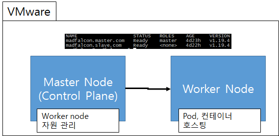
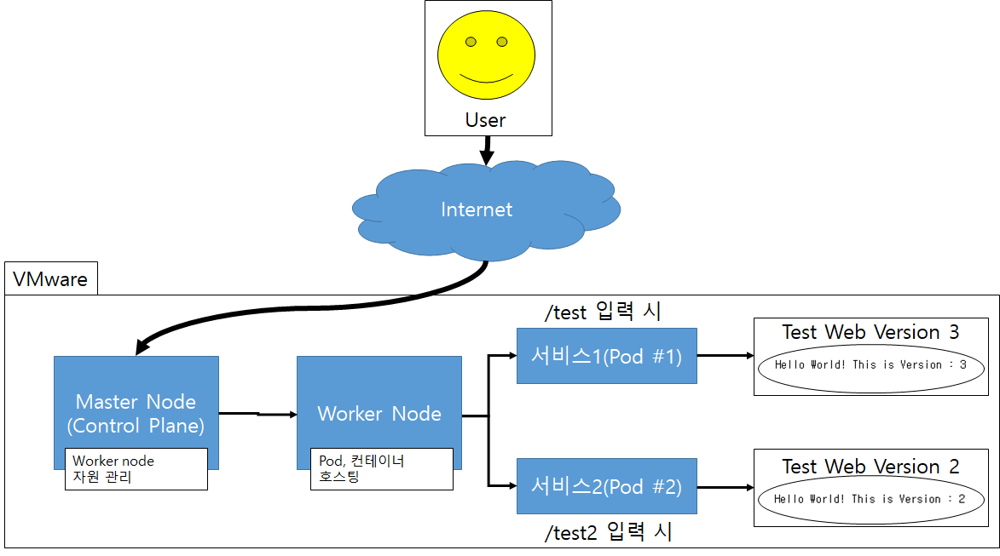
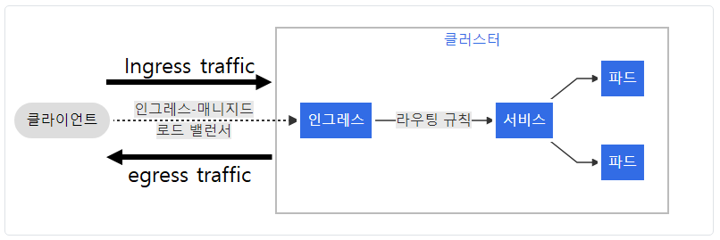
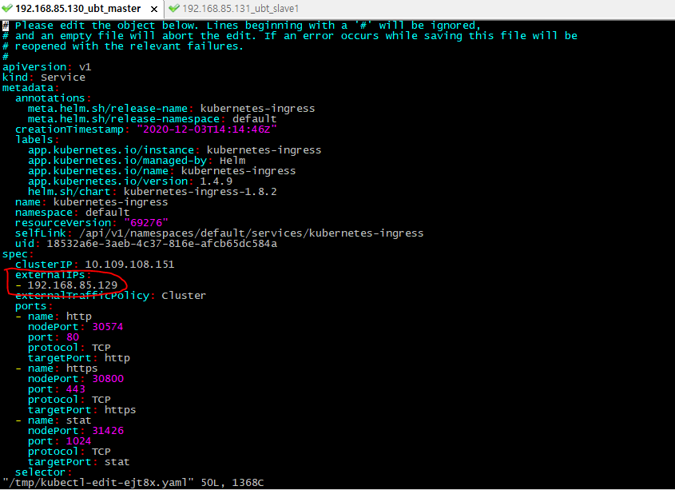
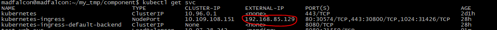
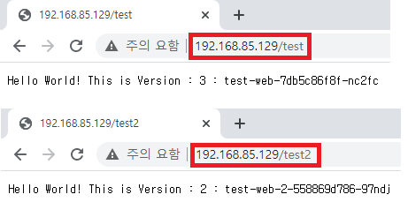

# Kubernetes Deploy web service

K8s를 통해 내부의 웹 서버(Pods)를 외부에 배포해보자! 


## 0. 테스트 환경

docker와 K8s가 설치되어 있는 Ubuntu 환경의 master - worker node 구성이 되어 있어야 한다. 본인은 컴퓨터 리소스의 한계로 VMware를 통해 Master node와 Worker node를 각 1대씩 구성했다.



각 노드들에 대해 간단하게 설명하자면 worker node는 우리가 배포하고자 하는 서비스들이 실제 동작하는 곳이다. master node는 worker node에서 실행되는 서비스들을 관리(배포하거나 통합)해주는 역활을 한다.

URL path에 따라 서비스를 라우팅 할 예정이며 `/test1`을 입력할 경우 version 2의 서비스를, `/test2`를 입력할 경우 version 3의 웹 서비스를 반환 할 계획이다.




## 1. Keepalived 설치 및 셋팅


### 1-1. 왜 해야할까?

Keepalived는 공식문서에 따르면 C로 작성된 로드밸런싱 및 고가용성을 제공하는 프레임워크 이다. 여기서는 웹 서비스를 요청받을 VIP만 셋팅할 예정이다. 

VIP는 Virtual IP의 약자로 말 그대로 가상의 아이피다. 용도는 서비스 로드밸런싱 또는 네트워크 장비의 장애복구용으로 쓰이기도 하는데 이중화된 네트워크 장비에서 실제 트래픽을 전달하는 active 장비가 down 되었을 경우 fail-over를 통해 standy 장비가 active 상태로 전환되면서 해당 VIP를 선점하여 서비스를 처리해주는 역활을 하기도 한다. 자세한 내용은 구글을 통해 알아보도록...여기서는 서비스 로드밸런싱 용도로 사용할 예정이다.


### 1-2. 설치해보자!

 설치는 간단하다.

- `yum install keepalived` 입력

설치 완료 후 `/etc/keepalived/` 경로에 `keepalived.conf`파일을 하나 만들고 아래와 같이 입력한다.

```bash
global_defs {
  notification_email {
    network-admins@domain.com
  }
  notification_email_from web_node1@domain.com
  smtp_server localhost
  smtp_connect_timeout 30
  router_id WEB_CLUSTER1
}

# 해당 인터페이스에 사용할 IP를 선택한다.
# 외부에서 접근가능한 IP로 선택하자
vrrp_instance VI_1 {
  state MASTER
  interface ens33 #해당 IP대역에 대한 인터페이스
  virtual_router_id 51
  priority 110
  advert_int 1
  authentication {
    auth_type PASS
    auth_pass 1111
  }
  virtual_ipaddress {
    192.168.85.129 #사용할 IP
  }
}
```

셋팅 완료 후 keepalived 서비스를 시작해보자

1. `sudo systemctl stop keepalived`(keepalived 서비스 중지)
2. `sudo systemctl start keepalived`(keepalived 서비스 시작)
3. `sudo systemctl status keepalived`(keepalived 상태 확인)

```bash
madfalcon@madfalcon:~/my_tmp/component$ sudo systemctl stop keepalived
madfalcon@madfalcon:~/my_tmp/component$ sudo systemctl start keepalived
madfalcon@madfalcon:~/my_tmp/component$ sudo systemctl status keepalived
[0m keepalived.service - Keepalive Daemon (LVS and VRRP)
     Loaded: loaded (/lib/systemd/system/keepalived.service; enabled; vendor preset: enabled)
     Active: active (running) since Fri 2020-12-04 18:19:28 UTC; 5s ago
   Main PID: 91148 (keepalived)
      Tasks: 2 (limit: 4587)
     Memory: 1.8M
     CGroup: /system.slice/keepalived.service
             쒋91148 /usr/sbin/keepalived --dont-fork
             붴91161 /usr/sbin/keepalived --dont-fork

## 아래처럼 나온다면 정상적으로 가동된 상태이다.

Dec 04 18:19:28 madfalcon.master.com Keepalived[91148]: WARNING - keepalived was build for newer Linux 5.4.18, running on Linux 5.4.0-56-generic #62-Ubuntu S>
Dec 04 18:19:28 madfalcon.master.com Keepalived[91148]: Command line: '/usr/sbin/keepalived' '--dont-fork'
Dec 04 18:19:28 madfalcon.master.com Keepalived[91148]: Opening file '/etc/keepalived/keepalived.conf'.
Dec 04 18:19:28 madfalcon.master.com Keepalived[91148]: Starting VRRP child process, pid=91161
Dec 04 18:19:28 madfalcon.master.com Keepalived_vrrp[91161]: Registering Kernel netlink reflector
Dec 04 18:19:28 madfalcon.master.com Keepalived_vrrp[91161]: Registering Kernel netlink command channel
Dec 04 18:19:28 madfalcon.master.com Keepalived_vrrp[91161]: Opening file '/etc/keepalived/keepalived.conf'.
Dec 04 18:19:28 madfalcon.master.com Keepalived_vrrp[91161]: Registering gratuitous ARP shared channel
Dec 04 18:19:28 madfalcon.master.com Keepalived_vrrp[91161]: (VI_1) Entering BACKUP STATE (init)
Dec 04 18:19:31 madfalcon.master.com Keepalived_vrrp[91161]: (VI_1) Entering MASTER STATE

## ping을 날려봐도 된다
madfalcon@madfalcon:~/my_tmp/component$ ping 192.168.85.129
PING 192.168.85.129 (192.168.85.129) 56(84) bytes of data.
64 bytes from 192.168.85.129: icmp_seq=1 ttl=64 time=0.078 ms
64 bytes from 192.168.85.129: icmp_seq=2 ttl=64 time=0.063 ms
64 bytes from 192.168.85.129: icmp_seq=3 ttl=64 time=0.087 ms
64 bytes from 192.168.85.129: icmp_seq=4 ttl=64 time=0.090 ms
^C
--- 192.168.85.129 ping statistics ---
4 packets transmitted, 4 received, 0% packet loss, time 3067ms
rtt min/avg/max/mdev = 0.063/0.079/0.090/0.010 ms
```


## 2. ingress controller 설치 및 셋팅


### 2-1. 왜 해야할까?

K8s 환경에서 외부에서 내부로 유입되는 트래픽을 `ingress traffic`이라 부르고 내부에서 외부로 나가는 트래픽을 `egress traffic`이라고 부른다. 



출처 : [쿠버네티스 공식 문서](https://kubernetes.io/ko/docs/concepts/services-networking/ingress/#%EC%9D%B8%EA%B7%B8%EB%A0%88%EC%8A%A4%EB%9E%80)

인그레스(ingress)는 클러스터 외부에서 내부로 접근하는 요청들을 어떻게 처리할지 정의해둔 규칙들의 모음이다.  외부에서 서비스로 접속이 가능한 URL, 로드 밸런스 트래픽, SSL / TLS 종료 그리고 이름-기반의 가상 호스팅을 제공하도록 구성할 수 있다. 인그레스 자체는 이런 규칙들을 정의해둔 자원이고 이런 규칙들을 실제로 동작하게 해주는게 인그레스 컨트롤러(ingress controller)이다. 즉, ingress와 ingress controller는 쌍으로 셋팅을 해야한다는 뜻이다. 


### 2-2. 설치해보자!

1. 설치
   
- ingress controller를 통해 외부에서 들어오는 트래픽을 라우팅 처리 할 수 있다. ingress controller 기능을 제공하는 업체는 다양하다. 여기서 나는 HAproxy를 사용할 예정이다. 설치방법은 [링크](https://github.com/madfalc0n/TIL/blob/master/Cloud/k8s/Kubernetes_install_haproxy.md)를 참고하여 설치하면 되겠다.
  
2. 셋팅

   1. 아래 과정까지 완료되었다고 가정한 상황에서 진행한다.

     ```
     madfalcon@madfalcon:~/my_tmp/component$ kubectl get svc -A
     NAMESPACE     NAME                                   TYPE        CLUSTER-IP       EXTERNAL-IP   PORT(S)                                     AGE
     default       kubernetes                             ClusterIP   10.96.0.1        <none>        443/TCP                                     160m
     default       kubernetes-ingress                     NodePort    10.107.106.183   <none>        80:30251/TCP,443:31065/TCP,1024:31305/TCP   16m
     default       kubernetes-ingress-default-backend     ClusterIP   None             <none>        8080/TCP                                    16m
     kube-system   kube-dns                               ClusterIP   10.96.0.10       <none>        53/UDP,53/TCP,9153/TCP                      160m
     madfalcon@madfalcon:~/my_tmp/component$ 
     ```

   2. `kubernetes-ingress`를 아래의 명령어를 입력하여 추가했던 VIP를 넣어줘야 한다.

      1. `kubectl edit svc kubernetes-ingress`를 입력하여 ExternalIP를 추가한다.

      

      2. 아래와 같이 externalip가 추가 된 것을 확인할 수 있다.

         


## 3. Service 셋팅

해당 IP를 요청하면 ingress controller를 통해 내부의 서비스를 호출하는 과정까지 만들어진 상태이다. 그렇다면 내부의 서비스를 불러오기 위한 서비스를 연결하는 과정이 필요하다. 시나리오는 192.168.85.129 에서 path에 따른 웹 호출을 진행할 것이며 2개의 서비스를 연동해보고자 한다. 

- 아래의 yaml 파일을 통해 서비스를 만들어 보자
- 참고로 서비스는 이미 만들어놓은 것을 테스트하는 것이다.
- deployment에 대해 알고 싶다면 [링크](https://github.com/madfalc0n/TIL/blob/master/Cloud/k8s/Kubernetes_workloads_resources.md)에서 좀 더 있다.
- 서비스를 만드는 방법은 [링크](https://github.com/madfalc0n/TIL/blob/master/Cloud/Docker/docker_node_web_build.md)에서 좀 더 알 수 있다.

```bash
# 적용하는 방법은 아래에 각각 .yaml 파일을 만들고 kubectl apply -f 생성한파일.yaml 을 입력하면 된다.

#deployment 1번 (서비스1와 매칭될 예정)
apiVersion: apps/v1
kind: Deployment
metadata:
  name: test-web
  labels:
    app: test
spec:
  replicas: 3
  selector:
    matchLabels:
      app: test
  template:
    metadata:
      labels:
        app: test
    spec:
      containers:
      - name: test
        image: chadool116/test-web-node:v3
        ports:
        - containerPort: 8080

#deployment 2번 (서비스2와 매칭될 예정)
apiVersion: apps/v1
kind: Deployment
metadata:
  name: test-web-2
  labels:
    app: test-2
spec:
  replicas: 3
  selector:
    matchLabels:
      app: test-2
  template:
    metadata:
      labels:
        app: test-2
    spec:
      containers:
      - name: test-2
        image: chadool116/test-web-node:v2
        ports:
        - containerPort: 8080


#서비스1(deployment 1번과 매칭)
apiVersion: v1
kind: Service
metadata:
  name: test-web-svc
spec:
  selector:
    app: test
  ports:
    - port: 8080
      protocol: TCP
      targetPort: 8080


#서비스2(deployment 2번과 매칭)
apiVersion: v1
kind: Service
metadata:
  name: test-web-svc-2
spec:
  selector:
    app: test-2
  ports:
    - port: 8080
      protocol: TCP
      targetPort: 8080
      
## 생성결과
madfalcon@madfalcon:~/my_tmp/component$ kubectl get pods
NAME                                                  READY   STATUS    RESTARTS   AGE
kubernetes-ingress-75bd986f6c-4r2kq                   1/1     Running   1          28h
kubernetes-ingress-75bd986f6c-zvvtg                   1/1     Running   1          28h
kubernetes-ingress-default-backend-759ccc6c98-dzm68   1/1     Running   1          28h
kubernetes-ingress-default-backend-759ccc6c98-sw89n   1/1     Running   1          28h
test-web-2-558869d786-95nkh                           1/1     Running   0          67m
test-web-2-558869d786-97ndj                           1/1     Running   0          67m
test-web-2-558869d786-tm5k5                           1/1     Running   0          67m
test-web-7db5c86f8f-j4htw                             1/1     Running   0          91m
test-web-7db5c86f8f-nc2fc                             1/1     Running   0          91m
test-web-7db5c86f8f-r4bct                             1/1     Running   0          91m


# 서비스 정상접속되는지 테스트 (deployment를 통해 각각 3개의 pods 중 하나 선별하여 테스트)

#서비스 1번
madfalcon@madfalcon:~/my_tmp/component$ kubectl exec -it test-web-7db5c86f8f-j4htw -- curl 10.244.1.65:8080
Hello World! This is Version : 3 : test-web-7db5c86f8f-j4htw

#서비스 2번
madfalcon@madfalcon:~/my_tmp/component$ kubectl exec -it test-web-2-558869d786-95nkh -- curl 10.244.1.68:8080           
Hello World! This is Version : 2 : test-web-2-558869d786-95nkh
```

 


## 4. ingress 셋팅 

ingress는 3번에서 만든 서비스들을 매핑시키는 부분이다. 아래와 같이 작성하면 된다.

```yaml
apiVersion: extensions/v1beta1
kind: Ingress
metadata:
  name: test-web-ingress
spec:
  rules:
  - http:
      paths:
      - path: /test #원하는 path
        pathType: Prefix
        backend:
          serviceName: test-web-svc #생성했던 서비스 name
          servicePort: 8080 #image 생성시 expose 햇던 port
      - path: /test2 #원하는 path
        pathType: Prefix
        backend:
          serviceName: test-web-svc-2 #생성했던 서비스 name
          servicePort: 8080 #image 생성시 expose 햇던 port
```

생성이 되었다면 아래와 같이 describe 명령어를 통해 확인할 수 있다.

```bash
madfalcon@madfalcon:~/my_tmp/component$ kubectl describe ing
Warning: extensions/v1beta1 Ingress is deprecated in v1.14+, unavailable in v1.22+; use networking.k8s.io/v1 Ingress
Name:             test-web-ingress
Namespace:        default
Address:          
Default backend:  default-http-backend:80 (<error: endpoints "default-http-backend" not found>)
Rules:
  Host        Path  Backends
  ----        ----  --------
  *           
              /test    test-web-svc:8080 (10.244.1.65:8080,10.244.1.66:8080,10.244.1.67:8080)
              /test2   test-web-svc-2:8080 (10.244.1.68:8080,10.244.1.69:8080,10.244.1.70:8080)
#괄호 안에 IP들은 Pod
Annotations:  <none>
Events:       <none>
```


## 5. 접속 테스트

내가 원하는 서비스(pod)로 라우팅이 되는지 확인할 수 있다. 기본적인 curl 요청으로 간단한 접속 테스트가 가능하다.

```bash
# 1번 서비스 접속 테스트
madfalcon@madfalcon:~/my_tmp/component$ curl -i 192.168.85.129/test
HTTP/1.1 200 OK
date: Fri, 04 Dec 2020 18:51:04 GMT
transfer-encoding: chunked

Hello World! This is Version : 3 : test-web-7db5c86f8f-r4bctmadfalcon@madfalcon:~/my_tmp/component$ 

# 2번 서비스 접속 테스트
madfalcon@madfalcon:~/my_tmp/component$ curl -i 192.168.85.129/test2
HTTP/1.1 200 OK
date: Fri, 04 Dec 2020 18:51:07 GMT
transfer-encoding: chunked

Hello World! This is Version : 2 : test-web-2-558869d786-95nkhmadfalcon@madfalcon:~/my_tmp/component$ 
```

외부에서도 접속되는지 확인해보자!




## 6. 참고

1. [쿠버네티스 공식 홈페이지 문서](https://kubernetes.io/ko/docs/concepts/services-networking/ingress/)
2. [keepalived를 설치하고 셋팅해보자](http://blog.naver.com/PostView.nhn?blogId=hanajava&logNo=221626055915&parentCategoryNo=40&categoryNo=87&viewDate=&isShowPopularPosts=false&from=postList)

2. [[Kubernetes] 1편 : 쿠버네티스 Ingress 개념 및 사용 방법, 온-프레미스 환경에서 Ingress 구축하기](https://m.blog.naver.com/PostView.nhn?blogId=alice_k106&logNo=221502890249&proxyReferer=&proxyReferer=https:%2F%2Fwww.google.co.kr%2F)

4. [쿠버네티스 인그레스](https://arisu1000.tistory.com/27840)