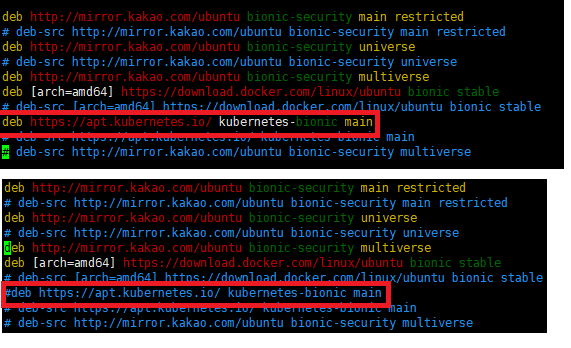

# Kubernetes install manual

## 사전환경

- Ubuntu 18.04 LTS(VMware)


## K8s 설치

1. sudo apt install apt-transport-https

   `apt-transport-https` : https를 통해 데이터 및 패키지에 접근할 수 있도록 해주는 패키지

```bash
madfalcon@madfalcon_master:~/m_tmp$ sudo apt install apt-transport-https
Reading package lists... Done
Building dependency tree       
Reading state information... Done
apt-transport-https is already the newest version (1.6.12ubuntu0.1).
0 upgraded, 0 newly installed, 0 to remove and 98 not upgraded.
```

2. curl -s https://packages.cloud.google.com/apt/doc/apt-key.gpg | sudo apt-key add

```bash
madfalcon@madfalcon_master:~/m_tmp$ curl -s https://packages.cloud.google.com/apt/doc/apt-key.gpg | sudo apt-key add
OK
```

3. sudo add-apt-repository "deb https://apt.kubernetes.io/ kubernetes-$(lsb_release -cs) main"

```bash
madfalcon@madfalcon_master:~/m_tmp$ sudo add-apt-repository "deb https://apt.kubernetes.io/ kubernetes-$(lsb_release -cs) main"
Hit:1 http://mirror.kakao.com/ubuntu bionic InRelease
Hit:2 http://mirror.kakao.com/ubuntu bionic-updates InRelease
Hit:3 http://mirror.kakao.com/ubuntu bionic-backports InRelease                                       
Hit:4 http://mirror.kakao.com/ubuntu bionic-security InRelease                                        
Hit:5 https://download.docker.com/linux/ubuntu bionic InRelease                                       
Ign:6 https://packages.cloud.google.com/apt kubernetes-bionic InRelease        
Err:7 https://packages.cloud.google.com/apt kubernetes-bionic Release
  404  Not Found [IP: 172.217.27.78 443]
Reading package lists... Done
E: The repository 'https://apt.kubernetes.io kubernetes-bionic Release' does not have a Release file.
N: Updating from such a repository can't be done securely, and is therefore disabled by default.
N: See apt-secure(8) manpage for repository creation and user configuration details.
```

설치중 위와 같이 에러 뜨는 경우 아래처럼 추가 설정을 진행해야 하는데 `sudo vi /etc/apt/source.list` 입력 후 `kubernetes-bionic`이 적혀있는 항목을 찾는다. `deb https://apt.kubernetes.io/ kubernetes-bionic main`항목을 찾아서 앞에 # 을 붙이고 저장후 빠져나온다.



4. sudo apt-add-repository "deb http://apt.kubernetes.io/ kubernetes-xenial main" 

```bash
madfalcon@madfalcon_master:~/m_tmp$ sudo apt-add-repository "deb http://apt.kubernetes.io/ kubernetes-xenial main" 
Hit:1 http://mirror.kakao.com/ubuntu bionic InRelease
Hit:2 http://mirror.kakao.com/ubuntu bionic-updates InRelease
Hit:3 http://mirror.kakao.com/ubuntu bionic-backports InRelease              
Hit:4 http://mirror.kakao.com/ubuntu bionic-security InRelease                                         
Hit:5 https://download.docker.com/linux/ubuntu bionic InRelease                                        
Get:6 https://packages.cloud.google.com/apt kubernetes-xenial InRelease [8,993 B]     
Get:7 https://packages.cloud.google.com/apt kubernetes-xenial/main amd64 Packages [36.1 kB]
Fetched 45.1 kB in 1s (30.1 kB/s)  
Reading package lists... Done
```

5. sudo apt-add-repository "deb http://apt.kubernetes.io/ kubernetes-yakkety main"

```bash
madfalcon@madfalcon_master:~/m_tmp$ sudo apt-add-repository "deb http://apt.kubernetes.io/ kubernetes-yakkety main"
Hit:1 http://mirror.kakao.com/ubuntu bionic InRelease
Hit:2 http://mirror.kakao.com/ubuntu bionic-updates InRelease                                           
Hit:3 http://mirror.kakao.com/ubuntu bionic-backports InRelease                                                                                         
Hit:4 http://mirror.kakao.com/ubuntu bionic-security InRelease                                                                                          
Hit:5 https://download.docker.com/linux/ubuntu bionic InRelease                                                                                         
Hit:6 https://packages.cloud.google.com/apt kubernetes-xenial InRelease                                      
Get:7 https://packages.cloud.google.com/apt kubernetes-yakkety InRelease [3,726 B]    
Fetched 3,726 B in 1s (2,833 B/s)    
Reading package lists... Done
```

6. sudo apt update

```bash
madfalcon@madfalcon_master:~/m_tmp$ sudo apt update
Hit:1 http://mirror.kakao.com/ubuntu bionic InRelease
Hit:2 http://mirror.kakao.com/ubuntu bionic-updates InRelease                                            
Hit:3 http://mirror.kakao.com/ubuntu bionic-backports InRelease                                                                                          
Hit:4 http://mirror.kakao.com/ubuntu bionic-security InRelease                                                                                           
Hit:5 https://download.docker.com/linux/ubuntu bionic InRelease                                                                                          
Hit:6 https://packages.cloud.google.com/apt kubernetes-xenial InRelease                                     
Hit:7 https://packages.cloud.google.com/apt kubernetes-yakkety InRelease
Reading package lists... Done                      
Building dependency tree    
Reading state information... Done
98 packages can be upgraded. Run 'apt list --upgradable' to see them.
```

7. sudo apt install kubelet kubeadm kubectl kubernetes-cni -y

```bash
madfalcon@madfalcon_master:~/m_tmp$ sudo apt install kubelet kubeadm kubectl kubernetes-cni -y
Reading package lists... Done
Building dependency tree       
Reading state information... Done
The following additional packages will be installed:
  conntrack cri-tools socat
The following NEW packages will be installed:
  conntrack cri-tools kubeadm kubectl kubelet kubernetes-cni socat
0 upgraded, 7 newly installed, 0 to remove and 98 not upgraded.
Need to get 52.0 MB of archives.
After this operation, 275 MB of additional disk space will be used.
Get:1 http://mirror.kakao.com/ubuntu bionic/main amd64 conntrack amd64 1:1.4.4+snapshot20161117-6ubuntu2 [30.6 kB]
Get:2 http://mirror.kakao.com/ubuntu bionic/main amd64 socat amd64 1.7.3.2-2ubuntu2 [342 kB]
Get:3 https://packages.cloud.google.com/apt kubernetes-xenial/main amd64 cri-tools amd64 1.13.0-00 [8,776 kB]
Get:4 https://packages.cloud.google.com/apt kubernetes-xenial/main amd64 kubernetes-cni amd64 0.7.5-00 [6,473 kB]
Get:5 https://packages.cloud.google.com/apt kubernetes-xenial/main amd64 kubelet amd64 1.18.3-00 [19.4 MB]
Get:6 https://packages.cloud.google.com/apt kubernetes-xenial/main amd64 kubectl amd64 1.18.3-00 [8,821 kB]
Get:7 https://packages.cloud.google.com/apt kubernetes-xenial/main amd64 kubeadm amd64 1.18.3-00 [8,163 kB]
Fetched 52.0 MB in 4s (14.2 MB/s)  
Selecting previously unselected package conntrack.
(Reading database ... 67285 files and directories currently installed.)
Preparing to unpack .../0-conntrack_1%3a1.4.4+snapshot20161117-6ubuntu2_amd64.deb ...
Unpacking conntrack (1:1.4.4+snapshot20161117-6ubuntu2) ...
Selecting previously unselected package cri-tools.
Preparing to unpack .../1-cri-tools_1.13.0-00_amd64.deb ...
Unpacking cri-tools (1.13.0-00) ...
Selecting previously unselected package kubernetes-cni.
Preparing to unpack .../2-kubernetes-cni_0.7.5-00_amd64.deb ...
Unpacking kubernetes-cni (0.7.5-00) ...
Selecting previously unselected package socat.
Preparing to unpack .../3-socat_1.7.3.2-2ubuntu2_amd64.deb ...
Unpacking socat (1.7.3.2-2ubuntu2) ...
Selecting previously unselected package kubelet.
Preparing to unpack .../4-kubelet_1.18.3-00_amd64.deb ...
Unpacking kubelet (1.18.3-00) ...
Selecting previously unselected package kubectl.
Preparing to unpack .../5-kubectl_1.18.3-00_amd64.deb ...
Unpacking kubectl (1.18.3-00) ...
Selecting previously unselected package kubeadm.
Preparing to unpack .../6-kubeadm_1.18.3-00_amd64.deb ...
Unpacking kubeadm (1.18.3-00) ...
Setting up conntrack (1:1.4.4+snapshot20161117-6ubuntu2) ...
Setting up kubernetes-cni (0.7.5-00) ...
Setting up cri-tools (1.13.0-00) ...
Setting up socat (1.7.3.2-2ubuntu2) ...
Setting up kubelet (1.18.3-00) ...
Created symlink /etc/systemd/system/multi-user.target.wants/kubelet.service → /lib/systemd/system/kubelet.service.
Setting up kubectl (1.18.3-00) ...
Setting up kubeadm (1.18.3-00) ...
Processing triggers for man-db (2.8.3-2ubuntu0.1) ...
```


## 참고한 주소

- 쿠버네티스 개념1: https://kubernetes.io/ko/docs/concepts/overview/what-is-kubernetes/
- 쿠버네티스 개념2: https://subicura.com/2019/05/19/kubernetes-basic-1.html
- 쿠버네티스 설치: https://hiseon.me/linux/ubuntu/ubuntu-kubernetes-install/
- 쿠버네티스 문제: https://stackoverflow.com/questions/53068337/unable-to-add-kubernetes-bionic-main-ubuntu-18-04-to-apt-repository