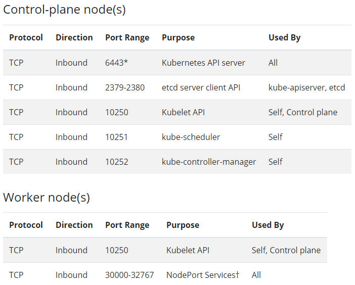

# Kubernetes install manual(NEW)

## 사전환경

- Ubuntu 20.04.1 LTS(VMware)


## 사전셋팅

1. ipbridge 셋팅

   ```
   cat <<EOF | sudo tee /etc/sysctl.d/k8s.conf
   net.bridge.bridge-nf-call-ip6tables = 1
   net.bridge.bridge-nf-call-iptables = 1
   EOF
   sudo sysctl --system
   ```

2. 클러스터링 구성시 통신구성은 다음과 같다.

   

   출처 : [쿠버네티스 공식 doc](https://kubernetes.io/docs/setup/production-environment/tools/kubeadm/install-kubeadm/)


## K8s 설치

1. kubeadm, kublet, kubectl 총 3가지 패키지를 설치할 예정이다.

   ```
   1. kubeadm: the command to bootstrap the cluster.
   
   2. kubelet: the component that runs on all of the machines in your cluster and does things like starting pods and containers.
   
   3. kubectl: the command line util to talk to your cluster.
   ```

2. 아래의 명령어를 복사해서 붙여넣고 설치하면 된다.

   ```
   sudo apt-get update && sudo apt-get install -y apt-transport-https curl
   curl -s https://packages.cloud.google.com/apt/doc/apt-key.gpg | sudo apt-key add -
   cat <<EOF | sudo tee /etc/apt/sources.list.d/kubernetes.list
   deb https://apt.kubernetes.io/ kubernetes-xenial main
   EOF
   sudo apt-get update
   sudo apt-get install -y kubelet kubeadm kubectl
   sudo apt-mark hold kubelet kubeadm kubectl
   ```

   


## 참고한 주소

- [쿠버네티스 공식 문서](https://kubernetes.io/docs/setup/production-environment/tools/kubeadm/install-kubeadm/)