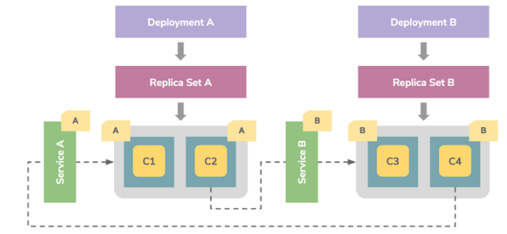

# K8s Workloads Resources

워크로드는 쿠버네티스에서 구동되는 애플리케이션이다. 워크로드가 단일 컴포넌트이거나 함께 작동하는 여러 컴포넌트이든 관계없이, 쿠버네티스에서는 워크로드를 일련의 [파드](https://kubernetes.io/ko/docs/concepts/workloads/pods) 집합 내에서 실행한다. 쿠버네티스에서 파드는 클러스터에서 실행 중인 [컨테이너](https://kubernetes.io/ko/docs/concepts/containers/) 집합을 나타낸다.

파드에는 정의된 라이프사이클이 있다. 예를 들어, 일단 파드가 클러스터에서 실행되고 해당 파드가 실행 중인 [노드](https://kubernetes.io/ko/docs/concepts/architecture/nodes/)에서 심각한 오류가 발생하게 되면 해당 노드의 모든 파드가 실패한다. 쿠버네티스는 이 수준의 실패를 최종적으로 처리한다. 나중에 노드가 복구되더라도 새 파드를 만들어야 한다.

그러나, 작업이 훨씬 쉽도록, 각 파드를 직접 관리할 필요는 없도록 만들었다. 대신, 사용자를 대신하여 파드 집합을 관리하는 *워크로드 리소스* 를 사용할 수 있다. 이러한 리소스는 지정한 상태와 일치하도록 올바른 수의 올바른 파드 유형이 실행되고 있는지 확인하는 [컨트롤러](https://kubernetes.io/ko/docs/concepts/architecture/controller/)를 구성한다.

> 출처 : [쿠버네티스 공식문서](https://kubernetes.io/ko/docs/concepts/workloads/)

## 1. Deployment

앱을 배포할 때 사용되는 기본중의 기본 컨트롤러이다. 배포를 위한 기능들을 제공한다. deployment 는 replicaset, pod를 지속적으로 모니터링 해주며 노드가 다운되거나 삭제되면 deployment 컨트롤러가 인스턴스를 클러스터 내부의 다른 노드 인스턴스로 교체해 준다. 아키텍쳐는 다음과 같다.



[출처](http://blog.naver.com/PostView.nhn?blogId=sory1008&logNo=221566576268&categoryNo=0&parentCategoryNo=80&viewDate=&currentPage=1&postListTopCurrentPage=1&from=postView)

- 예시 yaml 파일

```yaml
apiVersion: apps/v1
kind: Deployment
metadata:
  name: test-web
  labels:
    app: test
spec:
  replicas: 3
  selector:
    matchLabels:
      app: test
  template:
    metadata:
      labels:
        app: test
    spec:
      containers:
      - name: test
        image: chadool116/test-web-node:v1
        ports:
        - containerPort: 8080   
        
## metadata - name : kubectl get deploy 입력시 보여지는 name

madfalcon@madfalcon:~/my_tmp/component$ kubectl get deploy 
NAME                                 READY   UP-TO-DATE   AVAILABLE   AGE
test-web                             3/3     3            3           41m

## spec 내 containers - image 본인이 업로드 한 image:tag 입력
## containerPort : DockerFile을 통해 이미지를 생성했을 때 expose port 번호, 실제 서비스 open시 생성되는 port번호

## kubectl apply -f 위.yaml 업로드 후 pod 생성되었는지, 
madfalcon@madfalcon:~/my_tmp/component$ kubectl get pods
NAME                                                  READY   STATUS    RESTARTS   AGE
test-web-6dd5c847d7-7f22d                             1/1     Running   0          43m
test-web-6dd5c847d7-s84hr                             1/1     Running   0          43m
test-web-6dd5c847d7-xl8x2                             1/1     Running   0          43m

## 웹 서비스 접속이 되는지 확인해보기
## 1. 생성된 pods의 정보를 확인해보자
madfalcon@madfalcon:~/my_tmp/component$ kubectl describe pods test-web-6dd5c847d7-7f22d
Name:         test-web-6dd5c847d7-7f22d
Namespace:    default
Priority:     0
Node:         madfalcon.slave.com/192.168.85.131
Start Time:   Thu, 03 Dec 2020 15:04:22 +0000
Labels:       app=test
              pod-template-hash=6dd5c847d7
Annotations:  <none>
Status:       Running
IP:           10.244.1.41
IPs:
  IP:           10.244.1.41
Controlled By:  ReplicaSet/test-web-6dd5c847d7
.........
.........
.........

## 2. ip를 통해 접속 테스트 확인해보자, kubectl exec -it [pod 이름] -- curl [할당된IP]:[port]
madfalcon@madfalcon:~/my_tmp/component$ kubectl exec -it test-web-6dd5c847d7-7f22d -- curl 10.244.1.41:8080
Hello World! I'm test-web-6dd5c847d7-7f22d
```

- 배포한 앱을 변경(업데이트) 해보자
  - kubectl rollout history deployment

```bash
#배포한 이력은 아래의 명령어를 통해 확인이 가능하다.
# REVISION 이 변경된 횟수 이다.
madfalcon@madfalcon:~/my_tmp/component$ kubectl rollout history deployment
deployment.apps/test-web 
REVISION  CHANGE-CAUSE
1         <none>


# 위 yaml 파일에서 버전을 업데이트(v1 -> v2)하고 진행해보자, 다만 추가 업데이트된 버전에 대해 dockerhub에 업데이트 되어있어야 함
madfalcon@madfalcon:~/my_tmp/component$ diff deploy.yaml deploy2.yaml 
19c19
<         image: chadool116/test-web-node:v1
---
>         image: chadool116/test-web-node:v2

madfalcon@madfalcon:~/my_tmp/component$ kubectl apply -f deploy2.yaml 
deployment.apps/test-web configured

madfalcon@madfalcon:~/my_tmp/component$ kubectl rollout history deployment
deployment.apps/test-web 
REVISION  CHANGE-CAUSE
1         <none>
2         <none>

# 기존 pods들이 terminating 되고 새로운 pods들로 업데이트 되는 것을 확인할 수 있다
madfalcon@madfalcon:~/my_tmp/component$ kubectl get pods
NAME                                                  READY   STATUS        RESTARTS   AGE
test-web-5f74946b54-ftqwv(new)                        1/1     Running       0          19s
test-web-5f74946b54-hzmj7(new)                        1/1     Running       0          14s
test-web-5f74946b54-xkmhr(new)                        1/1     Running       0          16s
test-web-6dd5c847d7-pxkcs(old)                        1/1     Terminating   0          2m39s
test-web-6dd5c847d7-t4d4g(old)                        1/1     Terminating   0          2m36s
test-web-6dd5c847d7-tm56q(old)                        1/1     Terminating   0          2m41s

# 내용을 확인해보면 업데이트 된 것을 확인할 수 있다.
madfalcon@madfalcon:~/my_tmp/component$ kubectl describe pods test-web-5f74946b54-ftqwv   
Name:         test-web-5f74946b54-ftqwv
Namespace:    default
Priority:     0
Node:         madfalcon.slave.com/192.168.85.131
Start Time:   Thu, 03 Dec 2020 16:21:49 +0000
Labels:       app=test
              pod-template-hash=5f74946b54
Annotations:  <none>
Status:       Running
IP:           10.244.1.49
IPs:
  IP:           10.244.1.49
Controlled By:  ReplicaSet/test-web-5f74946b54
Containers:
  test:
    Container ID:   docker://482bc931069e2f5f16ad881fe111a0928cedcfb6c85ebff4c54c7e92bdab9edc
    Image:          chadool116/test-web-node:v2
    Image ID:       docker-pullable://chadool116/test-web-node@sha256:4311aaa04f0cb9471f308c9db89d89691c8235c55d2263bc24bc4ce7a93a7384
    Port:           8080/TCP
    Host Port:      0/TCP
    State:          Running
      Started:      Thu, 03 Dec 2020 16:21:51 +0000
    Ready:          True
    Restart Count:  0
    Environment:    <none>
    Mounts:
      /var/run/secrets/kubernetes.io/serviceaccount from default-token-p6zdw (ro)
Conditions:
  Type              Status
  Initialized       True 
  Ready             True 
  ContainersReady   True 
  PodScheduled      True 
Volumes:
  default-token-p6zdw:
    Type:        Secret (a volume populated by a Secret)
    SecretName:  default-token-p6zdw
    Optional:    false
QoS Class:       BestEffort
Node-Selectors:  <none>
Tolerations:     node.kubernetes.io/not-ready:NoExecute op=Exists for 300s
                 node.kubernetes.io/unreachable:NoExecute op=Exists for 300s
Events:
  Type    Reason     Age    From               Message
  ----    ------     ----   ----               -------
  Normal  Scheduled  2m37s  default-scheduler  Successfully assigned default/test-web-5f74946b54-ftqwv to madfalcon.slave.com
  Normal  Pulled     2m35s  kubelet            Container image "chadool116/test-web-node:v2" already present on machine
  Normal  Created    2m35s  kubelet            Created container test
  Normal  Started    2m35s  kubelet            Started container test

madfalcon@madfalcon:~/my_tmp/component$ kubectl exec -it test-web-5f74946b54-ftqwv -- curl 10.244.1.49:8080 
Hello World! This is Version : 2 : test-web-5f74946b54-ftqwv

```

- 업데이트된 앱을 다시 rollback 시켜보자

```bash
madfalcon@madfalcon:~/my_tmp/component$ kubectl rollout history deployment
deployment.apps/test-web 
REVISION  CHANGE-CAUSE
1         <none>
2         <none>

madfalcon@madfalcon:~/my_tmp/component$ kubectl rollout undo deployment test-web 
deployment.apps/test-web rolled back

madfalcon@madfalcon:~/my_tmp/component$ kubectl rollout history deployment
deployment.apps/test-web 
REVISION  CHANGE-CAUSE
2         <none>
3         <none>

# 롤백 된 버전
madfalcon@madfalcon:~/my_tmp/component$ kubectl rollout history deployment test-web --revision=3
deployment.apps/test-web with revision #3
Pod Template:
  Labels:       app=test
        pod-template-hash=6dd5c847d7
  Containers:
   test:
    Image:      chadool116/test-web-node:v1
    Port:       8080/TCP
    Host Port:  0/TCP
    Environment:        <none>
    Mounts:     <none>
  Volumes:      <none>

# 기존 업데이트 된 버전
madfalcon@madfalcon:~/my_tmp/component$ kubectl rollout history deployment test-web --revision=2
deployment.apps/test-web with revision #2
Pod Template:
  Labels:       app=test
        pod-template-hash=5f74946b54
  Containers:
   test:
    Image:      chadool116/test-web-node:v2
    Port:       8080/TCP
    Host Port:  0/TCP
    Environment:        <none>
    Mounts:     <none>
  Volumes:      <none>

madfalcon@madfalcon:~/my_tmp/component$ 
```


## 2. StatefulSet


## 3. DaemonSet


## 4. Job or CronJob

