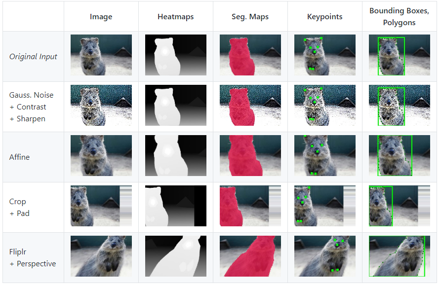

# Imgaug user manual

## Imgaug 란?

이미지를 다루는 딥러닝 모델 경우 데이터 augmentation 기술을 많이 적용할 것이다. `Imgaug`는 이 데이터 augmentation 을 쉽게 하기위해 만들어진 파이썬 모듈이다.


출처 : [깃허브](https://github.com/aleju/imgaug)

해당 모듈에서는 augmentation 통해 만들어진 새로운 이미지들에 대해 bounding box, Keypoints, Segmentation map이 적용된 상태로 저장가능하다. 




## 사용방법

### 설치

해당 모듈은 파이썬 2.7, 3.4+ 이상 지원한다.

### Anaconda에서 설치

To install the library in anaconda, perform the following commands:

```
conda config --add channels conda-forge
conda install imgaug
```

You can deinstall the library again via `conda remove imgaug`.

### pip를 통해 설치

```
pip install imgaug
```

깃허브를 통해 최신버전을 직접받기

```
pip install git+https://github.com/aleju/imgaug.git
```

자세한 설명을 원할 경우 [install guide](https://imgaug.readthedocs.io/en/latest/source/installation.html) 참고!

삭제하고싶은경우 `pip uninstall imgaug`를 입력하여 삭제 가능


## 사용 매뉴얼

[Documentation](https://imgaug.readthedocs.io/en/latest/index.html)에서 자세한 설명이 담겨있다.


## 참고

[참고1](https://junyoung-jamong.github.io/machine/learning/2019/01/23/바운딩박스를-포함한-이미지-증폭시키기-with-imgaug.html)