# Object Detection

객체 인식과 검출은 엄연히 다른 말이다. 인식은 자동차가 정지 신호를 인식하고 보행자와 가로등을 구별할 수 있도록 하는 것이고 검출은 이미지 내에서 특정 feature를 검출 하는 것이다.


## IoU(Intersection over Union)

object detection에서 모델을 훈련하거나 예측할 때 사용하는 도구로 특정 데이터 집합에서 물체 탐지기의 정확도를 측정하는 데 사용되는 평가 지표이다.

일반적으로 HOG + Linear SVM 물체 탐지기  및 Convolutional Neural Network 탐지기 (R-CNN, Faster R-CNN, YOLO 등) 의 성능을 평가하는 데 사용되는 Union over Intersection을 찾을 수 있다 . 그러나  예측을 생성하는 데 사용 된 실제 알고리즘 은 중요하지 않다.

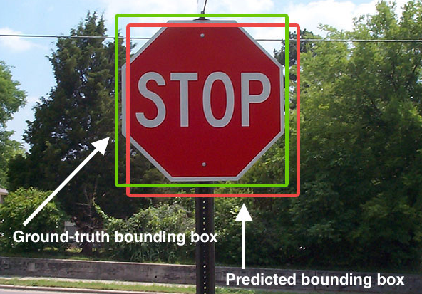

수작업으로 표시한 **진짜 경계상자(Ground-truth bounding box)**와 모델이 **예측한 경계상자(Predicted bounding box)**

 - IoU = 교집합의 영역 넓이/ 합집합의 영역 넓이

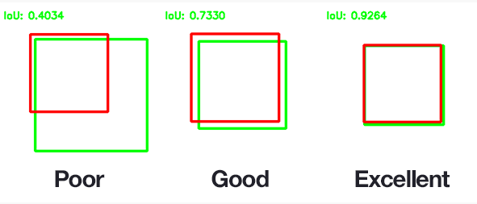

 IOU의 평가지표, 영역이 많이 겹칠수록 점수도 높다. 성능을 올리기 위해 IoU threshold 값을 조절해서 모델링 하기도 한다.


## NMS(Non-Maximum Suppression) 알고리즘


## cv2.CascadeClassifier()

- 이미지에서 feature 를 검출하기 위해 모든 가능한 크기의 커널에 대해 이미지의 모든부분에 적용을 해야 한다. 예시로 adaboost를 꼽을수 있지만 이 방법으로는 시간이 너무 걸리게되는 무식한 작업인데 예를들어 3x3 크기의 이미지에 대해 이 방법을 적용할 경우 수만가지에 대해 계산을 해야 한다.

  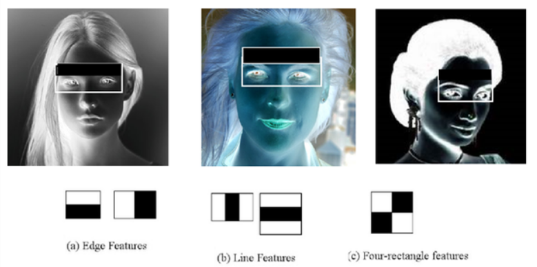


- 이런 방법 대신 단순하고 시간을 적게 걸리게 하기위해 Cascade Classifier가 구현되었다. 
- haarcascade 방식의 알고리즘은 머신 러닝의 컨볼류션(convolution neural network) 신경망 분석 기법과 유사하다. Opencv에서는 haarcascade를 통해 이미지 feature를 학습 시킬 수 있고 특정 이미지에서 feature를 검출 할 수 있다. 
- 얼굴을 인식하기 위한 haarvascade_frontalface_default.xml의 예를 들면 수천개의 양화와 음화 이미지를 학습하여 만들어진다. 음화는 과거에 카메라 촬영 후 현상 작업을 통하여 얻어지는 결과가 네가티브 즉 음화이다. 위 그림에서처럼 이미 얼굴이 인식되었다고 하면 눈의 명암적 특징을 컨볼루션 Neural Network 머신 러닝에 의해서 찾아내는 것도 가능할 것이다. 사람이 얼굴 및 신체 각부위의 특징을 찾아내듯이 수많은 자동차의 특징도 유사한 방법으로 찾아낼 수 있을 것이며 cars.xml 라이브러리가 바로 haarcascade 라이브러리가 제공하는 자동차 인식 라이브러리이다.

- OpenCV에서는 얼굴 또는 특정신체부위를 검출하기 위해 학습된 데이터(haarcascade_frontalface_default.xml, haarcascade_eye.xml)를 제공하고 있다.

- 사용예시

  ```python
  #얼굴 검출용
  classifier = cv2.CascadeClassifier('haarcascade_frontalface_default.xml')
  #눈 검출용
  classifier = cv2.CascadeClassifier('haarcascade_eye.xml')
  
  #jpg
  src = cv2.imread('pic/dog.jpg')
  
  faces = classifier.detectMultiScale(src)
  
  #해상도가 작으면 찾기 어렵다
  #회전되어 있는 얼굴은 회전을 해주고 검출해야 함
  for (x, y, w, h) in faces:
      cv2.rectangle(src, (x, y), (x + w, y + h), (255, 0, 255), 2)
  imshow('src', src)    
  ```

  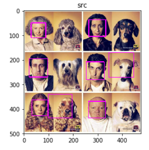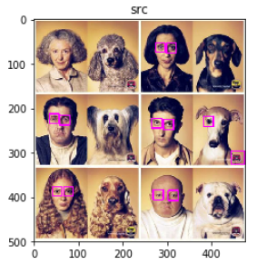

  > 얼굴 검출과 눈 검출, 눈 같은 경우 검출이 제대로 되지 않는 것을 볼 수 있다.

- 얼굴은 공통부분이 많아 검출이 쉽게 된다.

- 눈은 고주파 성분이 없고 패턴이 너무 단순하므로 학습을 잘 시켜도 눈이 아니어도 눈으로 검출할 가능성이 크기 떄문에 어렵다.

- 해당 문제를 해결하기 위한 대안으로 먼저 얼굴 검출 후 얼굴 높이의 반만 정해주면 입이 눈으로 인식되는 부분을 피할 수 있다.

- 사용예시

  ```python
  face_classifier = cv2.CascadeClassifier('haarcascade_frontalface_default.xml')
  eye_classifier = cv2.CascadeClassifier('haarcascade_eye.xml')
  
  src = cv2.imread('pic/kids.png')
  
  faces = face_classifier.detectMultiScale(src)
  
  for (x1, y1, w1, h1) in faces:#얼굴부분을 먼저 검출
          cv2.rectangle(src, (x1, y1), (x1 + w1, y1 + h1), (255, 0, 255), 2)
  
          print(x1, y1, w1,h1)
          faceROI = src[y1:y1 + (h1), x1:x1 + w1]#얼굴의 높이의 반정도 주면 입이 눈으로 인식되는 부분을 피할 수 있따.
          eyes = eye_classifier.detectMultiScale(faceROI) #얼굴부분에서만 눈 체크
  
          for (x2, y2, w2, h2) in eyes:
              center = (int(x2 + w2 / 2), int(y2 + h2 / 2))
              cv2.circle(faceROI, center, int(w2 / 2), (255, 0, 0), 2, cv2.LINE_AA)
  
  imshow('src', src)  
  ```

  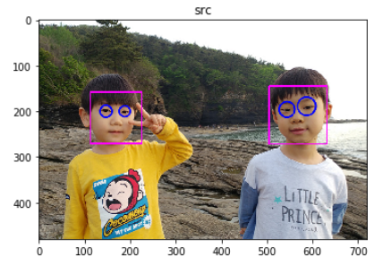

  

  

## cv2.HOGDescriptor()

> HOG Algorithm은 일반적으로 보행자 검출이나 사람의 형태에 대한 검출 즉, Object Tracking에 많이 사용되는 Feature 중 하나이다. Image의 지역적인 Gradient를 해당 영상의 특징으로 사용하는 방법이다. 
>
> 출처: https://eehoeskrap.tistory.com/98 [Enough is not enough]

> 사람 및 사물을 검출하는 방법은 다음과 같이 수행된다.

1. 이미지 전처리를 위한 crop 및 resize 

   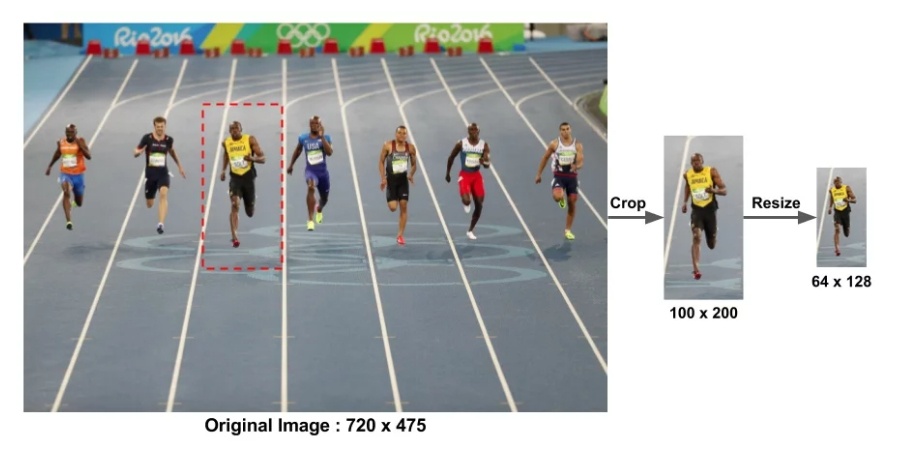

2. 이미지의 gradient 계산

   - x, y 축에 대해 edge 추출을 위해 커널 적용 후 gradient 계산

   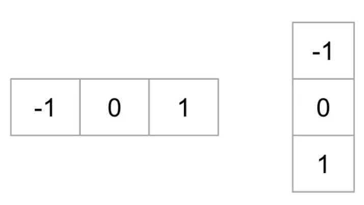

   - sobel 필터를 통해 gradient 에 따른 이미지를 검출 할 수 있음

     ```python
     # Read image
     im = cv2.imread('bolt.png')
     im = np.float32(im) / 255.0
      
     # Calculate gradient 
     gx = cv2.Sobel(img, cv2.CV_32F, 1, 0, ksize=1)
     gy = cv2.Sobel(img, cv2.CV_32F, 0, 1, ksize=1)
     
     #magnitude(벡터크기) , direction
     mag, angle = cv2.cartToPolar(gx, gy, angleInDegrees=True)
     ```

     - gradient의 magnitude와 direction을 아래의 식을 통해 얻을 수 있음

     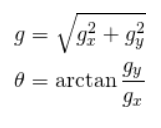

     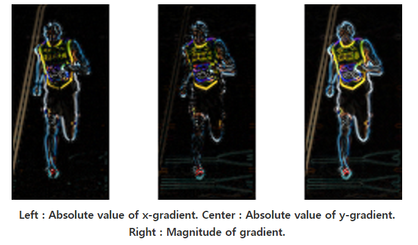

     > 왼쪽: x-gradient 의 절대 값, 중앙: y-graident의 절대 값,  오른쪽: gradient의 magnitude(벡터크기)

3. 8x8 셀 내의 Histogram of Gradient 계산

   - 해당 이미지(64 x 128)는 8x8 로 ROI(얼굴,머리,상단 등)를 검출하기에는 충분하며 16(128/8), 8(64/8)의 이미지로 다시 표현한 것 
   - 만약 crop 및 resize의 크기를 다르게 할 경우 최적의 셀을 알아봐야 할 것

   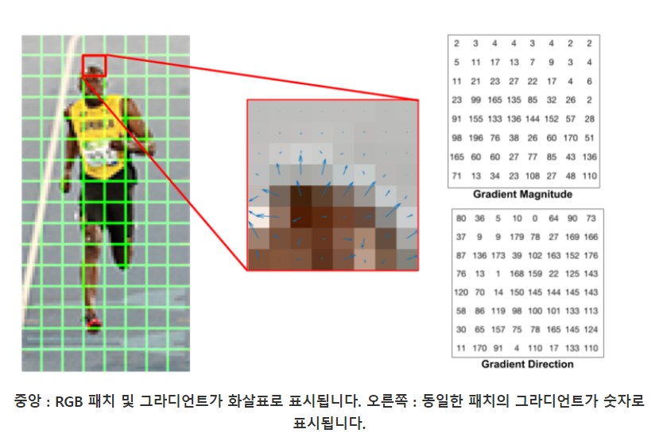

   - 위는 8x8 패치에 대한 Gradient의 크기와 방향에 대해서 나타낸 사진이다.

   - 위와 같은 사진의 결과는 0 ~ 360도도가 아닌 signedGradient=False인 경우이다.

   - 따라서 모든 각도를 0 ~ 180도로 표현한 것 이다.

   - 위와 같은 결과를 몇개의 bin으로서 표현할 지 정하여서 나타낸다.

   - 아래의 사진은 nbins=9로 두어서 0 ~ 180도를 9개의 bin으로서 표현한 것 이다.

     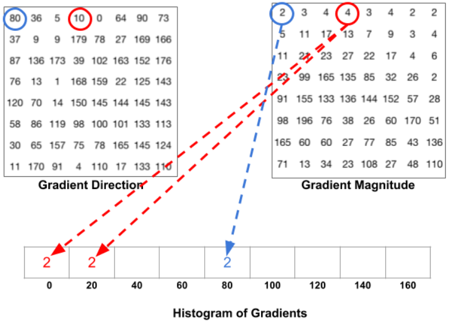

     > direction이 80 일떄 값은2 이며 10도일때 값은 4이지만 0과 20사이 절반이므로 각각 2 씩 들어가게된다.


## YOLO(You Only Look Once) v3

> 1. 격자 단위로 나누어 한번에 클래스를 판단하고 이를 통합해 최종 객체를 구분
> 2. 기존의 방법들과 달리 Object detection을 이미지 픽셀 좌표에 대응되는 bounding box을 찾음
> 3. 이에 대한 class확률을 구하는 Single Regression Problem으로 해결
> 4. 기존에 사용하던 방식들을 이미지를 스캔하는 방식으로 객체를 인식하였기 때문에 속도가 현처히 느렸음
> 5. 제일 최근까지 개발된 것이 현재 v3 임
> 6. **Input 이미지 또는 영상 사이즈는 무조건 416x416**(v3 기준)으로 맞춰 주어야 함

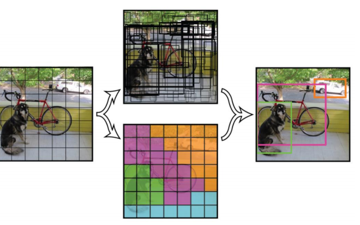

> YOLO는 이미지를 13x13 cell로 나누게 된다.


### Network Architecture for YOLO v3 

#### YOLO v3 Full Network Architecture

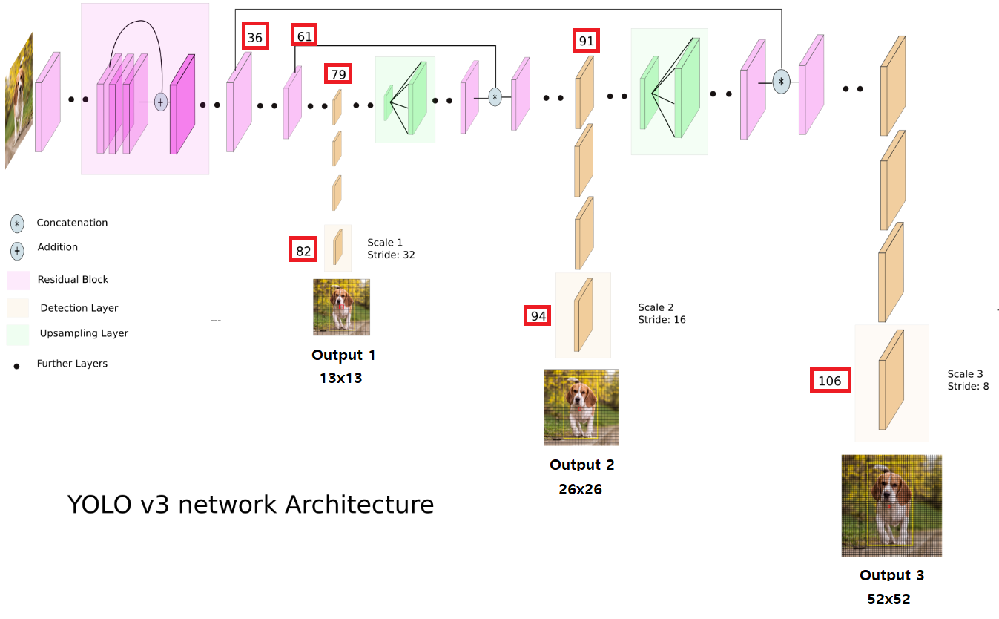

>  - YOLO v3 Network base는 Darknet-53 을 기반으로 설계 되었다.
>  - 빨간네모에 속한 번호들은 각 layer의 번호
>  - 출력 layer 들의 이름은 각각 `YOLO_82`, `YOLO_94`, `YOLO_106` 
>  - 위 출력 layer를 통해 **세가지의 서로다른 scale을 통해 bounding box를 dectect한다.**


#### Darknet-53 Network

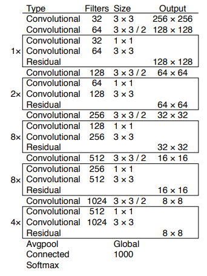

> - Darknet-53의 Network Architecture, 53은 layer의 수를 의미
> - Imagenet에서 train 시킨 Network를 이용, YOLO v2 는 Darknet-19를 기반으로 만들어짐

  

### Detection at three Scales

> YOLO v3 의 핵심은 **세가지의 서로다른 scale을 통해 bounding box를 dectect한다.** 
>
> 서로 사이즈가 다른 세가지의 맵에서 1x1 kernel로 detect를 수행하며 아래의 조건을 통해 다음의 식을 가진다.

- `YOLO v3`, `COCO`에서 train 된 경우 
  1. **B = 3** , bounding box의 수 
  2. **C = 80** , Class(분류항목)의 수

```markdown
kernel = 1 x 1 x (B x (5 + C) )
kernel = 1 x 1 x 255
```

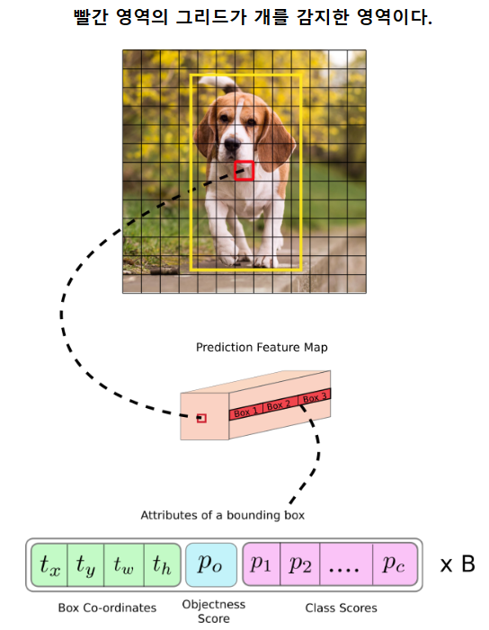

> Bounding box에는 해당 박스의 x,y, w(넓이),h(높이) , Po(object일 확률), 각 class의 확률 정보가 들어가 있다.  


- 3개의 scale을 통해 예측할 때 **이미지의 크기를 32, 16, 8 사이즈로 Downsampling**을 진행함
  
  1. 첫번째 탐지는 82번 레이어(`YOLO_82`)에서 수행된다. 
     
     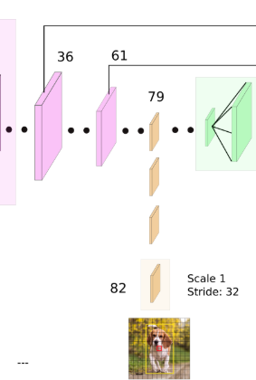
     
     1. 81번째 레이어에서 이미지를 **Downsampling**하여 81 레이어의 Stride가  32가 된다. 
     2. 82번 레이어에서 기존 이미지 사이즈인 416x416에서 32를 나누어 **13x13**으로 변환되며 1x1 커널을 사용해 **13x13x255** 의 detection map을 가진다. 
     
  2. 두번째 탐지는 94번 레이어(`YOLO_94`)에서 수행된다.
  
     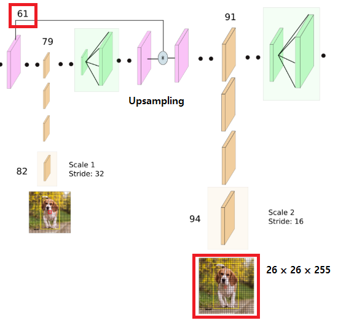
  
     1. **26x26** 사이즈로 2배가 되는 **Upsampling** 되기 전 61번의 레이어와 추가적으로 결합된다.
     2. 최종적으로 94번 레이어에서 **26x26x255** 의 detection  map을 가진다.
  
  3. 세번째 탐지는 106번 레이어에서 수행된다.
  
     
  
     1. **52x52** 사이즈로 되기 전 36번의 레이어와 추가적으로 결합된다.
     2. 최종적으로 106번 레이어에서 **52x52x255**의 detection map을 가진다.


### Anchor Boxes(앵커박스)

> - 검출되는 bounding box의 너비와 높이를 예측하는것이 합리적일 수 있으나 실제 학습중에는 불안정한 gradient 가 발생한다. 
>- 최근의 객체탐지기는 로그공간 변화를 예측하거나 미리 사전에 정의된 bounding box를 **앵커박스**라 부르는데 앵커박스로 오프셋 하기도 한다.
> - YOLO v3에는 각 셀당 3개의 앵커 박스가 있으며 **총 9개**(3개의 스케일 x 셀당 3개의 박스)의 bounding box를 예측한다.

#### 1. Bounding box의 수

> 동일한 사이즈의 이미지에서 v3는 v2보다 더많은 바운딩박스를 예측한다.
>
> 416x416 사이즈에서 v2는 13x13x5 = **845개** 의 바운딩 박스를 예측한다.
>
> v3의 경우 각 스케일당 3개 씩으로 507(13x13x3), 2028(26x26x3), 8112(52x52x3) 총 **10,647개**의 바운딩 박스를 예측한다.

#### 2. 예측하기

> 아래의 사진은 bounding box를 얻기 위해 네트워크 출력이 변환되는 과정을 설명한 것이다.

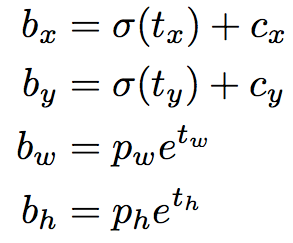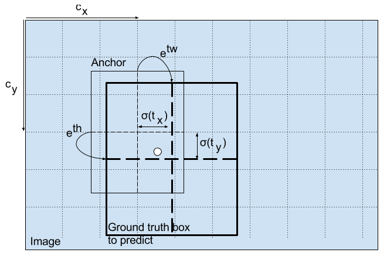

- bx, by, bw, bh 는 예측의 x, y 중심 좌표, 너비 및 높이

- tx, ty, tw, th 는 네트워크가 출력하는 것(Output). 

- cx 와 cy 는 그리드의 왼쪽 위 좌표이고, pw 및 ph 는 box에 대한 앵커의 치수

  

  > 출처: http://christopher5106.github.io/object/detectors/2017/08/10/bounding-box-object-detectors-understanding-yolo.html


### 실습코드

- [YOLO](https://github.com/madfalc0n/Image-analysis-and-develope/blob/master/Deep_Learning/20200128/opencvyolo.ipynb)


confidence 오브젝트일 확률

바운딩박스

나


참고주소:

https://www.learnopencv.com/histogram-of-oriented-gradients/

https://wjddyd66.github.io/opencv/OpenCV(8)/

https://towardsdatascience.com/yolo-v3-object-detection-53fb7d3bfe6b

https://blog.paperspace.com/how-to-implement-a-yolo-object-detector-in-pytorch/