# OpenCV Feature Extraction

> 이미지에서 라인, 코너, 특징점 등과 같은 `특징 추출(feature extraction)`이라고 함 


## 정의

- 가로/세로 위치 변화에 따른 픽셀 값의 변화율을 이미지의 도함수(Image derivatives)라고 한다. 다음 식에서 f(x)f(x)는 xx위치의 픽셀 명도이다.

  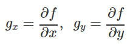

- x,yx,y 방향의 도함수의 크기를 구하는 것이 라플라스 연산이다.

  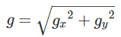

- 실제 이미지 프로세싱에서는 다음과 같은 중앙차분법(central difference)을 사용한다.

  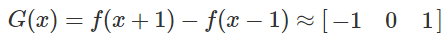

- 이 연산은 다음 이미지 커널를 사용하여 필터링한 것과 같다.

  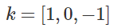


## Edge Extraction

> 이미지 속 경계선을 인지하는 것이 `엣지 추출(edge detection)`이라고 함, 종류는 `Sobel edge Detection`과 `Canny edge Detection`이 있음

### 1. Canny Edge Extraction

> 그레디언트의 크기 뿐 아니라 방향도 사용한다. 또한 국부 최대값 근처의 그레디언트값을 제거하는 `Non maximal suppression`을 이용하여 가짜 엣지를 제거한다. 마지막으로 두 개의 기준값(threshold)을 사용해서 엣지를 구분한다.

- cv2.Canny(원본 이미지, 임계값1, 임계값2, 커널 크기, L2그라디언트) 
  - 많이 쓰는 함수
  - 반환 값은 0 또는 255로 나옴
  - 임계값1은 임계값1 이하에 포함된 가장자리는 가장자리에서 제외
  - 임계값2는 임계값2 이상에 포함된 가장자리는 가장자리로 간주
  - 커널 크기는 Sobel 마스크의 Aperture Size를 의미합니다. 포함하지 않을 경우, 자동으로 할당
  - L2그라디언트는 L2방식의 사용 유/무를 설정합니다. 사용하지 않을 경우, 자동적으로 L1그라디언트 방식을 사용
  - L2그라디언트 : (dI/dx)2+(dI/dy)2
    L1그라디언트 : ∥dI/dx∥+∥dI/dy∥
  - 사용예시

  ```python
  image = cv2.imread("./data/book.jpg")
  gray = cv2.cvtColor(image, cv2.COLOR_BGR2GRAY)
  gray = cv2.GaussianBlur(gray, (3, 3), 0)
  edged = cv2.Canny(gray, 10, 250) 
  #외곽선정보 따는거, 가우시안 안쓰면 엣지들이 많이 나옴. 250보다 크면 무조건 엣지를 보겠다. 10보다 작으면 엣지를 안본다
  ```

  

  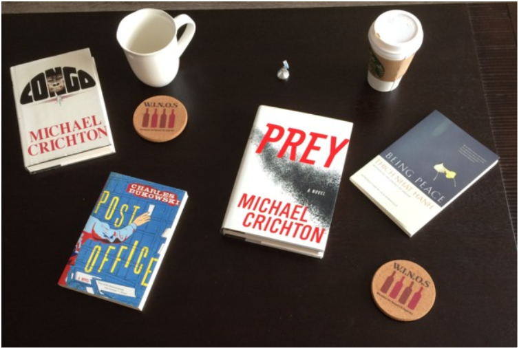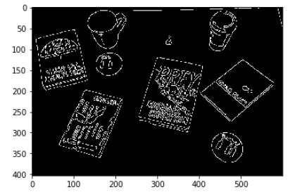

  > 원본, 가우시안블러+Canny를 적용 

- [실습](https://github.com/madfalc0n/Image-analysis-and-develope/blob/master/image_processing/20200110/1.2_low_level_filter.ipynb)


### 2. Sobel edge Detection

```python
#소벨 필터 사용
sobel1 = cv2.Sobel(img, cv2.CV_64F, 1 , 0, ksize=3)   #ksize 는 커널 사이즈, 64플롯 타입으로 출력(음수도 표시하기 위함)
sobel2 = cv2.Sobel(gauss_7, cv2.CV_64F, 1 , 0, ksize=3) 
plt.imshow(np.hstack([sobel1, sobel2])) # 노이즈가 너무 많아서 다 걸려버림...0에서 1로 정규화 안되어 있기도 하고
```

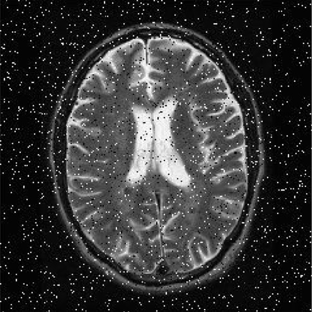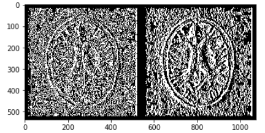

> 원본, sobel, 가우시안블러+sobel 노이즈가 너무 많아서 다 걸려버림...0에서 1로 정규화 안되어 있기도 하고

```python
from skimage.data import text
import cv2

img = text()

sobelx = cv2.Sobel(img, cv2.CV_8U, 1, 0, ksize=3)
sobely = cv2.Sobel(img, cv2.CV_8U, 0, 1, ksize=3)
laplacian = cv2.Laplacian(img, cv2.CV_8U)

plt.figure(figsize=(9, 4))
plt.subplot(2, 2, 1)
plt.imshow(img, cmap='gray')
plt.title('Original')
plt.axis("off")
plt.subplot(2, 2, 2)
plt.imshow(laplacian, cmap='gray')
plt.title('Laplacian')
plt.axis("off")
plt.subplot(2, 2, 3)
plt.imshow(sobelx, cmap='gray')
plt.title('Sobel X')
plt.axis("off")
plt.subplot(2, 2, 4)
plt.imshow(sobely, cmap='gray')
plt.title('Sobel Y')
plt.axis("off")
plt.tight_layout()
plt.show()
```

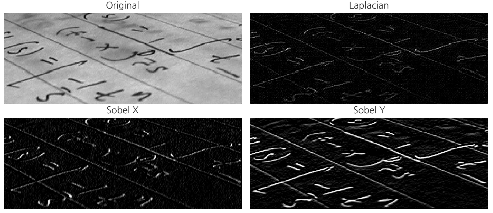

> [DSschool](https://datascienceschool.net/view-notebook/7eb4b2a440824bb0a8c2c7ce3da7a4e2/) 에서 퍼왔다... 어느정도 sobel의 예시를 잘 보여주고 있다.


### ORB(Oriented FAST and Rotated BRIEF)

> 주변과 방향성을 원으로 표시한 것,
>
> 용도는 파노라마 용에 많이 쓰임
>
> 물체/로고/얼굴 인식할 때 쓰임,
>
> 증강현실

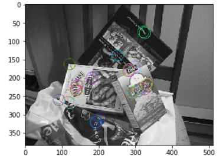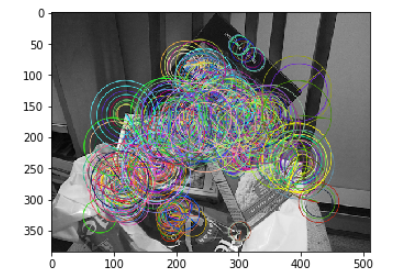

원의 크기가 크다는것은 그만큼 정보량이 있다는 것. 원이 작다는 것은 범위를 벗어나면 다른점으로 인식할 수 있다. 


#### 실습

- [ORB](20200114/1.3_Corner_ORB.ipynb)


## Corner Extraction

> 코너는 `Edge가 교차되는 지점`이다.

### 1. Harris Corner

> 해리스 엣지 컴출

코너를 찾는 알고리즘

그레이 영상을 넣고 자동으로 찾아줌

- cv2.cornerHarris(src, blockSize, ksize, k[, dst[, borderType]]) → dst
  - src – Input single-channel 8-bit or floating-point image.
  - dst – Image to store the Harris detector responses. It has the type CV_32FC1 and the same size as src .
  - blockSize – Neighborhood size (see the details on cornerEigenValsAndVecs() ).
  - ksize – Aperture parameter for the Sobel() operator.
  - k – Harris detector free parameter. See the formula below.
  - borderType – Pixel extrapolation method. See borderInterpolate() .


원의면적은 점의 갯수


코너 찾는데 주변픽셀도 고려 

### 2. Hough line transformation

> 허프라인변환, 검출된 엣지로부터 직선을 이루는 부분을 찾아주는 함수
>
> cv2.HoughCircles(image, method, dp, minDist[, circles[, param1[, param2[, minRadius[, maxRadius]]]]]) → circles

- 원을 찾아주는 전용함수

- image – 8-bit single-channel image. grayscale image.

- method – 검출 방법. 

  - 현재는 `HOUGH_GRADIENT(엣지가 있는지 없는지 판단)`가 있음.
  - 캐니엣지가 따로 들어가므로 캐니함수 안써도됨

- dp

  - dp=1이면 Input Image와 동일한 해상도.(고정으로 씀) 
  - 2일때는 결과를 반으로 줌

- minDist

  - 검출한 원의 중심과의 최소거리. 
  - 값이 작으면 원이 아닌 것들도 검출이 되고, 너무 크면 원을 놓칠 수 있음.

- param1

  - 내부적으로 사용하는 canny edge 검출기에 전달되는 Paramter
  - edge threshold low ->  edge가 검출되어 같은 원이 검출됨
  - 에지문턱값으로 불림, 값이 작으면 많이 생성되기 때문에 원이 많이 검출될 
  - 크면 에지가 검출안되기 때문에 원의수도 줄어듬
  - 바둑개수가  검출이 안되면 낮값을 낮춰야 함

- param2

  - 이 값이 작을 수록 오류가 높아짐. 크면 검출률이 낮아짐.
  - 추정후보지가 원이라고 생각한 수 
  - 크면 정말 원인 애들만 검출하라
  - 작으면 작은 원인 애들도 검출하라

- minRadius – 원의 최소 반지름.

- maxRadius – 원의 최대 반지름.

- 사용예시

  ```python
  circles = cv2.HoughCircles(gray, cv2.HOUGH_GRADIENT, 1, 20, param1=100, param2=30, minRadius=10, maxRadius=50)
  #그레이스케일 이미지 출력
  #cv2.HOUGH_GRADIENT 로 검출하라
  #기존 이미지와 동일한 해상도로 설정하라
  #
  #
  #서로다른 원간에 최소거리를 20으로 설정하라
  #검출된 원의 크기가 10~50 사이만 선정하라
  print(circles) 
  [[[513.5 123.5  26.4]
       :      :     :
    [194.5  49.5  31.4]]]
  #  x좌표   y좌표  반지름
  
  from collections import Counter
  
  def detect_weiqi(img): #하얀색인지 파란색인지 정해주는 함수
      txt = 'black'
      gray = cv2.cvtColor(img, cv2.COLOR_BGR2GRAY)
      _, threshold = cv2.threshold(gray, 100, 255, cv2.THRESH_BINARY)
  
      c = Counter(list(threshold.flatten()))
      if c.most_common()[0][0] != 0:
          txt = 'white'
      return txt, threshold
  
  circles = np.uint16(np.around(circles))
  font = cv2.FONT_HERSHEY_SIMPLEX
  for i in circles[0, :]:
      x, y, r = i    
      cv2.circle(img, (x, y), r, (0, 0, 255), 5)
      crop_img = img[y - r:y + r, x - r:x + r]    
      txt, threshold = detect_weiqi(crop_img) 
      if txt == 'black' :  
          cv2.circle(img, (x, y),int(r*0.7), (0, 0, 0), -1)
      else :
          cv2.circle(img, (x, y), int(r*0.7), (255, 255, 255), -1)         
  imshow("", img)
  ```

  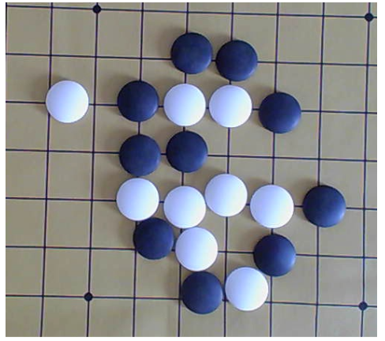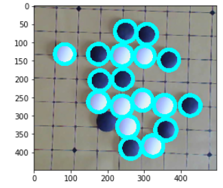


- [실습](https://github.com/madfalc0n/Image-analysis-and-develope/blob/master/image_processing/20200110/1.5_img_rotate_3.ipynb)


### 해밍디스턴스

> 1. 고속으로 재는방법
> 2. 비트로 비교해서 같으면 0 다르면 1, 7과 4의 거리를 재면(서로뻄) 비트로 표시하면 100(2진수) 인데 0을 빼면 1이 남게된다 즉 거리는 1로 표기한다. 


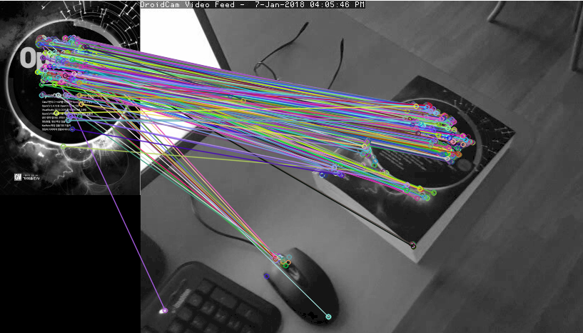


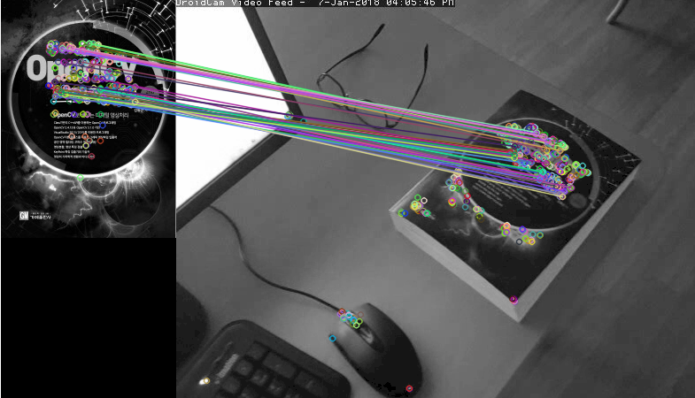


## 참고자료

- https://datascienceschool.net/view-notebook/7eb4b2a440824bb0a8c2c7ce3da7a4e2/