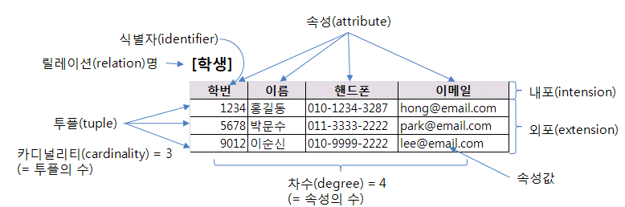
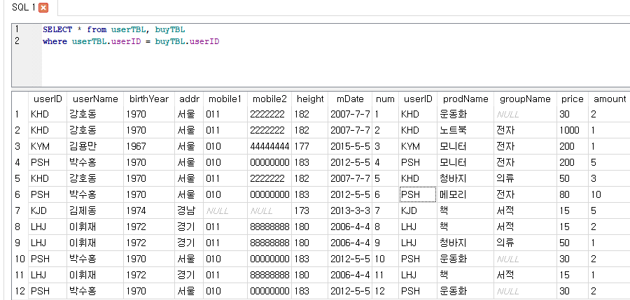
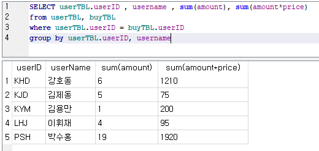
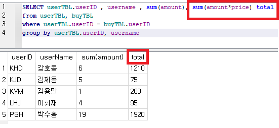
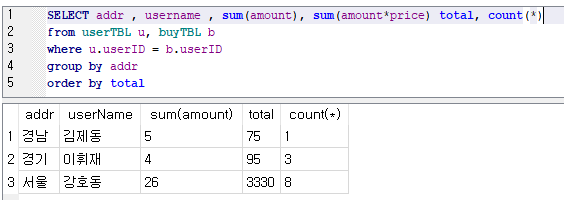

# 데이터베이스

DB를 물건에 비유한다면?

| 공장으로 비유 | 데이터                    |
| ------------- | ------------------------- |
| 물건          | 데이터                    |
| 창고          | 데이터베이스(디스크)      |
| 창고관리인    | DBMS(핵심)                |
| 직원          | 응용 프로그램 또는 사용자 |

* 데이터는 어떤경로를 들어오든 오류가 있으면 안됨 즉, **무결성** 이어야 한다.
* 데이터베이스와 응용 프로그램은 서로 의존적인 관계가 되면 안됨 즉, **독립성** 이어야 한다.
* 데이터를 소유한 사람 또는 데이터에 접근이 허가된 사람만 접근이 가능하며 **보안** 이 철저해야 함

* 데이터베이스 내 **중복 최소화**가 이루어 져야 함

* 통일된 방식으로 **응용 프로그램 제작 할 수 있고 유지 보수 및 수정이 용이함**

* 데이터 손상문제가 발생할 경우 원상복구 가능해야 함 즉, **안정성**이 보장되어야 함

## 관계형 DB

* 모든 데이터는 테이블에 저장
* 테이블 간의 관계는 **기본키(PK)**와 **외래키(FK)**를 사용하여 맺음(**부모-자식**관계)
* 다른 DBMS에 비해 업무 변화에 따라 바로 순응 할 수있고 유지·보수 측면에서도 편리
* 대용량 데이터를 체계적으로 관리 할 수있음
* 데이터의 **무결성**도잘보장됨
* 시스템 자원을 많이 차지하여 시스템이 전반적으로 느려지는 단점이있음



> 엑셀같은 DB...라고 보면 된다., 궁금하다면 구글에 검색을 해보자


## 구문종류

### select

 - 테이블에 있는 값을 조회할 때 사용
 - select *from [테이블명];
   - [테이블명]의 모든 컬럼과 값을 출력
 - where, group by, having, order by, 구문을 통해 조건에 따른 값을 출력 할 수 있음

```sql
select deptno, avg(sal)
from emp
group by deptno;  --그룹핑 

select ..........         -------4
from  대상객체    -------1
where 조건         -------2
group by            -------3

부서별 급여평균(avg(sal))이 2500이상인 부서번호(deptno)와 부서평균급여를 검색, 출력
select deptno, avg(sal)
from emp
group by deptno
having avg(sal) >=2500;

select ..........         -------5
from  대상객체    -------1
where 조건         -------2
group by            -------3
having 그룹함수 조건  -----4

테이블에 데이터가 저장된 순서는 데이터 추가한 순서임(block에 쌓여진 순서) -heap mode
정렬결과를 반환 받으려면
select ..........         -------5
from  대상객체    -------1
where 조건         -------2
group by            -------3
having 그룹함수 조건  -----4
orderd by 컬럼 asc|desc -----6

select empno, ename, sal
from emp;

select empno, ename, sal
from emp
order by sal desc;
```

### insert

 - 테이블에 새로운 값 추가할 때
 - insert into [테이블명] (컬럼1, 컬럼2...) values (값1, 값2);
 - insert 후 commit 하기 전까지 다른 세션에서는 확인 불가

```sql
insert into dept (deptno, dname)
values ( 50 , 'IT');

insert into dept
values (60,null,null); --insert~values 절로는 1개의 row만 추가됨
```

 - 이렇게도 쓸수 있다.

```sql
insert into tdepp select * from dept;  -- tdept테이블에 있던 테이블 값들 tdepp에 복사
```

### create 명령어

 - 테이블 새로 만들때
 - create table [테이블명] (컬럼1 타입1, 컬럼2 타입1,...);

```sql
create table tdepp (
deptno number(3),
dname varchar2(20),
loc varchar2(30)
);

SQL> create table tdepp (
  2  deptno   number(3),
  3  dname   varchar2(20),
  4  loc        varchar2(30)
  5  );

테이블이 생성되었습니다.
```

### update

 - row의 컬럼값 변경
 - update [테이블명] set  컬럼명 = 변경값,........;
 - update [테이블명] set  컬럼명 = 변경값,........where 조건;

 - 값 변경 후 롤백하여 복원된 값 확인

```sql
select ename, sal
from emp;
update emp set sal = 0 ;
select ename, sal
from emp;

rollback; - 변경 수행 취소 명령어

select ename, sal
from emp;
```

 - 사용예....

```sql
SQL> select ename, sal
  2  from emp;

ENAME             SAL
---------- ----------
SMITH             800
ALLEN            1600
WARD             1250
JONES            2975
MARTIN           1250
BLAKE            2850
CLARK            2450
SCOTT            3000
KING             5000
TURNER           1500
ADAMS            1100

ENAME             SAL
---------- ----------
JAMES             950
FORD             3000
MILLER           1300

14 개의 행이 선택되었습니다.

SQL> update emp set sal = 0 ;

14 행이 갱신되었습니다.

SQL> select ename, sal
  2  from emp;

ENAME             SAL
---------- ----------
SMITH               0
ALLEN               0
WARD                0
JONES               0
MARTIN              0
BLAKE               0
CLARK               0
SCOTT               0
KING                0
TURNER              0
ADAMS               0

ENAME             SAL
---------- ----------
JAMES               0
FORD                0
MILLER              0

14 개의 행이 선택되었습니다.

SQL> rollback
  2  ;

롤백이 완료되었습니다.

SQL> select ename, sal
  2  from emp;

ENAME             SAL
---------- ----------
SMITH             800
ALLEN            1600
WARD             1250
JONES            2975
MARTIN           1250
BLAKE            2850
CLARK            2450
SCOTT            3000
KING             5000
TURNER           1500
ADAMS            1100

ENAME             SAL
---------- ----------
JAMES             950
FORD             3000
MILLER           1300

14 개의 행이 선택되었습니다.

SQL>
```


### delete

 - 테이블을 지울 수도 있고 테이블 내의 값만 지울수도 있고...
 - delete [from] 테이블명; - 해당 테이블에 모든 데이터 삭제
 - delete [from] 테이블명 where 조건;

```sql
delete from dept;
select * from dept;
rollback;
delete from dept where deptno in (50, 60) ;
select * from dept;
commit;
```


## JOIN

2개 이상의 서로 다른 테이블을 하나의 결과 테이블을 만드는 것

* userid를 합쳐서 usertbl과 buytbl 항목을 전부 출력해보기

```sql
SELECT * from userTBL, buyTBL
where userTBL.userID = buyTBL.userID
```




* userid,와 username 을 그룹해서 amount 와 amount*price 나타내기



- select 뒤 컬럼에 표시할 항목에 대한 이름을 지정하려면 다음과 같이 하면 된다.



* 응용해서 이렇게 쓸 수도 있다.




## 실습

- [실습자료](https://github.com/madfalc0n/Image-analysis-and-develope/tree/master/python/20191213)