# 데이터베이스

DB를 물건에 비유한다면?

* 물건 데이터
* 창고 데이터베이스(디스크)
* 창고관리인 DBMS - 잘 관리해야 빨리전달되고 할 수 있다.
  * 데이터는 창고관리인을 통해 받을 수 있다
* 직원 응용 프로그램 또는 사용자

데이터는 무결성이어야 한다.

독립성

보안

중복 최소화

응용 프로그램 제작 및 수정 용이

안정성 향상- 데이터 손상문제가 발생할 경우 원상복구 가능해야 함

## 관계형 DB

> 엑셀같은 DB...라고 보면 된다.


## 구문종류

### select

 - 테이블에 있는 값을 조회할 때 사용
 - select *from [테이블명];
   - [테이블명]의 모든 컬럼과 값을 출력
 - where, group by, having, order by, 구문을 통해 조건에 따른 값을 출력 할 수 있음

```oracle
select deptno, avg(sal)
from emp
group by deptno;  --그룹핑 

select ..........         -------4
from  대상객체    -------1
where 조건         -------2
group by            -------3

부서별 급여평균(avg(sal))이 2500이상인 부서번호(deptno)와 부서평균급여를 검색, 출력
select deptno, avg(sal)
from emp
group by deptno
having avg(sal) >=2500;

select ..........         -------5
from  대상객체    -------1
where 조건         -------2
group by            -------3
having 그룹함수 조건  -----4

테이블에 데이터가 저장된 순서는 데이터 추가한 순서임(block에 쌓여진 순서) -heap mode
정렬결과를 반환 받으려면
select ..........         -------5
from  대상객체    -------1
where 조건         -------2
group by            -------3
having 그룹함수 조건  -----4
orderd by 컬럼 asc|desc -----6

select empno, ename, sal
from emp;

select empno, ename, sal
from emp
order by sal desc;
```

### insert

 - 테이블에 새로운 값 추가할 때
 - insert into [테이블명] (컬럼1, 컬럼2...) values (값1, 값2);
 - insert 후 commit 하기 전까지 다른 세션에서는 확인 불가

```oracle
insert into dept (deptno, dname)
values ( 50 , 'IT');

insert into dept
values (60,null,null); --insert~values 절로는 1개의 row만 추가됨
```

 - 이렇게도 쓸수 있다.

```oracle
insert into tdepp select * from dept;  -- tdept테이블에 있던 테이블 값들 tdepp에 복사
```

### create 명령어

 - 테이블 새로 만들때
 - create table [테이블명] (컬럼1 타입1, 컬럼2 타입1,...);

```oracle
create table tdepp (
deptno number(3),
dname varchar2(20),
loc varchar2(30)
);

SQL> create table tdepp (
  2  deptno   number(3),
  3  dname   varchar2(20),
  4  loc        varchar2(30)
  5  );

테이블이 생성되었습니다.
```

### update

 - row의 컬럼값 변경
 - update [테이블명] set  컬럼명 = 변경값,........;
 - update [테이블명] set  컬럼명 = 변경값,........where 조건;

 - 값 변경 후 롤백하여 복원된 값 확인

```oracle
select ename, sal
from emp;
update emp set sal = 0 ;
select ename, sal
from emp;

rollback; - 변경 수행 취소 명령어

select ename, sal
from emp;
```

 - 사용예....

```oracle
SQL> select ename, sal
  2  from emp;

ENAME             SAL
---------- ----------
SMITH             800
ALLEN            1600
WARD             1250
JONES            2975
MARTIN           1250
BLAKE            2850
CLARK            2450
SCOTT            3000
KING             5000
TURNER           1500
ADAMS            1100

ENAME             SAL
---------- ----------
JAMES             950
FORD             3000
MILLER           1300

14 개의 행이 선택되었습니다.

SQL> update emp set sal = 0 ;

14 행이 갱신되었습니다.

SQL> select ename, sal
  2  from emp;

ENAME             SAL
---------- ----------
SMITH               0
ALLEN               0
WARD                0
JONES               0
MARTIN              0
BLAKE               0
CLARK               0
SCOTT               0
KING                0
TURNER              0
ADAMS               0

ENAME             SAL
---------- ----------
JAMES               0
FORD                0
MILLER              0

14 개의 행이 선택되었습니다.

SQL> rollback
  2  ;

롤백이 완료되었습니다.

SQL> select ename, sal
  2  from emp;

ENAME             SAL
---------- ----------
SMITH             800
ALLEN            1600
WARD             1250
JONES            2975
MARTIN           1250
BLAKE            2850
CLARK            2450
SCOTT            3000
KING             5000
TURNER           1500
ADAMS            1100

ENAME             SAL
---------- ----------
JAMES             950
FORD             3000
MILLER           1300

14 개의 행이 선택되었습니다.

SQL>
```


### delete

 - 테이블을 지울 수도 있고 테이블 내의 값만 지울수도 있고...
 - delete [from] 테이블명; - 해당 테이블에 모든 데이터 삭제
 - delete [from] 테이블명 where 조건;

```oracle
delete from dept;
select * from dept;
rollback;
delete from dept where deptno in (50, 60) ;
select * from dept;
commit;
```


## 조인

서로 다른 테이블을 합치는 것


## ORM(Object Relation Model)

* 객체와 관계형데이터베이스의 데이터를 자동으로 매핑해주는 역할을 수행
* 데이터 베이스와 파이썬의 중간역활로 인터페이스 역할을 수행

### ORM 의 특징

1. 장점
   - 객체 지향적인 코드로 인해 **더 직관적이고 비즈니스 로직에 더 집중할 수 있게 도와준다**.
   - ORM을 이용하면 SQL Query가 아닌 직관적인 코드(메서드)로 데이터를 조작할 수 있어 개발자가 객체 모델로 프로그래밍하는 데 집중할 수 있도록 도와준다.
   - 선언문, 할당, 종료 같은 부수적인 코드가 없거나 급격히 줄어든다.
   - 각종 객체에 대한 코드를 별도로 작성하기 때문에 코드의 **가독성**을 올려준다.
   - SQL의 절차적이고 순차적인 접근이 아닌 객체 지향적인 접근으로 인해 생산성이 증가한다.
   - **재사용 및 유지보수의 편리성이 증가**한다.
   - ORM은 **독립적**으로 작성되어있고, 해당 객체들을 **재활용** 할 수 있다.
   - 때문에 모델에서 가공된 데이터를 컨트롤러에 의해 뷰와 합쳐지는 형태로 디자인 패턴을 견고하게 다지는데 유리하다.
   - 매핑정보가 명확하여, ERD를 보는 것에 대한 의존도를 낮출 수 있다.
   - **DBMS에 대한 종속성이 줄어든다.**
   - 객체 간의 관계를 바탕으로 SQL을 자동으로 생성하기 때문에 RDBMS의 데이터 구조와 Java의 객체지향
   - 모델 사이의 간격을 좁힐 수 있다.
   - 대부분 ORM 솔루션은 DB에 종속적이지 않다.
   - 종속적이지 않다는것은 구현 방법 뿐만아니라 많은 솔루션에서 자료형 타입까지 유효하다.
   - 프로그래머는 Object에 집중함으로 극단적으로 DBMS를 교체하는 거대한 작업에도 비교적 적은 리스크와 시간이 소요된다.
   - 또한 자바에서 가공할경우 equals, hashCode의 오버라이드 같은 자바의 기능을 이용할 수 있고, 간결하고 빠른 가공이 가능하다.
2. 단점
   - 완벽한 ORM 으로만 서비스를 구현하기가 어렵다.
   - 사용하기는 편하지만 설계는 매우 신중하게 해야한다.
   - 프로젝트의 복잡성이 커질경우 난이도 또한 올라갈 수 있다.
   - 잘못 구현된 경우에 속도 저하 및 심각할 경우 일관성이 무너지는 문제점이 생길 수 있다.
   - 일부 자주 사용되는 대형 쿼리는 속도를 위해 SP를 쓰는등 별도의 튜닝이 필요한 경우가 있다.
   - DBMS의 고유 기능을 이용하기 어렵다. (하지만 이건 단점으로만 볼 수 없다 : 특정 DBMS의 고유기능을 이용하면 이식성이 저하된다.)
   - 프로시저가 많은 시스템에선 ORM의 객체 지향적인 장점을 활용하기 어렵다.
   - 이미 프로시저가 많은 시스템에선 다시 객체로 바꿔야하며, 그 과정에서 생산성 저하나 리스크가 많이 발생할 수 있다.

출처: https://gmlwjd9405.github.io/2019/02/01/orm.html


### ORM 연동해보기

1. `settings.py`에서 `INSTALLED_APPS`항목에서 다음과  같이 추가한다. 어플리케이션 별로 DB 저장이 가능하다. 나는 `myapp` 에 대해 따로 디비를 만들어 볼 것이다.


2.  `mysite > myapp > models.py`에서 클래스를 정의하자.

```python
from django.db import models
from django.utils import timezone

class User(models.Model):
    userid = models.CharField(max_length=10, primary_key=True)
    name = models.CharField(max_length=10)
    age = models.IntegerField()
    hobby = models.CharField(max_length=20)

    def __str__(self):
        return f"{self.userid} / {self.name} / {self.age}"
```

3. `myapp > admin.py`에서 아래와 같이 정의를한다.

```python
from django.contrib import admin
from myapp.models import User

# Register your models here.
admin.site.register(User) 
```

4. 쉘에서 `python manage.py makemigrations myapp`를 입력 하여 마이그레이션 기록을 생성

   * 시스템이 변경된 기록을 해당 `migrations` 폴더에 기입한다.

   * 변경된 사항이 발생할경우 해당 폴더에 업데이트 됨

     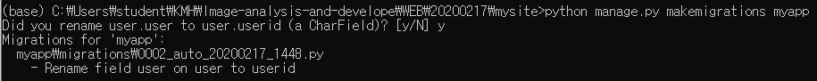

   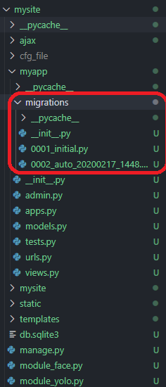

5. 쉘에서 `python manage.py migrate`를 입력하여 변경사항을 적용한다

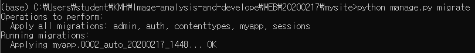

6. `python manage.py shell`를 입력하여 DB를 수정할 수 있는 모드로 진입한다.

   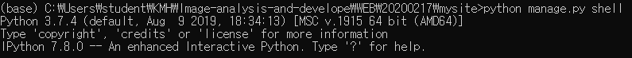


7. DB에 데이터를 넣을 수 있는 방법은 2가지 있다.

   1. runserver를 통해 GUI(admin 모드)에서 수행하거나

      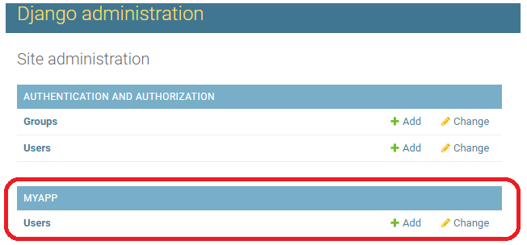

   2. 아래의 명령어로 `myapp`에 대한 디비 호출을 통해 데이터 입력 가능

```python
from myapp.models import User #class 에서 정의 한 모듈을 호출
datas = User.objects.all() 
print(datas)
<QuerySet []>

print(datas) # GUI에서 추가 후 다시 출력했더니 동기화 됨
<QuerySet [<User: Kim / 김유신 / 40>, <User: lee / 이순신 / 40>]>

#데이터 입력하기위한 객체 선언
u = User(userid='lee', name='임꺽쩡', age=40, hobby='봉사')

#이런식으로도 출력할 수 있음
u.name #'임꺽쩡'

print(datas) # 아직 세이브를 하지 않았기 때문에 적용이 되지 않음
<QuerySet [<User: Kim / 김유신 / 40>, <User: lee / 이순신 / 40>]>

#데이터 변경사항 저장
u.save()

#변경사항이 적용된것을 확인
print(datas)
<QuerySet [<User: Kim / 김유신 / 40>, <User: lee / 임꺽쩡 / 40>]>

#GUI에서 적용한거는 save없이 바로 적용됨
print(datas)
<QuerySet [<User: Kim / 김유신 / 40>, <User: lee / 임꺽쩡 / 40>, <User: leeel / 이순신 / 50>]>
```


## 실습해보기

장고에서 `admin`을 통해 지원하므로 실습을 해보자

* `아나콘다 shell`에서 장고를 통해 생성한 프로젝트 폴더에서 `python manage.py runserver` 입력


* 서버 실행 후 웹 서버에서 `/admin` 추가 후 접속

* 아까 생성했던 계정과 비밀번호 입력 후 접속한다.

  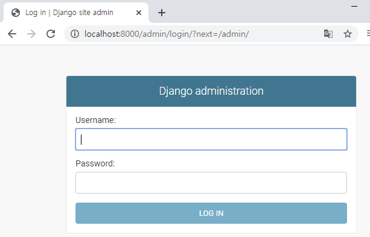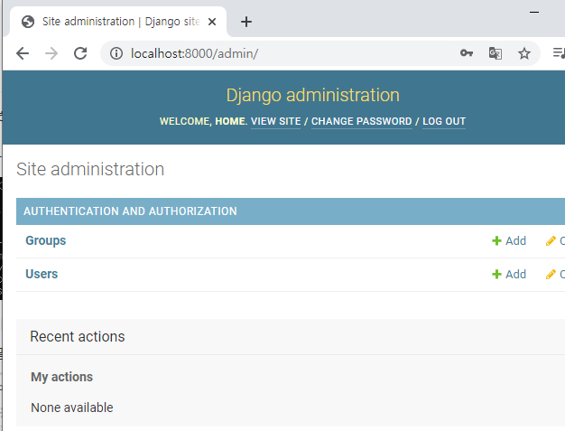

* `users` 클릭해서 `add user`선택 후 계정을 만들어보자

  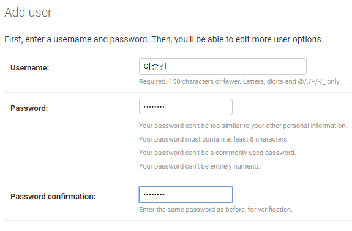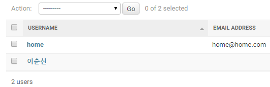

장고에서 사용자와 관련된 DB는 모두 **`db.sqlite3`**에 저장된다.


### DB 관리툴 실행해보기

DB를 접근할 수 있는 UI 툴을 [웹](https://sqlitebrowser.org/dl/)에서 받아서 실행시켜보자

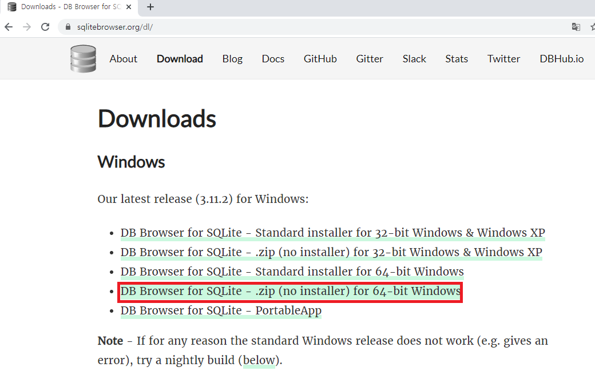

다운 받아서 압축 풀고 **`DB Browser for SQLite.exe`**을 실행시킨 후 장고에 있는 **`db.sqlite3`**를 열어보자

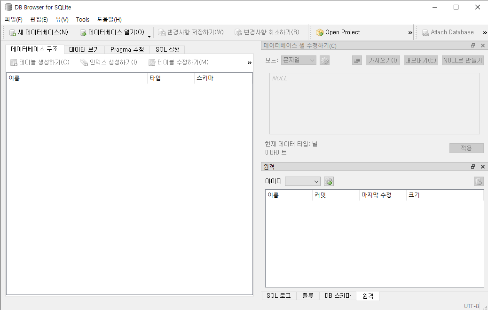

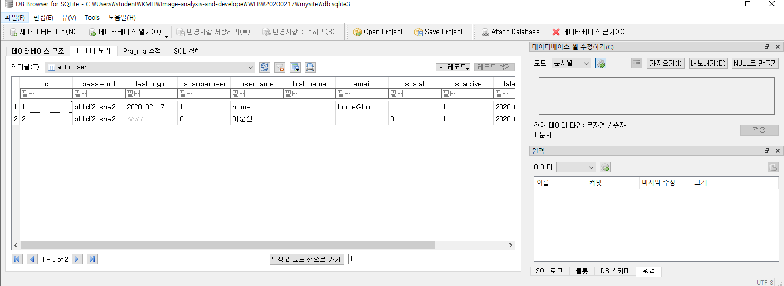


* `SQL 실행` 항목에서 다음의 쿼리문을 작성해서 실행시켜봐라

```sql
INSERT into userTBL VALUES
('KHI', '강호동', 1970, '서울', '011', '2222222',182, '2007-7-7')
```


* userid를 합쳐서 usertbl과 buytbl 항목을 전부 출력해보기

```sql
SELECT * from userTBL, buyTBL
where userTBL.userID = buyTBL.userID
```


* userid,와 username 을 그룹해서 amount 와 amount*price 나타내기


- select 뒤 컬럼에 표시할 항목에 대한 이름을 지정하려면 다음과 같이 하면 된다.


* 응용해서 이렇게 쓸 수도 있다.


## 주피터 노트북으로 장고쓰기

1. 먼저 장고를 다운그레이드 해야한다 (3.0 -> 2.0) `pip install django==2.0` 입력

2. 다운그레이드 후 `pip install django-extensions` 입력하여 설치

3. 셋팅에서 `django_extenssion` 입력 

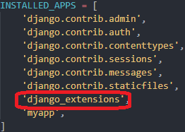

4. 쉘에서 `python manage.py shell_plus --notebook` 입력 후 `mysite`폴더에서 프로젝트 생성

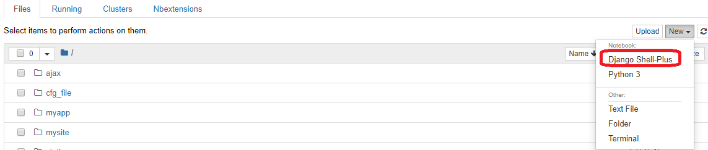

5. ORM 을 주피터노트북으로 테스트해보자

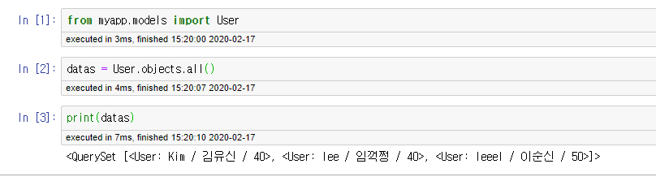


웹 서버와 디비를 연동해보자!

1. models 모듈하나 만들고

   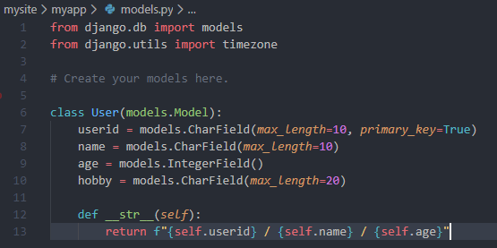

2. 템플릿 하나 만들고

   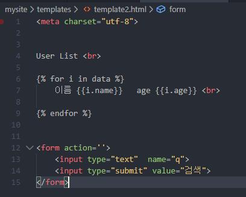

3. view에 함수 하나 만들고

   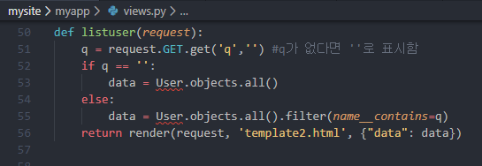

4. urls에 path 하나 추가하고 models 모듈 호출해서 db 호출하고

   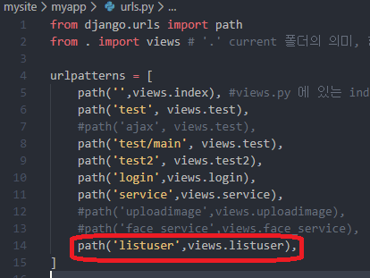

5. 테스트해보고

   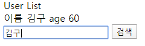