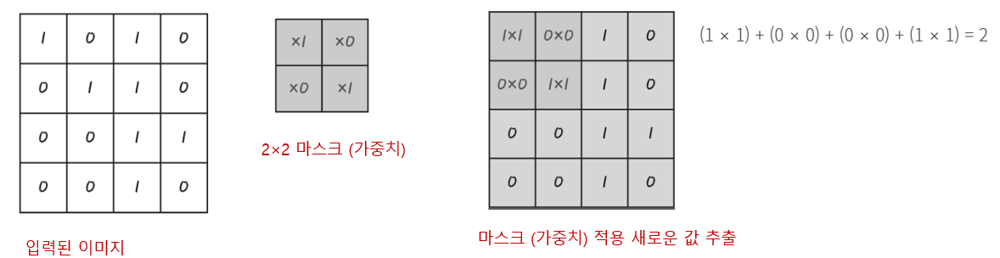
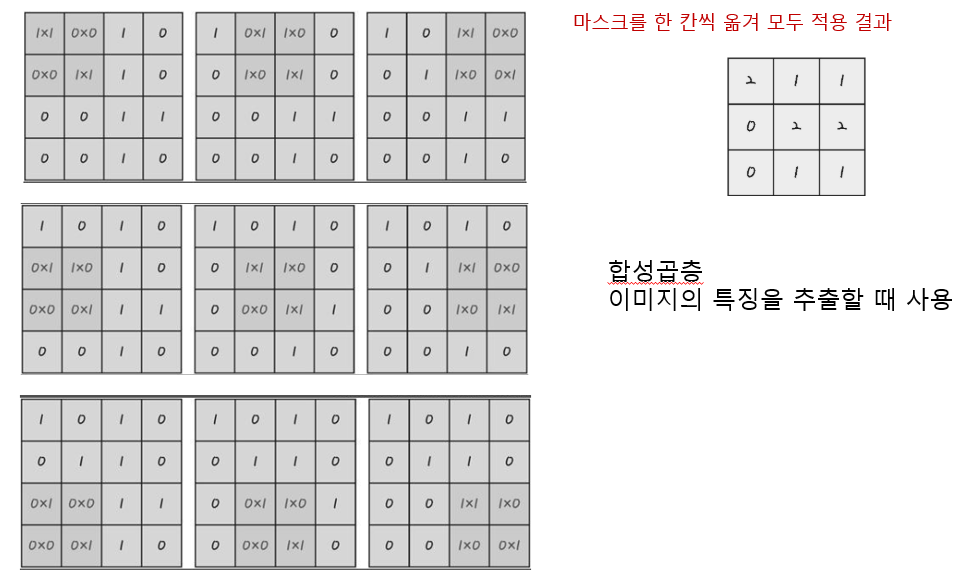
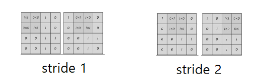
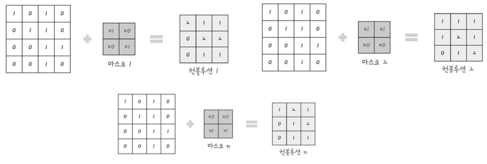
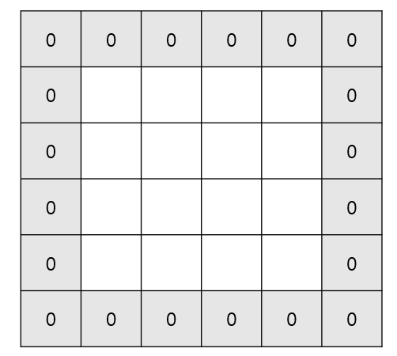
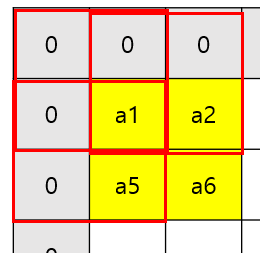
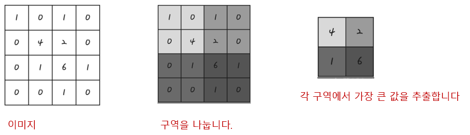
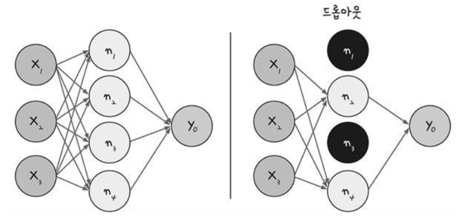
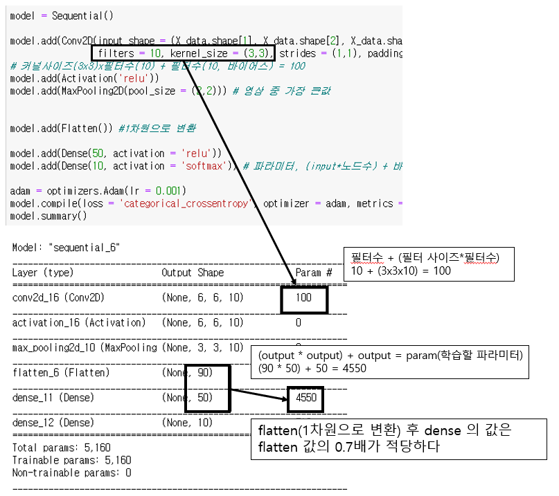

# CNN(Convolutional Neural Network)

> 말 그대로 convolution 이라는 작업이 들어가는 뉴럴 넷
>
> 이미지 전체를 보는것이 아닌 부분(filter)을 보는것 
>
> 1. 이미지, 비디오, 텍스트 또는 사운드를 분류하는 머신 러닝의 한 유형인 [딥러닝](https://kr.mathworks.com/discovery/deep-learning.html)에 가장 많이 사용되는 알고리즘.
>
> 2. 이미지에서 객체, 얼굴, 장면을 인식하기 위해 패턴을 찾는 데 특히 유용함. 
> 3. 데이터에서 직접 학습하며, 패턴을 사용하여 이미지를 분류하고 특징을 수동으로 추출할 필요가 없다.
>
> 4. [자율 주행 자동차](https://kr.mathworks.com/solutions/automotive/automated-driving.html), [얼굴 인식 애플리케이션](https://kr.mathworks.com/discovery/face-recognition.html)과 같이 [객체 인식](https://kr.mathworks.com/discovery/object-recognition.html)과 [컴퓨터 비전](https://kr.mathworks.com/solutions/image-video-processing.html)이 필요한 분야에서 CNN을 많이 사용하며 응용 분야에 따라 CNN을 처음부터 만들 수도 있고, 데이터셋으로 사전 학습된 모델을 사용할 수도 있다.





> 출처는 모두의 딥러닝.. 이런식으로 필터를 통해 부분 탐색을 한다고 보면 된다
>
> 각 스텝별로 1개의 Value를 얻으며 위 과정을 반복하면 3x3의 Output을 얻게된다

## 1. input과 filter 사이즈에 따른 output 출력 공식 

```markdown
1. Input size -> N (i.e. N x N)
2. Filter size -> F (i.e. F x F)
3. Output size -> k:=(N-F)/stride + 1 where k is an integer.(stride는 스텝수, 다음 픽셀로 갈 때 넘어갈 수)
```



- `Input, Filter, stride` 를 통해 나온 `Output`을 `convolution layer`라고 부른다. 즉, 하나의 filter당 하나의`activation`이 하나 주어지면 이에 따른 `convolution layer`를 얻을 수 있다는 것이다. 

- filter가 달라지면 이에 따른 activation을 다르게 줄 수 있으니까(꼭 달라야 하는 것은 아니지만), 이로부터 나오는 새로운 convolution layer를 생각할 수 있을 것이다. 

- 예를 들어 6개의 filter로부터 6개의 convolution layer를 얻었다고 가정하면 N=4, F=2 이기 때문에 3x3짜리 convolution layer를 6개 얻은 셈이다. 이를 하나로 합치면 3x3x6짜리 `convolution layers`(또는 `activation maps`라 부름)를 얻게 된다. 

  

- 이렇게 activation maps까지 얻는 일련의 과정을 `convolution`이라고 한다. 

- 상황에 따라서는 filter에서 하나의 값을 얻는 것 자체를 `convolution`이라고 하기도 하지만 초점은 **기존의 것으로부터 filter를 거쳐 새로운 것을 만들어내는 것을 `convolution`**으로 이해하면 된다.


## 2.Padding

> 1. 차원이 줄어드는 것은 수학적으로 데이터의 손실이 발생한다고 말한다(4x4 는 총 16차원이지만 output은 3x3으로 9차원으로 줄게됨, 즉 데이터 손실이 발생).
> 2. 기존 Input의 차원의 수를 Output에서도 유지하기 위해 사용하는 방법이 패딩이다.(인풋이 4x4라면 출력도 4x4 처럼)
> 3. 간단하게 말하면 **Convolution layer의 출력 데이터가 줄어드는 것을 방지하는 방법**

### zero padding

> 기존 input(4x4) 에서 위아래 양옆으로 0을 덧대면서 6x6 로 확장하는 것
>
> filter 가 3x3, stride가 1 일경우 output은 4x4가 된다.



### padding 추가에 따른 output 공식

```markdown
1. Total size ; N
2. Filter size ; F
3. Stride ; s
4. Padding size ; p
5. Convolution layer size after padding; k = [(N+2p)-F]/s + 1
6. k=N if and only if p=[(N-1)s+F-N]/2
```

- 패딩을 사용함에 따라 필요없는 부분이 생기는 것도 고려해야 한다. 
- 원래 데이터에는 0을 붙인 만큼이 없었기 때문에, 우리가 원래 필요한 4x4의 데이터 말고도 `noise`가 발생하게 된다. 우리는 이것을 `trade-off`라고 한다.



> 1. Filter size를 2라고 하고 왼쪽 위만 생각해 보았을 때 padding하기 전에는 **노란색** 영역의 값만 필요한 것이었는데 padding을 한 후에는 **빨간색** 영역 만큼이 추가로 **noise**로 발생하게 된다. 
>
> 2. 이 때 noise가 주는 오류를 최소화하기 위해 0을 padding 했다고 생각하자.


## 3.Max pooling

> 1. 컨볼루션 층을 통해 이미지 특징을 도출 결과가 여전히 크고 복잡하면 다시 한번 축소해야 하는데 다시 축소하는 과정을 `풀링(pooling)` 또는 `서브 샘플링(sub sampling)`이라고 한다
> 2. 맥스 풀링은 정해진 구역 안에서 가장 큰 값만 다음 층으로 넘기고 나머지는 버린다. 




## 4.Overfitting 피하기

>1. 딥러닝 학습을 실행할 때 가장 중요한 것은 **과적합을 얼마나 효과적으로 피하는가** 이다. **`드롭아웃(drop out)`** 기법은 은닉층에 배치된 노드 중 일부를 임의로 꺼주는 것으로 랜덤하게 노드를 끔으로써 학습 데이터에 지나치게 치우쳐서 학습되는 과적합을 방지할 수 있다.



## 5.케라스를 통한 CNN 

1. 데이터셋 불러옴
2. 원핫인코딩으로 변환
3. 4차원으로 변환(갯수 ,영상크기, 채널수)

- 초기 파라미터 값
  - (필터 수 * 커널사이즈) + 필터 수
- 다차원 사이즈의 이미지들을 모두 1차원으로 변환(flatten) 후 이후 Dense 레이어 연결 시 노드의 수를 flatten 후 output 의 0.7배가 제일 적당하다.




## 참고

1. 참고1: [CNN](https://medium.com/@hobinjeong/cnn-convolutional-neural-network-9f600dd3b395)