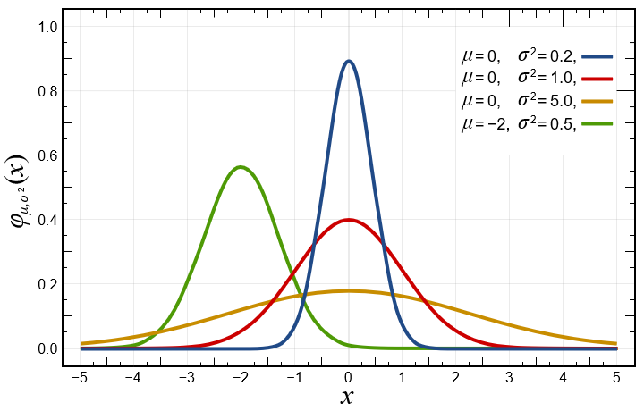

# Normal distribution(정규분포)

> 가우시안 분포
>
> 1. 정규분포는 수집된 자료의 분포를 근사하는 데에 자주 사용되며, 이것은 중심극한정리에 의하여 독립적인 확률변수들의 평균은 정규분포에 가까워지는 성질이 있기 때문이다.
>
> 2. 정규분포는 2개의 매개 변수 평균 과 표준편차  에 대해 모양이 결정되고, 이때의 분포를 로 표기한다. 특히, 평균이 0이고 표준편차가 1인 정규분포 을 표준 정규 분포(standard normal distribution)라고 한다

## 정규분포 초기화의 문제점

