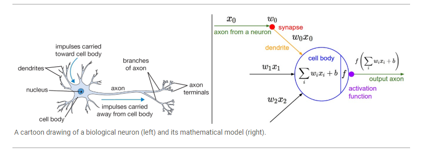
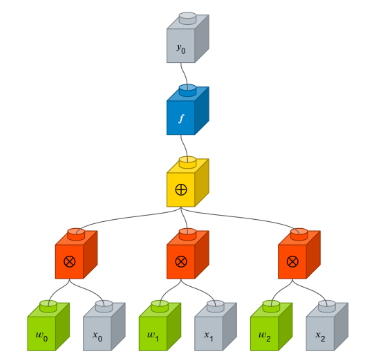

## 퍼셉트론(perceptron)

> 1. 입력 값과 활성화 함수를 사용해 출력 값을 다음으로 넘기는 가장 작은 신경망 단위
>
> 2. 뉴런과 뉴런이 서로 새로운 연결을 만들기도 하고 필요에 따라 위치를 바꾸는 것처럼, 여러 층의 퍼셉트론을 서로 연결시키고 복잡하게 조합하여 주어진 입력 값에 대한 판단을 하게 하는 것

> http://cs231n.github.io/neural-networks-1/

#### 용어 설명

- axon (축삭돌기) : 팔처럼 몸체에서 뻗어나와 다른 뉴런의 수상돌기와 연결됨
- dendrite (수상돌기) : 다른 뉴런의 축삭 돌기와 연결되며, 몸체에 나뭇가지 형태로 붙어 있음.
- synapse (시냅스) : 축사돌기와 수상돌기가 연결된 지점입니다. 여기서 한 뉴런이 다른 뉴런으로 신호가 전달됨.

- x0, x1, x2 : 입력되는 뉴런의 축삭돌기로부터 전달되는 신호의 양(입력)
- w0, w1, w2 : 시냅스의 강도, 즉 입력되는 뉴런의 영향력을 나타냄(가중치)
- w0x0 + w1x1 + w2*x2 : 입력되는 신호의 양과 해당 신호의 시냅스 강도가 곱해진 값의 합계
- f : 최종 합계가 다른 뉴런에게 전달되는 신호의 양을 결정짓는 규칙, 이를 활성화 함수(activation function)라고 함

> 그림으로 표현하면 다음과 같다. 녹색은 가중치, 노란색과 빨간색은 연산자 그리고 파란색은 활성화 함수를 나타냄

#### 실습

1. [Perceptron](https://github.com/madfalc0n/Image-analysis-and-develope/blob/master/Deep_Learning/20191230/1.3_perceptron.ipynb)

#### 참고
- 참고1 : [퍼셉트론_1](http://www.incodom.kr/%EA%B8%B0%EA%B3%84%ED%95%99%EC%8A%B5/%ED%8D%BC%EC%85%89%ED%8A%B8%EB%A1%A0)
- 참고2 : [퍼셉트론_2](https://wikidocs.net/24958)

- 참고3 : [퍼셉트론 3](https://tykimos.github.io/2017/01/27/MLP_Layer_Talk/)