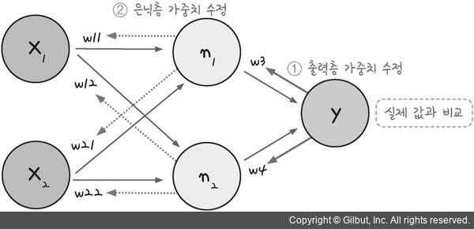
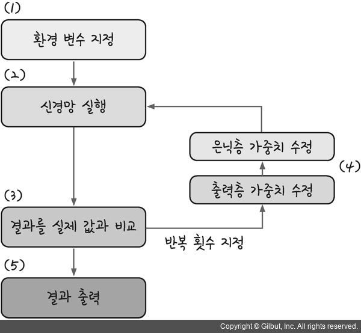
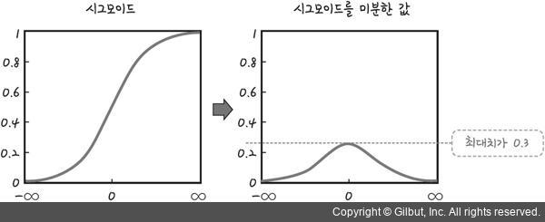
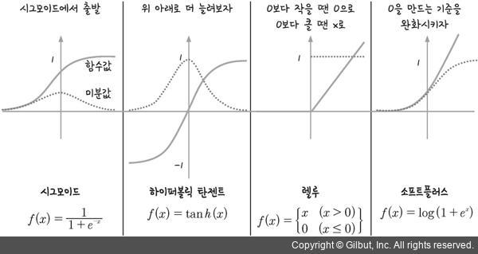

## 오차 역전파(back propagation)

>1. 각 레이어층의 weight 값은 변하지만 뒷단에서 변하는게 문제
>2. 다층 퍼셉트론에서의 최적화 과정을 오차 역전파라고 부름
>3. 임의의 가중치를 선언하고 최소 제곱법을 이용해 오차를 구한 뒤 이 오차가 최소인 지점으로 계속해서 조금씩 이동시킴.
>4. 가중치에서 기울기를 빼도 값의 변화가 없을 때까지 계속해서 가중치 수정 작업을 반복하는 것

> 출처 : 모두의 딥러닝

#### 과정

1.  임의의 초기 가중치(W)를 준 뒤 결과(yout)를 계산한다.

2.  계산 결과와 우리가 원하는 값 사이의 오차를 구한다.

3.  경사 하강법을 이용해 바로 앞 가중치를 오차가 작아지는 방향으로 업데이트한다.
4.  위 과정을 더이상 오차가 줄어들지 않을 때까지 반복한다.

> 출처: 모두의 딥러닝

#### 문제점

1. 활성화 함수 시그모이드는 층이 늘어나면서 기울기가 중간에 0이 되어버리는 기울기 소실 문제가 발생한다.
2. 시그모이드를 미분하면 최대치가 0.3이며 1보다 작으므로 계속 곱하다 보면 0에 가까워진다.
3. 즉 시그모이드는 층을 거쳐 갈수록 기울기가 사라져 가중치를 수정하기 어려워 진다.

> 출처: 모두의 딥러닝

#### 대안

1. 다른 함수로 대체

> 출처: 모두의 딥러닝

 - 하이퍼볼릭 탄젠트(tanh) - 시그모이드 함수의 범위를 -1에서 1로 확장, 미분한 값의 범위가 함께 확장 되는 효과를 가져왔다. 여전히 1보다 작은 값이 존재하므로 기울기 소실 문제는 사라지지 않는다.

 - 렐루(ReLU) - x가 0보다 작을 때는 모든 값을 0으로 처리하고, 0보다 큰 값은 x를 그대로 사용하는 방법 x가 0보다 크기만 하면 미분 값이 1이 된다. 따라서 여러 은닉층을 거치며 곱해지더라도 맨 처음 층까지 사라지지 않고 남아있을 수 있다.