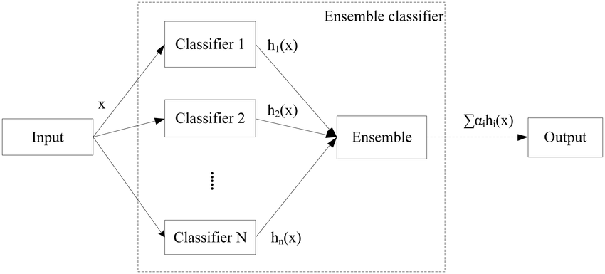
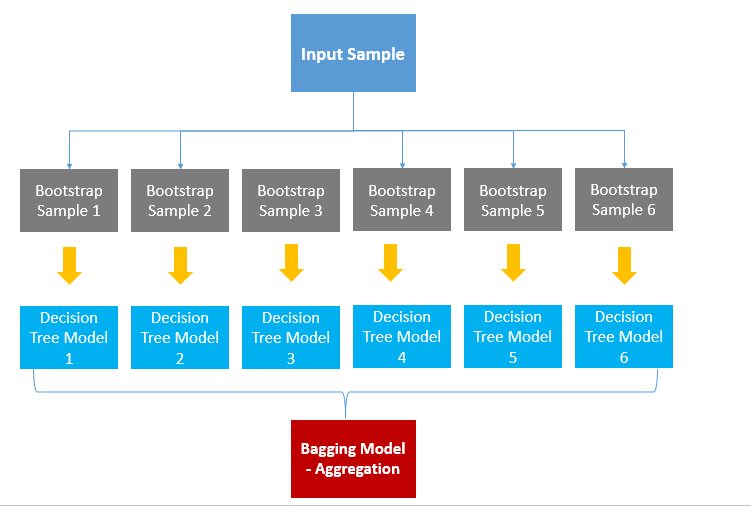

# 앙상블

여러개의 머신러닝 모델을 연결하여 더 강력한 모델을 만드는 기법으로 분류와 회귀 문제의 다양한 데이터셋에서 효과적이라고 입증되었고 많이 쓰고있다. `랜덤 포레스트(random forest)`와 `그래디언트 부스팅(gradient boosting)` 결정 트리는 둘 다 모델을 구성하는 기본 요소로 결정 트리를 사용한다.

> 출처 : [프로그래밍 학습 블로그](http://blog.naver.com/PostView.nhn?blogId=qbxlvnf11&logNo=221488622777&categoryNo=0&parentCategoryNo=0&viewDate=&currentPage=1&postListTopCurrentPage=1&from=postView)

여기서 개별로 학습된 모델을 **weak learner**라고 표현한다.

## 장점

1. 성능을 분산시키기 때문에 과적합(overfitting)을 피할 수 있음
2. 개별 모델 성능이 잘 안나올 경우 앙상블을 통해 성능 향상 가능

## 종류

### 취합 방법

#### 다수결 투표 방법

#### 배깅(Bootstrap, AGGregatING, Bagging)

샘플을 무작위로 잘게 나누고 나누어진 훈련 셋을 여러 개의 모델에 학습시켜 다양한 **weak learner**를 만들고 이들을 취합해서 사용하는 방법으로 최종적으로 각 learner 의 예측결과를 평균내서 종합(aggregate)한다. 각 훈련데이터 셋은 중복을 허용한다.

> 출처 : [귀퉁이 서재](https://bkshin.tistory.com/entry/%EB%A8%B8%EC%8B%A0%EB%9F%AC%EB%8B%9D-11-%EC%95%99%EC%83%81%EB%B8%94-%ED%95%99%EC%8A%B5-Ensemble-Learning-%EB%B0%B0%EA%B9%85Bagging%EA%B3%BC-%EB%B6%80%EC%8A%A4%ED%8C%85Boosting)

#### 페이스팅

배깅과 비슷하지만 각 모델별로  훈련데이터셋을 적용하는것

#### 랜덤 포레스트

여러개의 결정트리를 생성하여 각 트리에서 나오는 결과를 취합하는 방식으로 결정 트리를 생성할 때 배깅, 부스팅 방법을 사용하기도 한다.

### 부스팅(Boosting) 방법

**weak learner**들을 하나씩 점진적으로 연결하여 **strong learner**를 만드는 방법

부스트래핑된 테스트 데이터로 여러개의 weak learner 들을 순차적으로(iterative) 만드는데, i번째 learner 는 i-1 번째 learner 가 잘못 예측한 데이터에 가중치를 좀 더 주어서(boosting) 학습한다. 최종적으로 마지막에 생성된 learner 를 이용하여 예측한다.

#### Ada boost

#### Gradient Boost

## 참고

1. [국내사이트](https://bkshin.tistory.com/entry/%EB%A8%B8%EC%8B%A0%EB%9F%AC%EB%8B%9D-11-%EC%95%99%EC%83%81%EB%B8%94-%ED%95%99%EC%8A%B5-Ensemble-Learning-%EB%B0%B0%EA%B9%85Bagging%EA%B3%BC-%EB%B6%80%EC%8A%A4%ED%8C%85Boosting)
2. [해외사이트](https://www.quora.com/What-is-the-difference-between-gradient-boosting-and-adaboost)

