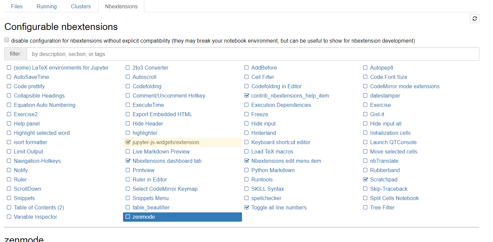

# jupyter_contribute

## 설치

- `pip install jupyter_contrib_nbextensions` 입력

```
(base) C:\Users\student>pip install jupyter_contrib_nbextensions
Collecting jupyter_contrib_nbextensions
  Downloading https://files.pythonhosted.org/packages/33/f0/6e2c00afda860f655fbf0f795f7310bdbf12122846344dfdc803fc7455d5/jupyter_contrib_nbextensions-0.5.1-py2.py3-none-any.whl (20.9MB)
     |████████████████████████████████| 20.9MB 1.3MB/s
Requirement already satisfied: pyyaml in c:\programdata\anaconda3\lib\site-packages (from jupyter_contrib_nbextensions) (5.1.2)
Requirement already satisfied: jupyter-core in c:\programdata\anaconda3\lib\site-packages (from jupyter_contrib_nbextensions) (4.5.0)
Collecting jupyter-nbextensions-configurator>=0.4.0 (from jupyter_contrib_nbextensions)
  Downloading https://files.pythonhosted.org/packages/51/a3/d72d5f2dc10c5ccf5a6f4c79f636bf071a5ce462dedd07af2f70384db6cb/jupyter_nbextensions_configurator-0.4.1.tar.gz (479kB)
     |████████████████████████████████| 481kB ...
Requirement already satisfied: nbconvert>=4.2 in c:\programdata\anaconda3\lib\site-packages (from jupyter_contrib_nbextensions) (5.6.0)
Collecting jupyter-contrib-core>=0.3.3 (from jupyter_contrib_nbextensions)
  Downloading https://files.pythonhosted.org/packages/e6/8f/04a752a8b66a66e7092c035e5d87d2502ac7ec07f9fb6059059b6c0dc272/jupyter_contrib_core-0.3.3-py2.py3-none-any.whl
Requirement already satisfied: lxml in c:\programdata\anaconda3\lib\site-packages (from jupyter_contrib_nbextensions) (4.4.1)
Requirement already satisfied: tornado in c:\programdata\anaconda3\lib\site-packages (from jupyter_contrib_nbextensions) (6.0.3)
Requirement already satisfied: traitlets>=4.1 in c:\programdata\anaconda3\lib\site-packages (from jupyter_contrib_nbextensions) (4.3.3)
Requirement already satisfied: notebook>=4.0 in c:\programdata\anaconda3\lib\site-packages (from jupyter_contrib_nbextensions) (6.0.1)
Requirement already satisfied: ipython-genutils in c:\programdata\anaconda3\lib\site-packages (from jupyter_contrib_nbextensions) (0.2.0)
Collecting jupyter-latex-envs>=1.3.8 (from jupyter_contrib_nbextensions)
  Downloading https://files.pythonhosted.org/packages/0e/15/55805de080d5542f76920364635e96e64d3b37f678befdfe3b16aa154205/jupyter_latex_envs-1.4.6.tar.gz (861kB)
     |████████████████████████████████| 870kB 6.4MB/s
Collecting jupyter-highlight-selected-word>=0.1.1 (from jupyter_contrib_nbextensions)
  Downloading https://files.pythonhosted.org/packages/50/d7/19ab7cfd60bf268d2abbacc52d4295a40f52d74dfc0d938e4761ee5e598b/jupyter_highlight_selected_word-0.2.0-py2.py3-none-any.whl
Requirement already satisfied: pygments in c:\programdata\anaconda3\lib\site-packages (from nbconvert>=4.2->jupyter_contrib_nbextensions) (2.4.2)
Requirement already satisfied: nbformat>=4.4 in c:\programdata\anaconda3\lib\site-packages (from nbconvert>=4.2->jupyter_contrib_nbextensions) (4.4.0)
Requirement already satisfied: pandocfilters>=1.4.1 in c:\programdata\anaconda3\lib\site-packages (from nbconvert>=4.2->jupyter_contrib_nbextensions) (1.4.2)
Requirement already satisfied: jinja2>=2.4 in c:\programdata\anaconda3\lib\site-packages (from nbconvert>=4.2->jupyter_contrib_nbextensions) (2.10.3)
Requirement already satisfied: bleach in c:\programdata\anaconda3\lib\site-packages (from nbconvert>=4.2->jupyter_contrib_nbextensions) (3.1.0)
Requirement already satisfied: defusedxml in c:\programdata\anaconda3\lib\site-packages (from nbconvert>=4.2->jupyter_contrib_nbextensions) (0.6.0)
Requirement already satisfied: testpath in c:\programdata\anaconda3\lib\site-packages (from nbconvert>=4.2->jupyter_contrib_nbextensions) (0.4.2)
Requirement already satisfied: entrypoints>=0.2.2 in c:\programdata\anaconda3\lib\site-packages (from nbconvert>=4.2->jupyter_contrib_nbextensions) (0.3)
Requirement already satisfied: mistune<2,>=0.8.1 in c:\programdata\anaconda3\lib\site-packages (from nbconvert>=4.2->jupyter_contrib_nbextensions) (0.8.4)
Requirement already satisfied: setuptools in c:\programdata\anaconda3\lib\site-packages (from jupyter-contrib-core>=0.3.3->jupyter_contrib_nbextensions) (41.4.0)
Requirement already satisfied: decorator in c:\programdata\anaconda3\lib\site-packages (from traitlets>=4.1->jupyter_contrib_nbextensions) (4.4.0)
Requirement already satisfied: six in c:\programdata\anaconda3\lib\site-packages (from traitlets>=4.1->jupyter_contrib_nbextensions) (1.12.0)
Requirement already satisfied: ipykernel in c:\programdata\anaconda3\lib\site-packages (from notebook>=4.0->jupyter_contrib_nbextensions) (5.1.2)
Requirement already satisfied: Send2Trash in c:\programdata\anaconda3\lib\site-packages (from notebook>=4.0->jupyter_contrib_nbextensions) (1.5.0)
Requirement already satisfied: jupyter-client>=5.3.1 in c:\programdata\anaconda3\lib\site-packages (from notebook>=4.0->jupyter_contrib_nbextensions) (5.3.3)
Requirement already satisfied: pyzmq>=17 in c:\programdata\anaconda3\lib\site-packages (from notebook>=4.0->jupyter_contrib_nbextensions) (18.1.0)
Requirement already satisfied: prometheus-client in c:\programdata\anaconda3\lib\site-packages (from notebook>=4.0->jupyter_contrib_nbextensions) (0.7.1)
Requirement already satisfied: terminado>=0.8.1 in c:\programdata\anaconda3\lib\site-packages (from notebook>=4.0->jupyter_contrib_nbextensions) (0.8.2)
Requirement already satisfied: ipython in c:\programdata\anaconda3\lib\site-packages (from jupyter-latex-envs>=1.3.8->jupyter_contrib_nbextensions) (7.8.0)
Requirement already satisfied: jsonschema!=2.5.0,>=2.4 in c:\programdata\anaconda3\lib\site-packages (from nbformat>=4.4->nbconvert>=4.2->jupyter_contrib_nbextensions) (3.0.2)
Requirement already satisfied: MarkupSafe>=0.23 in c:\programdata\anaconda3\lib\site-packages (from jinja2>=2.4->nbconvert>=4.2->jupyter_contrib_nbextensions) (1.1.1)
Requirement already satisfied: webencodings in c:\programdata\anaconda3\lib\site-packages (from bleach->nbconvert>=4.2->jupyter_contrib_nbextensions) (0.5.1)
Requirement already satisfied: python-dateutil>=2.1 in c:\programdata\anaconda3\lib\site-packages (from jupyter-client>=5.3.1->notebook>=4.0->jupyter_contrib_nbextensions) (2.8.0)
Requirement already satisfied: pywin32>=1.0; sys_platform == "win32" in c:\programdata\anaconda3\lib\site-packages (from jupyter-client>=5.3.1->notebook>=4.0->jupyter_contrib_nbextensions) (223)
Requirement already satisfied: jedi>=0.10 in c:\programdata\anaconda3\lib\site-packages (from ipython->jupyter-latex-envs>=1.3.8->jupyter_contrib_nbextensions) (0.15.1)
Requirement already satisfied: backcall in c:\programdata\anaconda3\lib\site-packages (from ipython->jupyter-latex-envs>=1.3.8->jupyter_contrib_nbextensions) (0.1.0)
Requirement already satisfied: prompt-toolkit<2.1.0,>=2.0.0 in c:\programdata\anaconda3\lib\site-packages (from ipython->jupyter-latex-envs>=1.3.8->jupyter_contrib_nbextensions) (2.0.10)
Requirement already satisfied: colorama; sys_platform == "win32" in c:\programdata\anaconda3\lib\site-packages (from ipython->jupyter-latex-envs>=1.3.8->jupyter_contrib_nbextensions) (0.4.1)
Requirement already satisfied: pickleshare in c:\programdata\anaconda3\lib\site-packages (from ipython->jupyter-latex-envs>=1.3.8->jupyter_contrib_nbextensions) (0.7.5)
Requirement already satisfied: attrs>=17.4.0 in c:\programdata\anaconda3\lib\site-packages (from jsonschema!=2.5.0,>=2.4->nbformat>=4.4->nbconvert>=4.2->jupyter_contrib_nbextensions) (19.2.0)
Requirement already satisfied: pyrsistent>=0.14.0 in c:\programdata\anaconda3\lib\site-packages (from jsonschema!=2.5.0,>=2.4->nbformat>=4.4->nbconvert>=4.2->jupyter_contrib_nbextensions) (0.15.4)
Requirement already satisfied: parso>=0.5.0 in c:\programdata\anaconda3\lib\site-packages (from jedi>=0.10->ipython->jupyter-latex-envs>=1.3.8->jupyter_contrib_nbextensions) (0.5.1)
Requirement already satisfied: wcwidth in c:\programdata\anaconda3\lib\site-packages (from prompt-toolkit<2.1.0,>=2.0.0->ipython->jupyter-latex-envs>=1.3.8->jupyter_contrib_nbextensions) (0.1.7)
Building wheels for collected packages: jupyter-nbextensions-configurator, jupyter-latex-envs
  Building wheel for jupyter-nbextensions-configurator (setup.py) ... done
  Created wheel for jupyter-nbextensions-configurator: filename=jupyter_nbextensions_configurator-0.4.1-py2.py3-none-any.whl size=465828 sha256=2a9783bdf5391046ef18422b1a6ae2b49f77d58397df73c84520677accda2f6d
  Stored in directory: C:\Users\student\AppData\Local\pip\Cache\wheels\15\df\fe\2a74fe34709e7fdc5ae153a768675d9fda93cc7d5133ed1fb0
  Building wheel for jupyter-latex-envs (setup.py) ... done
  Created wheel for jupyter-latex-envs: filename=jupyter_latex_envs-1.4.6-py2.py3-none-any.whl size=963398 sha256=2ba293bc38edada2b293e97b35e15c0080a5b33d18c2afb8b4c34c9022ed3993
  Stored in directory: C:\Users\student\AppData\Local\pip\Cache\wheels\0d\71\2a\164491997299b9f2479a251e254323fe35d946779e18f27956
Successfully built jupyter-nbextensions-configurator jupyter-latex-envs
Installing collected packages: jupyter-contrib-core, jupyter-nbextensions-configurator, jupyter-latex-envs, jupyter-highlight-selected-word, jupyter-contrib-nbextensions
Successfully installed jupyter-contrib-core-0.3.3 jupyter-contrib-nbextensions-0.5.1 jupyter-highlight-selected-word-0.2.0 jupyter-latex-envs-1.4.6 jupyter-nbextensions-configurator-0.4.1

(base) C:\Users\student>
```


- `jupyter contrib nbextension install --user` 입력

```
(base) C:\Users\student>jupyter contrib nbextension install --user
[I 14:23:33 InstallContribNbextensionsApp] jupyter contrib nbextension install --user
[I 14:23:33 InstallContribNbextensionsApp] Installing jupyter_contrib_nbextensions nbextension files to jupyter data directory
[I 14:23:33 InstallContribNbextensionsApp] Installing c:\programdata\anaconda3\lib\site-packages\jupyter_contrib_nbextensions\nbextensions\addbefore -> addbefore
[I 14:23:33 InstallContribNbextensionsApp] Making directory: C:\Users\student\AppData\Roaming\jupyter\nbextensions\addbefore\
[I 14:23:33 InstallContribNbextensionsApp] Copying: c:\programdata\anaconda3\lib\site-packages\jupyter_contrib_nbextensions\nbextensions\addbefore\addbefore.yaml -> C:\Users\student\AppData\Roaming\jupyter\nbextensions\addbefore\addbefore.yaml
[I 14:23:33 InstallContribNbextensionsApp] Copying: c:\programdata\anaconda3\lib\site-packages\jupyter_contrib_nbextensions\nbextensions\addbefore\icon.png -> C:\Users\student\AppData\Roaming\jupyter\nbextensions\addbefore\icon.png
[I 14:23:33 InstallContribNbextensionsApp] Copying: c:\programdata\anaconda3\lib\site-packages\jupyter_contrib_nbextensions\nbextensions\addbefore\main.js -> C:\Users\student\AppData\Roaming\jupyter\nbextensions\addbefore\main.js
[I 14:23:33 InstallContribNbextensionsApp] Copying: c:\programdata\anaconda3\lib\site-packages\jupyter_contrib_nbextensions\nbextensions\addbefore\readme.md -> C:\Users\student\AppData\Roaming\jupyter\nbextensions\addbefore\readme.md
[I 14:23:33 InstallContribNbextensionsApp] - Validating: ok
[I 14:23:33 InstallContribNbextensionsApp] Installing c:\programdata\anaconda3\lib\site-packages\jupyter_contrib_nbextensions\nbextensions\autosavetime -> autosavetime
[I 14:23:33 InstallContribNbextensionsApp] Making directory: C:\Users\student\AppData\Roaming\jupyter\nbextensions\autosavetime\
[I 14:23:33 InstallContribNbextensionsApp] Copying: c:\programdata\anaconda3\lib\site-packages\jupyter_contrib_nbextensions\nbextensions\autosavetime\autosavetime.yaml -> C:\Users\student\AppData\Roaming\jupyter\nbextensions\autosavetime\autosavetime.yaml
[I 14:23:33 InstallContribNbextensionsApp] Copying: c:\programdata\anaconda3\lib\site-packages\jupyter_contrib_nbextensions\nbextensions\autosavetime\icon.png -> C:\Users\student\AppData\Roaming\jupyter\nbextensions\autosavetime\icon.png
[I 14:23:33 InstallContribNbextensionsApp] Copying: c:\programdata\anaconda3\lib\site-packages\jupyter_contrib_nbextensions\nbextensions\autosavetime\main.js -> C:\Users\student\AppData\Roaming\jupyter\nbextensions\autosavetime\main.js
[I 14:23:33 InstallContribNbextensionsApp] Copying: c:\programdata\anaconda3\lib\site-packages\jupyter_contrib_nbextensions\nbextensions\autosavetime\README.md -> C:\Users\student\AppData\Roaming\jupyter\nbextensions\autosavetime\README.md
[I 14:23:33 InstallContribNbextensionsApp] - Validating: ok
[I 14:23:33 InstallContribNbextensionsApp] Installing c:\programdata\anaconda3\lib\site-packages\jupyter_contrib_nbextensions\nbextensions\autoscroll -> autoscroll
[I 14:23:33 InstallContribNbextensionsApp] Making directory: C:\Users\student\AppData\Roaming\jupyter\nbextensions\autoscroll\
[I 14:23:33 InstallContribNbextensionsApp] Copying: c:\programdata\anaconda3\lib\site-packages\jupyter_contrib_nbextensions\nbextensions\autoscroll\autoscroll.yaml -> C:\Users\student\AppData\Roaming\jupyter\nbextensions\autoscroll\autoscroll.yaml
[I 14:23:33 InstallContribNbextensionsApp] Copying: c:\programdata\anaconda3\lib\site-packages\jupyter_contrib_nbextensions\nbextensions\autoscroll\icon.png -> C:\Users\student\AppData\Roaming\jupyter\nbextensions\autoscroll\icon.png
[I 14:23:33 InstallContribNbextensionsApp] Copying: c:\programdata\anaconda3\lib\site-packages\jupyter_contrib_nbextensions\nbextensions\autoscroll\main.js -> C:\Users\student\AppData\Roaming\jupyter\nbextensions\autoscroll\main.js
[I 14:23:33 InstallContribNbextensionsApp] Copying: c:\programdata\anaconda3\lib\site-packages\jupyter_contrib_nbextensions\nbextensions\autoscroll\README.md -> C:\Users\student\AppData\Roaming\jupyter\nbextensions\autoscroll\README.md
[I 14:23:33 InstallContribNbextensionsApp] - Validating: ok
[I 14:23:33 InstallContribNbextensionsApp] Installing c:\programdata\anaconda3\lib\site-packages\jupyter_contrib_nbextensions\nbextensions\cell_filter -> cell_filter
[I 14:23:33 InstallContribNbextensionsApp] Making directory: C:\Users\student\AppData\Roaming\jupyter\nbextensions\cell_filter\
[I 14:23:33 InstallContribNbextensionsApp] Copying: c:\programdata\anaconda3\lib\site-packages\jupyter_contrib_nbextensions\nbextensions\cell_filter\cell_filter.js -> C:\Users\student\AppData\Roaming\jupyter\nbextensions\cell_filter\cell_filter.js
[I 14:23:33 InstallContribNbextensionsApp] Copying: c:\programdata\anaconda3\lib\site-packages\jupyter_contrib_nbextensions\nbextensions\cell_filter\cell_filter.yml -> C:\Users\student\AppData\Roaming\jupyter\nbextensions\cell_filter\cell_filter.yml
[I 14:23:33 InstallContribNbextensionsApp] Copying: c:\programdata\anaconda3\lib\site-packages\jupyter_contrib_nbextensions\nbextensions\cell_filter\README.md -> C:\Users\student\AppData\Roaming\jupyter\nbextensions\cell_filter\README.md
[I 14:23:33 InstallContribNbextensionsApp] - Validating: ok
[I 14:23:33 InstallContribNbextensionsApp] Installing c:\programdata\anaconda3\lib\site-packages\jupyter_contrib_nbextensions\nbextensions\codefolding -> codefolding
[I 14:23:33 InstallContribNbextensionsApp] Making directory: C:\Users\student\AppData\Roaming\jupyter\nbextensions\codefolding\
[I 14:23:33 InstallContribNbextensionsApp] Copying: c:\programdata\anaconda3\lib\site-packages\jupyter_contrib_nbextensions\nbextensions\codefolding\codefolding.yaml -> C:\Users\student\AppData\Roaming\jupyter\nbextensions\codefolding\codefolding.yaml
[I 14:23:33 InstallContribNbextensionsApp] Copying: c:\programdata\anaconda3\lib\site-packages\jupyter_contrib_nbextensions\nbextensions\codefolding\codefolding_editor.png -> C:\Users\student\AppData\Roaming\jupyter\nbextensions\codefolding\codefolding_editor.png
[I 14:23:33 InstallContribNbextensionsApp] Copying: c:\programdata\anaconda3\lib\site-packages\jupyter_contrib_nbextensions\nbextensions\codefolding\codefolding_editor.yaml -> C:\Users\student\AppData\Roaming\jupyter\nbextensions\codefolding\codefolding_editor.yaml
[I 14:23:33 InstallContribNbextensionsApp] Copying: c:\programdata\anaconda3\lib\site-packages\jupyter_contrib_nbextensions\nbextensions\codefolding\codefolding_firstline_folded.png -> C:\Users\student\AppData\Roaming\jupyter\nbextensions\codefolding\codefolding_firstline_folded.png
[I 14:23:33 InstallContribNbextensionsApp] Copying: c:\programdata\anaconda3\lib\site-packages\jupyter_contrib_nbextensions\nbextensions\codefolding\codefolding_firstline_unfolded.png -> C:\Users\student\AppData\Roaming\jupyter\nbextensions\codefolding\codefolding_firstline_unfolded.png
[I 14:23:33 InstallContribNbextensionsApp] Copying: c:\programdata\anaconda3\lib\site-packages\jupyter_contrib_nbextensions\nbextensions\codefolding\codefolding_indent_folded_1.png -> C:\Users\student\AppData\Roaming\jupyter\nbextensions\codefolding\codefolding_indent_folded_1.png
[I 14:23:33 InstallContribNbextensionsApp] Copying: c:\programdata\anaconda3\lib\site-packages\jupyter_contrib_nbextensions\nbextensions\codefolding\codefolding_indent_folded_2.png -> C:\Users\student\AppData\Roaming\jupyter\nbextensions\codefolding\codefolding_indent_folded_2.png
[I 14:23:33 InstallContribNbextensionsApp] Copying: c:\programdata\anaconda3\lib\site-packages\jupyter_contrib_nbextensions\nbextensions\codefolding\codefolding_indent_unfolded.png -> C:\Users\student\AppData\Roaming\jupyter\nbextensions\codefolding\codefolding_indent_unfolded.png
[I 14:23:33 InstallContribNbextensionsApp] Copying: c:\programdata\anaconda3\lib\site-packages\jupyter_contrib_nbextensions\nbextensions\codefolding\edit.js -> C:\Users\student\AppData\Roaming\jupyter\nbextensions\codefolding\edit.js
[I 14:23:33 InstallContribNbextensionsApp] Copying: c:\programdata\anaconda3\lib\site-packages\jupyter_contrib_nbextensions\nbextensions\codefolding\firstline-fold.js -> C:\Users\student\AppData\Roaming\jupyter\nbextensions\codefolding\firstline-fold.js
[I 14:23:33 InstallContribNbextensionsApp] Copying: c:\programdata\anaconda3\lib\site-packages\jupyter_contrib_nbextensions\nbextensions\codefolding\foldgutter.css -> C:\Users\student\AppData\Roaming\jupyter\nbextensions\codefolding\foldgutter.css
[I 14:23:33 InstallContribNbextensionsApp] Copying: c:\programdata\anaconda3\lib\site-packages\jupyter_contrib_nbextensions\nbextensions\codefolding\icon.png -> C:\Users\student\AppData\Roaming\jupyter\nbextensions\codefolding\icon.png
[I 14:23:33 InstallContribNbextensionsApp] Copying: c:\programdata\anaconda3\lib\site-packages\jupyter_contrib_nbextensions\nbextensions\codefolding\magic-fold.js -> C:\Users\student\AppData\Roaming\jupyter\nbextensions\codefolding\magic-fold.js
[I 14:23:33 InstallContribNbextensionsApp] Copying: c:\programdata\anaconda3\lib\site-packages\jupyter_contrib_nbextensions\nbextensions\codefolding\magic-folded.png -> C:\Users\student\AppData\Roaming\jupyter\nbextensions\codefolding\magic-folded.png
[I 14:23:33 InstallContribNbextensionsApp] Copying: c:\programdata\anaconda3\lib\site-packages\jupyter_contrib_nbextensions\nbextensions\codefolding\magic-unfolded.png -> C:\Users\student\AppData\Roaming\jupyter\nbextensions\codefolding\magic-unfolded.png
[I 14:23:33 InstallContribNbextensionsApp] Copying: c:\programdata\anaconda3\lib\site-packages\jupyter_contrib_nbextensions\nbextensions\codefolding\main.js -> C:\Users\student\AppData\Roaming\jupyter\nbextensions\codefolding\main.js
[I 14:23:33 InstallContribNbextensionsApp] Copying: c:\programdata\anaconda3\lib\site-packages\jupyter_contrib_nbextensions\nbextensions\codefolding\readme.md -> C:\Users\student\AppData\Roaming\jupyter\nbextensions\codefolding\readme.md
[I 14:23:33 InstallContribNbextensionsApp] - Validating: ok
[I 14:23:33 InstallContribNbextensionsApp] Installing c:\programdata\anaconda3\lib\site-packages\jupyter_contrib_nbextensions\nbextensions\codefolding -> codefolding
[I 14:23:33 InstallContribNbextensionsApp] Up to date: C:\Users\student\AppData\Roaming\jupyter\nbextensions\codefolding\codefolding.yaml
[I 14:23:33 InstallContribNbextensionsApp] Up to date: C:\Users\student\AppData\Roaming\jupyter\nbextensions\codefolding\codefolding_editor.png
[I 14:23:33 InstallContribNbextensionsApp] Up to date: C:\Users\student\AppData\Roaming\jupyter\nbextensions\codefolding\codefolding_editor.yaml
[I 14:23:33 InstallContribNbextensionsApp] Up to date: C:\Users\student\AppData\Roaming\jupyter\nbextensions\codefolding\codefolding_firstline_folded.png
[I 14:23:33 InstallContribNbextensionsApp] Up to date: C:\Users\student\AppData\Roaming\jupyter\nbextensions\codefolding\codefolding_firstline_unfolded.png
[I 14:23:33 InstallContribNbextensionsApp] Up to date: C:\Users\student\AppData\Roaming\jupyter\nbextensions\codefolding\codefolding_indent_folded_1.png
[I 14:23:33 InstallContribNbextensionsApp] Up to date: C:\Users\student\AppData\Roaming\jupyter\nbextensions\codefolding\codefolding_indent_folded_2.png
[I 14:23:33 InstallContribNbextensionsApp] Up to date: C:\Users\student\AppData\Roaming\jupyter\nbextensions\codefolding\codefolding_indent_unfolded.png
[I 14:23:33 InstallContribNbextensionsApp] Up to date: C:\Users\student\AppData\Roaming\jupyter\nbextensions\codefolding\edit.js
[I 14:23:33 InstallContribNbextensionsApp] Up to date: C:\Users\student\AppData\Roaming\jupyter\nbextensions\codefolding\firstline-fold.js
[I 14:23:33 InstallContribNbextensionsApp] Up to date: C:\Users\student\AppData\Roaming\jupyter\nbextensions\codefolding\foldgutter.css
[I 14:23:33 InstallContribNbextensionsApp] Up to date: C:\Users\student\AppData\Roaming\jupyter\nbextensions\codefolding\icon.png
[I 14:23:33 InstallContribNbextensionsApp] Up to date: C:\Users\student\AppData\Roaming\jupyter\nbextensions\codefolding\magic-fold.js
[I 14:23:33 InstallContribNbextensionsApp] Up to date: C:\Users\student\AppData\Roaming\jupyter\nbextensions\codefolding\magic-folded.png
[I 14:23:33 InstallContribNbextensionsApp] Up to date: C:\Users\student\AppData\Roaming\jupyter\nbextensions\codefolding\magic-unfolded.png
[I 14:23:33 InstallContribNbextensionsApp] Up to date: C:\Users\student\AppData\Roaming\jupyter\nbextensions\codefolding\main.js
[I 14:23:33 InstallContribNbextensionsApp] Up to date: C:\Users\student\AppData\Roaming\jupyter\nbextensions\codefolding\readme.md
[I 14:23:33 InstallContribNbextensionsApp] - Validating: ok
[I 14:23:33 InstallContribNbextensionsApp] Installing c:\programdata\anaconda3\lib\site-packages\jupyter_contrib_nbextensions\nbextensions\codemirror_mode_extensions -> codemirror_mode_extensions
[I 14:23:33 InstallContribNbextensionsApp] Making directory: C:\Users\student\AppData\Roaming\jupyter\nbextensions\codemirror_mode_extensions\
[I 14:23:33 InstallContribNbextensionsApp] Copying: c:\programdata\anaconda3\lib\site-packages\jupyter_contrib_nbextensions\nbextensions\codemirror_mode_extensions\codemirror_mode_extensions.yaml -> C:\Users\student\AppData\Roaming\jupyter\nbextensions\codemirror_mode_extensions\codemirror_mode_extensions.yaml
[I 14:23:33 InstallContribNbextensionsApp] Copying: c:\programdata\anaconda3\lib\site-packages\jupyter_contrib_nbextensions\nbextensions\codemirror_mode_extensions\main.js -> C:\Users\student\AppData\Roaming\jupyter\nbextensions\codemirror_mode_extensions\main.js
[I 14:23:33 InstallContribNbextensionsApp] - Validating: ok
[I 14:23:33 InstallContribNbextensionsApp] Installing c:\programdata\anaconda3\lib\site-packages\jupyter_contrib_nbextensions\nbextensions\code_font_size -> code_font_size
[I 14:23:33 InstallContribNbextensionsApp] Making directory: C:\Users\student\AppData\Roaming\jupyter\nbextensions\code_font_size\
[I 14:23:33 InstallContribNbextensionsApp] Copying: c:\programdata\anaconda3\lib\site-packages\jupyter_contrib_nbextensions\nbextensions\code_font_size\code_font_size.js -> C:\Users\student\AppData\Roaming\jupyter\nbextensions\code_font_size\code_font_size.js
[I 14:23:33 InstallContribNbextensionsApp] Copying: c:\programdata\anaconda3\lib\site-packages\jupyter_contrib_nbextensions\nbextensions\code_font_size\code_font_size.yaml -> C:\Users\student\AppData\Roaming\jupyter\nbextensions\code_font_size\code_font_size.yaml
[I 14:23:33 InstallContribNbextensionsApp] Copying: c:\programdata\anaconda3\lib\site-packages\jupyter_contrib_nbextensions\nbextensions\code_font_size\README.md -> C:\Users\student\AppData\Roaming\jupyter\nbextensions\code_font_size\README.md
[I 14:23:33 InstallContribNbextensionsApp] - Validating: ok
[I 14:23:33 InstallContribNbextensionsApp] Installing c:\programdata\anaconda3\lib\site-packages\jupyter_contrib_nbextensions\nbextensions\code_prettify -> code_prettify
[I 14:23:33 InstallContribNbextensionsApp] Making directory: C:\Users\student\AppData\Roaming\jupyter\nbextensions\code_prettify\
[I 14:23:33 InstallContribNbextensionsApp] Copying: c:\programdata\anaconda3\lib\site-packages\jupyter_contrib_nbextensions\nbextensions\code_prettify\2to3.js -> C:\Users\student\AppData\Roaming\jupyter\nbextensions\code_prettify\2to3.js
[I 14:23:33 InstallContribNbextensionsApp] Copying: c:\programdata\anaconda3\lib\site-packages\jupyter_contrib_nbextensions\nbextensions\code_prettify\2to3.yaml -> C:\Users\student\AppData\Roaming\jupyter\nbextensions\code_prettify\2to3.yaml
[I 14:23:33 InstallContribNbextensionsApp] Copying: c:\programdata\anaconda3\lib\site-packages\jupyter_contrib_nbextensions\nbextensions\code_prettify\autopep8.js -> C:\Users\student\AppData\Roaming\jupyter\nbextensions\code_prettify\autopep8.js
[I 14:23:33 InstallContribNbextensionsApp] Copying: c:\programdata\anaconda3\lib\site-packages\jupyter_contrib_nbextensions\nbextensions\code_prettify\autopep8.yaml -> C:\Users\student\AppData\Roaming\jupyter\nbextensions\code_prettify\autopep8.yaml
[I 14:23:33 InstallContribNbextensionsApp] Copying: c:\programdata\anaconda3\lib\site-packages\jupyter_contrib_nbextensions\nbextensions\code_prettify\code_prettify.js -> C:\Users\student\AppData\Roaming\jupyter\nbextensions\code_prettify\code_prettify.js
[I 14:23:33 InstallContribNbextensionsApp] Copying: c:\programdata\anaconda3\lib\site-packages\jupyter_contrib_nbextensions\nbextensions\code_prettify\code_prettify.yaml -> C:\Users\student\AppData\Roaming\jupyter\nbextensions\code_prettify\code_prettify.yaml
[I 14:23:33 InstallContribNbextensionsApp] Copying: c:\programdata\anaconda3\lib\site-packages\jupyter_contrib_nbextensions\nbextensions\code_prettify\demo-jv.gif -> C:\Users\student\AppData\Roaming\jupyter\nbextensions\code_prettify\demo-jv.gif
[I 14:23:33 InstallContribNbextensionsApp] Copying: c:\programdata\anaconda3\lib\site-packages\jupyter_contrib_nbextensions\nbextensions\code_prettify\demo-py.gif -> C:\Users\student\AppData\Roaming\jupyter\nbextensions\code_prettify\demo-py.gif
[I 14:23:33 InstallContribNbextensionsApp] Copying: c:\programdata\anaconda3\lib\site-packages\jupyter_contrib_nbextensions\nbextensions\code_prettify\demo-R.gif -> C:\Users\student\AppData\Roaming\jupyter\nbextensions\code_prettify\demo-R.gif
[I 14:23:33 InstallContribNbextensionsApp] Copying: c:\programdata\anaconda3\lib\site-packages\jupyter_contrib_nbextensions\nbextensions\code_prettify\demo_2to3.gif -> C:\Users\student\AppData\Roaming\jupyter\nbextensions\code_prettify\demo_2to3.gif
[I 14:23:33 InstallContribNbextensionsApp] Copying: c:\programdata\anaconda3\lib\site-packages\jupyter_contrib_nbextensions\nbextensions\code_prettify\isort.js -> C:\Users\student\AppData\Roaming\jupyter\nbextensions\code_prettify\isort.js
[I 14:23:33 InstallContribNbextensionsApp] Copying: c:\programdata\anaconda3\lib\site-packages\jupyter_contrib_nbextensions\nbextensions\code_prettify\isort.yaml -> C:\Users\student\AppData\Roaming\jupyter\nbextensions\code_prettify\isort.yaml
[I 14:23:33 InstallContribNbextensionsApp] Copying: c:\programdata\anaconda3\lib\site-packages\jupyter_contrib_nbextensions\nbextensions\code_prettify\kernel_exec_on_cell.js -> C:\Users\student\AppData\Roaming\jupyter\nbextensions\code_prettify\kernel_exec_on_cell.js
[I 14:23:33 InstallContribNbextensionsApp] Copying: c:\programdata\anaconda3\lib\site-packages\jupyter_contrib_nbextensions\nbextensions\code_prettify\README.md -> C:\Users\student\AppData\Roaming\jupyter\nbextensions\code_prettify\README.md
[I 14:23:33 InstallContribNbextensionsApp] Copying: c:\programdata\anaconda3\lib\site-packages\jupyter_contrib_nbextensions\nbextensions\code_prettify\README_2to3.md -> C:\Users\student\AppData\Roaming\jupyter\nbextensions\code_prettify\README_2to3.md
[I 14:23:33 InstallContribNbextensionsApp] Copying: c:\programdata\anaconda3\lib\site-packages\jupyter_contrib_nbextensions\nbextensions\code_prettify\README_autopep8.md -> C:\Users\student\AppData\Roaming\jupyter\nbextensions\code_prettify\README_autopep8.md
[I 14:23:33 InstallContribNbextensionsApp] Copying: c:\programdata\anaconda3\lib\site-packages\jupyter_contrib_nbextensions\nbextensions\code_prettify\README_code_prettify.md -> C:\Users\student\AppData\Roaming\jupyter\nbextensions\code_prettify\README_code_prettify.md
[I 14:23:33 InstallContribNbextensionsApp] Copying: c:\programdata\anaconda3\lib\site-packages\jupyter_contrib_nbextensions\nbextensions\code_prettify\README_isort.md -> C:\Users\student\AppData\Roaming\jupyter\nbextensions\code_prettify\README_isort.md
[I 14:23:33 InstallContribNbextensionsApp] - Validating: ok
[I 14:23:33 InstallContribNbextensionsApp] Installing c:\programdata\anaconda3\lib\site-packages\jupyter_contrib_nbextensions\nbextensions\code_prettify -> code_prettify
[I 14:23:33 InstallContribNbextensionsApp] Up to date: C:\Users\student\AppData\Roaming\jupyter\nbextensions\code_prettify\2to3.js
[I 14:23:33 InstallContribNbextensionsApp] Up to date: C:\Users\student\AppData\Roaming\jupyter\nbextensions\code_prettify\2to3.yaml
[I 14:23:33 InstallContribNbextensionsApp] Up to date: C:\Users\student\AppData\Roaming\jupyter\nbextensions\code_prettify\autopep8.js
[I 14:23:33 InstallContribNbextensionsApp] Up to date: C:\Users\student\AppData\Roaming\jupyter\nbextensions\code_prettify\autopep8.yaml
[I 14:23:33 InstallContribNbextensionsApp] Up to date: C:\Users\student\AppData\Roaming\jupyter\nbextensions\code_prettify\code_prettify.js
[I 14:23:33 InstallContribNbextensionsApp] Up to date: C:\Users\student\AppData\Roaming\jupyter\nbextensions\code_prettify\code_prettify.yaml
[I 14:23:33 InstallContribNbextensionsApp] Up to date: C:\Users\student\AppData\Roaming\jupyter\nbextensions\code_prettify\demo-jv.gif
[I 14:23:33 InstallContribNbextensionsApp] Up to date: C:\Users\student\AppData\Roaming\jupyter\nbextensions\code_prettify\demo-py.gif
[I 14:23:33 InstallContribNbextensionsApp] Up to date: C:\Users\student\AppData\Roaming\jupyter\nbextensions\code_prettify\demo-R.gif
[I 14:23:33 InstallContribNbextensionsApp] Up to date: C:\Users\student\AppData\Roaming\jupyter\nbextensions\code_prettify\demo_2to3.gif
[I 14:23:33 InstallContribNbextensionsApp] Up to date: C:\Users\student\AppData\Roaming\jupyter\nbextensions\code_prettify\isort.js
[I 14:23:33 InstallContribNbextensionsApp] Up to date: C:\Users\student\AppData\Roaming\jupyter\nbextensions\code_prettify\isort.yaml
[I 14:23:33 InstallContribNbextensionsApp] Up to date: C:\Users\student\AppData\Roaming\jupyter\nbextensions\code_prettify\kernel_exec_on_cell.js
[I 14:23:33 InstallContribNbextensionsApp] Up to date: C:\Users\student\AppData\Roaming\jupyter\nbextensions\code_prettify\README.md
[I 14:23:33 InstallContribNbextensionsApp] Up to date: C:\Users\student\AppData\Roaming\jupyter\nbextensions\code_prettify\README_2to3.md
[I 14:23:33 InstallContribNbextensionsApp] Up to date: C:\Users\student\AppData\Roaming\jupyter\nbextensions\code_prettify\README_autopep8.md
[I 14:23:33 InstallContribNbextensionsApp] Up to date: C:\Users\student\AppData\Roaming\jupyter\nbextensions\code_prettify\README_code_prettify.md
[I 14:23:33 InstallContribNbextensionsApp] Up to date: C:\Users\student\AppData\Roaming\jupyter\nbextensions\code_prettify\README_isort.md
[I 14:23:33 InstallContribNbextensionsApp] - Validating: ok
[I 14:23:33 InstallContribNbextensionsApp] Installing c:\programdata\anaconda3\lib\site-packages\jupyter_contrib_nbextensions\nbextensions\code_prettify -> code_prettify
[I 14:23:33 InstallContribNbextensionsApp] Up to date: C:\Users\student\AppData\Roaming\jupyter\nbextensions\code_prettify\2to3.js
[I 14:23:33 InstallContribNbextensionsApp] Up to date: C:\Users\student\AppData\Roaming\jupyter\nbextensions\code_prettify\2to3.yaml
[I 14:23:33 InstallContribNbextensionsApp] Up to date: C:\Users\student\AppData\Roaming\jupyter\nbextensions\code_prettify\autopep8.js
[I 14:23:33 InstallContribNbextensionsApp] Up to date: C:\Users\student\AppData\Roaming\jupyter\nbextensions\code_prettify\autopep8.yaml
[I 14:23:33 InstallContribNbextensionsApp] Up to date: C:\Users\student\AppData\Roaming\jupyter\nbextensions\code_prettify\code_prettify.js
[I 14:23:33 InstallContribNbextensionsApp] Up to date: C:\Users\student\AppData\Roaming\jupyter\nbextensions\code_prettify\code_prettify.yaml
[I 14:23:33 InstallContribNbextensionsApp] Up to date: C:\Users\student\AppData\Roaming\jupyter\nbextensions\code_prettify\demo-jv.gif
[I 14:23:33 InstallContribNbextensionsApp] Up to date: C:\Users\student\AppData\Roaming\jupyter\nbextensions\code_prettify\demo-py.gif
[I 14:23:33 InstallContribNbextensionsApp] Up to date: C:\Users\student\AppData\Roaming\jupyter\nbextensions\code_prettify\demo-R.gif
[I 14:23:33 InstallContribNbextensionsApp] Up to date: C:\Users\student\AppData\Roaming\jupyter\nbextensions\code_prettify\demo_2to3.gif
[I 14:23:33 InstallContribNbextensionsApp] Up to date: C:\Users\student\AppData\Roaming\jupyter\nbextensions\code_prettify\isort.js
[I 14:23:33 InstallContribNbextensionsApp] Up to date: C:\Users\student\AppData\Roaming\jupyter\nbextensions\code_prettify\isort.yaml
[I 14:23:33 InstallContribNbextensionsApp] Up to date: C:\Users\student\AppData\Roaming\jupyter\nbextensions\code_prettify\kernel_exec_on_cell.js
[I 14:23:33 InstallContribNbextensionsApp] Up to date: C:\Users\student\AppData\Roaming\jupyter\nbextensions\code_prettify\README.md
[I 14:23:33 InstallContribNbextensionsApp] Up to date: C:\Users\student\AppData\Roaming\jupyter\nbextensions\code_prettify\README_2to3.md
[I 14:23:33 InstallContribNbextensionsApp] Up to date: C:\Users\student\AppData\Roaming\jupyter\nbextensions\code_prettify\README_autopep8.md
[I 14:23:33 InstallContribNbextensionsApp] Up to date: C:\Users\student\AppData\Roaming\jupyter\nbextensions\code_prettify\README_code_prettify.md
[I 14:23:33 InstallContribNbextensionsApp] Up to date: C:\Users\student\AppData\Roaming\jupyter\nbextensions\code_prettify\README_isort.md
[I 14:23:33 InstallContribNbextensionsApp] - Validating: ok
[I 14:23:33 InstallContribNbextensionsApp] Installing c:\programdata\anaconda3\lib\site-packages\jupyter_contrib_nbextensions\nbextensions\code_prettify -> code_prettify
[I 14:23:33 InstallContribNbextensionsApp] Up to date: C:\Users\student\AppData\Roaming\jupyter\nbextensions\code_prettify\2to3.js
[I 14:23:33 InstallContribNbextensionsApp] Up to date: C:\Users\student\AppData\Roaming\jupyter\nbextensions\code_prettify\2to3.yaml
[I 14:23:33 InstallContribNbextensionsApp] Up to date: C:\Users\student\AppData\Roaming\jupyter\nbextensions\code_prettify\autopep8.js
[I 14:23:33 InstallContribNbextensionsApp] Up to date: C:\Users\student\AppData\Roaming\jupyter\nbextensions\code_prettify\autopep8.yaml
[I 14:23:33 InstallContribNbextensionsApp] Up to date: C:\Users\student\AppData\Roaming\jupyter\nbextensions\code_prettify\code_prettify.js
[I 14:23:33 InstallContribNbextensionsApp] Up to date: C:\Users\student\AppData\Roaming\jupyter\nbextensions\code_prettify\code_prettify.yaml
[I 14:23:33 InstallContribNbextensionsApp] Up to date: C:\Users\student\AppData\Roaming\jupyter\nbextensions\code_prettify\demo-jv.gif
[I 14:23:33 InstallContribNbextensionsApp] Up to date: C:\Users\student\AppData\Roaming\jupyter\nbextensions\code_prettify\demo-py.gif
[I 14:23:33 InstallContribNbextensionsApp] Up to date: C:\Users\student\AppData\Roaming\jupyter\nbextensions\code_prettify\demo-R.gif
[I 14:23:33 InstallContribNbextensionsApp] Up to date: C:\Users\student\AppData\Roaming\jupyter\nbextensions\code_prettify\demo_2to3.gif
[I 14:23:33 InstallContribNbextensionsApp] Up to date: C:\Users\student\AppData\Roaming\jupyter\nbextensions\code_prettify\isort.js
[I 14:23:33 InstallContribNbextensionsApp] Up to date: C:\Users\student\AppData\Roaming\jupyter\nbextensions\code_prettify\isort.yaml
[I 14:23:33 InstallContribNbextensionsApp] Up to date: C:\Users\student\AppData\Roaming\jupyter\nbextensions\code_prettify\kernel_exec_on_cell.js
[I 14:23:33 InstallContribNbextensionsApp] Up to date: C:\Users\student\AppData\Roaming\jupyter\nbextensions\code_prettify\README.md
[I 14:23:33 InstallContribNbextensionsApp] Up to date: C:\Users\student\AppData\Roaming\jupyter\nbextensions\code_prettify\README_2to3.md
[I 14:23:33 InstallContribNbextensionsApp] Up to date: C:\Users\student\AppData\Roaming\jupyter\nbextensions\code_prettify\README_autopep8.md
[I 14:23:33 InstallContribNbextensionsApp] Up to date: C:\Users\student\AppData\Roaming\jupyter\nbextensions\code_prettify\README_code_prettify.md
[I 14:23:33 InstallContribNbextensionsApp] Up to date: C:\Users\student\AppData\Roaming\jupyter\nbextensions\code_prettify\README_isort.md
[I 14:23:33 InstallContribNbextensionsApp] - Validating: ok
[I 14:23:33 InstallContribNbextensionsApp] Installing c:\programdata\anaconda3\lib\site-packages\jupyter_contrib_nbextensions\nbextensions\collapsible_headings -> collapsible_headings
[I 14:23:33 InstallContribNbextensionsApp] Making directory: C:\Users\student\AppData\Roaming\jupyter\nbextensions\collapsible_headings\
[I 14:23:33 InstallContribNbextensionsApp] Copying: c:\programdata\anaconda3\lib\site-packages\jupyter_contrib_nbextensions\nbextensions\collapsible_headings\collapsible_headings.yaml -> C:\Users\student\AppData\Roaming\jupyter\nbextensions\collapsible_headings\collapsible_headings.yaml
[I 14:23:33 InstallContribNbextensionsApp] Copying: c:\programdata\anaconda3\lib\site-packages\jupyter_contrib_nbextensions\nbextensions\collapsible_headings\icon.png -> C:\Users\student\AppData\Roaming\jupyter\nbextensions\collapsible_headings\icon.png
[I 14:23:33 InstallContribNbextensionsApp] Copying: c:\programdata\anaconda3\lib\site-packages\jupyter_contrib_nbextensions\nbextensions\collapsible_headings\main.css -> C:\Users\student\AppData\Roaming\jupyter\nbextensions\collapsible_headings\main.css
[I 14:23:33 InstallContribNbextensionsApp] Copying: c:\programdata\anaconda3\lib\site-packages\jupyter_contrib_nbextensions\nbextensions\collapsible_headings\main.js -> C:\Users\student\AppData\Roaming\jupyter\nbextensions\collapsible_headings\main.js
[I 14:23:33 InstallContribNbextensionsApp] Copying: c:\programdata\anaconda3\lib\site-packages\jupyter_contrib_nbextensions\nbextensions\collapsible_headings\readme.md -> C:\Users\student\AppData\Roaming\jupyter\nbextensions\collapsible_headings\readme.md
[I 14:23:33 InstallContribNbextensionsApp] Copying: c:\programdata\anaconda3\lib\site-packages\jupyter_contrib_nbextensions\nbextensions\collapsible_headings\screenshot.png -> C:\Users\student\AppData\Roaming\jupyter\nbextensions\collapsible_headings\screenshot.png
[I 14:23:33 InstallContribNbextensionsApp] - Validating: ok
[I 14:23:33 InstallContribNbextensionsApp] Installing c:\programdata\anaconda3\lib\site-packages\jupyter_contrib_nbextensions\nbextensions\comment-uncomment -> comment-uncomment
[I 14:23:33 InstallContribNbextensionsApp] Making directory: C:\Users\student\AppData\Roaming\jupyter\nbextensions\comment-uncomment\
[I 14:23:33 InstallContribNbextensionsApp] Copying: c:\programdata\anaconda3\lib\site-packages\jupyter_contrib_nbextensions\nbextensions\comment-uncomment\comment-uncomment.yaml -> C:\Users\student\AppData\Roaming\jupyter\nbextensions\comment-uncomment\comment-uncomment.yaml
[I 14:23:33 InstallContribNbextensionsApp] Copying: c:\programdata\anaconda3\lib\site-packages\jupyter_contrib_nbextensions\nbextensions\comment-uncomment\icon.png -> C:\Users\student\AppData\Roaming\jupyter\nbextensions\comment-uncomment\icon.png
[I 14:23:33 InstallContribNbextensionsApp] Copying: c:\programdata\anaconda3\lib\site-packages\jupyter_contrib_nbextensions\nbextensions\comment-uncomment\main.js -> C:\Users\student\AppData\Roaming\jupyter\nbextensions\comment-uncomment\main.js
[I 14:23:33 InstallContribNbextensionsApp] Copying: c:\programdata\anaconda3\lib\site-packages\jupyter_contrib_nbextensions\nbextensions\comment-uncomment\readme.md -> C:\Users\student\AppData\Roaming\jupyter\nbextensions\comment-uncomment\readme.md
[I 14:23:33 InstallContribNbextensionsApp] - Validating: ok
[I 14:23:33 InstallContribNbextensionsApp] Installing c:\programdata\anaconda3\lib\site-packages\jupyter_contrib_nbextensions\nbextensions\contrib_nbextensions_help_item -> contrib_nbextensions_help_item
[I 14:23:33 InstallContribNbextensionsApp] Making directory: C:\Users\student\AppData\Roaming\jupyter\nbextensions\contrib_nbextensions_help_item\
[I 14:23:33 InstallContribNbextensionsApp] Copying: c:\programdata\anaconda3\lib\site-packages\jupyter_contrib_nbextensions\nbextensions\contrib_nbextensions_help_item\contrib_nbextensions_help_item.yaml -> C:\Users\student\AppData\Roaming\jupyter\nbextensions\contrib_nbextensions_help_item\contrib_nbextensions_help_item.yaml
[I 14:23:33 InstallContribNbextensionsApp] Copying: c:\programdata\anaconda3\lib\site-packages\jupyter_contrib_nbextensions\nbextensions\contrib_nbextensions_help_item\main.js -> C:\Users\student\AppData\Roaming\jupyter\nbextensions\contrib_nbextensions_help_item\main.js
[I 14:23:33 InstallContribNbextensionsApp] Copying: c:\programdata\anaconda3\lib\site-packages\jupyter_contrib_nbextensions\nbextensions\contrib_nbextensions_help_item\README.md -> C:\Users\student\AppData\Roaming\jupyter\nbextensions\contrib_nbextensions_help_item\README.md
[I 14:23:33 InstallContribNbextensionsApp] - Validating: ok
[I 14:23:33 InstallContribNbextensionsApp] Installing c:\programdata\anaconda3\lib\site-packages\jupyter_contrib_nbextensions\nbextensions\datestamper -> datestamper
[I 14:23:33 InstallContribNbextensionsApp] Making directory: C:\Users\student\AppData\Roaming\jupyter\nbextensions\datestamper\
[I 14:23:33 InstallContribNbextensionsApp] Copying: c:\programdata\anaconda3\lib\site-packages\jupyter_contrib_nbextensions\nbextensions\datestamper\icon.png -> C:\Users\student\AppData\Roaming\jupyter\nbextensions\datestamper\icon.png
[I 14:23:33 InstallContribNbextensionsApp] Copying: c:\programdata\anaconda3\lib\site-packages\jupyter_contrib_nbextensions\nbextensions\datestamper\main.js -> C:\Users\student\AppData\Roaming\jupyter\nbextensions\datestamper\main.js
[I 14:23:33 InstallContribNbextensionsApp] Copying: c:\programdata\anaconda3\lib\site-packages\jupyter_contrib_nbextensions\nbextensions\datestamper\main.yaml -> C:\Users\student\AppData\Roaming\jupyter\nbextensions\datestamper\main.yaml
[I 14:23:33 InstallContribNbextensionsApp] Copying: c:\programdata\anaconda3\lib\site-packages\jupyter_contrib_nbextensions\nbextensions\datestamper\readme.md -> C:\Users\student\AppData\Roaming\jupyter\nbextensions\datestamper\readme.md
[I 14:23:33 InstallContribNbextensionsApp] - Validating: ok
[I 14:23:33 InstallContribNbextensionsApp] Installing c:\programdata\anaconda3\lib\site-packages\jupyter_contrib_nbextensions\nbextensions\equation-numbering -> equation-numbering
[I 14:23:33 InstallContribNbextensionsApp] Making directory: C:\Users\student\AppData\Roaming\jupyter\nbextensions\equation-numbering\
[I 14:23:33 InstallContribNbextensionsApp] Copying: c:\programdata\anaconda3\lib\site-packages\jupyter_contrib_nbextensions\nbextensions\equation-numbering\button.png -> C:\Users\student\AppData\Roaming\jupyter\nbextensions\equation-numbering\button.png
[I 14:23:33 InstallContribNbextensionsApp] Copying: c:\programdata\anaconda3\lib\site-packages\jupyter_contrib_nbextensions\nbextensions\equation-numbering\icon.png -> C:\Users\student\AppData\Roaming\jupyter\nbextensions\equation-numbering\icon.png
[I 14:23:33 InstallContribNbextensionsApp] Copying: c:\programdata\anaconda3\lib\site-packages\jupyter_contrib_nbextensions\nbextensions\equation-numbering\info.yaml -> C:\Users\student\AppData\Roaming\jupyter\nbextensions\equation-numbering\info.yaml
[I 14:23:33 InstallContribNbextensionsApp] Copying: c:\programdata\anaconda3\lib\site-packages\jupyter_contrib_nbextensions\nbextensions\equation-numbering\main.js -> C:\Users\student\AppData\Roaming\jupyter\nbextensions\equation-numbering\main.js
[I 14:23:33 InstallContribNbextensionsApp] Copying: c:\programdata\anaconda3\lib\site-packages\jupyter_contrib_nbextensions\nbextensions\equation-numbering\readme.md -> C:\Users\student\AppData\Roaming\jupyter\nbextensions\equation-numbering\readme.md
[I 14:23:33 InstallContribNbextensionsApp] - Validating: ok
[I 14:23:33 InstallContribNbextensionsApp] Installing c:\programdata\anaconda3\lib\site-packages\jupyter_contrib_nbextensions\nbextensions\execute_time -> execute_time
[I 14:23:33 InstallContribNbextensionsApp] Making directory: C:\Users\student\AppData\Roaming\jupyter\nbextensions\execute_time\
[I 14:23:33 InstallContribNbextensionsApp] Copying: c:\programdata\anaconda3\lib\site-packages\jupyter_contrib_nbextensions\nbextensions\execute_time\ExecuteTime.css -> C:\Users\student\AppData\Roaming\jupyter\nbextensions\execute_time\ExecuteTime.css
[I 14:23:33 InstallContribNbextensionsApp] Copying: c:\programdata\anaconda3\lib\site-packages\jupyter_contrib_nbextensions\nbextensions\execute_time\ExecuteTime.js -> C:\Users\student\AppData\Roaming\jupyter\nbextensions\execute_time\ExecuteTime.js
[I 14:23:33 InstallContribNbextensionsApp] Copying: c:\programdata\anaconda3\lib\site-packages\jupyter_contrib_nbextensions\nbextensions\execute_time\ExecuteTime.yaml -> C:\Users\student\AppData\Roaming\jupyter\nbextensions\execute_time\ExecuteTime.yaml
[I 14:23:33 InstallContribNbextensionsApp] Copying: c:\programdata\anaconda3\lib\site-packages\jupyter_contrib_nbextensions\nbextensions\execute_time\execution-timings-box.png -> C:\Users\student\AppData\Roaming\jupyter\nbextensions\execute_time\execution-timings-box.png
[I 14:23:33 InstallContribNbextensionsApp] Copying: c:\programdata\anaconda3\lib\site-packages\jupyter_contrib_nbextensions\nbextensions\execute_time\execution-timings-menu.png -> C:\Users\student\AppData\Roaming\jupyter\nbextensions\execute_time\execution-timings-menu.png
[I 14:23:33 InstallContribNbextensionsApp] Copying: c:\programdata\anaconda3\lib\site-packages\jupyter_contrib_nbextensions\nbextensions\execute_time\icon.png -> C:\Users\student\AppData\Roaming\jupyter\nbextensions\execute_time\icon.png
[I 14:23:33 InstallContribNbextensionsApp] Copying: c:\programdata\anaconda3\lib\site-packages\jupyter_contrib_nbextensions\nbextensions\execute_time\readme.md -> C:\Users\student\AppData\Roaming\jupyter\nbextensions\execute_time\readme.md
[I 14:23:33 InstallContribNbextensionsApp] - Validating: ok
[I 14:23:33 InstallContribNbextensionsApp] Installing c:\programdata\anaconda3\lib\site-packages\jupyter_contrib_nbextensions\nbextensions\execution_dependencies -> execution_dependencies
[I 14:23:33 InstallContribNbextensionsApp] Making directory: C:\Users\student\AppData\Roaming\jupyter\nbextensions\execution_dependencies\
[I 14:23:33 InstallContribNbextensionsApp] Copying: c:\programdata\anaconda3\lib\site-packages\jupyter_contrib_nbextensions\nbextensions\execution_dependencies\execution_dependencies.js -> C:\Users\student\AppData\Roaming\jupyter\nbextensions\execution_dependencies\execution_dependencies.js
[I 14:23:33 InstallContribNbextensionsApp] Copying: c:\programdata\anaconda3\lib\site-packages\jupyter_contrib_nbextensions\nbextensions\execution_dependencies\execution_dependencies.yml -> C:\Users\student\AppData\Roaming\jupyter\nbextensions\execution_dependencies\execution_dependencies.yml
[I 14:23:33 InstallContribNbextensionsApp] Copying: c:\programdata\anaconda3\lib\site-packages\jupyter_contrib_nbextensions\nbextensions\execution_dependencies\README.md -> C:\Users\student\AppData\Roaming\jupyter\nbextensions\execution_dependencies\README.md
[I 14:23:33 InstallContribNbextensionsApp] - Validating: ok
[I 14:23:33 InstallContribNbextensionsApp] Installing c:\programdata\anaconda3\lib\site-packages\jupyter_contrib_nbextensions\nbextensions\exercise -> exercise
[I 14:23:33 InstallContribNbextensionsApp] Making directory: C:\Users\student\AppData\Roaming\jupyter\nbextensions\exercise\
[I 14:23:33 InstallContribNbextensionsApp] Copying: c:\programdata\anaconda3\lib\site-packages\jupyter_contrib_nbextensions\nbextensions\exercise\exercise.yaml -> C:\Users\student\AppData\Roaming\jupyter\nbextensions\exercise\exercise.yaml
[I 14:23:33 InstallContribNbextensionsApp] Copying: c:\programdata\anaconda3\lib\site-packages\jupyter_contrib_nbextensions\nbextensions\exercise\history.md -> C:\Users\student\AppData\Roaming\jupyter\nbextensions\exercise\history.md
[I 14:23:33 InstallContribNbextensionsApp] Copying: c:\programdata\anaconda3\lib\site-packages\jupyter_contrib_nbextensions\nbextensions\exercise\icon.png -> C:\Users\student\AppData\Roaming\jupyter\nbextensions\exercise\icon.png
[I 14:23:33 InstallContribNbextensionsApp] Copying: c:\programdata\anaconda3\lib\site-packages\jupyter_contrib_nbextensions\nbextensions\exercise\image.gif -> C:\Users\student\AppData\Roaming\jupyter\nbextensions\exercise\image.gif
[I 14:23:33 InstallContribNbextensionsApp] Copying: c:\programdata\anaconda3\lib\site-packages\jupyter_contrib_nbextensions\nbextensions\exercise\main.css -> C:\Users\student\AppData\Roaming\jupyter\nbextensions\exercise\main.css
[I 14:23:33 InstallContribNbextensionsApp] Copying: c:\programdata\anaconda3\lib\site-packages\jupyter_contrib_nbextensions\nbextensions\exercise\main.js -> C:\Users\student\AppData\Roaming\jupyter\nbextensions\exercise\main.js
[I 14:23:33 InstallContribNbextensionsApp] Copying: c:\programdata\anaconda3\lib\site-packages\jupyter_contrib_nbextensions\nbextensions\exercise\readme.md -> C:\Users\student\AppData\Roaming\jupyter\nbextensions\exercise\readme.md
[I 14:23:33 InstallContribNbextensionsApp] - Validating: ok
[I 14:23:33 InstallContribNbextensionsApp] Installing c:\programdata\anaconda3\lib\site-packages\jupyter_contrib_nbextensions\nbextensions\exercise2 -> exercise2
[I 14:23:33 InstallContribNbextensionsApp] Making directory: C:\Users\student\AppData\Roaming\jupyter\nbextensions\exercise2\
[I 14:23:33 InstallContribNbextensionsApp] Copying: c:\programdata\anaconda3\lib\site-packages\jupyter_contrib_nbextensions\nbextensions\exercise2\exercise2.yaml -> C:\Users\student\AppData\Roaming\jupyter\nbextensions\exercise2\exercise2.yaml
[I 14:23:33 InstallContribNbextensionsApp] Copying: c:\programdata\anaconda3\lib\site-packages\jupyter_contrib_nbextensions\nbextensions\exercise2\icon.png -> C:\Users\student\AppData\Roaming\jupyter\nbextensions\exercise2\icon.png
[I 14:23:34 InstallContribNbextensionsApp] Copying: c:\programdata\anaconda3\lib\site-packages\jupyter_contrib_nbextensions\nbextensions\exercise2\image.gif -> C:\Users\student\AppData\Roaming\jupyter\nbextensions\exercise2\image.gif
[I 14:23:34 InstallContribNbextensionsApp] Copying: c:\programdata\anaconda3\lib\site-packages\jupyter_contrib_nbextensions\nbextensions\exercise2\main.css -> C:\Users\student\AppData\Roaming\jupyter\nbextensions\exercise2\main.css
[I 14:23:34 InstallContribNbextensionsApp] Copying: c:\programdata\anaconda3\lib\site-packages\jupyter_contrib_nbextensions\nbextensions\exercise2\main.js -> C:\Users\student\AppData\Roaming\jupyter\nbextensions\exercise2\main.js
[I 14:23:34 InstallContribNbextensionsApp] Copying: c:\programdata\anaconda3\lib\site-packages\jupyter_contrib_nbextensions\nbextensions\exercise2\readme.md -> C:\Users\student\AppData\Roaming\jupyter\nbextensions\exercise2\readme.md
[I 14:23:34 InstallContribNbextensionsApp] - Validating: ok
[I 14:23:34 InstallContribNbextensionsApp] Installing c:\programdata\anaconda3\lib\site-packages\jupyter_contrib_nbextensions\nbextensions\export_embedded -> export_embedded
[I 14:23:34 InstallContribNbextensionsApp] Making directory: C:\Users\student\AppData\Roaming\jupyter\nbextensions\export_embedded\
[I 14:23:34 InstallContribNbextensionsApp] Copying: c:\programdata\anaconda3\lib\site-packages\jupyter_contrib_nbextensions\nbextensions\export_embedded\export_embedded.yaml -> C:\Users\student\AppData\Roaming\jupyter\nbextensions\export_embedded\export_embedded.yaml
[I 14:23:34 InstallContribNbextensionsApp] Copying: c:\programdata\anaconda3\lib\site-packages\jupyter_contrib_nbextensions\nbextensions\export_embedded\icon.png -> C:\Users\student\AppData\Roaming\jupyter\nbextensions\export_embedded\icon.png
[I 14:23:34 InstallContribNbextensionsApp] Copying: c:\programdata\anaconda3\lib\site-packages\jupyter_contrib_nbextensions\nbextensions\export_embedded\main.js -> C:\Users\student\AppData\Roaming\jupyter\nbextensions\export_embedded\main.js
[I 14:23:34 InstallContribNbextensionsApp] Copying: c:\programdata\anaconda3\lib\site-packages\jupyter_contrib_nbextensions\nbextensions\export_embedded\readme.md -> C:\Users\student\AppData\Roaming\jupyter\nbextensions\export_embedded\readme.md
[I 14:23:34 InstallContribNbextensionsApp] - Validating: ok
[I 14:23:34 InstallContribNbextensionsApp] Installing c:\programdata\anaconda3\lib\site-packages\jupyter_contrib_nbextensions\nbextensions\freeze -> freeze
[I 14:23:34 InstallContribNbextensionsApp] Making directory: C:\Users\student\AppData\Roaming\jupyter\nbextensions\freeze\
[I 14:23:34 InstallContribNbextensionsApp] Copying: c:\programdata\anaconda3\lib\site-packages\jupyter_contrib_nbextensions\nbextensions\freeze\config.yaml -> C:\Users\student\AppData\Roaming\jupyter\nbextensions\freeze\config.yaml
[I 14:23:34 InstallContribNbextensionsApp] Copying: c:\programdata\anaconda3\lib\site-packages\jupyter_contrib_nbextensions\nbextensions\freeze\icon.png -> C:\Users\student\AppData\Roaming\jupyter\nbextensions\freeze\icon.png
[I 14:23:34 InstallContribNbextensionsApp] Copying: c:\programdata\anaconda3\lib\site-packages\jupyter_contrib_nbextensions\nbextensions\freeze\main.js -> C:\Users\student\AppData\Roaming\jupyter\nbextensions\freeze\main.js
[I 14:23:34 InstallContribNbextensionsApp] Copying: c:\programdata\anaconda3\lib\site-packages\jupyter_contrib_nbextensions\nbextensions\freeze\readme.md -> C:\Users\student\AppData\Roaming\jupyter\nbextensions\freeze\readme.md
[I 14:23:34 InstallContribNbextensionsApp] - Validating: ok
[I 14:23:34 InstallContribNbextensionsApp] Installing c:\programdata\anaconda3\lib\site-packages\jupyter_contrib_nbextensions\nbextensions\gist_it -> gist_it
[I 14:23:34 InstallContribNbextensionsApp] Making directory: C:\Users\student\AppData\Roaming\jupyter\nbextensions\gist_it\
[I 14:23:34 InstallContribNbextensionsApp] Copying: c:\programdata\anaconda3\lib\site-packages\jupyter_contrib_nbextensions\nbextensions\gist_it\gist_it.yaml -> C:\Users\student\AppData\Roaming\jupyter\nbextensions\gist_it\gist_it.yaml
[I 14:23:34 InstallContribNbextensionsApp] Copying: c:\programdata\anaconda3\lib\site-packages\jupyter_contrib_nbextensions\nbextensions\gist_it\icon.png -> C:\Users\student\AppData\Roaming\jupyter\nbextensions\gist_it\icon.png
[I 14:23:34 InstallContribNbextensionsApp] Copying: c:\programdata\anaconda3\lib\site-packages\jupyter_contrib_nbextensions\nbextensions\gist_it\main.js -> C:\Users\student\AppData\Roaming\jupyter\nbextensions\gist_it\main.js
[I 14:23:34 InstallContribNbextensionsApp] Copying: c:\programdata\anaconda3\lib\site-packages\jupyter_contrib_nbextensions\nbextensions\gist_it\readme.md -> C:\Users\student\AppData\Roaming\jupyter\nbextensions\gist_it\readme.md
[I 14:23:34 InstallContribNbextensionsApp] - Validating: ok
[I 14:23:34 InstallContribNbextensionsApp] Installing c:\programdata\anaconda3\lib\site-packages\jupyter_contrib_nbextensions\nbextensions\help_panel -> help_panel
[I 14:23:34 InstallContribNbextensionsApp] Making directory: C:\Users\student\AppData\Roaming\jupyter\nbextensions\help_panel\
[I 14:23:34 InstallContribNbextensionsApp] Copying: c:\programdata\anaconda3\lib\site-packages\jupyter_contrib_nbextensions\nbextensions\help_panel\help_panel.css -> C:\Users\student\AppData\Roaming\jupyter\nbextensions\help_panel\help_panel.css
[I 14:23:34 InstallContribNbextensionsApp] Copying: c:\programdata\anaconda3\lib\site-packages\jupyter_contrib_nbextensions\nbextensions\help_panel\help_panel.js -> C:\Users\student\AppData\Roaming\jupyter\nbextensions\help_panel\help_panel.js
[I 14:23:34 InstallContribNbextensionsApp] Copying: c:\programdata\anaconda3\lib\site-packages\jupyter_contrib_nbextensions\nbextensions\help_panel\help_panel.yaml -> C:\Users\student\AppData\Roaming\jupyter\nbextensions\help_panel\help_panel.yaml
[I 14:23:34 InstallContribNbextensionsApp] Copying: c:\programdata\anaconda3\lib\site-packages\jupyter_contrib_nbextensions\nbextensions\help_panel\help_panel_ext.png -> C:\Users\student\AppData\Roaming\jupyter\nbextensions\help_panel\help_panel_ext.png
[I 14:23:34 InstallContribNbextensionsApp] Copying: c:\programdata\anaconda3\lib\site-packages\jupyter_contrib_nbextensions\nbextensions\help_panel\help_panel_ext_fullscreen.png -> C:\Users\student\AppData\Roaming\jupyter\nbextensions\help_panel\help_panel_ext_fullscreen.png
[I 14:23:34 InstallContribNbextensionsApp] Copying: c:\programdata\anaconda3\lib\site-packages\jupyter_contrib_nbextensions\nbextensions\help_panel\icon.png -> C:\Users\student\AppData\Roaming\jupyter\nbextensions\help_panel\icon.png
[I 14:23:34 InstallContribNbextensionsApp] Copying: c:\programdata\anaconda3\lib\site-packages\jupyter_contrib_nbextensions\nbextensions\help_panel\readme.md -> C:\Users\student\AppData\Roaming\jupyter\nbextensions\help_panel\readme.md
[I 14:23:34 InstallContribNbextensionsApp] Making directory: C:\Users\student\AppData\Roaming\jupyter\nbextensions\help_panel\img
[I 14:23:34 InstallContribNbextensionsApp] Copying: c:\programdata\anaconda3\lib\site-packages\jupyter_contrib_nbextensions\nbextensions\help_panel\img\handle-v.png -> C:\Users\student\AppData\Roaming\jupyter\nbextensions\help_panel\img\handle-v.png
[I 14:23:34 InstallContribNbextensionsApp] - Validating: ok
[I 14:23:34 InstallContribNbextensionsApp] Installing c:\programdata\anaconda3\lib\site-packages\jupyter_contrib_nbextensions\nbextensions\hide_header -> hide_header
[I 14:23:34 InstallContribNbextensionsApp] Making directory: C:\Users\student\AppData\Roaming\jupyter\nbextensions\hide_header\
[I 14:23:34 InstallContribNbextensionsApp] Copying: c:\programdata\anaconda3\lib\site-packages\jupyter_contrib_nbextensions\nbextensions\hide_header\hide_header.yaml -> C:\Users\student\AppData\Roaming\jupyter\nbextensions\hide_header\hide_header.yaml
[I 14:23:34 InstallContribNbextensionsApp] Copying: c:\programdata\anaconda3\lib\site-packages\jupyter_contrib_nbextensions\nbextensions\hide_header\main.js -> C:\Users\student\AppData\Roaming\jupyter\nbextensions\hide_header\main.js
[I 14:23:34 InstallContribNbextensionsApp] Copying: c:\programdata\anaconda3\lib\site-packages\jupyter_contrib_nbextensions\nbextensions\hide_header\README.md -> C:\Users\student\AppData\Roaming\jupyter\nbextensions\hide_header\README.md
[I 14:23:34 InstallContribNbextensionsApp] - Validating: ok
[I 14:23:34 InstallContribNbextensionsApp] Installing c:\programdata\anaconda3\lib\site-packages\jupyter_contrib_nbextensions\nbextensions\hide_input -> hide_input
[I 14:23:34 InstallContribNbextensionsApp] Making directory: C:\Users\student\AppData\Roaming\jupyter\nbextensions\hide_input\
[I 14:23:34 InstallContribNbextensionsApp] Copying: c:\programdata\anaconda3\lib\site-packages\jupyter_contrib_nbextensions\nbextensions\hide_input\hide-input.yaml -> C:\Users\student\AppData\Roaming\jupyter\nbextensions\hide_input\hide-input.yaml
[I 14:23:34 InstallContribNbextensionsApp] Copying: c:\programdata\anaconda3\lib\site-packages\jupyter_contrib_nbextensions\nbextensions\hide_input\icon.png -> C:\Users\student\AppData\Roaming\jupyter\nbextensions\hide_input\icon.png
[I 14:23:34 InstallContribNbextensionsApp] Copying: c:\programdata\anaconda3\lib\site-packages\jupyter_contrib_nbextensions\nbextensions\hide_input\main.js -> C:\Users\student\AppData\Roaming\jupyter\nbextensions\hide_input\main.js
[I 14:23:34 InstallContribNbextensionsApp] Copying: c:\programdata\anaconda3\lib\site-packages\jupyter_contrib_nbextensions\nbextensions\hide_input\readme.md -> C:\Users\student\AppData\Roaming\jupyter\nbextensions\hide_input\readme.md
[I 14:23:34 InstallContribNbextensionsApp] - Validating: ok
[I 14:23:34 InstallContribNbextensionsApp] Installing c:\programdata\anaconda3\lib\site-packages\jupyter_contrib_nbextensions\nbextensions\hide_input_all -> hide_input_all
[I 14:23:34 InstallContribNbextensionsApp] Making directory: C:\Users\student\AppData\Roaming\jupyter\nbextensions\hide_input_all\
[I 14:23:34 InstallContribNbextensionsApp] Copying: c:\programdata\anaconda3\lib\site-packages\jupyter_contrib_nbextensions\nbextensions\hide_input_all\hide_input_all.yaml -> C:\Users\student\AppData\Roaming\jupyter\nbextensions\hide_input_all\hide_input_all.yaml
[I 14:23:34 InstallContribNbextensionsApp] Copying: c:\programdata\anaconda3\lib\site-packages\jupyter_contrib_nbextensions\nbextensions\hide_input_all\hide_input_all_hide.png -> C:\Users\student\AppData\Roaming\jupyter\nbextensions\hide_input_all\hide_input_all_hide.png
[I 14:23:34 InstallContribNbextensionsApp] Copying: c:\programdata\anaconda3\lib\site-packages\jupyter_contrib_nbextensions\nbextensions\hide_input_all\hide_input_all_show.png -> C:\Users\student\AppData\Roaming\jupyter\nbextensions\hide_input_all\hide_input_all_show.png
[I 14:23:34 InstallContribNbextensionsApp] Copying: c:\programdata\anaconda3\lib\site-packages\jupyter_contrib_nbextensions\nbextensions\hide_input_all\icon.png -> C:\Users\student\AppData\Roaming\jupyter\nbextensions\hide_input_all\icon.png
[I 14:23:34 InstallContribNbextensionsApp] Copying: c:\programdata\anaconda3\lib\site-packages\jupyter_contrib_nbextensions\nbextensions\hide_input_all\main.js -> C:\Users\student\AppData\Roaming\jupyter\nbextensions\hide_input_all\main.js
[I 14:23:34 InstallContribNbextensionsApp] Copying: c:\programdata\anaconda3\lib\site-packages\jupyter_contrib_nbextensions\nbextensions\hide_input_all\readme.md -> C:\Users\student\AppData\Roaming\jupyter\nbextensions\hide_input_all\readme.md
[I 14:23:34 InstallContribNbextensionsApp] - Validating: ok
[I 14:23:34 InstallContribNbextensionsApp] Installing c:\programdata\anaconda3\lib\site-packages\jupyter_contrib_nbextensions\nbextensions\highlighter -> highlighter
[I 14:23:34 InstallContribNbextensionsApp] Making directory: C:\Users\student\AppData\Roaming\jupyter\nbextensions\highlighter\
[I 14:23:34 InstallContribNbextensionsApp] Copying: c:\programdata\anaconda3\lib\site-packages\jupyter_contrib_nbextensions\nbextensions\highlighter\demo_highlighter.html -> C:\Users\student\AppData\Roaming\jupyter\nbextensions\highlighter\demo_highlighter.html
[I 14:23:34 InstallContribNbextensionsApp] Copying: c:\programdata\anaconda3\lib\site-packages\jupyter_contrib_nbextensions\nbextensions\highlighter\demo_highlighter.ipynb -> C:\Users\student\AppData\Roaming\jupyter\nbextensions\highlighter\demo_highlighter.ipynb
[I 14:23:34 InstallContribNbextensionsApp] Copying: c:\programdata\anaconda3\lib\site-packages\jupyter_contrib_nbextensions\nbextensions\highlighter\export_highlights.html -> C:\Users\student\AppData\Roaming\jupyter\nbextensions\highlighter\export_highlights.html
[I 14:23:34 InstallContribNbextensionsApp] Copying: c:\programdata\anaconda3\lib\site-packages\jupyter_contrib_nbextensions\nbextensions\highlighter\export_highlights.ipynb -> C:\Users\student\AppData\Roaming\jupyter\nbextensions\highlighter\export_highlights.ipynb
[I 14:23:34 InstallContribNbextensionsApp] Copying: c:\programdata\anaconda3\lib\site-packages\jupyter_contrib_nbextensions\nbextensions\highlighter\export_highlights.pdf -> C:\Users\student\AppData\Roaming\jupyter\nbextensions\highlighter\export_highlights.pdf
[I 14:23:34 InstallContribNbextensionsApp] Copying: c:\programdata\anaconda3\lib\site-packages\jupyter_contrib_nbextensions\nbextensions\highlighter\export_highlights.tex -> C:\Users\student\AppData\Roaming\jupyter\nbextensions\highlighter\export_highlights.tex
[I 14:23:34 InstallContribNbextensionsApp] Copying: c:\programdata\anaconda3\lib\site-packages\jupyter_contrib_nbextensions\nbextensions\highlighter\highlighter.css -> C:\Users\student\AppData\Roaming\jupyter\nbextensions\highlighter\highlighter.css
[I 14:23:34 InstallContribNbextensionsApp] Copying: c:\programdata\anaconda3\lib\site-packages\jupyter_contrib_nbextensions\nbextensions\highlighter\highlighter.js -> C:\Users\student\AppData\Roaming\jupyter\nbextensions\highlighter\highlighter.js
[I 14:23:34 InstallContribNbextensionsApp] Copying: c:\programdata\anaconda3\lib\site-packages\jupyter_contrib_nbextensions\nbextensions\highlighter\highlighter.yaml -> C:\Users\student\AppData\Roaming\jupyter\nbextensions\highlighter\highlighter.yaml
[I 14:23:34 InstallContribNbextensionsApp] Copying: c:\programdata\anaconda3\lib\site-packages\jupyter_contrib_nbextensions\nbextensions\highlighter\icon.png -> C:\Users\student\AppData\Roaming\jupyter\nbextensions\highlighter\icon.png
[I 14:23:34 InstallContribNbextensionsApp] Copying: c:\programdata\anaconda3\lib\site-packages\jupyter_contrib_nbextensions\nbextensions\highlighter\image.gif -> C:\Users\student\AppData\Roaming\jupyter\nbextensions\highlighter\image.gif
[I 14:23:34 InstallContribNbextensionsApp] Copying: c:\programdata\anaconda3\lib\site-packages\jupyter_contrib_nbextensions\nbextensions\highlighter\readme.md -> C:\Users\student\AppData\Roaming\jupyter\nbextensions\highlighter\readme.md
[I 14:23:34 InstallContribNbextensionsApp] Copying: c:\programdata\anaconda3\lib\site-packages\jupyter_contrib_nbextensions\nbextensions\highlighter\tst_highlights.html -> C:\Users\student\AppData\Roaming\jupyter\nbextensions\highlighter\tst_highlights.html
[I 14:23:34 InstallContribNbextensionsApp] Copying: c:\programdata\anaconda3\lib\site-packages\jupyter_contrib_nbextensions\nbextensions\highlighter\tst_highlights.ipynb -> C:\Users\student\AppData\Roaming\jupyter\nbextensions\highlighter\tst_highlights.ipynb
[I 14:23:34 InstallContribNbextensionsApp] Copying: c:\programdata\anaconda3\lib\site-packages\jupyter_contrib_nbextensions\nbextensions\highlighter\tst_highlights.pdf -> C:\Users\student\AppData\Roaming\jupyter\nbextensions\highlighter\tst_highlights.pdf
[I 14:23:34 InstallContribNbextensionsApp] Copying: c:\programdata\anaconda3\lib\site-packages\jupyter_contrib_nbextensions\nbextensions\highlighter\tst_highlights.tex -> C:\Users\student\AppData\Roaming\jupyter\nbextensions\highlighter\tst_highlights.tex
[I 14:23:34 InstallContribNbextensionsApp] - Validating: ok
[I 14:23:34 InstallContribNbextensionsApp] Installing c:\programdata\anaconda3\lib\site-packages\jupyter_contrib_nbextensions\nbextensions\hinterland -> hinterland
[I 14:23:34 InstallContribNbextensionsApp] Making directory: C:\Users\student\AppData\Roaming\jupyter\nbextensions\hinterland\
[I 14:23:34 InstallContribNbextensionsApp] Copying: c:\programdata\anaconda3\lib\site-packages\jupyter_contrib_nbextensions\nbextensions\hinterland\hinterland.js -> C:\Users\student\AppData\Roaming\jupyter\nbextensions\hinterland\hinterland.js
[I 14:23:34 InstallContribNbextensionsApp] Copying: c:\programdata\anaconda3\lib\site-packages\jupyter_contrib_nbextensions\nbextensions\hinterland\hinterland.yaml -> C:\Users\student\AppData\Roaming\jupyter\nbextensions\hinterland\hinterland.yaml
[I 14:23:34 InstallContribNbextensionsApp] Copying: c:\programdata\anaconda3\lib\site-packages\jupyter_contrib_nbextensions\nbextensions\hinterland\README.md -> C:\Users\student\AppData\Roaming\jupyter\nbextensions\hinterland\README.md
[I 14:23:34 InstallContribNbextensionsApp] - Validating: ok
[I 14:23:34 InstallContribNbextensionsApp] Installing c:\programdata\anaconda3\lib\site-packages\jupyter_contrib_nbextensions\nbextensions\init_cell -> init_cell
[I 14:23:34 InstallContribNbextensionsApp] Making directory: C:\Users\student\AppData\Roaming\jupyter\nbextensions\init_cell\
[I 14:23:34 InstallContribNbextensionsApp] Copying: c:\programdata\anaconda3\lib\site-packages\jupyter_contrib_nbextensions\nbextensions\init_cell\cell_toolbar_menu.png -> C:\Users\student\AppData\Roaming\jupyter\nbextensions\init_cell\cell_toolbar_menu.png
[I 14:23:34 InstallContribNbextensionsApp] Copying: c:\programdata\anaconda3\lib\site-packages\jupyter_contrib_nbextensions\nbextensions\init_cell\icon.png -> C:\Users\student\AppData\Roaming\jupyter\nbextensions\init_cell\icon.png
[I 14:23:34 InstallContribNbextensionsApp] Copying: c:\programdata\anaconda3\lib\site-packages\jupyter_contrib_nbextensions\nbextensions\init_cell\init_cell.yaml -> C:\Users\student\AppData\Roaming\jupyter\nbextensions\init_cell\init_cell.yaml
[I 14:23:34 InstallContribNbextensionsApp] Copying: c:\programdata\anaconda3\lib\site-packages\jupyter_contrib_nbextensions\nbextensions\init_cell\main.js -> C:\Users\student\AppData\Roaming\jupyter\nbextensions\init_cell\main.js
[I 14:23:34 InstallContribNbextensionsApp] Copying: c:\programdata\anaconda3\lib\site-packages\jupyter_contrib_nbextensions\nbextensions\init_cell\README.md -> C:\Users\student\AppData\Roaming\jupyter\nbextensions\init_cell\README.md
[I 14:23:34 InstallContribNbextensionsApp] - Validating: ok
[I 14:23:34 InstallContribNbextensionsApp] Installing c:\programdata\anaconda3\lib\site-packages\jupyter_contrib_nbextensions\nbextensions\keyboard_shortcut_editor -> keyboard_shortcut_editor
[I 14:23:34 InstallContribNbextensionsApp] Making directory: C:\Users\student\AppData\Roaming\jupyter\nbextensions\keyboard_shortcut_editor\
[I 14:23:34 InstallContribNbextensionsApp] Copying: c:\programdata\anaconda3\lib\site-packages\jupyter_contrib_nbextensions\nbextensions\keyboard_shortcut_editor\icon.png -> C:\Users\student\AppData\Roaming\jupyter\nbextensions\keyboard_shortcut_editor\icon.png
[I 14:23:34 InstallContribNbextensionsApp] Copying: c:\programdata\anaconda3\lib\site-packages\jupyter_contrib_nbextensions\nbextensions\keyboard_shortcut_editor\keyboard_shortcut_editor.yaml -> C:\Users\student\AppData\Roaming\jupyter\nbextensions\keyboard_shortcut_editor\keyboard_shortcut_editor.yaml
[I 14:23:34 InstallContribNbextensionsApp] Copying: c:\programdata\anaconda3\lib\site-packages\jupyter_contrib_nbextensions\nbextensions\keyboard_shortcut_editor\kse_components.js -> C:\Users\student\AppData\Roaming\jupyter\nbextensions\keyboard_shortcut_editor\kse_components.js
[I 14:23:34 InstallContribNbextensionsApp] Copying: c:\programdata\anaconda3\lib\site-packages\jupyter_contrib_nbextensions\nbextensions\keyboard_shortcut_editor\main.css -> C:\Users\student\AppData\Roaming\jupyter\nbextensions\keyboard_shortcut_editor\main.css
[I 14:23:34 InstallContribNbextensionsApp] Copying: c:\programdata\anaconda3\lib\site-packages\jupyter_contrib_nbextensions\nbextensions\keyboard_shortcut_editor\main.js -> C:\Users\student\AppData\Roaming\jupyter\nbextensions\keyboard_shortcut_editor\main.js
[I 14:23:34 InstallContribNbextensionsApp] Copying: c:\programdata\anaconda3\lib\site-packages\jupyter_contrib_nbextensions\nbextensions\keyboard_shortcut_editor\quickhelp_shim.js -> C:\Users\student\AppData\Roaming\jupyter\nbextensions\keyboard_shortcut_editor\quickhelp_shim.js
[I 14:23:34 InstallContribNbextensionsApp] Copying: c:\programdata\anaconda3\lib\site-packages\jupyter_contrib_nbextensions\nbextensions\keyboard_shortcut_editor\README.md -> C:\Users\student\AppData\Roaming\jupyter\nbextensions\keyboard_shortcut_editor\README.md
[I 14:23:34 InstallContribNbextensionsApp] Copying: c:\programdata\anaconda3\lib\site-packages\jupyter_contrib_nbextensions\nbextensions\keyboard_shortcut_editor\readme_add_new_link.png -> C:\Users\student\AppData\Roaming\jupyter\nbextensions\keyboard_shortcut_editor\readme_add_new_link.png
[I 14:23:34 InstallContribNbextensionsApp] Copying: c:\programdata\anaconda3\lib\site-packages\jupyter_contrib_nbextensions\nbextensions\keyboard_shortcut_editor\readme_add_new_select_action.png -> C:\Users\student\AppData\Roaming\jupyter\nbextensions\keyboard_shortcut_editor\readme_add_new_select_action.png
[I 14:23:34 InstallContribNbextensionsApp] Copying: c:\programdata\anaconda3\lib\site-packages\jupyter_contrib_nbextensions\nbextensions\keyboard_shortcut_editor\readme_comma.png -> C:\Users\student\AppData\Roaming\jupyter\nbextensions\keyboard_shortcut_editor\readme_comma.png
[I 14:23:34 InstallContribNbextensionsApp] Copying: c:\programdata\anaconda3\lib\site-packages\jupyter_contrib_nbextensions\nbextensions\keyboard_shortcut_editor\readme_conflict.png -> C:\Users\student\AppData\Roaming\jupyter\nbextensions\keyboard_shortcut_editor\readme_conflict.png
[I 14:23:34 InstallContribNbextensionsApp] Copying: c:\programdata\anaconda3\lib\site-packages\jupyter_contrib_nbextensions\nbextensions\keyboard_shortcut_editor\readme_dropdown.png -> C:\Users\student\AppData\Roaming\jupyter\nbextensions\keyboard_shortcut_editor\readme_dropdown.png
[I 14:23:34 InstallContribNbextensionsApp] Copying: c:\programdata\anaconda3\lib\site-packages\jupyter_contrib_nbextensions\nbextensions\keyboard_shortcut_editor\readme_menu_item.png -> C:\Users\student\AppData\Roaming\jupyter\nbextensions\keyboard_shortcut_editor\readme_menu_item.png
[I 14:23:34 InstallContribNbextensionsApp] Copying: c:\programdata\anaconda3\lib\site-packages\jupyter_contrib_nbextensions\nbextensions\keyboard_shortcut_editor\readme_reset_disabled.png -> C:\Users\student\AppData\Roaming\jupyter\nbextensions\keyboard_shortcut_editor\readme_reset_disabled.png
[I 14:23:34 InstallContribNbextensionsApp] Copying: c:\programdata\anaconda3\lib\site-packages\jupyter_contrib_nbextensions\nbextensions\keyboard_shortcut_editor\readme_shortcut_editor_blank.png -> C:\Users\student\AppData\Roaming\jupyter\nbextensions\keyboard_shortcut_editor\readme_shortcut_editor_blank.png
[I 14:23:34 InstallContribNbextensionsApp] Copying: c:\programdata\anaconda3\lib\site-packages\jupyter_contrib_nbextensions\nbextensions\keyboard_shortcut_editor\readme_shortcut_editor_success.png -> C:\Users\student\AppData\Roaming\jupyter\nbextensions\keyboard_shortcut_editor\readme_shortcut_editor_success.png
[I 14:23:34 InstallContribNbextensionsApp] Copying: c:\programdata\anaconda3\lib\site-packages\jupyter_contrib_nbextensions\nbextensions\keyboard_shortcut_editor\readme_undefined_key.png -> C:\Users\student\AppData\Roaming\jupyter\nbextensions\keyboard_shortcut_editor\readme_undefined_key.png
[I 14:23:34 InstallContribNbextensionsApp] - Validating: ok
[I 14:23:34 InstallContribNbextensionsApp] Installing c:\programdata\anaconda3\lib\site-packages\jupyter_contrib_nbextensions\nbextensions\limit_output -> limit_output
[I 14:23:34 InstallContribNbextensionsApp] Making directory: C:\Users\student\AppData\Roaming\jupyter\nbextensions\limit_output\
[I 14:23:34 InstallContribNbextensionsApp] Copying: c:\programdata\anaconda3\lib\site-packages\jupyter_contrib_nbextensions\nbextensions\limit_output\icon.png -> C:\Users\student\AppData\Roaming\jupyter\nbextensions\limit_output\icon.png
[I 14:23:34 InstallContribNbextensionsApp] Copying: c:\programdata\anaconda3\lib\site-packages\jupyter_contrib_nbextensions\nbextensions\limit_output\limit-output.yaml -> C:\Users\student\AppData\Roaming\jupyter\nbextensions\limit_output\limit-output.yaml
[I 14:23:34 InstallContribNbextensionsApp] Copying: c:\programdata\anaconda3\lib\site-packages\jupyter_contrib_nbextensions\nbextensions\limit_output\main.js -> C:\Users\student\AppData\Roaming\jupyter\nbextensions\limit_output\main.js
[I 14:23:34 InstallContribNbextensionsApp] Copying: c:\programdata\anaconda3\lib\site-packages\jupyter_contrib_nbextensions\nbextensions\limit_output\readme.md -> C:\Users\student\AppData\Roaming\jupyter\nbextensions\limit_output\readme.md
[I 14:23:34 InstallContribNbextensionsApp] - Validating: ok
[I 14:23:34 InstallContribNbextensionsApp] Installing c:\programdata\anaconda3\lib\site-packages\jupyter_contrib_nbextensions\nbextensions\livemdpreview -> livemdpreview
[I 14:23:34 InstallContribNbextensionsApp] Making directory: C:\Users\student\AppData\Roaming\jupyter\nbextensions\livemdpreview\
[I 14:23:34 InstallContribNbextensionsApp] Copying: c:\programdata\anaconda3\lib\site-packages\jupyter_contrib_nbextensions\nbextensions\livemdpreview\livemdpreview.js -> C:\Users\student\AppData\Roaming\jupyter\nbextensions\livemdpreview\livemdpreview.js
[I 14:23:34 InstallContribNbextensionsApp] Copying: c:\programdata\anaconda3\lib\site-packages\jupyter_contrib_nbextensions\nbextensions\livemdpreview\livemdpreview.yml -> C:\Users\student\AppData\Roaming\jupyter\nbextensions\livemdpreview\livemdpreview.yml
[I 14:23:34 InstallContribNbextensionsApp] - Validating: ok
[I 14:23:34 InstallContribNbextensionsApp] Installing c:\programdata\anaconda3\lib\site-packages\jupyter_contrib_nbextensions\nbextensions\load_tex_macros -> load_tex_macros
[I 14:23:34 InstallContribNbextensionsApp] Making directory: C:\Users\student\AppData\Roaming\jupyter\nbextensions\load_tex_macros\
[I 14:23:34 InstallContribNbextensionsApp] Copying: c:\programdata\anaconda3\lib\site-packages\jupyter_contrib_nbextensions\nbextensions\load_tex_macros\icon.png -> C:\Users\student\AppData\Roaming\jupyter\nbextensions\load_tex_macros\icon.png
[I 14:23:34 InstallContribNbextensionsApp] Copying: c:\programdata\anaconda3\lib\site-packages\jupyter_contrib_nbextensions\nbextensions\load_tex_macros\load_tex_macros.yaml -> C:\Users\student\AppData\Roaming\jupyter\nbextensions\load_tex_macros\load_tex_macros.yaml
[I 14:23:34 InstallContribNbextensionsApp] Copying: c:\programdata\anaconda3\lib\site-packages\jupyter_contrib_nbextensions\nbextensions\load_tex_macros\main.js -> C:\Users\student\AppData\Roaming\jupyter\nbextensions\load_tex_macros\main.js
[I 14:23:34 InstallContribNbextensionsApp] Copying: c:\programdata\anaconda3\lib\site-packages\jupyter_contrib_nbextensions\nbextensions\load_tex_macros\readme.md -> C:\Users\student\AppData\Roaming\jupyter\nbextensions\load_tex_macros\readme.md
[I 14:23:34 InstallContribNbextensionsApp] - Validating: ok
[I 14:23:34 InstallContribNbextensionsApp] Installing c:\programdata\anaconda3\lib\site-packages\jupyter_contrib_nbextensions\nbextensions\move_selected_cells -> move_selected_cells
[I 14:23:34 InstallContribNbextensionsApp] Making directory: C:\Users\student\AppData\Roaming\jupyter\nbextensions\move_selected_cells\
[I 14:23:34 InstallContribNbextensionsApp] Copying: c:\programdata\anaconda3\lib\site-packages\jupyter_contrib_nbextensions\nbextensions\move_selected_cells\main.js -> C:\Users\student\AppData\Roaming\jupyter\nbextensions\move_selected_cells\main.js
[I 14:23:34 InstallContribNbextensionsApp] Copying: c:\programdata\anaconda3\lib\site-packages\jupyter_contrib_nbextensions\nbextensions\move_selected_cells\move_selected_cells.yaml -> C:\Users\student\AppData\Roaming\jupyter\nbextensions\move_selected_cells\move_selected_cells.yaml
[I 14:23:34 InstallContribNbextensionsApp] Copying: c:\programdata\anaconda3\lib\site-packages\jupyter_contrib_nbextensions\nbextensions\move_selected_cells\README.md -> C:\Users\student\AppData\Roaming\jupyter\nbextensions\move_selected_cells\README.md
[I 14:23:34 InstallContribNbextensionsApp] - Validating: ok
[I 14:23:34 InstallContribNbextensionsApp] Installing c:\programdata\anaconda3\lib\site-packages\jupyter_contrib_nbextensions\nbextensions\navigation-hotkeys -> navigation-hotkeys
[I 14:23:34 InstallContribNbextensionsApp] Making directory: C:\Users\student\AppData\Roaming\jupyter\nbextensions\navigation-hotkeys\
[I 14:23:34 InstallContribNbextensionsApp] Copying: c:\programdata\anaconda3\lib\site-packages\jupyter_contrib_nbextensions\nbextensions\navigation-hotkeys\hotkeys.yaml -> C:\Users\student\AppData\Roaming\jupyter\nbextensions\navigation-hotkeys\hotkeys.yaml
[I 14:23:34 InstallContribNbextensionsApp] Copying: c:\programdata\anaconda3\lib\site-packages\jupyter_contrib_nbextensions\nbextensions\navigation-hotkeys\icon.png -> C:\Users\student\AppData\Roaming\jupyter\nbextensions\navigation-hotkeys\icon.png
[I 14:23:34 InstallContribNbextensionsApp] Copying: c:\programdata\anaconda3\lib\site-packages\jupyter_contrib_nbextensions\nbextensions\navigation-hotkeys\main.js -> C:\Users\student\AppData\Roaming\jupyter\nbextensions\navigation-hotkeys\main.js
[I 14:23:34 InstallContribNbextensionsApp] Copying: c:\programdata\anaconda3\lib\site-packages\jupyter_contrib_nbextensions\nbextensions\navigation-hotkeys\readme.md -> C:\Users\student\AppData\Roaming\jupyter\nbextensions\navigation-hotkeys\readme.md
[I 14:23:34 InstallContribNbextensionsApp] - Validating: ok
[I 14:23:34 InstallContribNbextensionsApp] Installing c:\programdata\anaconda3\lib\site-packages\jupyter_contrib_nbextensions\nbextensions\nbTranslate -> nbTranslate
[I 14:23:34 InstallContribNbextensionsApp] Making directory: C:\Users\student\AppData\Roaming\jupyter\nbextensions\nbTranslate\
[I 14:23:34 InstallContribNbextensionsApp] Copying: c:\programdata\anaconda3\lib\site-packages\jupyter_contrib_nbextensions\nbextensions\nbTranslate\demo1.gif -> C:\Users\student\AppData\Roaming\jupyter\nbextensions\nbTranslate\demo1.gif
[I 14:23:34 InstallContribNbextensionsApp] Copying: c:\programdata\anaconda3\lib\site-packages\jupyter_contrib_nbextensions\nbextensions\nbTranslate\demo2.gif -> C:\Users\student\AppData\Roaming\jupyter\nbextensions\nbTranslate\demo2.gif
[I 14:23:34 InstallContribNbextensionsApp] Copying: c:\programdata\anaconda3\lib\site-packages\jupyter_contrib_nbextensions\nbextensions\nbTranslate\languages.js -> C:\Users\student\AppData\Roaming\jupyter\nbextensions\nbTranslate\languages.js
[I 14:23:34 InstallContribNbextensionsApp] Copying: c:\programdata\anaconda3\lib\site-packages\jupyter_contrib_nbextensions\nbextensions\nbTranslate\main.js -> C:\Users\student\AppData\Roaming\jupyter\nbextensions\nbTranslate\main.js
[I 14:23:34 InstallContribNbextensionsApp] Copying: c:\programdata\anaconda3\lib\site-packages\jupyter_contrib_nbextensions\nbextensions\nbTranslate\mutils.js -> C:\Users\student\AppData\Roaming\jupyter\nbextensions\nbTranslate\mutils.js
[I 14:23:34 InstallContribNbextensionsApp] Copying: c:\programdata\anaconda3\lib\site-packages\jupyter_contrib_nbextensions\nbextensions\nbTranslate\nbTranslate.js -> C:\Users\student\AppData\Roaming\jupyter\nbextensions\nbTranslate\nbTranslate.js
[I 14:23:34 InstallContribNbextensionsApp] Copying: c:\programdata\anaconda3\lib\site-packages\jupyter_contrib_nbextensions\nbextensions\nbTranslate\nbTranslate.yaml -> C:\Users\student\AppData\Roaming\jupyter\nbextensions\nbTranslate\nbTranslate.yaml
[I 14:23:34 InstallContribNbextensionsApp] Copying: c:\programdata\anaconda3\lib\site-packages\jupyter_contrib_nbextensions\nbextensions\nbTranslate\README.md -> C:\Users\student\AppData\Roaming\jupyter\nbextensions\nbTranslate\README.md
[I 14:23:34 InstallContribNbextensionsApp] - Validating: ok
[I 14:23:34 InstallContribNbextensionsApp] Installing c:\programdata\anaconda3\lib\site-packages\jupyter_contrib_nbextensions\nbextensions\notify -> notify
[I 14:23:34 InstallContribNbextensionsApp] Making directory: C:\Users\student\AppData\Roaming\jupyter\nbextensions\notify\
[I 14:23:34 InstallContribNbextensionsApp] Copying: c:\programdata\anaconda3\lib\site-packages\jupyter_contrib_nbextensions\nbextensions\notify\notification.png -> C:\Users\student\AppData\Roaming\jupyter\nbextensions\notify\notification.png
[I 14:23:34 InstallContribNbextensionsApp] Copying: c:\programdata\anaconda3\lib\site-packages\jupyter_contrib_nbextensions\nbextensions\notify\notify.js -> C:\Users\student\AppData\Roaming\jupyter\nbextensions\notify\notify.js
[I 14:23:34 InstallContribNbextensionsApp] Copying: c:\programdata\anaconda3\lib\site-packages\jupyter_contrib_nbextensions\nbextensions\notify\notify.mp3 -> C:\Users\student\AppData\Roaming\jupyter\nbextensions\notify\notify.mp3
[I 14:23:34 InstallContribNbextensionsApp] Copying: c:\programdata\anaconda3\lib\site-packages\jupyter_contrib_nbextensions\nbextensions\notify\notify.yaml -> C:\Users\student\AppData\Roaming\jupyter\nbextensions\notify\notify.yaml
[I 14:23:34 InstallContribNbextensionsApp] Copying: c:\programdata\anaconda3\lib\site-packages\jupyter_contrib_nbextensions\nbextensions\notify\readme.md -> C:\Users\student\AppData\Roaming\jupyter\nbextensions\notify\readme.md
[I 14:23:34 InstallContribNbextensionsApp] - Validating: ok
[I 14:23:34 InstallContribNbextensionsApp] Installing c:\programdata\anaconda3\lib\site-packages\jupyter_contrib_nbextensions\nbextensions\printview -> printview
[I 14:23:34 InstallContribNbextensionsApp] Making directory: C:\Users\student\AppData\Roaming\jupyter\nbextensions\printview\
[I 14:23:34 InstallContribNbextensionsApp] Copying: c:\programdata\anaconda3\lib\site-packages\jupyter_contrib_nbextensions\nbextensions\printview\icon.png -> C:\Users\student\AppData\Roaming\jupyter\nbextensions\printview\icon.png
[I 14:23:34 InstallContribNbextensionsApp] Copying: c:\programdata\anaconda3\lib\site-packages\jupyter_contrib_nbextensions\nbextensions\printview\main.js -> C:\Users\student\AppData\Roaming\jupyter\nbextensions\printview\main.js
[I 14:23:34 InstallContribNbextensionsApp] Copying: c:\programdata\anaconda3\lib\site-packages\jupyter_contrib_nbextensions\nbextensions\printview\printview-button.png -> C:\Users\student\AppData\Roaming\jupyter\nbextensions\printview\printview-button.png
[I 14:23:34 InstallContribNbextensionsApp] Copying: c:\programdata\anaconda3\lib\site-packages\jupyter_contrib_nbextensions\nbextensions\printview\printview.yaml -> C:\Users\student\AppData\Roaming\jupyter\nbextensions\printview\printview.yaml
[I 14:23:34 InstallContribNbextensionsApp] Copying: c:\programdata\anaconda3\lib\site-packages\jupyter_contrib_nbextensions\nbextensions\printview\readme.md -> C:\Users\student\AppData\Roaming\jupyter\nbextensions\printview\readme.md
[I 14:23:34 InstallContribNbextensionsApp] - Validating: ok
[I 14:23:34 InstallContribNbextensionsApp] Installing c:\programdata\anaconda3\lib\site-packages\jupyter_contrib_nbextensions\nbextensions\python-markdown -> python-markdown
[I 14:23:34 InstallContribNbextensionsApp] Making directory: C:\Users\student\AppData\Roaming\jupyter\nbextensions\python-markdown\
[I 14:23:34 InstallContribNbextensionsApp] Copying: c:\programdata\anaconda3\lib\site-packages\jupyter_contrib_nbextensions\nbextensions\python-markdown\main.css -> C:\Users\student\AppData\Roaming\jupyter\nbextensions\python-markdown\main.css
[I 14:23:34 InstallContribNbextensionsApp] Copying: c:\programdata\anaconda3\lib\site-packages\jupyter_contrib_nbextensions\nbextensions\python-markdown\main.js -> C:\Users\student\AppData\Roaming\jupyter\nbextensions\python-markdown\main.js
[I 14:23:34 InstallContribNbextensionsApp] Copying: c:\programdata\anaconda3\lib\site-packages\jupyter_contrib_nbextensions\nbextensions\python-markdown\python-markdown-post.png -> C:\Users\student\AppData\Roaming\jupyter\nbextensions\python-markdown\python-markdown-post.png
[I 14:23:34 InstallContribNbextensionsApp] Copying: c:\programdata\anaconda3\lib\site-packages\jupyter_contrib_nbextensions\nbextensions\python-markdown\python-markdown-pre.png -> C:\Users\student\AppData\Roaming\jupyter\nbextensions\python-markdown\python-markdown-pre.png
[I 14:23:34 InstallContribNbextensionsApp] Copying: c:\programdata\anaconda3\lib\site-packages\jupyter_contrib_nbextensions\nbextensions\python-markdown\python-markdown.png -> C:\Users\student\AppData\Roaming\jupyter\nbextensions\python-markdown\python-markdown.png
[I 14:23:34 InstallContribNbextensionsApp] Copying: c:\programdata\anaconda3\lib\site-packages\jupyter_contrib_nbextensions\nbextensions\python-markdown\python-markdown.yaml -> C:\Users\student\AppData\Roaming\jupyter\nbextensions\python-markdown\python-markdown.yaml
[I 14:23:34 InstallContribNbextensionsApp] Copying: c:\programdata\anaconda3\lib\site-packages\jupyter_contrib_nbextensions\nbextensions\python-markdown\readme.md -> C:\Users\student\AppData\Roaming\jupyter\nbextensions\python-markdown\readme.md
[I 14:23:34 InstallContribNbextensionsApp] Copying: c:\programdata\anaconda3\lib\site-packages\jupyter_contrib_nbextensions\nbextensions\python-markdown\trusted.png -> C:\Users\student\AppData\Roaming\jupyter\nbextensions\python-markdown\trusted.png
[I 14:23:34 InstallContribNbextensionsApp] Copying: c:\programdata\anaconda3\lib\site-packages\jupyter_contrib_nbextensions\nbextensions\python-markdown\untrusted.png -> C:\Users\student\AppData\Roaming\jupyter\nbextensions\python-markdown\untrusted.png
[I 14:23:34 InstallContribNbextensionsApp] - Validating: ok
[I 14:23:34 InstallContribNbextensionsApp] Installing c:\programdata\anaconda3\lib\site-packages\jupyter_contrib_nbextensions\nbextensions\qtconsole -> qtconsole
[I 14:23:34 InstallContribNbextensionsApp] Making directory: C:\Users\student\AppData\Roaming\jupyter\nbextensions\qtconsole\
[I 14:23:34 InstallContribNbextensionsApp] Copying: c:\programdata\anaconda3\lib\site-packages\jupyter_contrib_nbextensions\nbextensions\qtconsole\qtconsole.js -> C:\Users\student\AppData\Roaming\jupyter\nbextensions\qtconsole\qtconsole.js
[I 14:23:34 InstallContribNbextensionsApp] Copying: c:\programdata\anaconda3\lib\site-packages\jupyter_contrib_nbextensions\nbextensions\qtconsole\qtconsole.yaml -> C:\Users\student\AppData\Roaming\jupyter\nbextensions\qtconsole\qtconsole.yaml
[I 14:23:34 InstallContribNbextensionsApp] Copying: c:\programdata\anaconda3\lib\site-packages\jupyter_contrib_nbextensions\nbextensions\qtconsole\README.md -> C:\Users\student\AppData\Roaming\jupyter\nbextensions\qtconsole\README.md
[I 14:23:34 InstallContribNbextensionsApp] - Validating: ok
[I 14:23:34 InstallContribNbextensionsApp] Installing c:\programdata\anaconda3\lib\site-packages\jupyter_contrib_nbextensions\nbextensions\rubberband -> rubberband
[I 14:23:34 InstallContribNbextensionsApp] Making directory: C:\Users\student\AppData\Roaming\jupyter\nbextensions\rubberband\
[I 14:23:34 InstallContribNbextensionsApp] Copying: c:\programdata\anaconda3\lib\site-packages\jupyter_contrib_nbextensions\nbextensions\rubberband\icon.png -> C:\Users\student\AppData\Roaming\jupyter\nbextensions\rubberband\icon.png
[I 14:23:34 InstallContribNbextensionsApp] Copying: c:\programdata\anaconda3\lib\site-packages\jupyter_contrib_nbextensions\nbextensions\rubberband\main.css -> C:\Users\student\AppData\Roaming\jupyter\nbextensions\rubberband\main.css
[I 14:23:34 InstallContribNbextensionsApp] Copying: c:\programdata\anaconda3\lib\site-packages\jupyter_contrib_nbextensions\nbextensions\rubberband\main.js -> C:\Users\student\AppData\Roaming\jupyter\nbextensions\rubberband\main.js
[I 14:23:34 InstallContribNbextensionsApp] Copying: c:\programdata\anaconda3\lib\site-packages\jupyter_contrib_nbextensions\nbextensions\rubberband\readme.md -> C:\Users\student\AppData\Roaming\jupyter\nbextensions\rubberband\readme.md
[I 14:23:34 InstallContribNbextensionsApp] Copying: c:\programdata\anaconda3\lib\site-packages\jupyter_contrib_nbextensions\nbextensions\rubberband\rubberband.yaml -> C:\Users\student\AppData\Roaming\jupyter\nbextensions\rubberband\rubberband.yaml
[I 14:23:34 InstallContribNbextensionsApp] - Validating: ok
[I 14:23:34 InstallContribNbextensionsApp] Installing c:\programdata\anaconda3\lib\site-packages\jupyter_contrib_nbextensions\nbextensions\ruler -> ruler
[I 14:23:34 InstallContribNbextensionsApp] Making directory: C:\Users\student\AppData\Roaming\jupyter\nbextensions\ruler\
[I 14:23:34 InstallContribNbextensionsApp] Copying: c:\programdata\anaconda3\lib\site-packages\jupyter_contrib_nbextensions\nbextensions\ruler\edit.js -> C:\Users\student\AppData\Roaming\jupyter\nbextensions\ruler\edit.js
[I 14:23:34 InstallContribNbextensionsApp] Copying: c:\programdata\anaconda3\lib\site-packages\jupyter_contrib_nbextensions\nbextensions\ruler\icon.png -> C:\Users\student\AppData\Roaming\jupyter\nbextensions\ruler\icon.png
[I 14:23:34 InstallContribNbextensionsApp] Copying: c:\programdata\anaconda3\lib\site-packages\jupyter_contrib_nbextensions\nbextensions\ruler\main.js -> C:\Users\student\AppData\Roaming\jupyter\nbextensions\ruler\main.js
[I 14:23:34 InstallContribNbextensionsApp] Copying: c:\programdata\anaconda3\lib\site-packages\jupyter_contrib_nbextensions\nbextensions\ruler\readme.md -> C:\Users\student\AppData\Roaming\jupyter\nbextensions\ruler\readme.md
[I 14:23:34 InstallContribNbextensionsApp] Copying: c:\programdata\anaconda3\lib\site-packages\jupyter_contrib_nbextensions\nbextensions\ruler\ruler.yaml -> C:\Users\student\AppData\Roaming\jupyter\nbextensions\ruler\ruler.yaml
[I 14:23:34 InstallContribNbextensionsApp] Copying: c:\programdata\anaconda3\lib\site-packages\jupyter_contrib_nbextensions\nbextensions\ruler\ruler_editor.yaml -> C:\Users\student\AppData\Roaming\jupyter\nbextensions\ruler\ruler_editor.yaml
[I 14:23:34 InstallContribNbextensionsApp] - Validating: ok
[I 14:23:34 InstallContribNbextensionsApp] Installing c:\programdata\anaconda3\lib\site-packages\jupyter_contrib_nbextensions\nbextensions\ruler -> ruler
[I 14:23:34 InstallContribNbextensionsApp] Up to date: C:\Users\student\AppData\Roaming\jupyter\nbextensions\ruler\edit.js
[I 14:23:34 InstallContribNbextensionsApp] Up to date: C:\Users\student\AppData\Roaming\jupyter\nbextensions\ruler\icon.png
[I 14:23:34 InstallContribNbextensionsApp] Up to date: C:\Users\student\AppData\Roaming\jupyter\nbextensions\ruler\main.js
[I 14:23:34 InstallContribNbextensionsApp] Up to date: C:\Users\student\AppData\Roaming\jupyter\nbextensions\ruler\readme.md
[I 14:23:34 InstallContribNbextensionsApp] Up to date: C:\Users\student\AppData\Roaming\jupyter\nbextensions\ruler\ruler.yaml
[I 14:23:34 InstallContribNbextensionsApp] Up to date: C:\Users\student\AppData\Roaming\jupyter\nbextensions\ruler\ruler_editor.yaml
[I 14:23:34 InstallContribNbextensionsApp] - Validating: ok
[I 14:23:34 InstallContribNbextensionsApp] Installing c:\programdata\anaconda3\lib\site-packages\jupyter_contrib_nbextensions\nbextensions\runtools -> runtools
[I 14:23:34 InstallContribNbextensionsApp] Making directory: C:\Users\student\AppData\Roaming\jupyter\nbextensions\runtools\
[I 14:23:34 InstallContribNbextensionsApp] Copying: c:\programdata\anaconda3\lib\site-packages\jupyter_contrib_nbextensions\nbextensions\runtools\annotations.odg -> C:\Users\student\AppData\Roaming\jupyter\nbextensions\runtools\annotations.odg
[I 14:23:34 InstallContribNbextensionsApp] Copying: c:\programdata\anaconda3\lib\site-packages\jupyter_contrib_nbextensions\nbextensions\runtools\cellstate.js -> C:\Users\student\AppData\Roaming\jupyter\nbextensions\runtools\cellstate.js
[I 14:23:34 InstallContribNbextensionsApp] Copying: c:\programdata\anaconda3\lib\site-packages\jupyter_contrib_nbextensions\nbextensions\runtools\demo.gif -> C:\Users\student\AppData\Roaming\jupyter\nbextensions\runtools\demo.gif
[I 14:23:34 InstallContribNbextensionsApp] Copying: c:\programdata\anaconda3\lib\site-packages\jupyter_contrib_nbextensions\nbextensions\runtools\gutter.css -> C:\Users\student\AppData\Roaming\jupyter\nbextensions\runtools\gutter.css
[I 14:23:34 InstallContribNbextensionsApp] Copying: c:\programdata\anaconda3\lib\site-packages\jupyter_contrib_nbextensions\nbextensions\runtools\icon.png -> C:\Users\student\AppData\Roaming\jupyter\nbextensions\runtools\icon.png
[I 14:23:34 InstallContribNbextensionsApp] Copying: c:\programdata\anaconda3\lib\site-packages\jupyter_contrib_nbextensions\nbextensions\runtools\main.css -> C:\Users\student\AppData\Roaming\jupyter\nbextensions\runtools\main.css
[I 14:23:34 InstallContribNbextensionsApp] Copying: c:\programdata\anaconda3\lib\site-packages\jupyter_contrib_nbextensions\nbextensions\runtools\main.js -> C:\Users\student\AppData\Roaming\jupyter\nbextensions\runtools\main.js
[I 14:23:34 InstallContribNbextensionsApp] Copying: c:\programdata\anaconda3\lib\site-packages\jupyter_contrib_nbextensions\nbextensions\runtools\readme.md -> C:\Users\student\AppData\Roaming\jupyter\nbextensions\runtools\readme.md
[I 14:23:34 InstallContribNbextensionsApp] Copying: c:\programdata\anaconda3\lib\site-packages\jupyter_contrib_nbextensions\nbextensions\runtools\runtools.yaml -> C:\Users\student\AppData\Roaming\jupyter\nbextensions\runtools\runtools.yaml
[I 14:23:34 InstallContribNbextensionsApp] Copying: c:\programdata\anaconda3\lib\site-packages\jupyter_contrib_nbextensions\nbextensions\runtools\runtools_execute.png -> C:\Users\student\AppData\Roaming\jupyter\nbextensions\runtools\runtools_execute.png
[I 14:23:34 InstallContribNbextensionsApp] Copying: c:\programdata\anaconda3\lib\site-packages\jupyter_contrib_nbextensions\nbextensions\runtools\runtools_lock.png -> C:\Users\student\AppData\Roaming\jupyter\nbextensions\runtools\runtools_lock.png
[I 14:23:34 InstallContribNbextensionsApp] Copying: c:\programdata\anaconda3\lib\site-packages\jupyter_contrib_nbextensions\nbextensions\runtools\runtools_marker.png -> C:\Users\student\AppData\Roaming\jupyter\nbextensions\runtools\runtools_marker.png
[I 14:23:34 InstallContribNbextensionsApp] Copying: c:\programdata\anaconda3\lib\site-packages\jupyter_contrib_nbextensions\nbextensions\runtools\runtools_nb.png -> C:\Users\student\AppData\Roaming\jupyter\nbextensions\runtools\runtools_nb.png
[I 14:23:34 InstallContribNbextensionsApp] Copying: c:\programdata\anaconda3\lib\site-packages\jupyter_contrib_nbextensions\nbextensions\runtools\runtools_show_hide.png -> C:\Users\student\AppData\Roaming\jupyter\nbextensions\runtools\runtools_show_hide.png
[I 14:23:34 InstallContribNbextensionsApp] - Validating: ok
[I 14:23:34 InstallContribNbextensionsApp] Installing c:\programdata\anaconda3\lib\site-packages\jupyter_contrib_nbextensions\nbextensions\scratchpad -> scratchpad
[I 14:23:34 InstallContribNbextensionsApp] Making directory: C:\Users\student\AppData\Roaming\jupyter\nbextensions\scratchpad\
[I 14:23:34 InstallContribNbextensionsApp] Copying: c:\programdata\anaconda3\lib\site-packages\jupyter_contrib_nbextensions\nbextensions\scratchpad\demo.gif -> C:\Users\student\AppData\Roaming\jupyter\nbextensions\scratchpad\demo.gif
[I 14:23:34 InstallContribNbextensionsApp] Copying: c:\programdata\anaconda3\lib\site-packages\jupyter_contrib_nbextensions\nbextensions\scratchpad\LICENSE -> C:\Users\student\AppData\Roaming\jupyter\nbextensions\scratchpad\LICENSE
[I 14:23:34 InstallContribNbextensionsApp] Copying: c:\programdata\anaconda3\lib\site-packages\jupyter_contrib_nbextensions\nbextensions\scratchpad\main.js -> C:\Users\student\AppData\Roaming\jupyter\nbextensions\scratchpad\main.js
[I 14:23:34 InstallContribNbextensionsApp] Copying: c:\programdata\anaconda3\lib\site-packages\jupyter_contrib_nbextensions\nbextensions\scratchpad\README.md -> C:\Users\student\AppData\Roaming\jupyter\nbextensions\scratchpad\README.md
[I 14:23:34 InstallContribNbextensionsApp] Copying: c:\programdata\anaconda3\lib\site-packages\jupyter_contrib_nbextensions\nbextensions\scratchpad\scratchpad.css -> C:\Users\student\AppData\Roaming\jupyter\nbextensions\scratchpad\scratchpad.css
[I 14:23:34 InstallContribNbextensionsApp] Copying: c:\programdata\anaconda3\lib\site-packages\jupyter_contrib_nbextensions\nbextensions\scratchpad\scratchpad.yaml -> C:\Users\student\AppData\Roaming\jupyter\nbextensions\scratchpad\scratchpad.yaml
[I 14:23:34 InstallContribNbextensionsApp] - Validating: ok
[I 14:23:34 InstallContribNbextensionsApp] Installing c:\programdata\anaconda3\lib\site-packages\jupyter_contrib_nbextensions\nbextensions\scroll_down -> scroll_down
[I 14:23:34 InstallContribNbextensionsApp] Making directory: C:\Users\student\AppData\Roaming\jupyter\nbextensions\scroll_down\
[I 14:23:34 InstallContribNbextensionsApp] Copying: c:\programdata\anaconda3\lib\site-packages\jupyter_contrib_nbextensions\nbextensions\scroll_down\config.yaml -> C:\Users\student\AppData\Roaming\jupyter\nbextensions\scroll_down\config.yaml
[I 14:23:34 InstallContribNbextensionsApp] Copying: c:\programdata\anaconda3\lib\site-packages\jupyter_contrib_nbextensions\nbextensions\scroll_down\icon.png -> C:\Users\student\AppData\Roaming\jupyter\nbextensions\scroll_down\icon.png
[I 14:23:34 InstallContribNbextensionsApp] Copying: c:\programdata\anaconda3\lib\site-packages\jupyter_contrib_nbextensions\nbextensions\scroll_down\main.js -> C:\Users\student\AppData\Roaming\jupyter\nbextensions\scroll_down\main.js
[I 14:23:34 InstallContribNbextensionsApp] Copying: c:\programdata\anaconda3\lib\site-packages\jupyter_contrib_nbextensions\nbextensions\scroll_down\readme.md -> C:\Users\student\AppData\Roaming\jupyter\nbextensions\scroll_down\readme.md
[I 14:23:34 InstallContribNbextensionsApp] - Validating: ok
[I 14:23:34 InstallContribNbextensionsApp] Installing c:\programdata\anaconda3\lib\site-packages\jupyter_contrib_nbextensions\nbextensions\select_keymap -> select_keymap
[I 14:23:34 InstallContribNbextensionsApp] Making directory: C:\Users\student\AppData\Roaming\jupyter\nbextensions\select_keymap\
[I 14:23:34 InstallContribNbextensionsApp] Copying: c:\programdata\anaconda3\lib\site-packages\jupyter_contrib_nbextensions\nbextensions\select_keymap\main.js -> C:\Users\student\AppData\Roaming\jupyter\nbextensions\select_keymap\main.js
[I 14:23:34 InstallContribNbextensionsApp] Copying: c:\programdata\anaconda3\lib\site-packages\jupyter_contrib_nbextensions\nbextensions\select_keymap\README.md -> C:\Users\student\AppData\Roaming\jupyter\nbextensions\select_keymap\README.md
[I 14:23:34 InstallContribNbextensionsApp] Copying: c:\programdata\anaconda3\lib\site-packages\jupyter_contrib_nbextensions\nbextensions\select_keymap\select_keymap.png -> C:\Users\student\AppData\Roaming\jupyter\nbextensions\select_keymap\select_keymap.png
[I 14:23:34 InstallContribNbextensionsApp] Copying: c:\programdata\anaconda3\lib\site-packages\jupyter_contrib_nbextensions\nbextensions\select_keymap\select_keymap.yaml -> C:\Users\student\AppData\Roaming\jupyter\nbextensions\select_keymap\select_keymap.yaml
[I 14:23:34 InstallContribNbextensionsApp] - Validating: ok
[I 14:23:34 InstallContribNbextensionsApp] Installing c:\programdata\anaconda3\lib\site-packages\jupyter_contrib_nbextensions\nbextensions\skill -> skill
[I 14:23:34 InstallContribNbextensionsApp] Making directory: C:\Users\student\AppData\Roaming\jupyter\nbextensions\skill\
[I 14:23:34 InstallContribNbextensionsApp] Copying: c:\programdata\anaconda3\lib\site-packages\jupyter_contrib_nbextensions\nbextensions\skill\main.js -> C:\Users\student\AppData\Roaming\jupyter\nbextensions\skill\main.js
[I 14:23:34 InstallContribNbextensionsApp] Copying: c:\programdata\anaconda3\lib\site-packages\jupyter_contrib_nbextensions\nbextensions\skill\README.md -> C:\Users\student\AppData\Roaming\jupyter\nbextensions\skill\README.md
[I 14:23:34 InstallContribNbextensionsApp] Copying: c:\programdata\anaconda3\lib\site-packages\jupyter_contrib_nbextensions\nbextensions\skill\skill.js -> C:\Users\student\AppData\Roaming\jupyter\nbextensions\skill\skill.js
[I 14:23:34 InstallContribNbextensionsApp] Copying: c:\programdata\anaconda3\lib\site-packages\jupyter_contrib_nbextensions\nbextensions\skill\skill.yaml -> C:\Users\student\AppData\Roaming\jupyter\nbextensions\skill\skill.yaml
[I 14:23:34 InstallContribNbextensionsApp] - Validating: ok
[I 14:23:34 InstallContribNbextensionsApp] Installing c:\programdata\anaconda3\lib\site-packages\jupyter_contrib_nbextensions\nbextensions\skip-traceback -> skip-traceback
[I 14:23:34 InstallContribNbextensionsApp] Making directory: C:\Users\student\AppData\Roaming\jupyter\nbextensions\skip-traceback\
[I 14:23:34 InstallContribNbextensionsApp] Copying: c:\programdata\anaconda3\lib\site-packages\jupyter_contrib_nbextensions\nbextensions\skip-traceback\icon.png -> C:\Users\student\AppData\Roaming\jupyter\nbextensions\skip-traceback\icon.png
[I 14:23:34 InstallContribNbextensionsApp] Copying: c:\programdata\anaconda3\lib\site-packages\jupyter_contrib_nbextensions\nbextensions\skip-traceback\main.js -> C:\Users\student\AppData\Roaming\jupyter\nbextensions\skip-traceback\main.js
[I 14:23:34 InstallContribNbextensionsApp] Copying: c:\programdata\anaconda3\lib\site-packages\jupyter_contrib_nbextensions\nbextensions\skip-traceback\readme.md -> C:\Users\student\AppData\Roaming\jupyter\nbextensions\skip-traceback\readme.md
[I 14:23:34 InstallContribNbextensionsApp] Copying: c:\programdata\anaconda3\lib\site-packages\jupyter_contrib_nbextensions\nbextensions\skip-traceback\skip-traceback.png -> C:\Users\student\AppData\Roaming\jupyter\nbextensions\skip-traceback\skip-traceback.png
[I 14:23:34 InstallContribNbextensionsApp] Copying: c:\programdata\anaconda3\lib\site-packages\jupyter_contrib_nbextensions\nbextensions\skip-traceback\skip-traceback.yaml -> C:\Users\student\AppData\Roaming\jupyter\nbextensions\skip-traceback\skip-traceback.yaml
[I 14:23:34 InstallContribNbextensionsApp] Copying: c:\programdata\anaconda3\lib\site-packages\jupyter_contrib_nbextensions\nbextensions\skip-traceback\traceback.png -> C:\Users\student\AppData\Roaming\jupyter\nbextensions\skip-traceback\traceback.png
[I 14:23:34 InstallContribNbextensionsApp] - Validating: ok
[I 14:23:34 InstallContribNbextensionsApp] Installing c:\programdata\anaconda3\lib\site-packages\jupyter_contrib_nbextensions\nbextensions\snippets -> snippets
[I 14:23:34 InstallContribNbextensionsApp] Making directory: C:\Users\student\AppData\Roaming\jupyter\nbextensions\snippets\
[I 14:23:34 InstallContribNbextensionsApp] Copying: c:\programdata\anaconda3\lib\site-packages\jupyter_contrib_nbextensions\nbextensions\snippets\main.js -> C:\Users\student\AppData\Roaming\jupyter\nbextensions\snippets\main.js
[I 14:23:34 InstallContribNbextensionsApp] Copying: c:\programdata\anaconda3\lib\site-packages\jupyter_contrib_nbextensions\nbextensions\snippets\README.md -> C:\Users\student\AppData\Roaming\jupyter\nbextensions\snippets\README.md
[I 14:23:34 InstallContribNbextensionsApp] Copying: c:\programdata\anaconda3\lib\site-packages\jupyter_contrib_nbextensions\nbextensions\snippets\snippets-demo.gif -> C:\Users\student\AppData\Roaming\jupyter\nbextensions\snippets\snippets-demo.gif
[I 14:23:34 InstallContribNbextensionsApp] Copying: c:\programdata\anaconda3\lib\site-packages\jupyter_contrib_nbextensions\nbextensions\snippets\snippets.json -> C:\Users\student\AppData\Roaming\jupyter\nbextensions\snippets\snippets.json
[I 14:23:34 InstallContribNbextensionsApp] Copying: c:\programdata\anaconda3\lib\site-packages\jupyter_contrib_nbextensions\nbextensions\snippets\snippets.yaml -> C:\Users\student\AppData\Roaming\jupyter\nbextensions\snippets\snippets.yaml
[I 14:23:34 InstallContribNbextensionsApp] - Validating: ok
[I 14:23:34 InstallContribNbextensionsApp] Installing c:\programdata\anaconda3\lib\site-packages\jupyter_contrib_nbextensions\nbextensions\snippets_menu -> snippets_menu
[I 14:23:34 InstallContribNbextensionsApp] Making directory: C:\Users\student\AppData\Roaming\jupyter\nbextensions\snippets_menu\
[I 14:23:34 InstallContribNbextensionsApp] Copying: c:\programdata\anaconda3\lib\site-packages\jupyter_contrib_nbextensions\nbextensions\snippets_menu\config.yaml -> C:\Users\student\AppData\Roaming\jupyter\nbextensions\snippets_menu\config.yaml
[I 14:23:34 InstallContribNbextensionsApp] Copying: c:\programdata\anaconda3\lib\site-packages\jupyter_contrib_nbextensions\nbextensions\snippets_menu\examples_for_custom.js -> C:\Users\student\AppData\Roaming\jupyter\nbextensions\snippets_menu\examples_for_custom.js
[I 14:23:34 InstallContribNbextensionsApp] Copying: c:\programdata\anaconda3\lib\site-packages\jupyter_contrib_nbextensions\nbextensions\snippets_menu\main.js -> C:\Users\student\AppData\Roaming\jupyter\nbextensions\snippets_menu\main.js
[I 14:23:34 InstallContribNbextensionsApp] Copying: c:\programdata\anaconda3\lib\site-packages\jupyter_contrib_nbextensions\nbextensions\snippets_menu\readme.md -> C:\Users\student\AppData\Roaming\jupyter\nbextensions\snippets_menu\readme.md
[I 14:23:34 InstallContribNbextensionsApp] Copying: c:\programdata\anaconda3\lib\site-packages\jupyter_contrib_nbextensions\nbextensions\snippets_menu\screenshot1.png -> C:\Users\student\AppData\Roaming\jupyter\nbextensions\snippets_menu\screenshot1.png
[I 14:23:34 InstallContribNbextensionsApp] Copying: c:\programdata\anaconda3\lib\site-packages\jupyter_contrib_nbextensions\nbextensions\snippets_menu\screenshot2.png -> C:\Users\student\AppData\Roaming\jupyter\nbextensions\snippets_menu\screenshot2.png
[I 14:23:34 InstallContribNbextensionsApp] Copying: c:\programdata\anaconda3\lib\site-packages\jupyter_contrib_nbextensions\nbextensions\snippets_menu\screenshot3.png -> C:\Users\student\AppData\Roaming\jupyter\nbextensions\snippets_menu\screenshot3.png
[I 14:23:34 InstallContribNbextensionsApp] Copying: c:\programdata\anaconda3\lib\site-packages\jupyter_contrib_nbextensions\nbextensions\snippets_menu\snippets_menu.css -> C:\Users\student\AppData\Roaming\jupyter\nbextensions\snippets_menu\snippets_menu.css
[I 14:23:34 InstallContribNbextensionsApp] Copying: c:\programdata\anaconda3\lib\site-packages\jupyter_contrib_nbextensions\nbextensions\snippets_menu\snippets_submenu_markdown.js -> C:\Users\student\AppData\Roaming\jupyter\nbextensions\snippets_menu\snippets_submenu_markdown.js
[I 14:23:34 InstallContribNbextensionsApp] Copying: c:\programdata\anaconda3\lib\site-packages\jupyter_contrib_nbextensions\nbextensions\snippets_menu\snippets_submenu_python.js -> C:\Users\student\AppData\Roaming\jupyter\nbextensions\snippets_menu\snippets_submenu_python.js
[I 14:23:34 InstallContribNbextensionsApp] Copying: c:\programdata\anaconda3\lib\site-packages\jupyter_contrib_nbextensions\nbextensions\snippets_menu\thumbnail.png -> C:\Users\student\AppData\Roaming\jupyter\nbextensions\snippets_menu\thumbnail.png
[I 14:23:34 InstallContribNbextensionsApp] Making directory: C:\Users\student\AppData\Roaming\jupyter\nbextensions\snippets_menu\snippets_submenus_python
[I 14:23:34 InstallContribNbextensionsApp] Copying: c:\programdata\anaconda3\lib\site-packages\jupyter_contrib_nbextensions\nbextensions\snippets_menu\snippets_submenus_python\astropy.js -> C:\Users\student\AppData\Roaming\jupyter\nbextensions\snippets_menu\snippets_submenus_python\astropy.js
[I 14:23:34 InstallContribNbextensionsApp] Copying: c:\programdata\anaconda3\lib\site-packages\jupyter_contrib_nbextensions\nbextensions\snippets_menu\snippets_submenus_python\h5py.js -> C:\Users\student\AppData\Roaming\jupyter\nbextensions\snippets_menu\snippets_submenus_python\h5py.js
[I 14:23:34 InstallContribNbextensionsApp] Copying: c:\programdata\anaconda3\lib\site-packages\jupyter_contrib_nbextensions\nbextensions\snippets_menu\snippets_submenus_python\matplotlib.js -> C:\Users\student\AppData\Roaming\jupyter\nbextensions\snippets_menu\snippets_submenus_python\matplotlib.js
[I 14:23:34 InstallContribNbextensionsApp] Copying: c:\programdata\anaconda3\lib\site-packages\jupyter_contrib_nbextensions\nbextensions\snippets_menu\snippets_submenus_python\numba.js -> C:\Users\student\AppData\Roaming\jupyter\nbextensions\snippets_menu\snippets_submenus_python\numba.js
[I 14:23:34 InstallContribNbextensionsApp] Copying: c:\programdata\anaconda3\lib\site-packages\jupyter_contrib_nbextensions\nbextensions\snippets_menu\snippets_submenus_python\numpy.js -> C:\Users\student\AppData\Roaming\jupyter\nbextensions\snippets_menu\snippets_submenus_python\numpy.js
[I 14:23:34 InstallContribNbextensionsApp] Copying: c:\programdata\anaconda3\lib\site-packages\jupyter_contrib_nbextensions\nbextensions\snippets_menu\snippets_submenus_python\numpy_polynomial.js -> C:\Users\student\AppData\Roaming\jupyter\nbextensions\snippets_menu\snippets_submenus_python\numpy_polynomial.js
[I 14:23:34 InstallContribNbextensionsApp] Copying: c:\programdata\anaconda3\lib\site-packages\jupyter_contrib_nbextensions\nbextensions\snippets_menu\snippets_submenus_python\numpy_ufuncs.js -> C:\Users\student\AppData\Roaming\jupyter\nbextensions\snippets_menu\snippets_submenus_python\numpy_ufuncs.js
[I 14:23:34 InstallContribNbextensionsApp] Copying: c:\programdata\anaconda3\lib\site-packages\jupyter_contrib_nbextensions\nbextensions\snippets_menu\snippets_submenus_python\pandas.js -> C:\Users\student\AppData\Roaming\jupyter\nbextensions\snippets_menu\snippets_submenus_python\pandas.js
[I 14:23:34 InstallContribNbextensionsApp] Copying: c:\programdata\anaconda3\lib\site-packages\jupyter_contrib_nbextensions\nbextensions\snippets_menu\snippets_submenus_python\python.js -> C:\Users\student\AppData\Roaming\jupyter\nbextensions\snippets_menu\snippets_submenus_python\python.js
[I 14:23:34 InstallContribNbextensionsApp] Copying: c:\programdata\anaconda3\lib\site-packages\jupyter_contrib_nbextensions\nbextensions\snippets_menu\snippets_submenus_python\python_regex.js -> C:\Users\student\AppData\Roaming\jupyter\nbextensions\snippets_menu\snippets_submenus_python\python_regex.js
[I 14:23:34 InstallContribNbextensionsApp] Copying: c:\programdata\anaconda3\lib\site-packages\jupyter_contrib_nbextensions\nbextensions\snippets_menu\snippets_submenus_python\scipy.js -> C:\Users\student\AppData\Roaming\jupyter\nbextensions\snippets_menu\snippets_submenus_python\scipy.js
[I 14:23:34 InstallContribNbextensionsApp] Copying: c:\programdata\anaconda3\lib\site-packages\jupyter_contrib_nbextensions\nbextensions\snippets_menu\snippets_submenus_python\scipy_constants.js -> C:\Users\student\AppData\Roaming\jupyter\nbextensions\snippets_menu\snippets_submenus_python\scipy_constants.js
[I 14:23:34 InstallContribNbextensionsApp] Copying: c:\programdata\anaconda3\lib\site-packages\jupyter_contrib_nbextensions\nbextensions\snippets_menu\snippets_submenus_python\scipy_special.js -> C:\Users\student\AppData\Roaming\jupyter\nbextensions\snippets_menu\snippets_submenus_python\scipy_special.js
[I 14:23:34 InstallContribNbextensionsApp] Copying: c:\programdata\anaconda3\lib\site-packages\jupyter_contrib_nbextensions\nbextensions\snippets_menu\snippets_submenus_python\sympy.js -> C:\Users\student\AppData\Roaming\jupyter\nbextensions\snippets_menu\snippets_submenus_python\sympy.js
[I 14:23:34 InstallContribNbextensionsApp] Copying: c:\programdata\anaconda3\lib\site-packages\jupyter_contrib_nbextensions\nbextensions\snippets_menu\snippets_submenus_python\sympy_assumptions.js -> C:\Users\student\AppData\Roaming\jupyter\nbextensions\snippets_menu\snippets_submenus_python\sympy_assumptions.js
[I 14:23:34 InstallContribNbextensionsApp] Copying: c:\programdata\anaconda3\lib\site-packages\jupyter_contrib_nbextensions\nbextensions\snippets_menu\snippets_submenus_python\sympy_functions.js -> C:\Users\student\AppData\Roaming\jupyter\nbextensions\snippets_menu\snippets_submenus_python\sympy_functions.js
[I 14:23:34 InstallContribNbextensionsApp] - Validating: ok
[I 14:23:34 InstallContribNbextensionsApp] Installing c:\programdata\anaconda3\lib\site-packages\jupyter_contrib_nbextensions\nbextensions\spellchecker -> spellchecker
[I 14:23:34 InstallContribNbextensionsApp] Making directory: C:\Users\student\AppData\Roaming\jupyter\nbextensions\spellchecker\
[I 14:23:34 InstallContribNbextensionsApp] Copying: c:\programdata\anaconda3\lib\site-packages\jupyter_contrib_nbextensions\nbextensions\spellchecker\config.yaml -> C:\Users\student\AppData\Roaming\jupyter\nbextensions\spellchecker\config.yaml
[I 14:23:34 InstallContribNbextensionsApp] Copying: c:\programdata\anaconda3\lib\site-packages\jupyter_contrib_nbextensions\nbextensions\spellchecker\download_new_dict.py -> C:\Users\student\AppData\Roaming\jupyter\nbextensions\spellchecker\download_new_dict.py
[I 14:23:34 InstallContribNbextensionsApp] Copying: c:\programdata\anaconda3\lib\site-packages\jupyter_contrib_nbextensions\nbextensions\spellchecker\main.css -> C:\Users\student\AppData\Roaming\jupyter\nbextensions\spellchecker\main.css
[I 14:23:34 InstallContribNbextensionsApp] Copying: c:\programdata\anaconda3\lib\site-packages\jupyter_contrib_nbextensions\nbextensions\spellchecker\main.js -> C:\Users\student\AppData\Roaming\jupyter\nbextensions\spellchecker\main.js
[I 14:23:34 InstallContribNbextensionsApp] Copying: c:\programdata\anaconda3\lib\site-packages\jupyter_contrib_nbextensions\nbextensions\spellchecker\README.md -> C:\Users\student\AppData\Roaming\jupyter\nbextensions\spellchecker\README.md
[I 14:23:34 InstallContribNbextensionsApp] Copying: c:\programdata\anaconda3\lib\site-packages\jupyter_contrib_nbextensions\nbextensions\spellchecker\screenshot.png -> C:\Users\student\AppData\Roaming\jupyter\nbextensions\spellchecker\screenshot.png
[I 14:23:34 InstallContribNbextensionsApp] Making directory: C:\Users\student\AppData\Roaming\jupyter\nbextensions\spellchecker\typo
[I 14:23:34 InstallContribNbextensionsApp] Copying: c:\programdata\anaconda3\lib\site-packages\jupyter_contrib_nbextensions\nbextensions\spellchecker\typo\LICENSE.txt -> C:\Users\student\AppData\Roaming\jupyter\nbextensions\spellchecker\typo\LICENSE.txt
[I 14:23:34 InstallContribNbextensionsApp] Copying: c:\programdata\anaconda3\lib\site-packages\jupyter_contrib_nbextensions\nbextensions\spellchecker\typo\typo.js -> C:\Users\student\AppData\Roaming\jupyter\nbextensions\spellchecker\typo\typo.js
[I 14:23:34 InstallContribNbextensionsApp] Making directory: C:\Users\student\AppData\Roaming\jupyter\nbextensions\spellchecker\__pycache__
[I 14:23:34 InstallContribNbextensionsApp] Copying: c:\programdata\anaconda3\lib\site-packages\jupyter_contrib_nbextensions\nbextensions\spellchecker\__pycache__\download_new_dict.cpython-37.pyc -> C:\Users\student\AppData\Roaming\jupyter\nbextensions\spellchecker\__pycache__\download_new_dict.cpython-37.pyc
[I 14:23:34 InstallContribNbextensionsApp] - Validating: ok
[I 14:23:34 InstallContribNbextensionsApp] Installing c:\programdata\anaconda3\lib\site-packages\jupyter_contrib_nbextensions\nbextensions\splitcell -> splitcell
[I 14:23:34 InstallContribNbextensionsApp] Making directory: C:\Users\student\AppData\Roaming\jupyter\nbextensions\splitcell\
[I 14:23:34 InstallContribNbextensionsApp] Copying: c:\programdata\anaconda3\lib\site-packages\jupyter_contrib_nbextensions\nbextensions\splitcell\icon.png -> C:\Users\student\AppData\Roaming\jupyter\nbextensions\splitcell\icon.png
[I 14:23:34 InstallContribNbextensionsApp] Copying: c:\programdata\anaconda3\lib\site-packages\jupyter_contrib_nbextensions\nbextensions\splitcell\readme.md -> C:\Users\student\AppData\Roaming\jupyter\nbextensions\splitcell\readme.md
[I 14:23:34 InstallContribNbextensionsApp] Copying: c:\programdata\anaconda3\lib\site-packages\jupyter_contrib_nbextensions\nbextensions\splitcell\splitcell.js -> C:\Users\student\AppData\Roaming\jupyter\nbextensions\splitcell\splitcell.js
[I 14:23:34 InstallContribNbextensionsApp] Copying: c:\programdata\anaconda3\lib\site-packages\jupyter_contrib_nbextensions\nbextensions\splitcell\splitcell.yaml -> C:\Users\student\AppData\Roaming\jupyter\nbextensions\splitcell\splitcell.yaml
[I 14:23:34 InstallContribNbextensionsApp] - Validating: ok
[I 14:23:34 InstallContribNbextensionsApp] Installing c:\programdata\anaconda3\lib\site-packages\jupyter_contrib_nbextensions\nbextensions\table_beautifier -> table_beautifier
[I 14:23:34 InstallContribNbextensionsApp] Making directory: C:\Users\student\AppData\Roaming\jupyter\nbextensions\table_beautifier\
[I 14:23:34 InstallContribNbextensionsApp] Copying: c:\programdata\anaconda3\lib\site-packages\jupyter_contrib_nbextensions\nbextensions\table_beautifier\main.css -> C:\Users\student\AppData\Roaming\jupyter\nbextensions\table_beautifier\main.css
[I 14:23:34 InstallContribNbextensionsApp] Copying: c:\programdata\anaconda3\lib\site-packages\jupyter_contrib_nbextensions\nbextensions\table_beautifier\main.js -> C:\Users\student\AppData\Roaming\jupyter\nbextensions\table_beautifier\main.js
[I 14:23:34 InstallContribNbextensionsApp] Copying: c:\programdata\anaconda3\lib\site-packages\jupyter_contrib_nbextensions\nbextensions\table_beautifier\README.md -> C:\Users\student\AppData\Roaming\jupyter\nbextensions\table_beautifier\README.md
[I 14:23:34 InstallContribNbextensionsApp] Copying: c:\programdata\anaconda3\lib\site-packages\jupyter_contrib_nbextensions\nbextensions\table_beautifier\table_beautifier.yaml -> C:\Users\student\AppData\Roaming\jupyter\nbextensions\table_beautifier\table_beautifier.yaml
[I 14:23:34 InstallContribNbextensionsApp] - Validating: ok
[I 14:23:34 InstallContribNbextensionsApp] Installing c:\programdata\anaconda3\lib\site-packages\jupyter_contrib_nbextensions\nbextensions\toc2 -> toc2
[I 14:23:34 InstallContribNbextensionsApp] Making directory: C:\Users\student\AppData\Roaming\jupyter\nbextensions\toc2\
[I 14:23:34 InstallContribNbextensionsApp] Copying: c:\programdata\anaconda3\lib\site-packages\jupyter_contrib_nbextensions\nbextensions\toc2\demo.gif -> C:\Users\student\AppData\Roaming\jupyter\nbextensions\toc2\demo.gif
[I 14:23:34 InstallContribNbextensionsApp] Copying: c:\programdata\anaconda3\lib\site-packages\jupyter_contrib_nbextensions\nbextensions\toc2\demo2.gif -> C:\Users\student\AppData\Roaming\jupyter\nbextensions\toc2\demo2.gif
[I 14:23:34 InstallContribNbextensionsApp] Copying: c:\programdata\anaconda3\lib\site-packages\jupyter_contrib_nbextensions\nbextensions\toc2\demo3.gif -> C:\Users\student\AppData\Roaming\jupyter\nbextensions\toc2\demo3.gif
[I 14:23:34 InstallContribNbextensionsApp] Copying: c:\programdata\anaconda3\lib\site-packages\jupyter_contrib_nbextensions\nbextensions\toc2\demo_dark.png -> C:\Users\student\AppData\Roaming\jupyter\nbextensions\toc2\demo_dark.png
[I 14:23:34 InstallContribNbextensionsApp] Copying: c:\programdata\anaconda3\lib\site-packages\jupyter_contrib_nbextensions\nbextensions\toc2\icon.png -> C:\Users\student\AppData\Roaming\jupyter\nbextensions\toc2\icon.png
[I 14:23:34 InstallContribNbextensionsApp] Copying: c:\programdata\anaconda3\lib\site-packages\jupyter_contrib_nbextensions\nbextensions\toc2\image.png -> C:\Users\student\AppData\Roaming\jupyter\nbextensions\toc2\image.png
[I 14:23:34 InstallContribNbextensionsApp] Copying: c:\programdata\anaconda3\lib\site-packages\jupyter_contrib_nbextensions\nbextensions\toc2\main.css -> C:\Users\student\AppData\Roaming\jupyter\nbextensions\toc2\main.css
[I 14:23:34 InstallContribNbextensionsApp] Copying: c:\programdata\anaconda3\lib\site-packages\jupyter_contrib_nbextensions\nbextensions\toc2\main.js -> C:\Users\student\AppData\Roaming\jupyter\nbextensions\toc2\main.js
[I 14:23:34 InstallContribNbextensionsApp] Copying: c:\programdata\anaconda3\lib\site-packages\jupyter_contrib_nbextensions\nbextensions\toc2\README.md -> C:\Users\student\AppData\Roaming\jupyter\nbextensions\toc2\README.md
[I 14:23:34 InstallContribNbextensionsApp] Copying: c:\programdata\anaconda3\lib\site-packages\jupyter_contrib_nbextensions\nbextensions\toc2\toc2.js -> C:\Users\student\AppData\Roaming\jupyter\nbextensions\toc2\toc2.js
[I 14:23:34 InstallContribNbextensionsApp] Copying: c:\programdata\anaconda3\lib\site-packages\jupyter_contrib_nbextensions\nbextensions\toc2\toc2.yaml -> C:\Users\student\AppData\Roaming\jupyter\nbextensions\toc2\toc2.yaml
[I 14:23:34 InstallContribNbextensionsApp] - Validating: ok
[I 14:23:34 InstallContribNbextensionsApp] Installing c:\programdata\anaconda3\lib\site-packages\jupyter_contrib_nbextensions\nbextensions\toggle_all_line_numbers -> toggle_all_line_numbers
[I 14:23:34 InstallContribNbextensionsApp] Making directory: C:\Users\student\AppData\Roaming\jupyter\nbextensions\toggle_all_line_numbers\
[I 14:23:34 InstallContribNbextensionsApp] Copying: c:\programdata\anaconda3\lib\site-packages\jupyter_contrib_nbextensions\nbextensions\toggle_all_line_numbers\icon.png -> C:\Users\student\AppData\Roaming\jupyter\nbextensions\toggle_all_line_numbers\icon.png
[I 14:23:34 InstallContribNbextensionsApp] Copying: c:\programdata\anaconda3\lib\site-packages\jupyter_contrib_nbextensions\nbextensions\toggle_all_line_numbers\main.js -> C:\Users\student\AppData\Roaming\jupyter\nbextensions\toggle_all_line_numbers\main.js
[I 14:23:34 InstallContribNbextensionsApp] Copying: c:\programdata\anaconda3\lib\site-packages\jupyter_contrib_nbextensions\nbextensions\toggle_all_line_numbers\main.yaml -> C:\Users\student\AppData\Roaming\jupyter\nbextensions\toggle_all_line_numbers\main.yaml
[I 14:23:34 InstallContribNbextensionsApp] Copying: c:\programdata\anaconda3\lib\site-packages\jupyter_contrib_nbextensions\nbextensions\toggle_all_line_numbers\readme.md -> C:\Users\student\AppData\Roaming\jupyter\nbextensions\toggle_all_line_numbers\readme.md
[I 14:23:34 InstallContribNbextensionsApp] - Validating: ok
[I 14:23:34 InstallContribNbextensionsApp] Installing c:\programdata\anaconda3\lib\site-packages\jupyter_contrib_nbextensions\nbextensions\tree-filter -> tree-filter
[I 14:23:34 InstallContribNbextensionsApp] Making directory: C:\Users\student\AppData\Roaming\jupyter\nbextensions\tree-filter\
[I 14:23:34 InstallContribNbextensionsApp] Copying: c:\programdata\anaconda3\lib\site-packages\jupyter_contrib_nbextensions\nbextensions\tree-filter\demo.gif -> C:\Users\student\AppData\Roaming\jupyter\nbextensions\tree-filter\demo.gif
[I 14:23:34 InstallContribNbextensionsApp] Copying: c:\programdata\anaconda3\lib\site-packages\jupyter_contrib_nbextensions\nbextensions\tree-filter\index.js -> C:\Users\student\AppData\Roaming\jupyter\nbextensions\tree-filter\index.js
[I 14:23:34 InstallContribNbextensionsApp] Copying: c:\programdata\anaconda3\lib\site-packages\jupyter_contrib_nbextensions\nbextensions\tree-filter\readme.md -> C:\Users\student\AppData\Roaming\jupyter\nbextensions\tree-filter\readme.md
[I 14:23:34 InstallContribNbextensionsApp] Copying: c:\programdata\anaconda3\lib\site-packages\jupyter_contrib_nbextensions\nbextensions\tree-filter\tree-filter.yaml -> C:\Users\student\AppData\Roaming\jupyter\nbextensions\tree-filter\tree-filter.yaml
[I 14:23:34 InstallContribNbextensionsApp] - Validating: ok
[I 14:23:34 InstallContribNbextensionsApp] Installing c:\programdata\anaconda3\lib\site-packages\jupyter_contrib_nbextensions\nbextensions\varInspector -> varInspector
[I 14:23:34 InstallContribNbextensionsApp] Making directory: C:\Users\student\AppData\Roaming\jupyter\nbextensions\varInspector\
[I 14:23:34 InstallContribNbextensionsApp] Copying: c:\programdata\anaconda3\lib\site-packages\jupyter_contrib_nbextensions\nbextensions\varInspector\demo.gif -> C:\Users\student\AppData\Roaming\jupyter\nbextensions\varInspector\demo.gif
[I 14:23:34 InstallContribNbextensionsApp] Copying: c:\programdata\anaconda3\lib\site-packages\jupyter_contrib_nbextensions\nbextensions\varInspector\icon.png -> C:\Users\student\AppData\Roaming\jupyter\nbextensions\varInspector\icon.png
[I 14:23:34 InstallContribNbextensionsApp] Copying: c:\programdata\anaconda3\lib\site-packages\jupyter_contrib_nbextensions\nbextensions\varInspector\jquery.tablesorter.min.js -> C:\Users\student\AppData\Roaming\jupyter\nbextensions\varInspector\jquery.tablesorter.min.js
[I 14:23:34 InstallContribNbextensionsApp] Copying: c:\programdata\anaconda3\lib\site-packages\jupyter_contrib_nbextensions\nbextensions\varInspector\main.css -> C:\Users\student\AppData\Roaming\jupyter\nbextensions\varInspector\main.css
[I 14:23:34 InstallContribNbextensionsApp] Copying: c:\programdata\anaconda3\lib\site-packages\jupyter_contrib_nbextensions\nbextensions\varInspector\main.js -> C:\Users\student\AppData\Roaming\jupyter\nbextensions\varInspector\main.js
[I 14:23:34 InstallContribNbextensionsApp] Copying: c:\programdata\anaconda3\lib\site-packages\jupyter_contrib_nbextensions\nbextensions\varInspector\README.md -> C:\Users\student\AppData\Roaming\jupyter\nbextensions\varInspector\README.md
[I 14:23:34 InstallContribNbextensionsApp] Copying: c:\programdata\anaconda3\lib\site-packages\jupyter_contrib_nbextensions\nbextensions\varInspector\tablesorter_LICENSE.txt -> C:\Users\student\AppData\Roaming\jupyter\nbextensions\varInspector\tablesorter_LICENSE.txt
[I 14:23:34 InstallContribNbextensionsApp] Copying: c:\programdata\anaconda3\lib\site-packages\jupyter_contrib_nbextensions\nbextensions\varInspector\varInspector.yaml -> C:\Users\student\AppData\Roaming\jupyter\nbextensions\varInspector\varInspector.yaml
[I 14:23:34 InstallContribNbextensionsApp] Copying: c:\programdata\anaconda3\lib\site-packages\jupyter_contrib_nbextensions\nbextensions\varInspector\var_list.py -> C:\Users\student\AppData\Roaming\jupyter\nbextensions\varInspector\var_list.py
[I 14:23:34 InstallContribNbextensionsApp] Copying: c:\programdata\anaconda3\lib\site-packages\jupyter_contrib_nbextensions\nbextensions\varInspector\var_list.r -> C:\Users\student\AppData\Roaming\jupyter\nbextensions\varInspector\var_list.r
[I 14:23:34 InstallContribNbextensionsApp] Making directory: C:\Users\student\AppData\Roaming\jupyter\nbextensions\varInspector\__pycache__
[I 14:23:34 InstallContribNbextensionsApp] Copying: c:\programdata\anaconda3\lib\site-packages\jupyter_contrib_nbextensions\nbextensions\varInspector\__pycache__\var_list.cpython-37.pyc -> C:\Users\student\AppData\Roaming\jupyter\nbextensions\varInspector\__pycache__\var_list.cpython-37.pyc
[I 14:23:34 InstallContribNbextensionsApp] - Validating: ok
[I 14:23:34 InstallContribNbextensionsApp] Installing c:\programdata\anaconda3\lib\site-packages\jupyter_contrib_nbextensions\nbextensions\zenmode -> zenmode
[I 14:23:34 InstallContribNbextensionsApp] Making directory: C:\Users\student\AppData\Roaming\jupyter\nbextensions\zenmode\
[I 14:23:34 InstallContribNbextensionsApp] Copying: c:\programdata\anaconda3\lib\site-packages\jupyter_contrib_nbextensions\nbextensions\zenmode\main.css -> C:\Users\student\AppData\Roaming\jupyter\nbextensions\zenmode\main.css
[I 14:23:34 InstallContribNbextensionsApp] Copying: c:\programdata\anaconda3\lib\site-packages\jupyter_contrib_nbextensions\nbextensions\zenmode\main.js -> C:\Users\student\AppData\Roaming\jupyter\nbextensions\zenmode\main.js
[I 14:23:34 InstallContribNbextensionsApp] Copying: c:\programdata\anaconda3\lib\site-packages\jupyter_contrib_nbextensions\nbextensions\zenmode\README.md -> C:\Users\student\AppData\Roaming\jupyter\nbextensions\zenmode\README.md
[I 14:23:34 InstallContribNbextensionsApp] Copying: c:\programdata\anaconda3\lib\site-packages\jupyter_contrib_nbextensions\nbextensions\zenmode\zenmode.yaml -> C:\Users\student\AppData\Roaming\jupyter\nbextensions\zenmode\zenmode.yaml
[I 14:23:34 InstallContribNbextensionsApp] Making directory: C:\Users\student\AppData\Roaming\jupyter\nbextensions\zenmode\images
[I 14:23:34 InstallContribNbextensionsApp] Copying: c:\programdata\anaconda3\lib\site-packages\jupyter_contrib_nbextensions\nbextensions\zenmode\images\back1.jpg -> C:\Users\student\AppData\Roaming\jupyter\nbextensions\zenmode\images\back1.jpg
[I 14:23:34 InstallContribNbextensionsApp] Copying: c:\programdata\anaconda3\lib\site-packages\jupyter_contrib_nbextensions\nbextensions\zenmode\images\back11.jpg -> C:\Users\student\AppData\Roaming\jupyter\nbextensions\zenmode\images\back11.jpg
[I 14:23:34 InstallContribNbextensionsApp] Copying: c:\programdata\anaconda3\lib\site-packages\jupyter_contrib_nbextensions\nbextensions\zenmode\images\back12.jpg -> C:\Users\student\AppData\Roaming\jupyter\nbextensions\zenmode\images\back12.jpg
[I 14:23:34 InstallContribNbextensionsApp] Copying: c:\programdata\anaconda3\lib\site-packages\jupyter_contrib_nbextensions\nbextensions\zenmode\images\back2.jpg -> C:\Users\student\AppData\Roaming\jupyter\nbextensions\zenmode\images\back2.jpg
[I 14:23:34 InstallContribNbextensionsApp] Copying: c:\programdata\anaconda3\lib\site-packages\jupyter_contrib_nbextensions\nbextensions\zenmode\images\back21.jpg -> C:\Users\student\AppData\Roaming\jupyter\nbextensions\zenmode\images\back21.jpg
[I 14:23:34 InstallContribNbextensionsApp] Copying: c:\programdata\anaconda3\lib\site-packages\jupyter_contrib_nbextensions\nbextensions\zenmode\images\back22.jpg -> C:\Users\student\AppData\Roaming\jupyter\nbextensions\zenmode\images\back22.jpg
[I 14:23:34 InstallContribNbextensionsApp] Copying: c:\programdata\anaconda3\lib\site-packages\jupyter_contrib_nbextensions\nbextensions\zenmode\images\back3.jpg -> C:\Users\student\AppData\Roaming\jupyter\nbextensions\zenmode\images\back3.jpg
[I 14:23:34 InstallContribNbextensionsApp] Copying: c:\programdata\anaconda3\lib\site-packages\jupyter_contrib_nbextensions\nbextensions\zenmode\images\ipynblogo0.png -> C:\Users\student\AppData\Roaming\jupyter\nbextensions\zenmode\images\ipynblogo0.png
[I 14:23:34 InstallContribNbextensionsApp] Copying: c:\programdata\anaconda3\lib\site-packages\jupyter_contrib_nbextensions\nbextensions\zenmode\images\ipynblogo1.png -> C:\Users\student\AppData\Roaming\jupyter\nbextensions\zenmode\images\ipynblogo1.png
[I 14:23:34 InstallContribNbextensionsApp] - Validating: ok
[I 14:23:34 InstallContribNbextensionsApp] Installing c:\programdata\anaconda3\lib\site-packages\jupyter_highlight_selected_word\static\highlight_selected_word -> highlight_selected_word
[I 14:23:34 InstallContribNbextensionsApp] Making directory: C:\Users\student\AppData\Roaming\jupyter\nbextensions\highlight_selected_word\
[I 14:23:34 InstallContribNbextensionsApp] Copying: c:\programdata\anaconda3\lib\site-packages\jupyter_highlight_selected_word\static\highlight_selected_word\configurator.yaml -> C:\Users\student\AppData\Roaming\jupyter\nbextensions\highlight_selected_word\configurator.yaml
[I 14:23:34 InstallContribNbextensionsApp] Copying: c:\programdata\anaconda3\lib\site-packages\jupyter_highlight_selected_word\static\highlight_selected_word\main.js -> C:\Users\student\AppData\Roaming\jupyter\nbextensions\highlight_selected_word\main.js
[I 14:23:34 InstallContribNbextensionsApp] Copying: c:\programdata\anaconda3\lib\site-packages\jupyter_highlight_selected_word\static\highlight_selected_word\README.md -> C:\Users\student\AppData\Roaming\jupyter\nbextensions\highlight_selected_word\README.md
[I 14:23:34 InstallContribNbextensionsApp] - Validating: ok
[I 14:23:34 InstallContribNbextensionsApp] Installing c:\programdata\anaconda3\lib\site-packages\latex_envs\static -> latex_envs
[I 14:23:34 InstallContribNbextensionsApp] Making directory: C:\Users\student\AppData\Roaming\jupyter\nbextensions\latex_envs\
[I 14:23:34 InstallContribNbextensionsApp] Copying: c:\programdata\anaconda3\lib\site-packages\latex_envs\static\bibInNb4.js -> C:\Users\student\AppData\Roaming\jupyter\nbextensions\latex_envs\bibInNb4.js
[I 14:23:34 InstallContribNbextensionsApp] Copying: c:\programdata\anaconda3\lib\site-packages\latex_envs\static\bibtex2.js -> C:\Users\student\AppData\Roaming\jupyter\nbextensions\latex_envs\bibtex2.js
[I 14:23:35 InstallContribNbextensionsApp] Copying: c:\programdata\anaconda3\lib\site-packages\latex_envs\static\configuration_toolbar.png -> C:\Users\student\AppData\Roaming\jupyter\nbextensions\latex_envs\configuration_toolbar.png
[I 14:23:35 InstallContribNbextensionsApp] Copying: c:\programdata\anaconda3\lib\site-packages\latex_envs\static\envsLatex.js -> C:\Users\student\AppData\Roaming\jupyter\nbextensions\latex_envs\envsLatex.js
[I 14:23:35 InstallContribNbextensionsApp] Copying: c:\programdata\anaconda3\lib\site-packages\latex_envs\static\envsLatex.json -> C:\Users\student\AppData\Roaming\jupyter\nbextensions\latex_envs\envsLatex.json
[I 14:23:35 InstallContribNbextensionsApp] Copying: c:\programdata\anaconda3\lib\site-packages\latex_envs\static\example.png -> C:\Users\student\AppData\Roaming\jupyter\nbextensions\latex_envs\example.png
[I 14:23:35 InstallContribNbextensionsApp] Copying: c:\programdata\anaconda3\lib\site-packages\latex_envs\static\example_user_envs.json -> C:\Users\student\AppData\Roaming\jupyter\nbextensions\latex_envs\example_user_envs.json
[I 14:23:35 InstallContribNbextensionsApp] Copying: c:\programdata\anaconda3\lib\site-packages\latex_envs\static\icon.png -> C:\Users\student\AppData\Roaming\jupyter\nbextensions\latex_envs\icon.png
[I 14:23:35 InstallContribNbextensionsApp] Copying: c:\programdata\anaconda3\lib\site-packages\latex_envs\static\initNb.js -> C:\Users\student\AppData\Roaming\jupyter\nbextensions\latex_envs\initNb.js
[I 14:23:35 InstallContribNbextensionsApp] Copying: c:\programdata\anaconda3\lib\site-packages\latex_envs\static\latex_envs.css -> C:\Users\student\AppData\Roaming\jupyter\nbextensions\latex_envs\latex_envs.css
[I 14:23:35 InstallContribNbextensionsApp] Copying: c:\programdata\anaconda3\lib\site-packages\latex_envs\static\latex_envs.js -> C:\Users\student\AppData\Roaming\jupyter\nbextensions\latex_envs\latex_envs.js
[I 14:23:35 InstallContribNbextensionsApp] Copying: c:\programdata\anaconda3\lib\site-packages\latex_envs\static\latex_envs.yaml -> C:\Users\student\AppData\Roaming\jupyter\nbextensions\latex_envs\latex_envs.yaml
[I 14:23:35 InstallContribNbextensionsApp] Copying: c:\programdata\anaconda3\lib\site-packages\latex_envs\static\main_toolbar.png -> C:\Users\student\AppData\Roaming\jupyter\nbextensions\latex_envs\main_toolbar.png
[I 14:23:35 InstallContribNbextensionsApp] Copying: c:\programdata\anaconda3\lib\site-packages\latex_envs\static\README.md -> C:\Users\student\AppData\Roaming\jupyter\nbextensions\latex_envs\README.md
[I 14:23:35 InstallContribNbextensionsApp] Copying: c:\programdata\anaconda3\lib\site-packages\latex_envs\static\thmsInNb4.js -> C:\Users\student\AppData\Roaming\jupyter\nbextensions\latex_envs\thmsInNb4.js
[I 14:23:35 InstallContribNbextensionsApp] Making directory: C:\Users\student\AppData\Roaming\jupyter\nbextensions\latex_envs\doc
[I 14:23:35 InstallContribNbextensionsApp] Copying: c:\programdata\anaconda3\lib\site-packages\latex_envs\static\doc\biblio_ipython.bib -> C:\Users\student\AppData\Roaming\jupyter\nbextensions\latex_envs\doc\biblio_ipython.bib
[I 14:23:35 InstallContribNbextensionsApp] Copying: c:\programdata\anaconda3\lib\site-packages\latex_envs\static\doc\configuration_toolbar.png -> C:\Users\student\AppData\Roaming\jupyter\nbextensions\latex_envs\doc\configuration_toolbar.png
[I 14:23:35 InstallContribNbextensionsApp] Copying: c:\programdata\anaconda3\lib\site-packages\latex_envs\static\doc\config_toolbar.png -> C:\Users\student\AppData\Roaming\jupyter\nbextensions\latex_envs\doc\config_toolbar.png
[I 14:23:35 InstallContribNbextensionsApp] Copying: c:\programdata\anaconda3\lib\site-packages\latex_envs\static\doc\documentation.pdf -> C:\Users\student\AppData\Roaming\jupyter\nbextensions\latex_envs\doc\documentation.pdf
[I 14:23:35 InstallContribNbextensionsApp] Copying: c:\programdata\anaconda3\lib\site-packages\latex_envs\static\doc\documentation.tex -> C:\Users\student\AppData\Roaming\jupyter\nbextensions\latex_envs\doc\documentation.tex
[I 14:23:35 InstallContribNbextensionsApp] Copying: c:\programdata\anaconda3\lib\site-packages\latex_envs\static\doc\example.png -> C:\Users\student\AppData\Roaming\jupyter\nbextensions\latex_envs\doc\example.png
[I 14:23:35 InstallContribNbextensionsApp] Copying: c:\programdata\anaconda3\lib\site-packages\latex_envs\static\doc\header.tex -> C:\Users\student\AppData\Roaming\jupyter\nbextensions\latex_envs\doc\header.tex
[I 14:23:35 InstallContribNbextensionsApp] Copying: c:\programdata\anaconda3\lib\site-packages\latex_envs\static\doc\IEEEtran.bst -> C:\Users\student\AppData\Roaming\jupyter\nbextensions\latex_envs\doc\IEEEtran.bst
[I 14:23:35 InstallContribNbextensionsApp] Copying: c:\programdata\anaconda3\lib\site-packages\latex_envs\static\doc\LaTeX_envs_menu.png -> C:\Users\student\AppData\Roaming\jupyter\nbextensions\latex_envs\doc\LaTeX_envs_menu.png
[I 14:23:35 InstallContribNbextensionsApp] Copying: c:\programdata\anaconda3\lib\site-packages\latex_envs\static\doc\latex_env_doc.html -> C:\Users\student\AppData\Roaming\jupyter\nbextensions\latex_envs\doc\latex_env_doc.html
[I 14:23:35 InstallContribNbextensionsApp] Copying: c:\programdata\anaconda3\lib\site-packages\latex_envs\static\doc\latex_env_doc.ipynb -> C:\Users\student\AppData\Roaming\jupyter\nbextensions\latex_envs\doc\latex_env_doc.ipynb
[I 14:23:35 InstallContribNbextensionsApp] Copying: c:\programdata\anaconda3\lib\site-packages\latex_envs\static\doc\latex_env_doc.tex -> C:\Users\student\AppData\Roaming\jupyter\nbextensions\latex_envs\doc\latex_env_doc.tex
[I 14:23:35 InstallContribNbextensionsApp] Copying: c:\programdata\anaconda3\lib\site-packages\latex_envs\static\doc\main_toolbar.png -> C:\Users\student\AppData\Roaming\jupyter\nbextensions\latex_envs\doc\main_toolbar.png
[I 14:23:35 InstallContribNbextensionsApp] Copying: c:\programdata\anaconda3\lib\site-packages\latex_envs\static\doc\README.md -> C:\Users\student\AppData\Roaming\jupyter\nbextensions\latex_envs\doc\README.md
[I 14:23:35 InstallContribNbextensionsApp] Copying: c:\programdata\anaconda3\lib\site-packages\latex_envs\static\doc\Toggles.png -> C:\Users\student\AppData\Roaming\jupyter\nbextensions\latex_envs\doc\Toggles.png
[I 14:23:35 InstallContribNbextensionsApp] Making directory: C:\Users\student\AppData\Roaming\jupyter\nbextensions\latex_envs\doc\.ipynb_checkpoints
[I 14:23:35 InstallContribNbextensionsApp] Copying: c:\programdata\anaconda3\lib\site-packages\latex_envs\static\doc\.ipynb_checkpoints\latex_env_doc-checkpoint.ipynb -> C:\Users\student\AppData\Roaming\jupyter\nbextensions\latex_envs\doc\.ipynb_checkpoints\latex_env_doc-checkpoint.ipynb
[I 14:23:35 InstallContribNbextensionsApp] Making directory: C:\Users\student\AppData\Roaming\jupyter\nbextensions\latex_envs\doc\latex_env_doc_files
[I 14:23:35 InstallContribNbextensionsApp] Copying: c:\programdata\anaconda3\lib\site-packages\latex_envs\static\doc\latex_env_doc_files\latex_env_doc_23_2.png -> C:\Users\student\AppData\Roaming\jupyter\nbextensions\latex_envs\doc\latex_env_doc_files\latex_env_doc_23_2.png
[I 14:23:35 InstallContribNbextensionsApp] Copying: c:\programdata\anaconda3\lib\site-packages\latex_envs\static\doc\latex_env_doc_files\latex_env_doc_24_2.png -> C:\Users\student\AppData\Roaming\jupyter\nbextensions\latex_envs\doc\latex_env_doc_files\latex_env_doc_24_2.png
[I 14:23:35 InstallContribNbextensionsApp] Copying: c:\programdata\anaconda3\lib\site-packages\latex_envs\static\doc\latex_env_doc_files\latex_env_doc_26_2.png -> C:\Users\student\AppData\Roaming\jupyter\nbextensions\latex_envs\doc\latex_env_doc_files\latex_env_doc_26_2.png
[I 14:23:35 InstallContribNbextensionsApp] Copying: c:\programdata\anaconda3\lib\site-packages\latex_envs\static\doc\latex_env_doc_files\latex_env_doc_27_2.png -> C:\Users\student\AppData\Roaming\jupyter\nbextensions\latex_envs\doc\latex_env_doc_files\latex_env_doc_27_2.png
[I 14:23:35 InstallContribNbextensionsApp] Copying: c:\programdata\anaconda3\lib\site-packages\latex_envs\static\doc\latex_env_doc_files\latex_env_doc_41_0.png -> C:\Users\student\AppData\Roaming\jupyter\nbextensions\latex_envs\doc\latex_env_doc_files\latex_env_doc_41_0.png
[I 14:23:35 InstallContribNbextensionsApp] Copying: c:\programdata\anaconda3\lib\site-packages\latex_envs\static\doc\latex_env_doc_files\latex_env_doc_42_0.png -> C:\Users\student\AppData\Roaming\jupyter\nbextensions\latex_envs\doc\latex_env_doc_files\latex_env_doc_42_0.png
[I 14:23:35 InstallContribNbextensionsApp] Copying: c:\programdata\anaconda3\lib\site-packages\latex_envs\static\doc\latex_env_doc_files\latex_env_doc_43_0.png -> C:\Users\student\AppData\Roaming\jupyter\nbextensions\latex_envs\doc\latex_env_doc_files\latex_env_doc_43_0.png
[I 14:23:35 InstallContribNbextensionsApp] Copying: c:\programdata\anaconda3\lib\site-packages\latex_envs\static\doc\latex_env_doc_files\latex_env_doc_44_0.png -> C:\Users\student\AppData\Roaming\jupyter\nbextensions\latex_envs\doc\latex_env_doc_files\latex_env_doc_44_0.png
[I 14:23:35 InstallContribNbextensionsApp] Copying: c:\programdata\anaconda3\lib\site-packages\latex_envs\static\doc\latex_env_doc_files\latex_env_doc_45_0.png -> C:\Users\student\AppData\Roaming\jupyter\nbextensions\latex_envs\doc\latex_env_doc_files\latex_env_doc_45_0.png
[I 14:23:35 InstallContribNbextensionsApp] Copying: c:\programdata\anaconda3\lib\site-packages\latex_envs\static\doc\latex_env_doc_files\latex_env_doc_46_0.png -> C:\Users\student\AppData\Roaming\jupyter\nbextensions\latex_envs\doc\latex_env_doc_files\latex_env_doc_46_0.png
[I 14:23:35 InstallContribNbextensionsApp] Copying: c:\programdata\anaconda3\lib\site-packages\latex_envs\static\doc\latex_env_doc_files\latex_env_doc_47_0.png -> C:\Users\student\AppData\Roaming\jupyter\nbextensions\latex_envs\doc\latex_env_doc_files\latex_env_doc_47_0.png
[I 14:23:35 InstallContribNbextensionsApp] Copying: c:\programdata\anaconda3\lib\site-packages\latex_envs\static\doc\latex_env_doc_files\latex_env_doc_48_0.png -> C:\Users\student\AppData\Roaming\jupyter\nbextensions\latex_envs\doc\latex_env_doc_files\latex_env_doc_48_0.png
[I 14:23:35 InstallContribNbextensionsApp] Copying: c:\programdata\anaconda3\lib\site-packages\latex_envs\static\doc\latex_env_doc_files\latex_env_doc_49_0.png -> C:\Users\student\AppData\Roaming\jupyter\nbextensions\latex_envs\doc\latex_env_doc_files\latex_env_doc_49_0.png
[I 14:23:35 InstallContribNbextensionsApp] Copying: c:\programdata\anaconda3\lib\site-packages\latex_envs\static\doc\latex_env_doc_files\latex_env_doc_50_0.png -> C:\Users\student\AppData\Roaming\jupyter\nbextensions\latex_envs\doc\latex_env_doc_files\latex_env_doc_50_0.png
[I 14:23:35 InstallContribNbextensionsApp] Copying: c:\programdata\anaconda3\lib\site-packages\latex_envs\static\doc\latex_env_doc_files\latex_env_doc_51_0.png -> C:\Users\student\AppData\Roaming\jupyter\nbextensions\latex_envs\doc\latex_env_doc_files\latex_env_doc_51_0.png
[I 14:23:35 InstallContribNbextensionsApp] Copying: c:\programdata\anaconda3\lib\site-packages\latex_envs\static\doc\latex_env_doc_files\latex_env_doc_52_0.png -> C:\Users\student\AppData\Roaming\jupyter\nbextensions\latex_envs\doc\latex_env_doc_files\latex_env_doc_52_0.png
[I 14:23:35 InstallContribNbextensionsApp] - Validating: ok
[I 14:23:35 InstallContribNbextensionsApp] Installing jupyter_contrib_nbextensions items to config in C:\Users\student\.jupyter
Enabling: jupyter_nbextensions_configurator
- Writing config: C:\Users\student\.jupyter
    - Validating...
      jupyter_nbextensions_configurator 0.4.1 ok
Enabling notebook nbextension nbextensions_configurator/config_menu/main...
Enabling tree nbextension nbextensions_configurator/tree_tab/main...
[I 14:23:35 InstallContribNbextensionsApp] Enabling notebook extension contrib_nbextensions_help_item/main...
[I 14:23:35 InstallContribNbextensionsApp]       - Validating: ok
[I 14:23:35 InstallContribNbextensionsApp] - Editing config: C:\Users\student\.jupyter\jupyter_nbconvert_config.json
[I 14:23:35 InstallContribNbextensionsApp] --  Configuring nbconvert template path
[I 14:23:35 InstallContribNbextensionsApp] --  Configuring nbconvert preprocessors
[I 14:23:35 InstallContribNbextensionsApp] - Writing config: C:\Users\student\.jupyter\jupyter_nbconvert_config.json
[I 14:23:35 InstallContribNbextensionsApp] --  Writing updated config file C:\Users\student\.jupyter\jupyter_nbconvert_config.json

(base) C:\Users\student>
```

- 원하는 기능 enable 하여 사용하기



