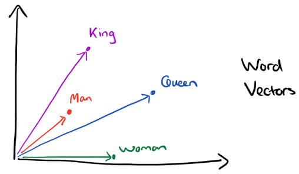
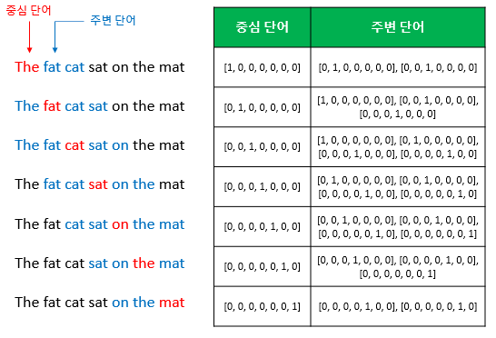
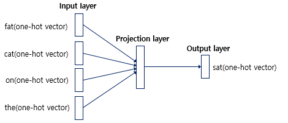
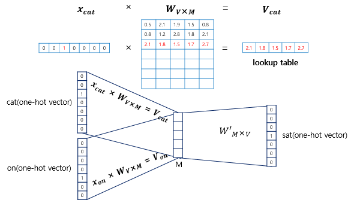
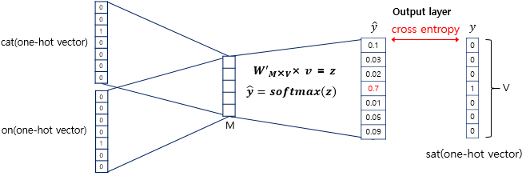

# 자연어 처리

> 컴퓨터과학, 인공지능, 언어학이 합쳐진 분야

- DNN 은 분산표현의 장점으로 인해 모호하지만 풍부한 정보를 얻을 수 있다.
  - 단어의 벡터화시작

- 언어는 불연속 데이터들의 조합임
  - 수치화 시키기 어려움
  - 특징을 추출할 수 없음

- 계층적, 재귀적인 구조를 지님
  - 문자, 단어, 구, 문

## 자연어 처리 종류

- 계열-> 계열
  - 형태소해석
  - 기계번역자동요약
  - 질의응답
- 계열-> 트리구조
  - 구문해석
- 계열-> 그래프구조
  - 의미해석

## 분포가설 이론

- 비슷한 문맥을 가진 단어는 비슷한 의미를 가진다
- 현대의 통계적 자연어 처리에서 획기적인 발상

### 종류

count-based methods

- SVD(LSA), HAL 등등

- 단어의 출현 갯수를 세는 방법

문맥통해서 관련된 단어끼리 특징 추출해서 연산 등을 통해 예측

## TF - IDF( Term Frequency - Inverse Document Frequency)

- TF : 현재 문서에서 단어 A가 나타난 횟수 ( 해당 단어가 많을 수록 중요하다는 뜻)
- DF : 단어가 나타난 문서의 수( 높으면 해당 단어가 흔하다는 뜻, 중요하지 않다는 뜻, 낮으면 특정 문서에서만 쓰인다는 뜻)
- 특정 단어의 상대적인 빈도를 나타내주는 값
- 값이 클 수록 **내 문서**에만 많이 언급되는 단어(=다른 문서에서는 잘 언급 안됨)
- 값이 작을수록 다른 문서에 잘 언급하는 단어를 의미(=현재 문서와 관련 없음)
- TF-IDF = TF * log(N/DF) N은 문서의 건 수

## 한계

> 워드 기반으로 하면 단어가 추가 될 경우 방법이 없다...
>
> 전이학습방식으로 해결해 나가야할듯?

## word embedding

> - 빈도수 기반 표현은 단어간 의미차를 표현할 수 없음
> - 단어 자체 의미 자체를 다차원 공간에서 벡터화 필요
>   - 단어들 사이의 유사도 측정 가능
>   - 단어들간의 평균 및 연산을 통해 추론 가능

king - man + woman = queen

## Continuous Bag of Words

> 주변에 있는 단어들을 가지고 중간에 있는 단어들을 예측하는 방법
>
> - _가 맛있다.
> - _를 타는 것이 재미있다.
> - 평소보다 두 _로 많이 먹어서  _가 아프다.

### 데이터셋 생성 방식

>  윈도우 슬라이딩 방식으로 데이터셋 생성, 윈도우 크기 만큼 생성

### 네트워크 구성 방식

> 뉴럴 넷과 유사하지만 오차역전파를 진행하지 않음

> V 차원은 M 차원으로 축소 시키기 위함

## word2vector

### 참고자료

- https://wikidocs.net/22660

## 모듈설치

pip install gensim

pip install wordcloud (단어별 크기 표시)

pip install konlpy --user (한국어 형태소 분석)

conda install -c conda-forge jpype1

