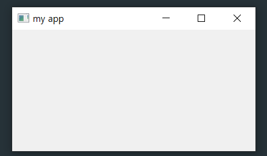

# Basic


## 1. 창 띄우기

- 소스코드

```python

import sys
from PyQt5.QtWidgets import QApplication, QWidget

class MyApp(QWidget):

    def __init__(self):
        super().__init__() # QWidget init
        self.initUI() # initUI init

    def initUI(self):
        self.setWindowTitle('my app') # app window title name
        self.move(600,600) # move point app
        self.resize(400, 200) # app window size 
        self.show() # show app widget

if __name__ == '__main__':
    app = QApplication(sys.argv)
    ex = MyApp()
    sys.exit(app.exec_())
```

- 실행 결과

  


## 2. 창 닫기

- 소스코드

```

```


- 실행결과


