# SLAM

> 강의 출처는 http://ais.informatik.uni-freiburg.de/teaching/ws13/mapping/

이 내용은 페이스북 SLAM KR에서 진행한 교육을 토대로 정리함

## 발표자

장형기- 증강현실 산업 종사자, 케임브리지 의료광학 연구실, 임페리얼 칼리지 영상유도수술 연구실

## Phase 1

## SLAM 기초

Visual-slam 이란?

computer vision 시각(이미지,비디오 등등) + Slam(로보틱스 기술,simulataneous Localisation and mapping, 동시적, 위치추적 및 지도작성,로봇이 움직일때 나의 위치에서 추정하고 주변의 환경이 어떻게 생겼는지 지도를 생성해주는 기술)

쉽게말하면 카메라를 이용해서 SLAM이 현재 위치를 추정하고 맵을 그려내는 기술

나의 위치를 추정함과 동시에 

예를들어 어느날 눈을 떠보니 해변에 쓰러져있었다. 근데 섬인거같은데 어딘지 잘모른다.

비유를 하나 들어보겠습니다.

우리가 어떤 무인도에 떨어졌다고 생각해봅시다.

우리는 이 곳이 어떻게 생겼는지도 잘 모르고, 내가 어디있는지도 잘 모릅니다.

**"내가 지금 어디에 있고, 이 곳 주변은 어떻게 생겼는지"** 이해하기 위해 우리는 주변을 **탐색**하기 시작합니다. (1)

우리는 섬 전체를 탐색하기 전 까지는, 나 자신이 현재 섬의 어떤 곳에 위치해있는지 알 수 없습니다.

다만 우리는 **처음 눈을 뜬 장소를 기점으로 나의 위치**를 추정할 수는 있죠. (2)

우리는 탐색을 계속해서 이어가다가, **내가 현재 있는 위치가 이전에 왔던 지점인 것을 인지**하고는 "엇 나 여기 아까 왔었잖아?" 하고 기억해낼 수 도 있습니다.

이런 "랜드마크"를 기점으로 우리는 또 자신의 위치를 추정할 수도 있을겁니다. (3)

결국 우리는 섬 전체를 모두 탐색할 것이고, **섬 전체의 지도**를 가지게 됩니다.

또, 어떤 곳을 우리가 갈 수 있는지도 알 수 있죠. (4)

"내 XX가 어디에있나~" + "내 xx가 들린곳은 어떻게 생겼나~"

1. "내가 지금 어디에 있고, 이 곳 주변은 어떻게 생겼는지"
   - SLAM 기술은 실시간으로 자신의 위치 추정과 (Localization) 주변 지도 작성을 (Mapping) 할 수 있습니다.
2. "처음 눈을 뜬 장소를 기점으로 나의 위치를 추정"
   - SLAM 프로그램이 시작한 시점에서부터 지속적으로 자신의 위치 추정을 할 수 있습니다.
   - 이 부분은 visual odometry라는 부분과도 겹치기 때문에 혼란을 줄 수 있는데, 아래에 설명이 있습니다.
3. "내가 현재 있는 위치가 이전에 왔던 지점인 것을 인지"
   - 최신 SLAM 기술들에 적용되는 **Loop Closure**라는 기능을 통해, 나의 현재 위치가 이전에 와본 적 있는 장소라는 것을 인지하고 자신의 위치에 대한 오차 수정을 할 수 있습니다.
4. "섬 전체의 지도" + "어떤 곳을 우리가 갈 수 있는지도 알 수 있다"
   - SLAM 프로그램이 종료되는 시점에서는 잘 그려진 지도와 나의 지난 위치들을 얻어낼 수 있습니다.

## 특징

알고리즘의 성능 가벼우면서 잘돌면서 동시에 강인한 알고리즘이 필요함. 즉 정확도는 떨어질 수 있음

- SLAM은 무조건 실시간으로 이 문제를 해결해야 함

  - 1초에 30프레임이라고 하면 1프레임당 모든 계산을 끝내야 함

  - 즉 33ms 이내에 계산이 끝나야 함

  - 가벼운 알고리즘?

    - 성능을 줄여야 할 수도 있다.
    - 속도와 성능의 tradoff

  - 알고리즘의 robustness(강인함)

  - 하드웨어

    

## SLAM 기법

ORB SLAM

- 초기 위치에서 주변환경에 대한 지도를 그려줌

## SLAM과 혼동되는 기술

- structure from motion(SfM), 실시간으로 돌지 않아도 되는 장점

- Visual Odometry
- Path Planning파스플래닝, 단순히 어떤지도가 있을 떄 a,b지점간의 최단거리를 정해주는 기술 slam과 연관이 없다. 지도를 slam에서 만들어낼 수 있다.  같은 기술이 아님, 그리고 slam은 3차원 공간 안에서 점들간의 벽인지 아닌지 구분하지 못하므로 구분해줘야하는 작업이 필요함

- photogrammetry, 3d가 아니어도 할 수 있음 루프클로저 개념이 들어가 있지 않음

- Image stiching

## SLAM의 종류

- Visual-SLAM(카메라를 이용)
  - monocular SLAM - 카메라 1대로 SLAM
  - stereo - 카메라 2대로 SLAM
  - rgb-d - depth 정보를 이용한 SLAM
- Visual-Inertial SLAM()
  - 관성(IMU)센서를 이용한 SLAM
  - 스마트폰에도 IMU 센서가 들어가 있따
  - 좀더 정확하게 트래킹 가능
- Lidar SLAM(GPS와 같이 사용하는경우도 있음)
  - 자율주행차, 부동산에서 많이 쓰임
  - 레이저가 발사하고 돌아오는 시간을 계산하여 거리 계산
  - 2d 하나의 평면에서 벽이 어떻게 생겼는지, 실내에서 많이 사용, 10~20만원대 정도면 괜찮은거 삼
  - 3d 높이정보까지 뽑아냄, 몇백만원대 부터 수천만원대 로 비쌈
  - visual slam보다 정확하지만 무거움
- Sensor fusion / INS
  - 센서에 제한을 두지않고 여러 종류를 섞어 사용한 기법 
  - 자율주행경우 위치가 잘못된경우 인명피해가 날 수 있기 때문
- 그래프 SLAM
  - 나의 위치를 그래프로 표현한다해서 이 원 안의 에러를 분산시켜서 각각 포즈를 분산시킨다.
  - 옵티마이제이션 방식을 사용
  - 비쥬얼 슬램이기도 한다.

정확한 내용은 zhang 2020 "a Survey of Simul(SLAM) with an envision in 6G wireless network" 을 참조해서 보기

## SLAM 공부하기 꿀팁

1. **C++**이 계산도 빠르고 cv/slam 관련 라이브러리가 많음
   - the chrno 의 C++ 강의

2. **파이썬**을 쓰면 opencv를 구현해보기는 쉽다. 하지만 실제로 쓰기에는 쓰레드 관리,최적화, 하드웨어 호환성 등의 문제가 있음, 하지만 딥러닝 SLAM 을 트레이닝 할 때는 좋음
   - 홍정모의 따라하며 배우는 C++ 강의 

3. 프레임워크/OS

   - ROS를 사용하면 개발이 편함
     - 센서 데이터를 ROS bag으로 받기 쉬움
     - 하지만 ROS 자체에 한계가 있음. ROS로 개발한 경우 TCP/IP 규약에 인해 센서값들을 가로채서 해킹이 가능
     - ROS2로 보완 가능하나 아직 개발중
     - 하지만 ROS는 없이도 개발이 가능

   - ROS가 돌아가는 ubuntu linux 를 추천
   - 표현석 박사의 ROS 로봇프로그래밍 우분투16.04 기준으로 작성되어있음

4. 기본지식
   - 선형대수
     - 공간에 대한 이해, 이상엽 mass의 선형 대수학, MIT 길버트 스트랭관련 자료
   - 베이즈 확률론
     - 상태추정 + sensor fusion, 칼만/버티컬 필터, 상태(나 또는 구조물 위치)추정 알고리즘
     - 요즘은 옵티마이제이션 기법이 추세임
     - probabilistic 의 robotics  책을 추천
   - 최소자승법 문제 + 최적화
     - 최신 SLAM 을 이해하는데 필수
   - 영어
     - 많은 SLAM 자료가 영어

5. 컴퓨터비전 지식
   - CV에 사용할 수 있는 라이브러리
     - Opencv, Eigen, Ceres, g2o, DBow

6. 딥러닝

   - 텐서플로우, 파이토치 추천

   - 아직까지 CPU의 속도를 이기지 못함

   - Deep-SLAM은 굉장히 최신분야
     - 2D /3D object detection & Segmentation
     - image retrieval(loop closure), 이미지 매칭관련
     - 6D pose localization & estimaion, 6자유도 
     - CV representation learning, 옵티컬 플로우..등
   - optimisation for real-time performance
     - 모델의 성능을 가볍게 하기 위함
     - model compression & quantistaion
     - inference optimisation , 좀더 가벼운 GPU에서 돌릴 수 있을 만큼
     - hardware optimisation
   - hardware acceleration(CPU/GPU)
     - SIMD(Single Instruction Multiple Data의 약자, SSE/AVX2(x86), Neon(arm 계열 프로세스), CUDA) , 벡터등의 연산을 빨리 한다는지
     - mobile computing platform

7. 장비추천(Desktop PC)

   - PC 방에 들어가는 사양정도면 웬만한 SLAM 돌릴 수 있다고 생각함

   - CPU 클럭 수 높고 쓰레드 많은거가 필요
     - inter vs AMD
       - inter이 avx-512 벡터 가속연산을 지원
       - amd는 avx2까지 지원, 대신 코어 수 / 클럭 가성비가 좋은편
         - 필요한 연산에따라 고르면 됨
   - GPU는 direct-method 사용 시 + Deep-slam 사용 시 필수
     - radeon 말고 nvidia GPU 사용
     - 많은 양의 병렬처리를 해야할 때, OpenCV + CUDA 가속도 가능
       - native build option 말고, nvidia optimised OpenCV 빌드 옵션으로 가능 
   - 램은 무조건 많게! 다다익램, 클럭 수 높고 쿨링 잘 되는거
     - 핸드폰으로 사용할 경우 맥시멈타임을 2분으로 저장, 램이 작아서 저장할 공간이 없기 때문

8. 모바일 환경

   - 스마트폰
     - 안드로이드 vs ios
       - ios가 최적화가 더 잘 되어있음..하지만 국내 안드로이드 사용자가 많음
   - Mobile PC / SBC
     - nvidia jetson nano(10만원대) / tx2(4~50) / xavier(8~90)
       - cuda 지원으로 인한 알고리즘 가속 + 특정 스테레오 카메라는 cuda 필수 이용 + 딥러닝 가능
     - lattepanda(맥북미니급 성능) / odroid + intel neural compute stick 또는 google coral accerator(USB 3.0으로 이용해야 함)
       - cpu가 많이 부족하나 파워 요구치가 낮음(라즈베리파이는 너무 부족함, 라즈베리파이 4부터 )
       - usb로 intel ncs / google coral 연결 후 딥러닝 가능
     - intel nuc
       - cuda 지원 안되는 경우가 많음. cpu만 쓸 경우 괜찮치만 파워가 필요
   - arm 프로세서가 많고 이를 위해 arm 전용 SIMD가 필요, 비전 알고리즘이 구현 안된경우가 많음

9. 단안 카메라
   - 웹캠
     - 가능한 사용하지 말기 별로 안좋음
     - 마이크로소프트 lifecam studio
       - exposure, iso, shutter speed 컨트롤 가능
   - 머신비전 카메라
     - 장형기님 추천
     - flir 추천, basler(머신비전 카메라계의 애플) 카메라가 국내 전파인증 통과, 연구용이면 lds, edmund optics, allied vision, 수아랩, 라온피플 등 무방
     - 카메라 세팅 변경 가능 + 성능이 좋아 가장 추천, 그러나 가격대 + 구매를 위한 지식이 필요
   - DSLR
     - 가능한 비추
     - structure from motion 할 때 좋음 센서 사이즈 크고 좋은렌즈 골라야함
   - 카메라 모듈
     - 라즈베리파이용 카메라 등이 있음
     - 인터페이스를 잘 알아보고 살 것
   - 스마트폰
     - API 사용법을 잘 이용해야 할 듯, 삼성 플래그쉽 추천
   - event-camera
     - 연구분야에서 활발히 사용하고 있음
     - 개인 구매 비추(비쌈) 데이터셋 활용 추천

10. 스테레오 카메라
    1. 스테레오랩스의 zed, zed 2, zed mini
       - cuda dependency 가 적용되어 있음- 하지만 빠름!
       - zed 2 ~ api에 딥러닝 인퍼런스 모델 탑재 가능
    2. 인텔 리얼센스 t265
       - fisheye 렌즈로 넓은 시야 탑재
11. 뎁스 카메라
    1. 마이크로 소프트 키넥트 2, azure kinect(성능이 정말 좋음)
       - 전체적으로 인텔 리얼센스보다 큼
    2. 인텔 리얼센스 d415, d435,  l515
       - 전체적으로 작고, 파워를 적게 사용
       - openvino와 연동 가능

## GPU 사용/ 딥러닝 SLAM

SLAM의 새로운 분야이지만 기존 SLAM 방식이 성능 더 좋음.

램카피 문제로 성능이 느리지만 추후에는 더 좋아질 수 있음

추가 문제점은 end-to-end learning의 성능이 좋지않음

딥러닝 + 슬램 의 수요가 많고 공급이 적어 몸값이 엄청 비쌀 것으로 보임

### 비주얼 슬램의 종류

- feature-based
  - 대부분 cpu 사용
- direct based
  - 대부분 GPU(모든 depth계산할 경우) 사용 몇몇 cpu 사용
  - 빛이 들어오는 intensity 값들인, 부분적인 값들을 사용

### CPU 사용 / 증강현실

가장 최선두에 있는 분야

- 증강현실은 visul slam의 가장 frontier 산업?
  - 자율주행은?
    - 의사결정에 대한 윤리적 문제가 존재함
  - accurate & fast localisation
  - low-processing power
    - 옵티마이즈 알고리즘(SIMD: SSE,avx,neon)
    - 옵티마이즈 하드웨어(fpga)
  - realistic rendering
  - 클라우드 저장소 / 엣지 서버, 여러분야가 동시에 GPU 사용해야 하는 경우
  - collaborative slam, 여러명이 동시에 지도를 생성, 스마트폰의 램이 꽉 차기 전에 여러대의 스마트폰을 이용

## Phase 2

## Visual SLAM의 시작

2D 디지털 이미지 Input으로 사용한다.

1. 단안 카메라의 경우
   1. input은 2d 디지털 이미지
   2. 알고리즘을 통해
   3. 위치 정보를 output
2. 양안 카메라의 경우
   1. input은 2d 디지털 이미지 2개를 사용
   2. 하나는 알고리즘, 하나는 뎁스 이미지를 구함

3. 뎁스 카메라의 경우
   1. 스트럭쳐 light 패턴을 통해
   2. 2d 디지털 이미지를 통해 
   3. 알고리즘을 통해
   4. 위치 정보 아웃풋

 

VSLAM을 하려면 어느정도 하드웨어에 대한 이해가 필요함

### 디지털 이미지란?

3차원 공간의 정보를 2D로 옮겨담은 것, 공간에서 반사되어 오는 빛을 측정

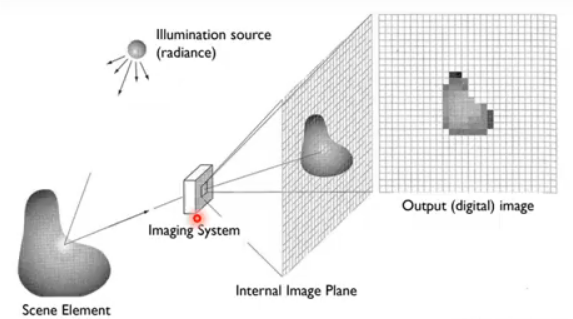

카메라는 사진을 찍는 도구이지만 Visual-SLAM 분야에서 카메라는 **빛을 측정하는 센서 또는 시스템**이다.

- 빛 -> 필터 -> 포토다이오드 -> 전류/전압 -> ADC(아날로그 to 디지털 시그널, 0~ 255 값으로 변환)

- 각각의 특정색깔 필터가 특정 색만 통과 시켜줌있음

- 들어온 빛을 전압으로 바꿔주고 ADC를 통해 값으로 변환해줌

  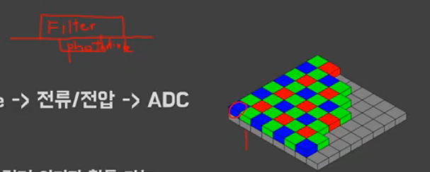

  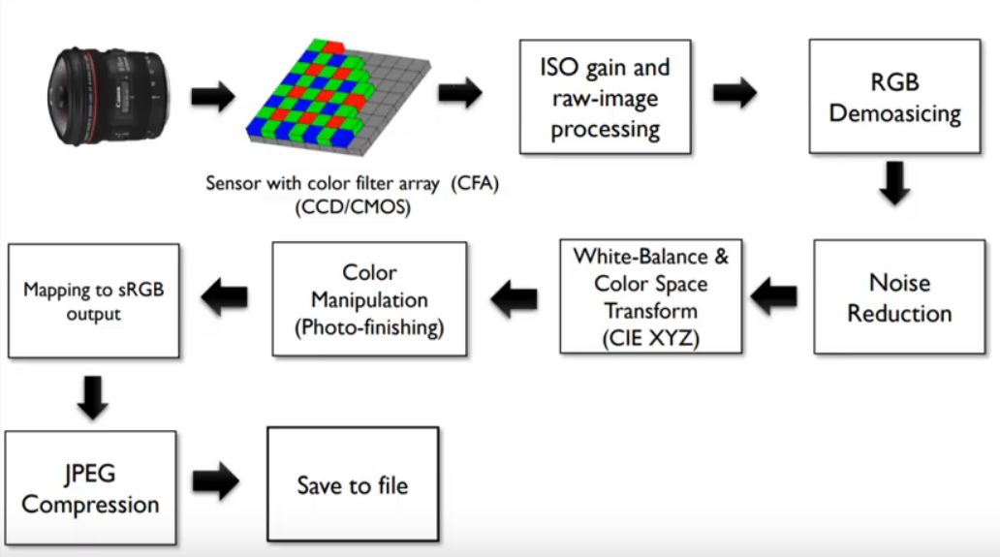

  > 출처 마이클 브라운

- 컬러 카메라

  - Bayer pattern을 통해 컬러 이미지 획득 가능

  - Red, Green, Blue 

  - 카메라 내부 프로세서(ISP)에서 보통 RAW파일로 저장 -> sRGB 스페이스로 변환

  - 카메라마다 뜻하는 R/G/B 값이 다름

    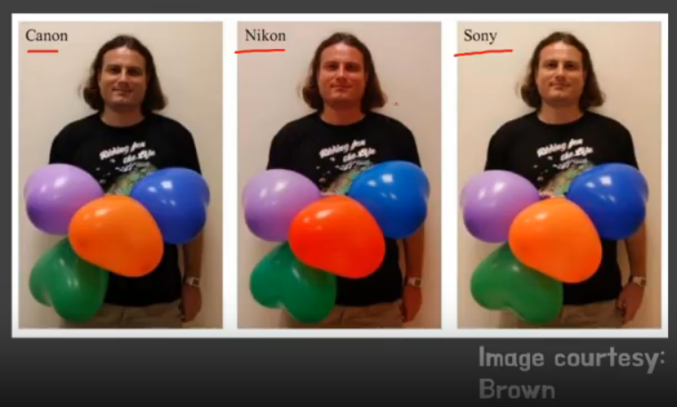

- biological vision vs silicon vision ?

  - biological vision

    - 어두운 곳을 잘 볼 수 있음
    - 눈(비전 센서)
      - 빛을 받아드리고
      - 신호처리해서
      - 뇌로 신호를 보내줌
    - 눈(프로세서)
      - 뉴럴 넷?
    - dead pixel도 존재
      - 뇌로 통하는 신경인 fovea 구간 - optical nerve가 지나가는 지점
      - 픽섹이 많이 존재한다

  - silicon vision

    - 어두운 곳을 잘 못 봄

    - 데드 픽셀이 존자하면 주변 값들을 평균내서 메꾼다

    - biological vision 보다 좋음

    - 프로세서는 biological 보다 안좋음

    - 어떤 카메라를 써야 하나?

      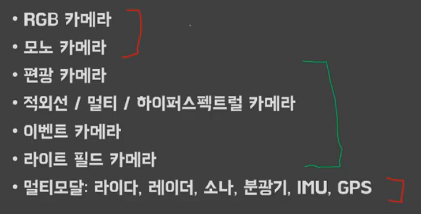

      > 연구용은 초록색, 현직자들은 빨간색, 편광카메라는 빛반사가 없는 SLAM 가능

- RGB 카메라의 단점

  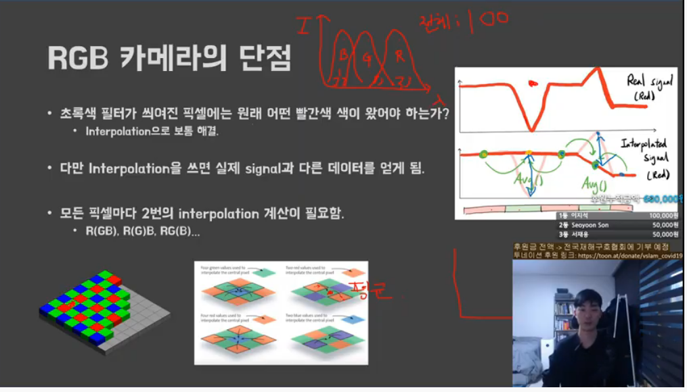

  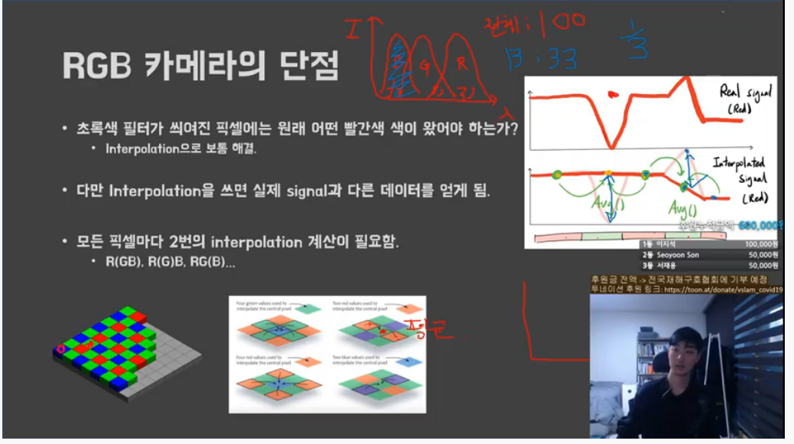

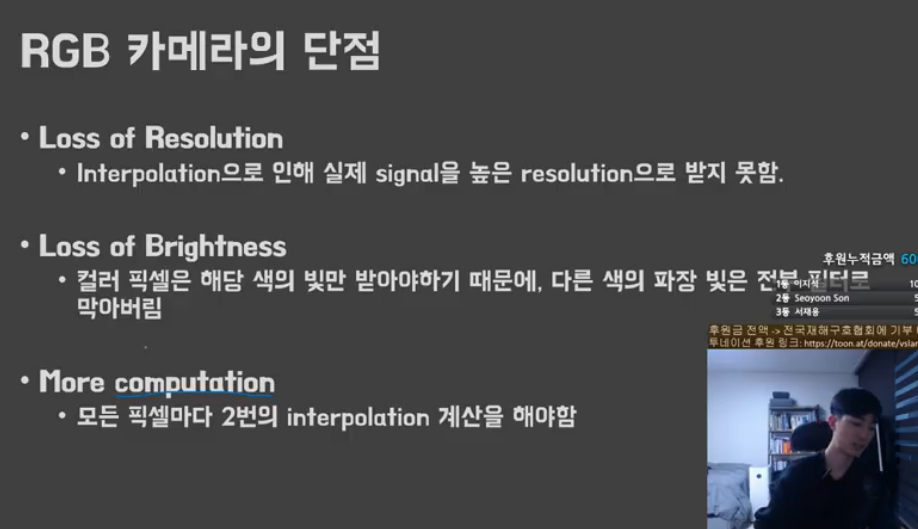

컬러 카메라는 빛의 필터로 인해 밝기가 떨어짐, 

해결방법으로는 

1. gain 값을 곱하여 밝기효과를 증가시킬 수 있음, 하지만 시그널에는 노이즈도 같이 껴있는데 gain 값 추가시 노이즈도 같이 곱해짐, 즉 시그널이 불안정 해진다.결과적으로 gain을 조절해가며 설정한다.

2. 조명을 추가

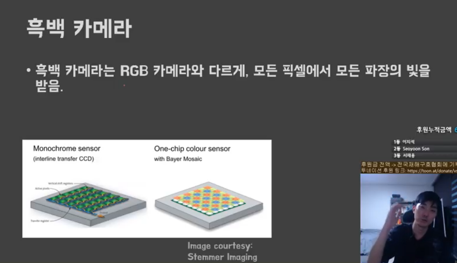

흑백이 칼러보다 SLAM 할 때 더 좋다, resolution loss도 없다

멀티/하이퍼스펙트럴 카메라

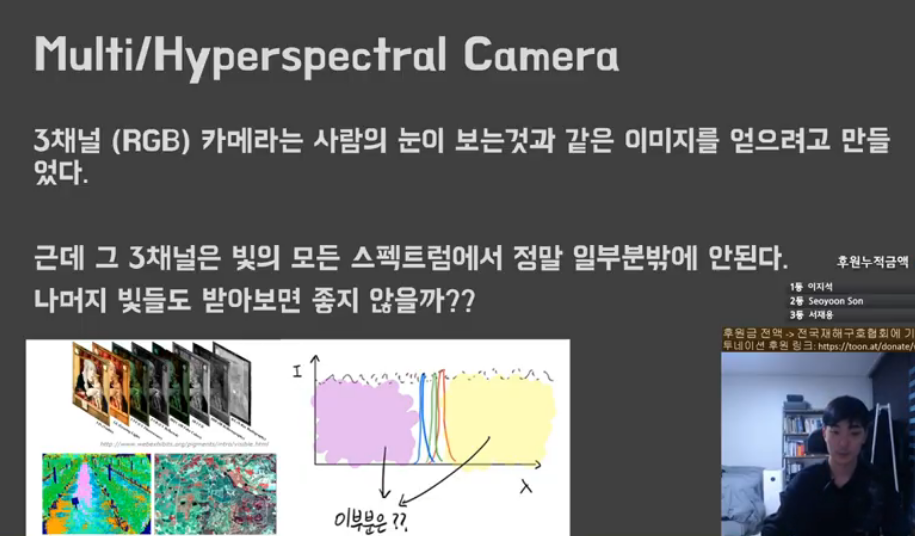

RGB 카메라 고를 때 고려사항

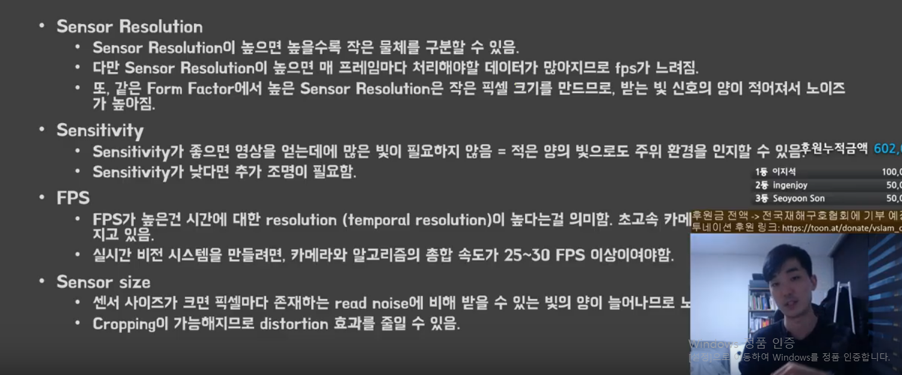

fps 는 보통 최소 이미지 가져오고 처리하고 할 때 25~30 fps 약 33ms 내 처리 하면 됨, 초고속 카메라는 

센서사이즈는 클수록 노이즈는 작아짐

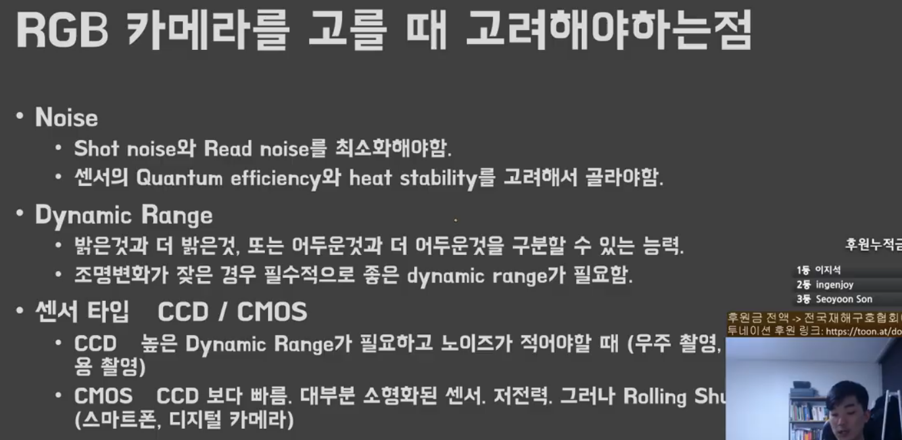

CCD는 SLAM에서 잘 안씀 CMOS 가 들고 다니기 가볍기 때문에 잘 씀 하지만 단점은 롤링 셔터가 발생

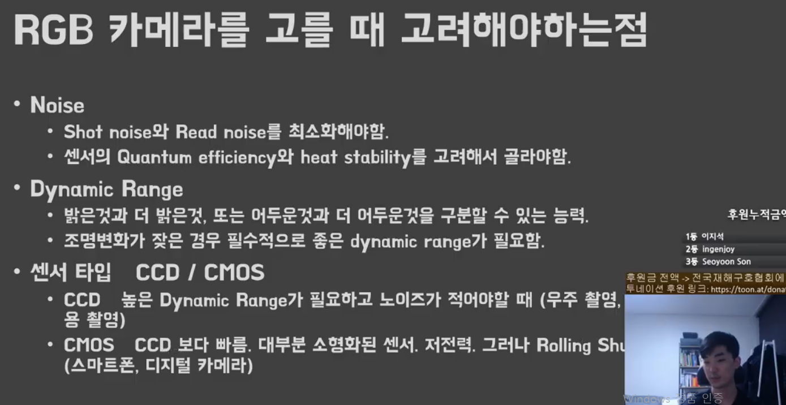

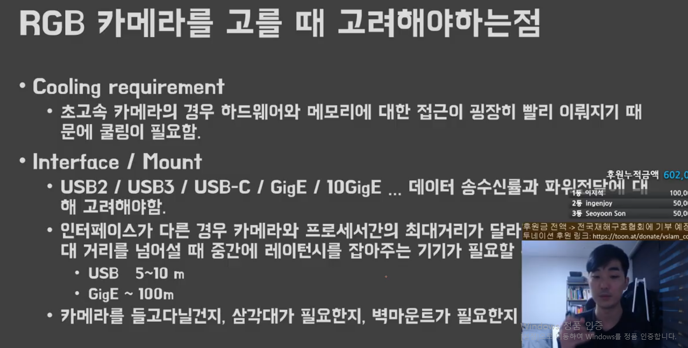

드론용 카메라는 위드로봇의 ocams- nu 추천

렌즈 칼큘레이터라는 앱을 이용하여 알맞은 렌즈를 맞출 수 있음

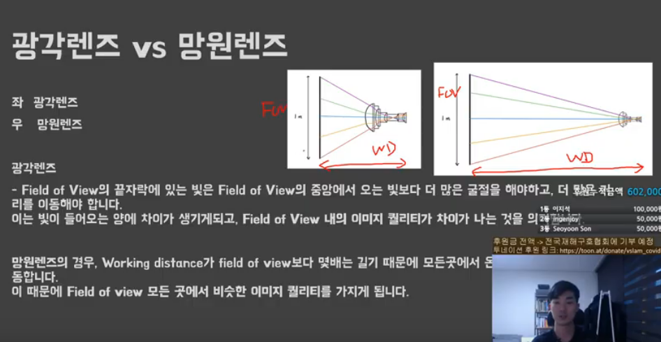

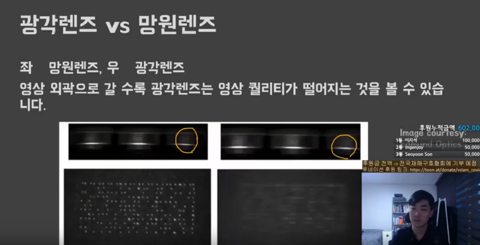

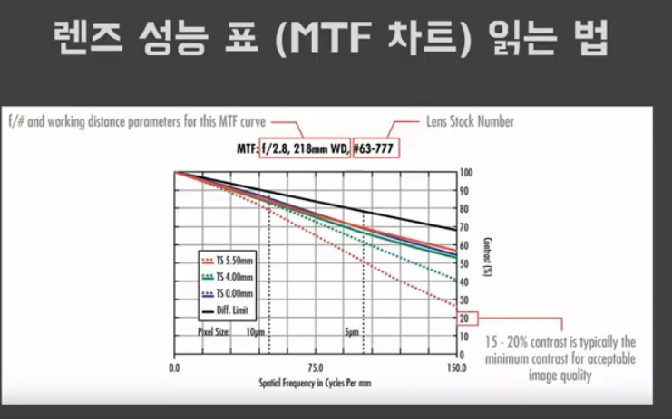

x축은 거리, y축은 정확도 퍼센트

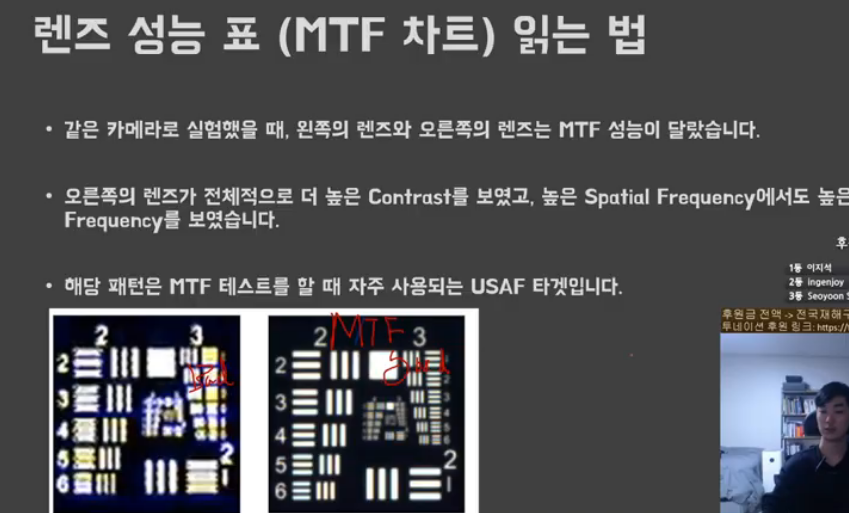

모션블러는 비주얼slam에 있어서 최대의 단점이다 exposure time(빛을 받아들이는 시간)을 줄이고 gain을 올린다. 다만 노이즈 발생에 주의