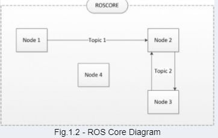

# ROS tutorial

theconstructsim 에서 진행하는 강의를 통해 배운내용을 정리하는 docs


## 1. 기본 명령어들

### 1. roslaunch

ROS program을 실행시키기 위한 명령어이다. 명령어 구조는 아래를 따른다.

```
roslaunch <패키지명> <launch_파일>
```

패키지는 ROS 프로그램을 구동하기 위한 모든 파일들을 담고있다.  소스파일로는 CPP 파일이 될 수 있고 python 파일이 있을 수 있고 구성은 다음과 같다.

- launch folder : launch file을 포함한 폴더

  - launch file은 다음의 내용을 포함하고 있다. 모든 파일에는 `<launch>`라는 태그가 필히 포함되어 있으며 그 안에 다음의 파라미터 값들이 있다.

    - pkg="패키지명"
      - ROS program의 코드가 포함된 패키지 이름
    - type="src파일.py" 
      - 실행하기 위한 코드(.py or .cpp) 파일
    - name="node_name"
      - python file을 시작할 ROS 노드의 이름
    - output="type_of_output"
      - 출력 방식 정의하는 부분?
      - Through which channel you will print the output of the Python file

    ```bash
    <launch>
      <!-- turtlebot_teleop_key already has its own built in velocity smoother -->
      <node pkg="turtlebot_teleop" type="turtlebot_teleop_key.py" name="turtlebot_teleop_keyboard"  output="screen">
        <param name="scale_linear" value="0.5" type="double"/>
        <param name="scale_angular" value="1.5" type="double"/>
        <remap from="turtlebot_teleop_keyboard/cmd_vel" to="/cmd_vel"/>   <!-- cmd_vel_mux/input/teleop"/-->
      </node>
    </launch>
    ```

    

- src folder : cpp, python 등의 소스파일이 담긴 폴더

- CMakeLists.txt : cmake rule이 정의된 파일

- package.xml : 패키지 정보가 담긴 xml 파일


### 2. roscd

ROS program 패키지 경로로 이동하게 해주는 명령어이다. 생성한 패키지로 이동시켜준다.

```bash
# roscd <패키지명>
# 사용시 패키지 경로로 이동해줌
user:~/catkin_ws/devel$ roscd turtlebot_teleop/
user:/home/simulations/public_sim_ws/src/all/turtlebot/turtlebot_teleop$ ls
CHANGELOG.rst  CMakeLists.txt  README.md  launch  package.xml  param  src
```


## 2. ROS Package 생성

패키지를 만들기 위해서는 catkin이라는 특별한 작업공간 내에서 작업을 수행해야 한다. catkin은 ros에서 사용하기 위해 ros 패키지가 있어야하는 하드 디스크의 디렉토리이다(예전에 rosbuild가 사라지고 나온 ros의 인프라스트럭쳐와 마크를 관리하는 새로운 low-lever build system). 일반적으로 catkin 작업공간 디렉토리를 catkin_ws라고 한다. 


### 1. Package 폴더 생성

아래의 명령어를 입력하여 패키지 생성을 할 수 있다.

```bash
# catkin_create_pkg <패키지명> <패키지_dependecies> , "패키지_dependecies"는 해당 패키지가 의존하는 다른 ROS 패키지의 이름 
# 경로는 catkin_ws/src 에서 명령어를 입력해준다.
user:~/catkin_ws/src$ catkin_create_pkg myoung_lab rospy
Created file myoung_lab/package.xml
Created file myoung_lab/CMakeLists.txt
Created folder myoung_lab/src
Successfully created files in /home/user/catkin_ws/src/myoung_lab. Please adjust the values in package.xml.

#rospack 명령어를 이용하여 생성한 패키지 정보를 확인할 수 있다.
user:~/catkin_ws/src$ rospack list | grep myoung
myoung_lab /home/user/catkin_ws/src/myoung_lab

#roscd 명령어를 이용하여 생성한 패키지 경로로 이동할 수 있다.
user:~/catkin_ws/src$ roscd myoung_lab
user:~/catkin_ws/src/myoung_lab$
user:~/catkin_ws/src/myoung_lab$ tree
.
|-- CMakeLists.txt
|-- package.xml
`-- src
```


### 2. src 파일 생성

ROS를 구동하기 위한 소스파일을 만들어보자. python 파일을 이용해본다.

경로는 생성한 패키지의 src 폴더에서 `.py` 파일을 만들어준다(.py 파일을 만들고 파일에 대한 권한을 추가해준다. linux 에서는 `chmod +x 파이썬파일.py` 을 입력하여 쓰기권한을 추가해준다). 테스트이므로 간단하게 아래와 같이 코드를 입력해보자.

```python
#! /usr/bin/env python 
# This line will ensure the interpreter used is the first one on your environment's $PATH. Every Python file needs
# to start with this line at the top.

import rospy # Import the rospy, which is a Python library for ROS.

rospy.init_node('ObiWan') # 'ObiWan'이라는 이름으로 ros node를 init

print("Help me Obi-Wan Kenobi, you're my only hope") # A simple Python print
```


### 3. launch 파일 생성

1. launch 파일은 패키지 파일내 소스파일을 실행시켜주는 파일이다. 아래와 같이 패키지 폴더로 이동 후 launch 폴더를 생성해준다.

```bash
# roscd 입력
# mkdir 이용하여 폴더 생성

user:~$ roscd myoung_lab
user:~/catkin_ws/src/myoung_lab$ mkdir launch
user:~/catkin_ws/src/myoung_lab$ ls
CMakeLists.txt  launch  package.xml  src

# 생성한 launch 폴더에 touch 명령어를 이용하여 launch 파일을 생성해준다.
user:~/catkin_ws/src/myoung_lab$ touch launch/myoung_lab.launch
user:~/catkin_ws/src/myoung_lab/launch$ ls
myoung_lab.launch
```

2. 아래에 해당 코드를 붙여넣고 저장해보자

```bash
<launch>
    <!-- My Package launch file -->
    <node pkg="패키지이름" type="simple.py" name="ObiWan"  output="screen">
    </node>
</launch>
```

3. roslaunch 명령어를 이용하여 launch 파일을 실행해보자

```bash
user:~/catkin_ws/src/myoung_lab/src$ roslaunch myoung_lab myoung_lab.launch
... logging to /home/user/.ros/log/64c88c3a-7383-11eb-b76b-0242ac150008/roslaunch-1_xterm-3766.log
Checking log directory for disk usage. This may take a while.
Press Ctrl-C to interrupt
Done checking log file disk usage. Usage is <1GB.

started roslaunch server http://1_xterm:42947/

SUMMARY
========

PARAMETERS
 * /rosdistro: noetic
 * /rosversion: 1.15.9

NODES
  /
    ObiWan (myoung_lab/simple.py)

ROS_MASTER_URI=http://1_simulation:11311

process[ObiWan-1]: started with pid [3782]
Help me Obi-Wan Kenobi, you're my only hope   <<<<<< python 파일에서 수행된 출력문
[ObiWan-1] process has finished cleanly
log file: /home/user/.ros/log/64c88c3a-7383-11eb-b76b-0242ac150008/ObiWan-1*.log
all processes on machine have died, roslaunch will exit
shutting down processing monitor...
... shutting down processing monitor complete
done
```

4. 위는 해당 패키지가 실행되고난 후 프로세스가 종료된 상태이다. python 코드에서는 ROS node를 init 후 print 명령어를 이용해 메세지를 출력하는 명령까지 수행하고 자동으로 종료된다. 프로세스가 자동으로 꺼지지 않게하기 위해서는 python코드를 다음과 같이 수정해주어야 한다.

```python
#! /usr/bin/env python 

import rospy # Import the rospy, which is a Python library for ROS.

rospy.init_node('ObiWan') # Initiate a node called ObiWan
rate = rospy.Rate(2)               # We create a Rate object of 2Hz
while not rospy.is_shutdown():     # Ctrl + C 를 입력하기 전까지 무한루프 반복
   print("Help me Obi-Wan Kenobi, you're my only hope")
   rate.sleep()  
# print("Help me Obi-Wan Kenobi, you're my only hope") # A simple Python print
```

```bash
# launch 명령어 실행후
user:~/catkin_ws/src/myoung_lab/src$ roslaunch myoung_lab myoung_lab.launch
... logging to /home/user/.ros/log/64c88c3a-7383-11eb-b76b-0242ac150008/roslaunch-1_xterm-3641.log
Checking log directory for disk usage. This may take a while.
Press Ctrl-C to interrupt
Done checking log file disk usage. Usage is <1GB.

started roslaunch server http://1_xterm:39773/

SUMMARY
========

PARAMETERS
 * /rosdistro: noetic
 * /rosversion: 1.15.9

NODES
  /
    ObiWan (myoung_lab/simple.py)

ROS_MASTER_URI=http://1_simulation:11311

process[ObiWan-1]: started with pid [3649]
Help me Obi-Wan Kenobi, you're my only hope
Help me Obi-Wan Kenobi, you're my only hope
Help me Obi-Wan Kenobi, you're my only hope
Help me Obi-Wan Kenobi, you're my only hope
^C[ObiWan-1] killing on exit
Traceback (most recent call last):
  File "/home/user/catkin_ws/src/myoung_lab/src/simple.py", line 11, in <module>
    rate.sleep()
  File "/opt/ros/noetic/lib/python3/dist-packages/rospy/timer.py", line 103, in sleep
    sleep(self._remaining(curr_time))
  File "/opt/ros/noetic/lib/python3/dist-packages/rospy/timer.py", line 165, in sleep
    raise rospy.exceptions.ROSInterruptException("ROS shutdown request")
rospy.exceptions.ROSInterruptException: ROS shutdown request
shutting down processing monitor...
... shutting down processing monitor complete
done
user:~/catkin_ws/src/myoung_lab/src$
```

5. roslaunch 실행중 프로세스가 종료되지 않은 상태에서는 `rosnode` 명령어를 이용하여 실행중인 노드에 대한 정보를 확인할 수 있다.

```bash
user:~$ rosnode list
/ObiWan #<<<<<우리가 init 했던 node
/gazebo
/mobile_base_nodelet_manager
/robot_state_publisher
/rosout

#생성했던 node에 대한 자세한 정보
user:~$ rosnode info /ObiWan
--------------------------------------------------------------------------------
Node [/ObiWan]
Publications:
 * /rosout [rosgraph_msgs/Log]

Subscriptions:
 * /clock [rosgraph_msgs/Clock]

Services:
 * /ObiWan/get_loggers
 * /ObiWan/set_logger_level


contacting node http://1_xterm:37911/ ...
Pid: 4783
Connections:
 * topic: /rosout
    * to: /rosout
    * direction: outbound (37025 - 172.21.0.8:45722) [10]
    * transport: TCPROS
 * topic: /clock
    * to: /gazebo (http://1_simulation:46689/)
    * direction: inbound
    * transport: TCPROS

user:~$
```


### 4. package 컴파일

패키지를 만들었다면 작동시키기 위해서는 컴파일 작업이 필요하다. `catkin_make`명령어를 입력하여 컴파일을 진행하는데 반드시 `catkin_ws` 디렉토리에서 진행해야 하며 src 폴더 내 모든 패키지를 컴파일 한다.

만약 특정 패키지만 컴파일 하고 싶은 경우 `catkin_make --only-pkg-with-deps <패키지명>`를 입력하자

```bash
user:~/catkin_ws/devel$ roscd; cd ..
user:~/catkin_ws$
user:~/catkin_ws$ catkin_make
Base path: /home/user/catkin_ws
Source space: /home/user/catkin_ws/src
Build space: /home/user/catkin_ws/build
Devel space: /home/user/catkin_ws/devel
Install space: /home/user/catkin_ws/install
####
#### Running command: "cmake /home/user/catkin_ws/src -DCATKIN_DEVEL_PREFIX=/home/user/catkin_ws/devel -DCMAKE_INSTALL_PREFIX=/home/user/catkin_ws/install -G Unix Makefiles" in "/home/user/catkin_ws/build"
####
CMake Warning (dev) in CMakeLists.txt:
  No project() command is present.  The top-level CMakeLists.txt file must
  contain a literal, direct call to the project() command.  Add a line of
  code such as

    project(ProjectName)

  near the top of the file, but after cmake_minimum_required().

  CMake is pretending there is a "project(Project)" command on the first
  line.
This warning is for project developers.  Use -Wno-dev to suppress it.

-- Using CATKIN_DEVEL_PREFIX: /home/user/catkin_ws/devel
-- Using CMAKE_PREFIX_PATH: /home/user/catkin_ws/devel;/home/simulations/public_sim_ws/devel;/opt/ros/noetic
-- This workspace overlays: /home/user/catkin_ws/devel;/home/simulations/public_sim_ws/devel;/opt/ros/noetic
-- Found PythonInterp: /usr/bin/python3 (found suitable version "3.8.5", minimum required is "3")
-- Using PYTHON_EXECUTABLE: /usr/bin/python3
-- Using Debian Python package layout
-- Using empy: /usr/lib/python3/dist-packages/em.py
-- Using CATKIN_ENABLE_TESTING: ON
-- Call enable_testing()
-- Using CATKIN_TEST_RESULTS_DIR: /home/user/catkin_ws/build/test_results
-- Forcing gtest/gmock from source, though one was otherwise available.
-- Found gtest sources under '/usr/src/googletest': gtests will be built
-- Found gmock sources under '/usr/src/googletest': gmock will be built
-- Found PythonInterp: /usr/bin/python3 (found version "3.8.5")
-- Using Python nosetests: /usr/bin/nosetests3
-- catkin 0.8.9
-- BUILD_SHARED_LIBS is on
-- BUILD_SHARED_LIBS is on
-- ~~~~~~~~~~~~~~~~~~~~~~~~~~~~~~~~~~~~~~~~~~~~~~~~~
-- ~~  traversing 1 packages in topological order:
-- ~~  - myoung_lab
-- ~~~~~~~~~~~~~~~~~~~~~~~~~~~~~~~~~~~~~~~~~~~~~~~~~
-- +++ processing catkin package: 'myoung_lab'
-- ==> add_subdirectory(myoung_lab)
-- Configuring done
-- Generating done
-- Build files have been written to: /home/user/catkin_ws/build
####
#### Running command: "make -j36 -l36" in "/home/user/catkin_ws/build"
####
```


### 5. parameter server

매개 변수 서버는 ROS가 매개 변수를 저장하는 데 사용하는 사전이다. 이러한 매개 변수는 런타임에 노드에서 사용할 수 있으며 일반적으로 구성 매개 변수와 같은 정적 데이터에 사용된다. `rosparam` 명령어를 이용하여 사용할 수 있다.

```bash
# node별로 정의된 파라미터 리스트를 불러온다
user:~/catkin_ws$ rosparam list
/camera/imager_rate
/camera/rgb/image_raw/compressed/format
/camera/rgb/image_raw/compressed/jpeg_optimize
/camera/rgb/image_raw/compressed/jpeg_progressive
/camera/rgb/image_raw/compressed/jpeg_quality
/camera/rgb/image_raw/compressed/jpeg_restart_interval
/camera/rgb/image_raw/compressed/png_level
/camera/rgb/image_raw/compressedDepth/depth_max
/camera/rgb/image_raw/compressedDepth/depth_quantization
/camera/rgb/image_raw/compressedDepth/format
/camera/rgb/image_raw/compressedDepth/png_level
/camera/rgb/image_raw/theora/keyframe_frequency
/camera/rgb/image_raw/theora/optimize_for
/camera/rgb/image_raw/theora/quality
/camera/rgb/image_raw/theora/target_bitrate
/gazebo/auto_disable_bodies
/gazebo/cfm
/gazebo/contact_max_correcting_vel
/gazebo/contact_surface_layer
/gazebo/enable_ros_network
/gazebo/erp
/gazebo/gravity_x
/gazebo/gravity_y
/gazebo/gravity_z
/gazebo/max_contacts
/gazebo/max_update_rate
/gazebo/sor_pgs_iters
/gazebo/sor_pgs_precon_iters
/gazebo/sor_pgs_rms_error_tol
/gazebo/sor_pgs_w
/gazebo/time_step
/robot_description
/robot_state_publisher/publish_frequency
/rosdistro
/roslaunch/uris/host_1_simulation__37581
/roslaunch/uris/host_1_xterm__39081
/roslaunch/uris/host_1_xterm__39773
/roslaunch/uris/host_1_xterm__40389
/roslaunch/uris/host_1_xterm__41759
/roslaunch/uris/host_1_xterm__42947
/roslaunch/uris/host_1_xterm__45141
/rosversion
/run_id
/use_sim_time

# get을 이용하여 파라미터 값을 불러올 수 있다.
# rosparam get <parameter_name>
user:~/catkin_ws$ rosparam get /camera/imager_rate
2.0

# set을 이용하여 파라미터 값을 설정할 수 있다.
# rosparam set <parameter_name> <value>
user:~/catkin_ws$ rosparam set /camera/imager_rate 4.0
user:~/catkin_ws$ rosparam get /camera/imager_rate
4.0
user:~/catkin_ws$
```


### 6. ros core

roscore는 `메인프로세스`로 ros system의 모든것을 관리한다.



 ros가 실행되는 동안 항상 roscore가 실행되며 `roscore`명령어를 입력하여 실행할 수 있다.

```bash
user:~/catkin_ws$ roscore
... logging to /home/user/.ros/log/64c88c3a-7383-11eb-b76b-0242ac150008/roslaunch-1_xterm-6404.log
Checking log directory for disk usage. This may take a while.
Press Ctrl-C to interrupt
Done checking log file disk usage. Usage is <1GB.

started roslaunch server http://1_xterm:40155/
ros_comm version 1.15.9


SUMMARY
========

PARAMETERS
 * /rosdistro: noetic
 * /rosversion: 1.15.9

NODES

WARNING: ROS_MASTER_URI [http://1_simulation:11311] host is not set to this machine
auto-starting new master
process[master]: started with pid [6412]
ROS_MASTER_URI=http://1_xterm:11311/

setting /run_id to 64c88c3a-7383-11eb-b76b-0242ac150008
process[rosout-1]: started with pid [6422]
started core service [/rosout]
```


### 7. Environment Variables

ROS는 제대로 작동하기 위해 Linux 시스템 환경 변수 세트를 사용한다. 다음을 입력하여 이러한 변수를 확인할 수 있습니다.

```bash
user ~ $ export | grep ROS
declare -x ROSLISP_PACKAGE_DIRECTORIES="/home/user/catkin_ws/devel/share/common-lisp"
declare -x ROS_DISTRO="noetic"
declare -x ROS_ETC_DIR="/opt/ros/noetic/etc/ros"
declare -x ROS_MASTER_URI="http://localhost:11311"
declare -x ROS_PACKAGE_PATH="/home/user/catkin_ws/src:/opt/ros/noetic/share:/opt/ros/noetic/stacks"
declare -x ROS_ROOT="/opt/ros/noetic/share/ros"

# ROS_MASTER_URI와 ROS_PACKAGE_PATH는 중요한 환경변수이다.
# ROS_MASTER_URI -> Contains the url where the ROS Core is being executed. Usually, your own computer (localhost).
# ROS_PACKAGE_PATH -> Contains the paths in your Hard Drive where ROS has packages in it.
```


## 3. 참고

1. ROS Packages: http://wiki.ros.org/Packages
2. Ros Nodes: http://wiki.ros.org/Nodes
3. Parameter Server: [http://wiki.ros.org/Parameter%20Server](http://wiki.ros.org/Parameter Server)
4. Roscore: http://wiki.ros.org/roscore
5. ROS Environment Variables: http://wiki.ros.org/ROS/EnvironmentVariables


