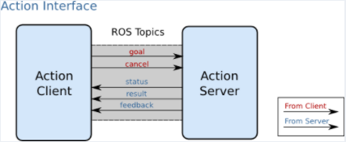
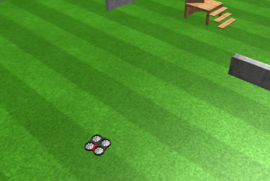
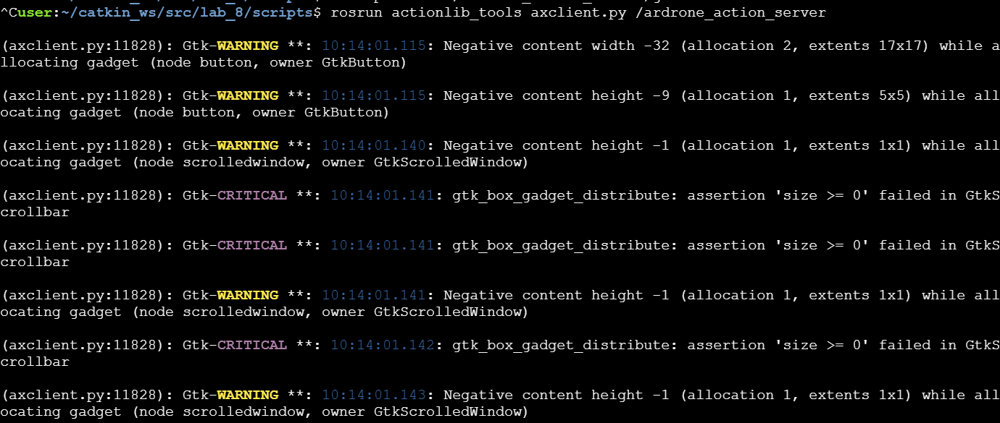
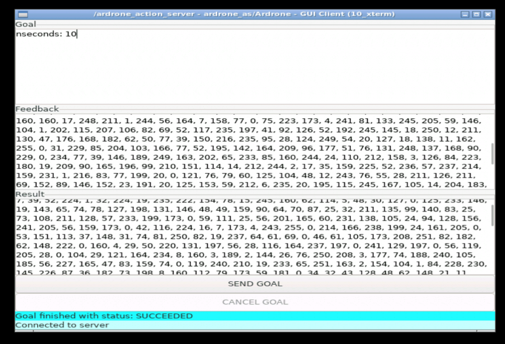

# ROS tutorial Actions

## 0. 학습목표

1. ROS Action이란 무엇인가?
2. 어떻게 로봇의 Action을 관리할 것인가?
3. Action server를 어떻게 호출할 것인가?
4. Custom Action 메시지를 만들어보자


## 1. ROS Action이란 무엇인가?

`Action`은 다른 노드가 제공하는 기능을 호출할 떄 `Service`와 같지만 응답을 기다리지 않아도 되는점이 다르다. 즉 비동기적이다. 



Action에서도 서버와 클라이언트로 나뉘며 기능을 제공하는 노드가 `Action Server`이다. 서버는 다른노드인 `Action client`로 부터 action 기능을 호출받는다. 

또한 `Topic`을 통해 정보를 주고받는데 5개의 Topic을 사용한다.

1. Cancel
   1. 클라이언트가 서버에게 goal을 취소하고 싶을경우 사용
2. feedback
   - 서버가 클라이언트에게 진행상황을 전달하기 위한 메시지
   - 작업이 진행되는 동안 생성됨
3. goal
   - 해당작업을 수행하기 위해 클라이언트에서 서버로 목표 정보를 전송
   - 예를들어, 레이저 스캐너 로봇의 경우 max/min 각도, 속도 등의 정보가 될 수 있음
4. result
   - 서버가 클라이언트에게 목표에 대한 결과 메시지를 전달
   - feedback 과 유사하다고 생각할 수 있으나 한번만 전송된다는 점
5. status

추가적으로 Action 관련 API는 [문서](http://docs.ros.org/en/jade/api/actionlib/html/classactionlib_1_1simple__action__client_1_1SimpleActionClient.html)를 참조하라


## 2. 어떻게 Action을 관리할 것인가?

Action은 별도의 명령어가 없다. `rostopic`명령어를 이용하여 확인할 수 있다.

먼저 action을 통해 동작을 수행하는 ar드론을 예시로 이용해보자(테스트는 theconstructsim.com에서 수행).



### 2-1. 드론서버 실행

```bash
#ar드론 서버 실행
user:~/catkin_ws$ roslaunch ardrone_as action_server.launch
... logging to /home/user/.ros/log/8e076e04-7b35-11eb-9e16-0242c0a8a007/roslaunch-10_xterm-10199.log
Checking log directory for disk usage. This may take a while.
Press Ctrl-C to interrupt
Done checking log file disk usage. Usage is <1GB.

started roslaunch server http://10_xterm:45441/

SUMMARY
========

PARAMETERS
 * /rosdistro: noetic
 * /rosversion: 1.15.9

NODES
  /
    ardrone_as (ardrone_as/action_server.py)

ROS_MASTER_URI=http://10_simulation:11311

process[ardrone_as-1]: started with pid [10207]
```

`rostopic` 명령어를 이용하여 action list를 확인해보자.

```bash
user:~/catkin_ws/src/lab_8/scripts$ rostopic list | grep ardrone
/ardrone_action_server/cancel
/ardrone_action_server/feedback
/ardrone_action_server/goal
/ardrone_action_server/result
/ardrone_action_server/status

```


### 2-2. 드론클라이언트 실행

드론을 움직이기 위한 클라이언트를 만들고 실행해보자. 우선적으로 패키지를 생성하고 컴파일까지 완료해준다.

패키지/launch 경로에 `실행파일.launch`를 생성하고 아래의 코드를 복붙하고 chmod +x를 이용하여 권한까지 추가해준다. 

```xml
<launch>
<node pkg='패키지명'
    type='클라이언트소스파일'
    name='drone_action_client'
    output='screen'>
</node>
</launch>
```

패키지/scripts 경로에 `클라이언트소스파일.py`를 생성하고 아래의 코드를 복붙하고 chmod +x를 이용하여 권한까지 추가해준다. 

```python
#! /usr/bin/env python
import rospy
import time
import actionlib
from ardrone_as.msg import ArdroneAction, ArdroneGoal, ArdroneResult, ArdroneFeedback
from geometry_msgs.msg import Twist


nImage = 1

# definition of the feedback callback. This will be called when feedback
# is received from the action server
# it just prints a message indicating a new message has been received
def feedback_callback(feedback):
    global nImage
    print('[Feedback] image n.%d received'%nImage)
    nImage += 1
    status = client.get_state()
    if status < 3:
        rospy.loginfo(f'status val : {status}, keep moving')
        move.linear.x = 1
        move.angular.z = 1
        my_pub.publish(move)
        rate.sleep()
        status = client.get_state()

# initializes the action client node
rospy.init_node('drone_action_client')

# create the connection to the action server
client = actionlib.SimpleActionClient('/ardrone_action_server', ArdroneAction)
# waits until the action server is up and running
client.wait_for_server()

# creates a goal to send to the action server
goal = ArdroneGoal()
goal.nseconds = 10 # indicates, take pictures along 10 seconds

# sends the goal to the action server, specifying which feedback function
# to call when feedback received
client.send_goal(goal, feedback_cb=feedback_callback)

# Uncomment these lines to test goal preemption:
#time.sleep(3.0)
#client.cancel_goal()  # would cancel the goal 3 seconds after starting

# wait until the result is obtained
# you can do other stuff here instead of waiting
# and check for status from time to time 
# status = client.get_state()
# check the client API link below for more info

my_pub = rospy.Publisher('/cmd_vel',Twist,queue_size=1)
move = Twist()
rate = rospy.Rate(3)
client.wait_for_result()
status = client.get_state()

if status == 3:
    rospy.loginfo(f'status val : {status}, keep stop')
    move.linear.x = 0
    move.angular.z = 0
    my_pub.publish(move)


print('[Result] State: %d'%(client.get_state()))
```

roslaunch 명령어를 이용하여 클라이언트를 실행해보자

```bash
user:~$ roslaunch <패키지명> <실행파일.launch>
... logging to /home/user/.ros/log/8e076e04-7b35-11eb-9e16-0242c0a8a007/roslaunch-10_xterm-13167.log
Checking log directory for disk usage. This may take a while.
Press Ctrl-C to interrupt
Done checking log file disk usage. Usage is <1GB.

started roslaunch server http://10_xterm:46011/

SUMMARY
========

PARAMETERS
 * /rosdistro: noetic
 * /rosversion: 1.15.9

NODES
  /
    drone_action_client (lab_8_ex_7_6/ardrone_action_client.py)

ROS_MASTER_URI=http://10_simulation:11311

process[drone_action_client-1]: started with pid [13175]
[Feedback] image n.1 received
[INFO] [1614680718.931798, 4015.601000]: status val : 1, keep moving
[Feedback] image n.2 received
[INFO] [1614680720.017270, 4016.599000]: status val : 1, keep moving
[Feedback] image n.3 received
[INFO] [1614680721.105306, 4017.601000]: status val : 1, keep moving
[Feedback] image n.4 received
[INFO] [1614680722.161879, 4018.600000]: status val : 1, keep moving
[Feedback] image n.5 received
[INFO] [1614680723.216084, 4019.599000]: status val : 1, keep moving
[Feedback] image n.6 received
[INFO] [1614680724.308235, 4020.599000]: status val : 1, keep moving
[Feedback] image n.7 received
[INFO] [1614680725.437818, 4021.600000]: status val : 1, keep moving
[Feedback] image n.8 received
[INFO] [1614680726.521370, 4022.598000]: status val : 1, keep moving
[Feedback] image n.9 received
[INFO] [1614680727.582014, 4023.599000]: status val : 1, keep moving
[INFO] [1614680728.644624, 4024.603000]: status val : 3, keep stop
[Result] State: 3
[drone_action_client-1] process has finished cleanly
log file: /home/user/.ros/log/8e076e04-7b35-11eb-9e16-0242c0a8a007/drone_action_client-1*.log
all processes on machine have died, roslaunch will exit
shutting down processing monitor...
... shutting down processing monitor complete
done
```

드론이 빙글빙글 돌다가 카운트 값 10이 되면 다시 정지한다.


### 2-3. 서버와 클라이언트간 주고받는 정보 확인하기

action list 항목별로 shell을 열어서 어떤 정보를 주고받는지 확인 가능하다.

```bash
rostopic echo /ardrone_action_server/cancel 또는 result 또는 feedback 또는 goal 또는 result 또는 status

#cancel의 경우 코드상에서 .cancel_goal()라는 함수를 호출해야 확인 가능
#result의 경우 클라이언트 명령이 모두 실행완료되고 난 후에 결과만 확인 가능
#feedback을 통해 드론의 실시간으로 변경되는 정보를 확인 가능
#status는 실시간 상태값...ar드론의 경우 아래의 값들중 하나
#    PENDING = 0
#    ACTIVE = 1
#    DONE = 2
#    WARN = 3
#    ERROR = 4
```


actionlib 패키지에 의해 제공되는 GUI 툴인 `axclient`를 통해서도 확인이 가능하다.

실행방법은 `rosrun actionlib_tools axclient.py <실행중인 action 서버>` 이다



아래에서 Goal 값을 설정 후 서버에게 Send Goal을 누르게 되면 feedback 과 result 정보를 확인할 수 있다.




## 3. Action 서버를 어떻게 호출할 것인가?

### 3-1. Action 서버를 만들어보자!

예시로 피보나치 수열을 만들어주는 action 서버를 만들어보자.

Action 서버가 호출되면 주어진 순서의 피보나치 시퀀스를 생성하게 된다. 서버의 Goal 메시지는 계산할 시퀀스의 순서, 계산되는 시퀀스의 feedback 및 최종 result 시퀀스의 결과를 나타내야 한다. 예를 들어 Goal 메시지를 통해 값을 10을 보냈다면, 1부터 10번째 까지의 피보나치 수열을 리스트로 반환해주는 코드이다.

```python
#! /usr/bin/env python
import rospy

import actionlib

from actionlib_tutorials.msg import FibonacciFeedback, FibonacciResult, FibonacciAction
#actionlib_tutorials 패키지의 Fibonacci.action 파일을 참조한다.

class FibonacciClass(object):
    
  # create messages that are used to publish feedback/result
  _feedback = FibonacciFeedback()
  _result   = FibonacciResult()

  def __init__(self):
    # creates the action server
    self._as = actionlib.SimpleActionServer("fibonacci_as", FibonacciAction, self.goal_callback, False)
    self._as.start()
    
  def goal_callback(self, goal):
    # this callback is called when the action server is called.
    # this is the function that computes the Fibonacci sequence
    # and returns the sequence to the node that called the action server
    
    # helper variables
    r = rospy.Rate(1)
    success = True
    
    # append the seeds for the fibonacci sequence
    self._feedback.sequence = []
    self._feedback.sequence.append(0)
    self._feedback.sequence.append(1)
    
    # publish info to the console for the user
    rospy.loginfo('"fibonacci_as": Executing, creating fibonacci sequence of order %i with seeds %i, %i' % ( goal.order, self._feedback.sequence[0], self._feedback.sequence[1]))
    
    # starts calculating the Fibonacci sequence
    fibonacciOrder = goal.order
    for i in range(1, fibonacciOrder):
    
      # check that preempt (cancelation) has not been requested by the action client
      if self._as.is_preempt_requested():
        rospy.loginfo('The goal has been cancelled/preempted')
        # the following line, sets the client in preempted state (goal cancelled)
        self._as.set_preempted()
        success = False
        # we end the calculation of the Fibonacci sequence
        break
      
      # builds the next feedback msg to be sent
      self._feedback.sequence.append(self._feedback.sequence[i] + self._feedback.sequence[i-1])
      # publish the feedback
      self._as.publish_feedback(self._feedback)
      # the sequence is computed at 1 Hz frequency
      r.sleep()
    
    # at this point, either the goal has been achieved (success==true)
    # or the client preempted the goal (success==false)
    # If success, then we publish the final result
    # If not success, we do not publish anything in the result
    if success:
      self._result.sequence = self._feedback.sequence
      rospy.loginfo('Succeeded calculating the Fibonacci of order %i' % fibonacciOrder )
      self._as.set_succeeded(self._result)
      
if __name__ == '__main__':
  rospy.init_node('fibonacci')
  FibonacciClass()
  rospy.spin()
```


## 4. Custom Action 메시지를 만들어보자

기본적인 메시지를 변경하는 과정은 똑같다고 생각하면 된다. 생성한 패키지 내 두 파일을 수정할 것이다.

- CMakeLists.txt
- package.xml

### 4-1. CMakeLists.txt 파일 수정

1. find_package()

   ```txt
   find_package(catkin REQUIRED COMPONENTS
         # your packages are listed here
         actionlib_msgs
   )
   ```

2. add_action_files()

   ```
   add_action_files(
         FILES
         파일명.action
   )
   ```

3. generate_messages()

   ```
   generate_messages(
         DEPENDENCIES
         actionlib_msgs 
         # Your packages go here
   )
   ```

4. catkin_package()

   ```
   catkin_package(
         CATKIN_DEPENDS
         rospy
         # Your package dependencies go here
   )
   ```

### 4-2. package.xml 파일 수정

.action 파일 내의 변수 중 하나가 외부에 정의된 메시지를 사용하는 경우 외부 패키지에 대한 정의도 같이 해주어야 한다. 

패키지 내에서 프로그램 실행을 위한 패키지가 필요한 경우 `<exec_depend>외부 패키지명</exec_depend>`를 추가 해주어야 한다(`<build_export_depend>외부 패키지명</build_export_depend>` 도 같이).

```xml
<build_export_depend>actionlib_msgs</build_export_depend>
<exec_depend>actionlib_msgs</exec_depend>
```

그리고 컴파일 할때 필수적으로 `<build_depend>외부 패키지명</build_depend> `을 추가해주자

```xml
<build_depend>actionlib_msgs</build_depend>
```

최종적으로 custom action 메시지를 사용할때 이렇게 추가해주면 된다.

```xml
  <build_depend>actionlib</build_depend>
  <build_depend>actionlib_msgs</build_depend>

  <build_export_depend>actionlib</build_export_depend>
  <build_export_depend>actionlib_msgs</build_export_depend>
  
  
  <exec_depend>actionlib</exec_depend>
  <exec_depend>actionlib_msgs</exec_depend>
```

수정된 package.xml 파일

```xml
<?xml version="1.0"?>
<package format="2">
  <name>my_custom_action_msg_pkg</name>
  <version>0.0.0</version>
  <description>The my_custom_action_msg_pkg package</description>
  <maintainer email="user@todo.todo">user</maintainer>
  <license>TODO</license>

  <buildtool_depend>catkin</buildtool_depend>
  <build_depend>actionlib</build_depend>
  <build_depend>actionlib_msgs</build_depend>
  <build_depend>rospy</build_depend>
  <build_depend>std_msgs</build_depend>
  <build_export_depend>actionlib</build_export_depend>
  <build_export_depend>actionlib_msgs</build_export_depend>
  <build_export_depend>rospy</build_export_depend>
  <exec_depend>actionlib</exec_depend>
  <exec_depend>actionlib_msgs</exec_depend>
  <exec_depend>rospy</exec_depend>

  <export>
  </export>
</package>
```

