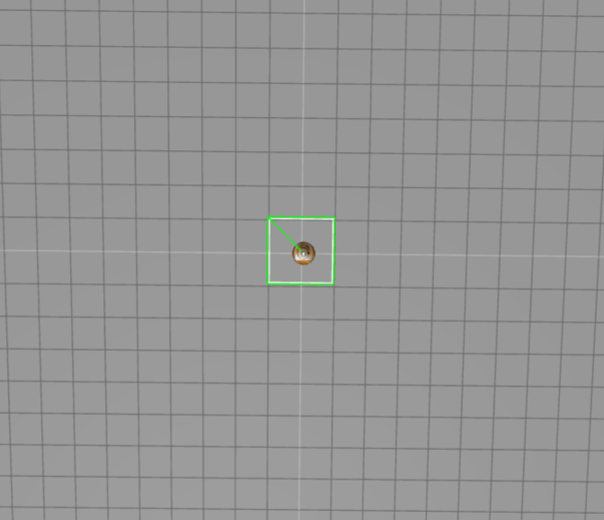
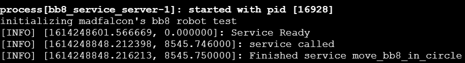
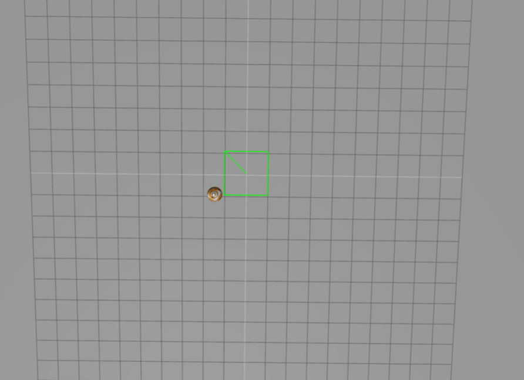

# ROS tutorial Services

## 0. 학습목표

1. 서비스란 무엇인가?
2. 로봇의 서비스를 어떻게 관리할 것인가?
3. 서비스를 어떻게 호출할 것인가?


## 1. 서비스란 무엇인가?

메세지 방식의 `Topic`은 비동기 방식이라 필요에 따라서 주어진 데이터를 전송하고 받기 좋은 방식이다. 또한 한번의 접속으로 지속적인 메세지를 송/수신하기 때문에 지속적으로 메세지를 발송해야하는 센서 데이터 에 적합하여 많이 사용한다. 하지만 경우에 따라서는 요청과 응답이 함께 사용되는 동기 방식의 메세지 굥환 방식도 필요하다. 

이에 따라, ROS에는 `Service`라는 이름으로 메세지 동기 방식을 제공하고 있다 서비스는 요청이 있을 경우에 응답을 하는 서비스 서버와 요청을 하고 응답을 받는 서비스 클라이언트로 나누어져 있다. 서비스는 1회용 통신 메세지이며 서비스 요청과 응답이 완료되면 연결된 두 노드의 접속은 끊기게 된다.

반대로 `Action`이라는 통신방식도 존재하는데 이는 서비스와 달리 비동기방식으로 통신이 진행되면서 다른작업도 수행가능하다

결론: 서비스는 통신방식중 하나로 `동기방식`이며 서비스를 호출할 경우 요청과 응답이 끝날때 까지 해당로봇은 다른 업무를 수행할 수 없다는 단점이 있다.


## 2. 서비스를 어떻게 관리할 것인가?

우선적으로 다음의 명령어를 통해 실행중인 서비스를 관리할 수 있다.

- rosservice

```bash
#rosservice list는 현재 실행중인 서비스 리스트를 보여줌
user:~$ rosservice list
/camera/rgb/image_raw/compressed/set_parameters
/camera/rgb/image_raw/compressedDepth/set_parameters
/camera/rgb/image_raw/theora/set_parameters
/camera/set_camera_info
/camera/set_parameters
/execute_trajectory
/gazebo/apply_body_wrench
/gazebo/apply_joint_effort

#rosservice info <서비스>는 해당 서비스에 대한 정보를 보여줌
user:~$ rosservice info /execute_trajectory
Node: /iri_wam_reproduce_trajectory
URI: 로스프로젝트://가나다라마바사:60029
Type: iri_wam_reproduce_trajectory/ExecTraj
Args: file
```

service info 에서 출력되는 내용을 보자, 각 항목에 대한 설명은 아래와 같다.

1. Node: It states the node that provides (has created) that service.
2. Type: It refers to the kind of message used by this service. It has the same structure as topics do. It's always made of package_where_the_service_message_is_defined / Name_of_the_File_where_Service_message_is_defined. In this case, the package is iri_wam_reproduce_trajectory, and the file where the Service Message is defined is called ExecTraj.
3. Args: Here you can find the arguments that this service takes when called. In this case, it only takes a trajectory file path stored in the variable called file.


- rossrv

```bash
#rossrv는 서비스에서 주고받는 메시지 내용을 확인할 수 있다.
user:~/catkin_ws/devel$ rossrv show trajectory_by_name_srv/TrajByName

string traj_name
---
bool success
string status_message

```

서비스의 메시지 구조는 다음과 같다. 구조에 대한 설명은 3번째 항목에서 설명할 예정이다.

```
REQUEST

-----------

RESPONSE
```

```python
#! /usr/bin/env python

import rospy
# Import the service message used by the service /trajectory_by_name
from trajectory_by_name_srv.srv import TrajByName, TrajByNameRequest
import sys

# Initialise a ROS node with the name service_client
rospy.init_node('service_client')

# Wait for the service client /trajectory_by_name to be running
rospy.wait_for_service('/trajectory_by_name')

# Create the connection to the service
traj_by_name_service = rospy.ServiceProxy('/trajectory_by_name', TrajByName)

# Create an object of type TrajByNameRequest
traj_by_name_object = TrajByNameRequest()

# Fill the variable traj_name of this object with the desired value
traj_by_name_object.traj_name = "release_food"

# Send through the connection the name of the trajectory to be executed by the robot
result = traj_by_name_service(traj_by_name_object)

# Print the result given by the service called
print(result)
```

```bash
# 서비스를 통해 요청에 대한 응답결과
user:~/catkin_ws/src/madfalcon2/scripts$ rosrun madfalcon2 simple_service_client.py
success: True
status_message: "Successfully executed trajectory"
```


## 3. 서비스를 어떻게 호출할 것인가?

서비스는 크게 서버(`Server`)와 클라이언트(`Client`)로 나뉜다.

서버는 서비스의 기능을 제공하는 역할을 수행하고 클라이언트는 서비스 서버로 부터 제공되는 기능을 호출하는 역할을 수행한다. 또한 이 둘 사이는 HttpRequest 방식을 사용하며 요청(`Request`)과 응답( `Response`)으로 나뉜다.

요청은 서비스를 요청하기 위한 메시지의 일종이다. 클라이언트가 서비스 서버에게 메시지를 요청하게 된다.

응답은 클라이언트에서 요청한 메시지를 서비스 서버에서 받고 결과를 반환해주는 것의 일종이다. 클라이언트가 응답을 받게되면 서비스는 완료된다.

 

### 0. TEST를 위한 셋팅

서비스 실습을 위해 다음과 같이 catkin 패키지를 생성하였으며 최종 구조는 아래와 같다.

```bash
user:~/catkin_ws/src/lab_6$ tree
.
|-- CMakeLists.txt
|-- launch
|   |-- call_bb8_move_in_circle_service_server.launch
|   `-- start_bb8_move_in_circle_service_server.launch
|-- package.xml
`-- scripts
    |-- bb8_move_in_circle_service_client.py
    `-- bb8_move_in_circle_service_server.py

2 directories, 6 files
```


### 1. Server 셋팅

서비스를 구현하기 위해선 서버의 활성화가 먼저 수행되어야 한다. python 코드를 이용하여 셋팅할 수 있다. 아래 예시는 thecunstructsim에서  제공되는 bb8이라는 로봇을 움직이기 위한 코드이다.

- bb8_move_in_circle_service_server.py

```python
#! /usr/bin/env python

import rospy
from geometry_msgs.msg import Twist
# bb8 로봇을 움직이기 위한 모듈
from std_srvs.srv import Empty, EmptyResponse 
# 서비스를 이용해 메시지를 주고받기 위한 클래스 모듈, Server에서는 EmptyResponse를 사용

"""
std_srvs.srv 의 Empty 메시지 구조는 다음과 같다.

user:~/catkin_ws/devel$ rossrv info std_srvs/Empty

---

요청과 응답이 텅비었음
"""


print(f"initializing madfalcon's bb8 robot test")

def my_callback(request):
    rospy.loginfo("service called")
    move_circle.linear.x = 0.2
    move_circle.angular.z = 0.2
    my_pub.publish(move_circle)
    rospy.loginfo("Finished service move_bb8_in_circle")
    return EmptyResponse() # the service Response class, in this case EmptyResponse
    #return MyServiceResponse(len(request.words.split())) 

#node init, 서버든 클라이언트든 항상 node는 하나씩 가지고 있어야 함
rospy.init_node('madfalcon_bb8_service_server') 

# 서비스 생성, empty 클래스 형식의 메시지 요청이 올경우 my_callback이라는 함수를 통해서 수행
my_service = rospy.Service('/madfalcon_bb8_service', Empty , my_callback) 

# 로봇을 움직이게 하기 위한 publisher 생성
my_pub = rospy.Publisher('/cmd_vel', Twist, queue_size = 1)
move_circle = Twist()

# 로그 발생
rospy.loginfo("Service Ready")

# 서비스 오픈 후 종료되지 않게 하기 위한 루프 설정
rospy.spin() # maintain the service open.
```

해당 파이썬 코드를 실행시키기 위한 런치파일

- start_bb8_move_in_circle_service_server.launch

```xml
<launch>
  <node pkg ="lab_6"
        type="bb8_move_in_circle_service_server.py"
        name="bb8_service_server"
        output="screen">
  </node>

</launch>
```


### 2. Client 셋팅

- bb8_move_in_circle_service_client.py

```python
#! /usr/bin/env python
import rospkg
import rospy
from std_srvs.srv import Empty, EmptyRequest 
# 서비스를 이용해 메시지를 주고받기 위한 클래스 모듈, Client에서는 EmptyResponse를 사용

#node init, 서버든 클라이언트든 항상 node는 하나씩 가지고 있어야 함
rospy.init_node('service_move_bb8_in_circle_client') 

# 서비스를 기다림, '/madfalcon_bb8_service'라는 이름의 서비스가 활성화 되어있어야 함
rospy.wait_for_service('/madfalcon_bb8_service') 

# '/madfalcon_bb8_service'라는 이름의 서비스에 대한 커넥션 생성
move_bb8_in_circle_service_client = rospy.ServiceProxy('/madfalcon_bb8_service', Empty) 

# 서버에 요청을 하기위한 EmptyRequest 객체 생성
move_bb8_in_circle_request_object = EmptyRequest() 

# 생성한 커넥션을 이용하여 EmptyRequest 요청을 보냄
result = move_bb8_in_circle_service_client(move_bb8_in_circle_request_object) 
# Print the result given by the service called
print(result) 
```

- call_bb8_move_in_circle_service_server.launch

```xml
<launch>
    <node pkg="lab_6" 
        type="bb8_move_in_circle_service_client.py" 
        name="service_move_bb8_in_circle_client"  
        output="screen">
    </node>
</launch>
```


### 4. 실행 결과

기본적인 bb8 로봇의 셋팅된 위치는 가장 가운데 자리



우선적으로 서버를 먼저 활성화 해야하며 launch 명령어를 이용하여 해당 패키지의 서버 런치파일을 실행한다.

- roslaunch lab_6 start_bb8_move_in_circle_service_server

```bash
user:~/catkin_ws/src/lab_6$ roslaunch lab_6 start_bb8_move_in_circle_service_server.launch
... logging to /home/user/.ros/log/059b0182-7740-11eb-b8c8-0242c0a8b008/roslaunch-8_xterm-16920.log
Checking log directory for disk usage. This may take a while.
Press Ctrl-C to interrupt
Done checking log file disk usage. Usage is <1GB.

started roslaunch server http://abcadsfasf

SUMMARY
========

PARAMETERS
 * /rosdistro: noetic
 * /rosversion: 1.15.9

NODES
  /
    bb8_service_server (lab_6/bb8_move_in_circle_service_server.py)

ROS_MASTER_URI=http://abcadsfasf

process[bb8_service_server-1]: started with pid [16928]
initializing madfalcon's bb8 robot test
[INFO] [1614248601.566669, 0.000000]: Service Ready
```

요청을 보내기 위한 클라이언트를 다른 쉘에서 활성화 시켜준다(서버는 활성화 상태에서 진행되어야 함).

- roslaunch lab_6 call_bb8_move_in_circle_service_server.launch

```bash
user:~/catkin_ws/src/lab_6$ roslaunch lab_6 call_bb8_move_in_circle_service_server.launch
... logging to /home/user/.ros/log/059b0182-7740-11eb-b8c8-0242c0a8b008/roslaunch-8_xterm-17416.log
Checking log directory for disk usage. This may take a while.
Press Ctrl-C to interrupt
Done checking log file disk usage. Usage is <1GB.

started roslaunch server http://abcadsfasf

SUMMARY
========

PARAMETERS
 * /rosdistro: noetic
 * /rosversion: 1.15.9

NODES
  /
    service_move_bb8_in_circle_client (lab_6/bb8_move_in_circle_service_client.py)

ROS_MASTER_URI=http://abcadsfasf

process[service_move_bb8_in_circle_client-1]: started with pid [17424]

[service_move_bb8_in_circle_client-1] process has finished cleanly
log file: /home/user/.ros/log/059b0182-7740-11eb-b8c8-0242c0a8b008/service_move_bb8_in_circle_client-1*.log
all processes on machine have died, roslaunch will exit
shutting down processing monitor...
... shutting down processing monitor complete
done
```

서버측의 로그에서 다음과 같이 메시지가 발생한다.



bb8 로봇이 x 축으로 0.2, z축으로 0.2 움직이는 것을 확인할 수 있다.

