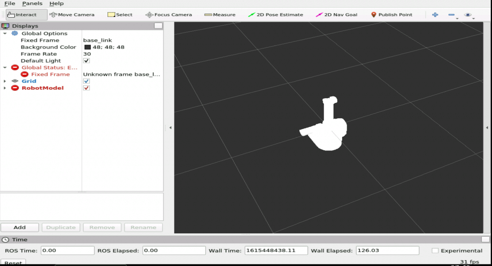
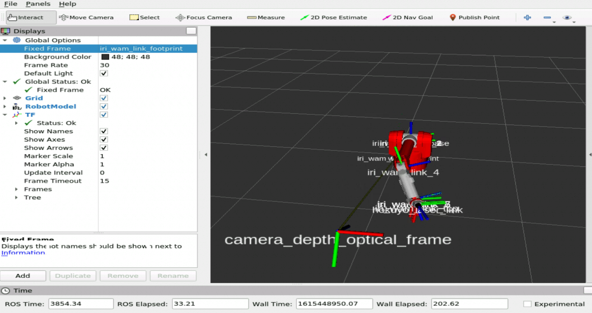

# ROS Tutorial DEBUG

## 0. 목차

1. ROS에서 디버그를 어떻게 도와줄건지?
2. 디버깅 ROS log 추가
3. 필터 ROS log
4. Rosbags를 이용하여 센서데이터를 기록하고 리플레이
5. Plot Topic data
6. rqt-graph를 이용하여 시스템의 서로다른 노드간 커넥션 그려보기
7. RVIz 활용

## rqt-console

## rqt-graph

## rosbags

우리는 rosbag을 이용하여 로봇의 움직임을 시뮬레이션하고 기록할 수 있다. 일명 리플레이

###  기록하기

## RViz

ROS 디버깅 툴중 가장 중요한 툴이다...이미지, 포이트클라우드, 레이저, 키네틱 트랜스 포메이션 등등의 무수한 부분들을 시각화 해주는 툴이다. 사용자가 원하는 마커를 정의할 수 있다. 

중요한 것은 RVIZ는 시뮬레이션이 아니다. RVIZ는 시뮬레이션 또는 실제 로봇에 의해 topic을 통해 퍼블리싱되는 내용을 표현해주는 툴이다.

아래 몇가지 요소만 고려하면 충분히 RVIZ를 활용할 수 있다.

- Central Panel
  - 모든 데이터가 표시되는 부분인 3D공간
- Left Displays Panel
  - central panel에서 시각화하려는 모든 요소를 관리하고 구성하는 공간
- Global Options
  - 데이터 시각화에 적합한 고정 프레임을 선택해야하고 모든 데이터가 참조되는 참조 프레임
- Add button
  - RVIZ에서 표현할 수 있는 모든 유형의 유소를 얻을 수 있는 부분

RVIZ를 이용하여 실시간으로 움직이는 로봇을 확인할 수 있다. 

## 참고

roswtf: http://wiki.ros.org/roswtf

Ros Logging System: http://wiki.ros.org/rospy/Overview/Logging

rqt_console: http://wiki.ros.org/rqt_console

rqt_plot: http://wiki.ros.org/rqt_plot

rqt_graph: http://wiki.ros.org/rqt_graph

Rosbag: http://wiki.ros.org/rosbag

Rviz: http://wiki.ros.org/rviz