# ROS Mapping

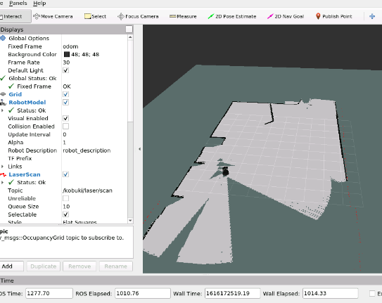

## 0. 여기서 배우는 것들

- What means Mapping in ROS Navigation
- How does ROS Mapping work
- How to configure ROS to make mapping work with almost any robot
- Different ways to build a Map


## 1. SLAM

Simultaneous Localization and Mapping의 약자로 실제 알려지지 않은 환경의 지도를 구축하는 동시에 구축중인지도에서 로봇의 위치를 추적하는 로봇 문제를 정의한다. 이는 기본적으로 매핑이 해결하는 문제이다. localization 또한 관련되어있으며 우선 맵을 생성하려면 SLAM을 수행해야 한다.


## 2. The Gmapping package

gmapping ROS 패키지에 SLAM 알고리즘이 구현되어 있다. 즉 따로 코딩을 하지 않아도 ROS navigation 스택을 사용할 경우 특정 로봇에 대해 gmapping을 구성하는 방법만 알고있으면 된다.

gmapping 패키지에는 `slam_gmapping`이라는 ROS 노드가 포함되어 있어 모바일 로봇이 환경을 이동하는 동안 제공하는 레이저 및 포즈 데이터를 사용하여 2D 맵을 만들 수 있다. 이 노드는 기본적으로 레이저와 로봇으로 부터 변환되는 데이터를 읽어오며 점유 그리드맵(OGM, 점유 격자 지도)으로 변환한다.

해당 실습을 통해 정리하자면 동작과정은 다음과 같다.

```
1. gmapping_demo.launch을 사용하여 Kobuki 로봇으로 gmapping 패키지를 시작
2. 해당 시작 파일은 slam_gmapping 노드 (gmapping 패키지에서)를 시작하고 로봇을 방 주위로 움직임
3. slam_gmapping 노드는 필요한 데이터를 얻기 위해 Laser (/ kobuki / laser / scan) 및 Transform Topics (/ tf)를 subscribe하고 맵을 구축
4. 생성 된 맵은 전체 프로세스 동안 / map topic에 publish되며, Rviz를 통해 맵을 빌드하는 과정을 볼 수 있음
```

OGM은 자료가 격자의 형태로 전달되어지는 지도를 말한다. 각 공간을 cell로 표시하며 0~100 사이의 정수형 값으로 점유 정도를 표현하는데 아래와 같다.

- cell을 완전히 점유한 경우: 100
- cell이 자유인 경우 : 0
- cell의 상태를 알 수 없는 경우: -1

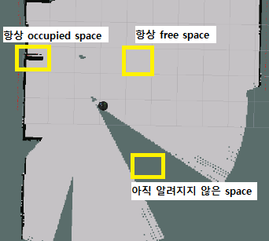


## 3. Saving the map

탐색을 통해 생성된 맵을 추출할 수 있으며 pgm와 yaml파일로 맵이 저장된다(map_server 패키지의 map_saver 사용).

```
rosrun map_server map_saver -f [저장할파일명]
```

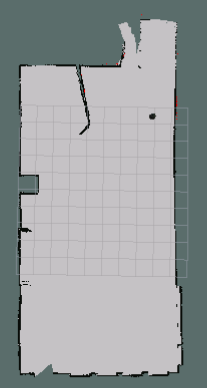

yaml 파일에는 다음의 내용을 가지고 있다.

```yaml
image: my_map.pgm
resolution: 0.050000
origin: [-12.200000, -15.400000, 0.000000]
negate: 0
occupied_thresh: 0.65
free_thresh: 0.196
```

- image : 생성된 맵 파일의 이름
- resolution : map의 해상도, meters/pixel
- origin : 지도에서 왼쪽 하단 픽셀의 좌표로 2D (x, y)로 제공되며. 세 번째 값은 회전을 나타냄(회전이 없으면 값은 0).
- occupied_thresh :이 값보다 큰 값을 가진 픽셀은 완전히 점유 된 영역으로 간주된다.
- free_thresh :이 값보다 작은 값을 가진 픽셀은 완전 자유 구역으로 간주된다.
- negate  : 맵의 색상을 반전합니다. 기본적으로 흰색은 완전히 비어 있음을 의미하고 검은 색은 완전히 사용됨을 의미합니다.

PGM 파일은 그레이스케일의 이미지를 나타내는 파일이다. 해당 파일을 열기위한 툴이 필요하며 열게되면 다음과 같은 이미지를 볼 수 있다.

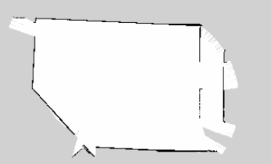

이미지는 해당 픽셀의 색상으로 각 cell의 점유 상태를 말해준다. 흰색은 free, 검은색은 occupied, 그 사이 픽셀(회색)은 알수 없다. 대부분의 지도는 회색이지만 컬러로 저장될수 있고 yaml 파일의 임계 값은 세 가지 범주(점유,자유,알수없음)를 나누는데 사용된다. 또한 pgm 파일을 png 파일로 변환해주는 [사이트](https://convertio.co/es/pgm-png/)가 있으며 이를 통해 변환이 가능하다.

## 4. Providing the map

맵을 저장하는 것 뿐만아니라, 다른 노드간 맵을 공유할 수 있다. 많은 노드가 로봇이 움직이는 현재 맵을 map_server에 요청한다면 맵에서 데이터를 가져 와서 경로 계획을 수행하는 데 사용하기 위해 move_base 노드에 의해 수행되거나, 맵에서 로봇이있는 위치를 파악하기 위해 localization 노드에 의해 수행된다.

map을 얻기위해 사용되는 service는 다음과 같다(map_server가 실행되어 있어야 함).

- static_map(nav_msgs/GetMap) :  지도에 occupancy 된 데이터를 제공하는 service

  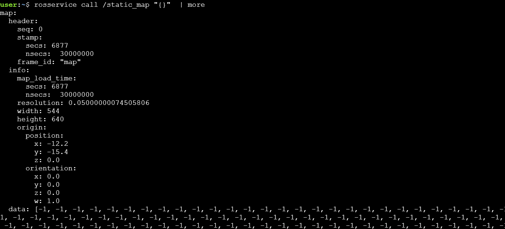

또한 service 요청외에도 지도와 함께 ros 메시지를 받기 위해 연결할 수 있는 두가지 latched 된 Topic 이 있다(map_server가 실행되어 있어야 함).

- map_metadata (nav_msgs/MapMetaData): 지도의 메타데이터를 제공하는 Topic

  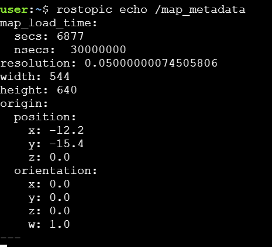

- map (nav_msgs/OccupancyGrid): 지도의 occupancy 된 데이터를 제공하는 Topic

  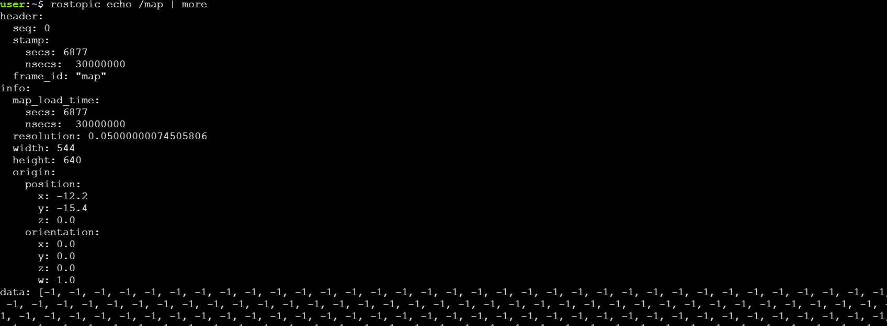

Topic이 latched 될때 해당 Topic에 publish된 마지막 메시지가 저장됨을 의미한다. 즉, 아무도 이 topic에 더 이상 publish하지 않더라도 앞으로 이 topic을 청취하는 모든 노드는이 마지막 메시지를 받게된다. 토픽이 래치되도록 지정하려면 토픽을 작성할 때 래치 속성을 true로 설정하기 만하면 된다.


## 5. Hardware Requirements

적절한 지도를 만들기 위한 하드웨어적인 두가지 요소가 중요하다.

- 좋은 레이저 데이터를 제공하기
- 좋은 Odometry 데이터를 제공하기

`slam_gmapping` 노드는 들어오는 레이저 판독값을 odom 프레임으로 변환을 시도한다.

- 레이저 데이터

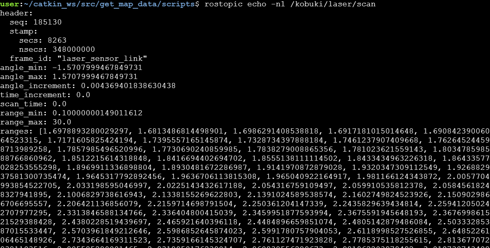

- odometry 데이터

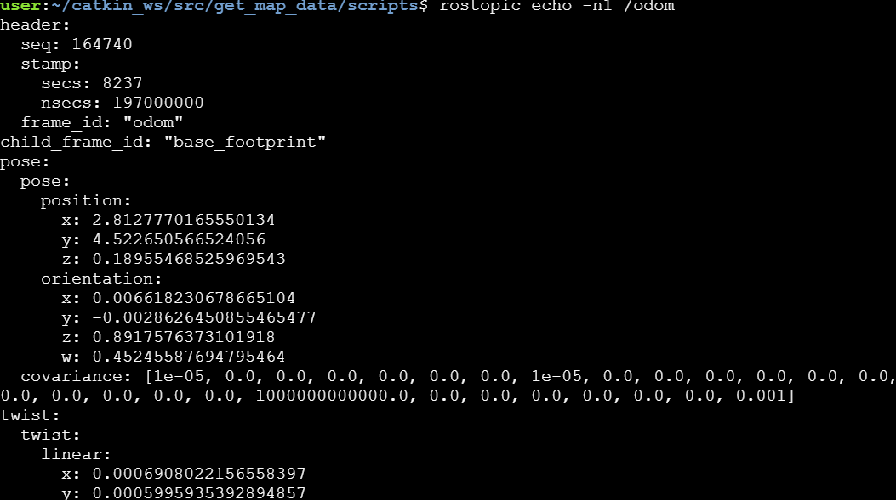


## 6. Transforms

이전 연습에서 로봇 변환을 올바르게 구성 했으므로 레이저 판독 값이 Odom 프레임으로 올바르게 변환 될 것이라고 믿을 수 있습니다. 하지만 항상 이럴까요? 아니요, 그럴 필요는 없습니다.

레이저 판독 값을 사용할 수 있으려면 레이저와 로봇베이스 사이에 변환을 설정하고 변환 트리에 추가해야합니다. 변환? 트리를 변형 하시겠습니까? 무슨 소리 야?

좋아,이 모든 것을 명확히하자. 그래서 우리는 레이저가 장착 된 Kobuki 로봇을 가지고 있습니다. 그러나 **레이저 데이터를 사용하려면이 레이저가 로봇에 장착 된 위치 (위치 및 방향)를 로봇에 알려야합니다. 이를 프레임 간 변환이라고합니다.**

변환은 프레임에 표현 된 데이터를 다른 프레임으로 변환하는 방법을 지정합니다. 예를 들어 앞쪽 3cm에서 레이저로 장애물을 감지하면 레이저에서 3cm 떨어져 있지만 로봇의 중심 (일반적으로 `/ base_link`라고 함)에서가 아니라는 것을 의미합니다. 로봇 중심으로부터의 거리를 알기 위해서는 **laser_frame에서 base_link 프레임으로 3cm를 변환해야합니다** (실제로는 경로 계획 시스템이 알아야하는 것입니다. 로봇 중심에서 로봇까지의 거리는 얼마입니까?). 장애물).

그렇게 생각하지 않습니까? 이 정보를 로봇에 제공하지 않으면 레이저가 물체를 감지 할 때 로봇이이 물체가 어디에 있는지 어떻게 알 수 있습니까? 로봇 앞에 있습니까? 뒤에 있습니까? 오른쪽입니까? 로봇에게 로봇 중심에 대한 레이저의 **위치와 방향**을 알려주지 않으면 로봇이 알 수있는 방법이 없습니다. 이렇게하려면 다음을 수행해야합니다.

먼저 두 개의 프레임 (좌표 프레임)을 정의합니다. 하나는 레이저 중앙에 있고 다른 하나는 로봇 중앙에 있습니다. 내비게이션의 경우 로봇의 중심이 로봇의 **회전 중심에 위치하는 것이 중요합니다**. 레이저 프레임의 이름을 base_laser로, 로봇 프레임의 이름을 base_link로 지정합니다.

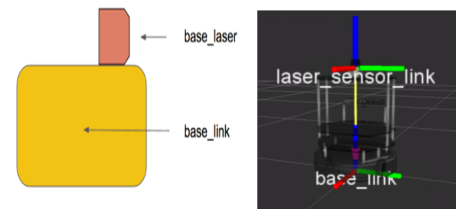

이제 base_laser와 base_link 사이의 관계 (위치 및 방향 측면에서)를 정의해야합니다. 예를 들어 base_laser 프레임이 base_link 프레임을 참조하는 y 축에서 20cm, x 축에서 10cm 거리에 있다는 것을 알고 있습니다. 그런 다음 로봇에이 관계를 제공해야합니다. **레이저 위치와 로봇 바닥 사이의 관계는 ROS에서 레이저와 로봇 사이의 TRANSFORM으로 알려져 있습니다**.

`slam_gmapping` 노드가 제대로 작동하기 위해서는 2 개의 transforms를 제공해야 한다.

- **the frame attached to laser -> base_link**: 일반적으로 고정된 값, robot_state_publisher 또는 tf 패키지의 static_transform_publisher에 의해 주기적으로 브로드캐스트 된다.
- **base_link -> odom**: 일반적으로 Odometry system에 의해 제공됨

로봇은 이 정보에 언제든지 액세스 할 수 있어야하므로이 정보를 **transform tree**에 게시한다. 변환 트리는 로봇의 서로 다른 프레임 (요소) 간의 모든 변환에 대한 정보를 찾을 수있는 데이터베이스와 같다.

아래 명령어를 입력하여 실행중인 시스템의 transform tree를 시각화 할 수 있다.

```
rosrun tf2_tools view_frames.py
```

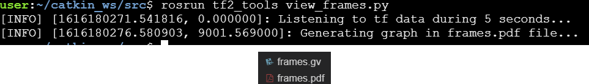

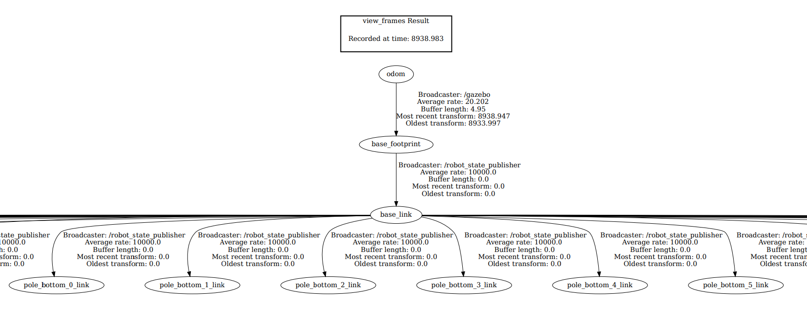

예시로, 로봇에 레이저를 장착했다고 가정해보자. 레이저와 로봇간의 transform이 설정되지 않았다. 여기서 기본적으로 transform 을 publish 하는 방법은 2가지가 있다.

- static_transform_publisher 사용하기
- transform broadcaster 사용하기

이 과정에서는 가장 빠른 방법이므로 static_transform_publisher를 사용합니다. static_transform_publisher는 단순히 명령 줄을 사용하여 변환을 직접 게시 할 수있는 즉시 사용 가능한 노드입니다. 다음은 명령 구조다.

```
static_transform_publisher 
x y z 
yaw pitch roll 
frame_id 
child_frame_id 
period_in_ms
```

- **x, y, z** are the offsets in meters
- **yaw, pitch, roll** are the rotation in radians
- **period_in_ms** specifies how often to send the transform

launch 파일을 사용해 명령구조를 바꿀 수도 있다

```xml
<launch>
    <node pkg="tf" type="static_transform_publisher" name="name_of_node" 
          args="x y z yaw pitch roll frame_id child_frame_id period_in_ms">
    </node>
</launch>
```

