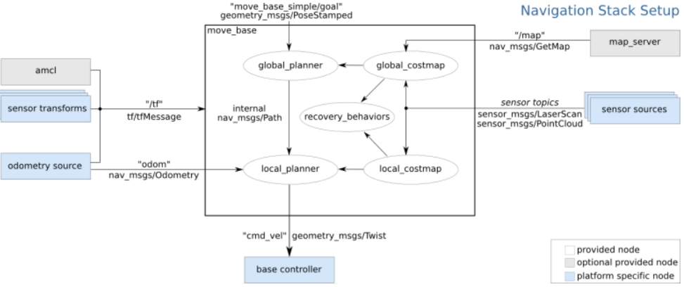

# ROS Navigation

네비게이션은 말그대로 탐색이다. 로봇을 통해 특정지역을 탐색함으로써 맵을 그리는과정이다. 로봇의 레이저와 같은 센서 판독값을 이용하여 맵을 그리게 되는데 이를 **Mapping**이라고도 한다. 해당과정은 theconstructsim에서 진행되며 Kobuki라는 로봇을 이용한다.

## 0. 여기서 배우는 것들

- What is the ROS Navigation Stack?
- What do I need to work with the Navigation Stack?
- What is the move_base node and why it is so important?
- Which parts take place in the move_base node?

## 1. Navigation Stack

네비게이션 스택은 로봇이 한 지점에서 다른 지점으로 자율적으로 이동하여 로봇이 발견할 수 있는 모든 장애물을 피하는데 사용되는 ROS 노드 및 알고리즘 세트이다. 모바일 로봇에서 자율 탐색을 수행하는데 도움이 될 수 있는 탐색관련 알고리즘이 구현되어 있다.

로봇의 현재위치와 목표위치 그리고 로봇의 odometry data(wheel encoder, IMU, GPS) 및 레이저 같은 센서의 데이터를 INPUT으로 받는다.  해당 값을 통해 로봇을 지정된 목표 위치로 이동시키기 위한 필요 속도 명령을 OUTPUT으로 이동 기지로 보내게 된다.

요약하자면, 네비게이션 스택의 목표는 로봇을 A 위치에서 목표인 B위치로 이동하는 중 장애물에 충돌하거나 프로세스에서 길을 잃지 않도록 하는 것이다.

### 0. 하드웨어적 요구사항

움직이는 ROS 로봇의 전체 시스템의 성능향상을 시키기 위한 하드웨어적인 고려사항이 있다.

1.  네비게이션 패키지는 differential drive 및 holonomic robots에서 더 잘 작동된다.
2. 모바일 로봇은 아래의 형식으로 속도 명령을 전송하여 제어해야 한다.
   - x,y(linear velocity, 선형 속도)
   - z(angular velocity,각 속도)
3. 주변환경 지도를 작성하고 localization을 수행하기 위해 로봇주변에 평면레이저를 장착해야 한다. 성능의 경우 정사각형 및 원형 모양의 모바일 기반에 더 좋다.
4. 자세한 내용은 [위키](http://wiki.ros.org/navigation/Tutorials/RobotSetup)에서 확인할 수 있다.

### 1. Navigation Stack 아키텍쳐

아래 그림은 네비게이션 스택에 대한 아키텍쳐이다.

아키텍쳐에 따르면 네비게이션 스택과 잘 작동하기 위해서는 추가적으로 몇가지 기능 블록을 INPUT으로 제공해야 한다.

- Odometry source: 로봇의 시작 위치에 대한 위치정보를 제공한다. 주요 odometry sources는 wheel encoders, IMU 그리고 2D/3D cameras (visual odometry)가 있다. odom 값은 메시지 유형이 nav_msgs/ Odometry인 네비게이션 스택에 publish 해야 한다. 또한 odom 메시지는 로봇의 위치와 속도를 포함할 수 있다.
- Sensor source: 맵에서 레이저를 통해 로봇의 위치를 파악하거나 로봇 경로에서 장애물을 감지(레이저, 초음파, 포인트 클라우드 등을 이용)하는데 사용된다. 
- sensor transforms/tf:  서로 다른 센서에서 가져온 데이터를 비교할 수 있으려면 서로 다른 로봇 센서에서 캡처 한 데이터를 공통 참조 프레임 (일반적으로 base_link)을 참조해야합니다. 로봇은 ROS 변환을 사용하여 메인 로봇 좌표 프레임과 다른 센서 프레임 간의 관계를 게시해야합니다.
  - 원문 : the data captured by the different robot sensors must be referenced to a common frame of reference (usually the base_link) in order to be able to compare data coming from different sensors. The robot should publish the relationship between the main robot coordinate frame and the different sensors' frames using ROS transforms.
- base_controller: 기본 컨트롤러의 주요 기능은 Twist (geometry_msgs / Twist) 메시지 인 Navigation 스택의 출력을 로봇의 해당 모터 속도로 변환하는 것입니다. 
  - 원문 : The main function of the base controller is to convert the output of the Navigation stack, which is a Twist (geometry_msgs/Twist) message, into corresponding motor velocities for the robot. 

### 2. 가장핵심인 move_base 노드

move_base 노드의 주요 기능은 다른 탐색 노드를 사용하여 로봇을 현재 위치에서 목표 위치로 이동하는 것이다. 이 노드는 경로 계획을위한 글로벌 플래너와 로컬 플래너를 연결하고, 로봇이 어떤 장애물에 갇혀있는 경우 회전 복구 패키지에 연결하고, 환경의 장애물 맵을 얻기 위해 글로벌 비용 맵과 로컬 비용 맵을 연결한다.

아래는 move_base 노드에 의해 링크 된 모든 패키지 목록이다.

- global-planner
- local-planner
- rotate-recovery
- clear-costmap-recovery
- costmap-2D

아래는 move_base 노드에 인터페이스 되는 다른 패키지들이다.

- map-server
- AMCL
- gmapping

### 3. 결론

내비게이션 스택은 로봇을 위치 A에서 위치 B로 이동하기 위해 함께 작동하는 알고리즘 인 ROS 노드의 집합으로, 길에서 찾을 수있는 장애물을 피한다. 

이를 위해 탐색 스택에는 여러 종류의 데이터 입력이 필요한데, 로봇을 원하는 위치로 안전하게 이동시키기 위해 필요한 명령 속도를 출력으로 제공한다.

> 출처 : [theconstructsim](https://app.theconstructsim.com/)

## 2. Mapping

## 3. Localization

## 4. Path Planning

로봇을 통해 지도를 만들기 위해선 경로를 지정을 해줘야 한다. 이를 Path Planning 이라고 한다. 경로계획은 기본적으로 로봇의 현재위치와 가고자하는 목적지를 입력으로 취하고 그 지점에 도달하기 위해 가장 빠른 경로를 출력으로 제공한다.

## 4. obstacle avoidance

장애물 회피