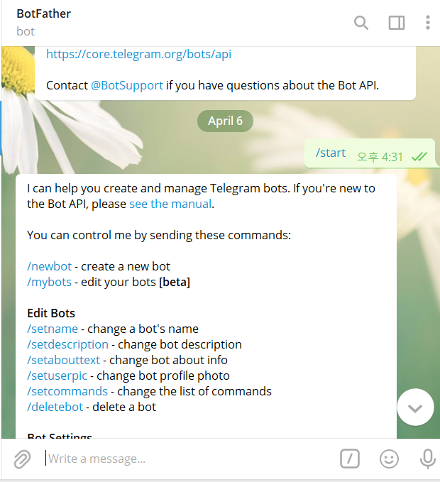
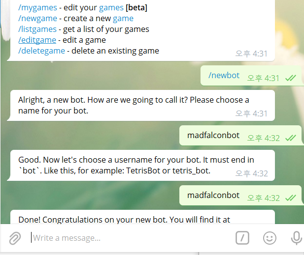
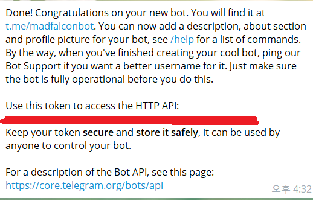
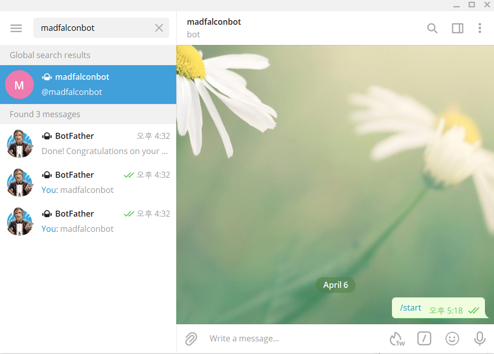

# How to make telegram bot?

텔레그램 봇을 어떻게 만들까?

방법은 간단하다.

텔레그램 채널에서

`@fatherbot`을 검색해서 대화를 시작해보자

`/newbot`을 입력하여 나만의 봇을 만들고 name과 username을 각각 입력 해준다.

이걸 마치면 HTTP API를 사용하기 위한 Token을 주어준다.

빨간색 라인이 그어져있는 부분이 토큰정보인데 이걸 활용해서 다른 서비스들과 연동할 수 있다.

채널검색에서 내가만든 봇을 검색하면 다음과 같이 찾을 수 있다.

