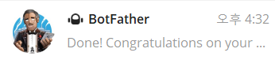

# How to make telegram bot?

## 1. Telegram 이란?

여러 플랫폼을 지원하면서 다양한 기기를 지원하는, 영리를 추구하지 않는 자유 클라우드 기반 인터넷 메신저이자 음성 인터넷 프로톨이다.

> [위키백과](https://ko.wikipedia.org/wiki/%ED%85%94%EB%A0%88%EA%B7%B8%EB%9E%A8)

## 2. Telegram Bot 이란?

사용자의 메시지 요청에 대해 응답을 해주는 Bot 서버이다. 이러한 특성을 활용하여 사용자로부터 날씨정보를 요청받을 경우 날씨에 대한 정보를 크롤링하여 응답으로 줄 수 있다.

## 3. Bot을 어떻게 만들까?

방법은 간단하다. 텔레그램 채널에서 `@botfather`을 검색해서 대화를 시작해보자

`/newbot`을 입력하여 나만의 봇을 만들고 name과 username을 각각 입력 해준다.

이걸 마치면 HTTP API를 사용하기 위한 Token을 주어준다.

빨간색 라인이 그어져있는 부분이 토큰정보인데 이걸 활용해서 다른 서비스들과 연동할 수 있다.

채널검색에서 내가만든 봇을 검색하면 다음과 같이 찾을 수 있다.

