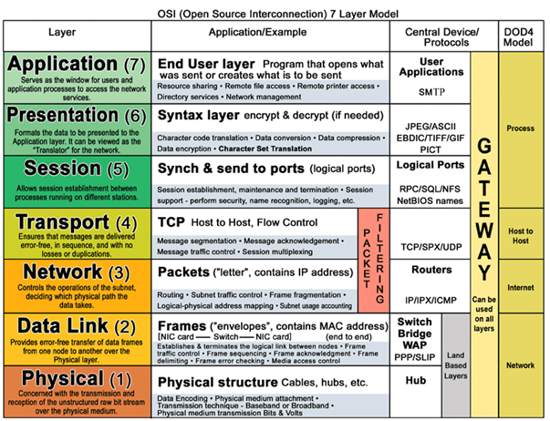

# OSI 7 Layer

> 국제표준화기구(ISO)에서 개발한 모델로, 컴퓨터 네트워크 프로토콜 디자인과 통신을 계층으로 나누어 설명한 것이다. 일반적으로 OSI 7 계층 모형이라고 한다.

https://www.javatpoint.com/osi-model

## Layer 종류

## Layer 별 프로토콜

1. Physical
   - Hubs, Repeaters, Cables, Optical Fiber, SONET/SDN,Coaxial Cable, Twisted Pair Cable and Connectors
2. Data Link
   - 802.11 (WLAN), Wi-Fi, WiMAX, ATM, Ethernet, Token Ring, Frame Relay, PPTP, L2TP and ISDN 

3. Network
   - IPv4, IPV6, IPX, OSPF, ICMP, IGMP and ARP

4. Transport
   - TCP, SPX and UDP more)

5. Session layer
   - Logical Ports 21, 22, 23, 80 etc…

6. Presentation layer
- SSL, WEP, WPA, Kerberos,
7. Application Layer
   - DHCP, DNS, FTP, HTTP, IMAP4, NNTP, POP3, SMTP, SNMP, SSH, TELNET and NTP

파이썬 소켓 프로그래밍을 통해 TCP/IP를 구축할 수 있음 