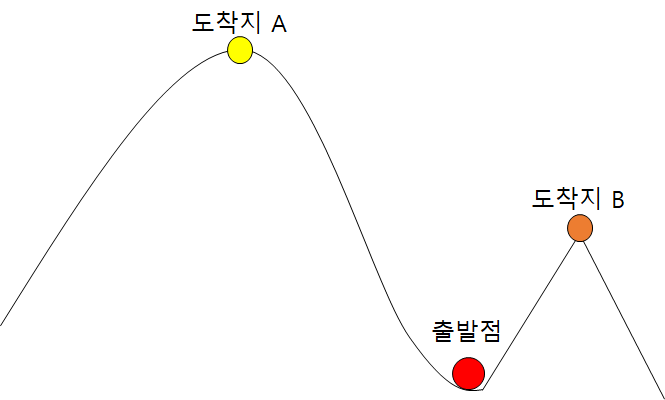

# Greedy algorithm

미래를 내다보지 않고 당장 눈 앞에 보이는 젤 좋은 것을 선택하는 방식으로 **구현하기 쉽고 빠르다**는 장점이 있다.

하지만 **최적의 답을 보장하지 않는다**는 단점이 있다.

그림을 보았을 때 실제적으로 도착지 A가 도착지 B보다 높지만 경사가 A에 비해 B가 더 심하다 보니 B를 선택하여 최고의 도착지를 가지 못하는 단점을 예로 들 수 있다.

## Greedy algorithm은 언제쓸까?

문제를 해결하기 위한 알고리즘이 너무 느려서 사용할 수 없는 수준일 때, 그리고 완벽한 답을 바라지 않고 적당한 답만 있어도 될 경우에 사용한다. 물론 그리디 알고리즘을 써서 최적의 답을 보장해주는 문제도 있다.