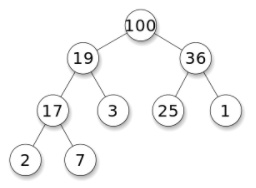
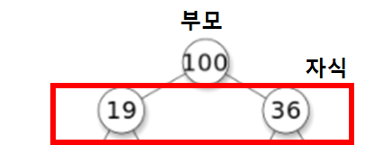
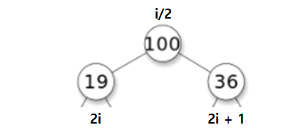

# Heap

## 정의

- 최댓값 및 최솟값을 찾아내는 연산을 빠르게 하기 위해 고안된 자료구조이다. 

- 완전이진트리(complete binary tree)를 기본으로 한 자료구조(tree-based structure)로서 다음의 속성을 만족한다.
  - 각 노드의 값은 자기 자식의 노드 보다 항상 크거나**(최대 힙, key(T.parent(v)) > key(v))** 작다**(최소 힙, key(T.parent(v)) < key(v))**.
  - 완전이진트리는 부모의 노드가 자식의 노드값이 따로 정렬되어 있지 않다는 차이점이 있다.

  

- 키 값의 대소관계는 부모-자식 노드 사이에서만 성립하며 형제 노드 사이에는 영향을 미치지 않는다.

- 자식 노드의 최대 개수는 힙의 종류에 따라 다르지만 이진 트리에서는 최대 2개이다.

- i번째 노드의 자식노드가 2개인데 왼쪽 자식노드는 2i, 오른쪽 자식노드는 2i+1이고, 부모노드는 i/2가 된다.

  

  

## 시간복잡도

힙의 시간복잡성은 이다.

이진트리의 속성에서,이므로 힙트리의 높이가 이 됨을 알 수 있다.

## 삽입과 삭제

힙에서는 삽입과 삭제를 통해 노드를 추가하고 삭제할 수 있다.

- 삽입
  1. 삽입하고자 하는 값을 트리의 가장 마지막 원소에 추가한다.
  2. 부모노드와 대소관계를 비교하면서 만족할 때까지 스왑을 반복한다.
- 삭제
  1. 제일 최상위 루트 노드를 삭제한다.
  2. 가장 마지막에 있는 노드를 루트로 이동시킨다.
  3. 자식 노드와 비교하여 만족할 때까지 스왑을 반복한다.

## 참고

- [위키](https://ko.wikipedia.org/wiki/%ED%9E%99_(%EC%9E%90%EB%A3%8C_%EA%B5%AC%EC%A1%B0))
- [참고2](https://hocheon.tistory.com/70)