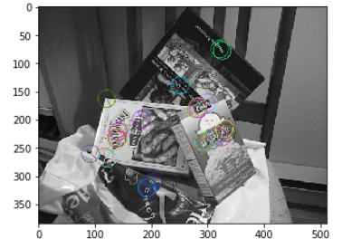
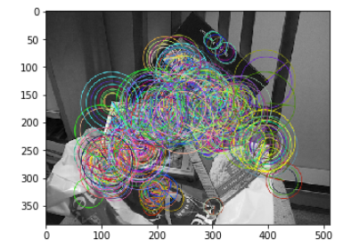
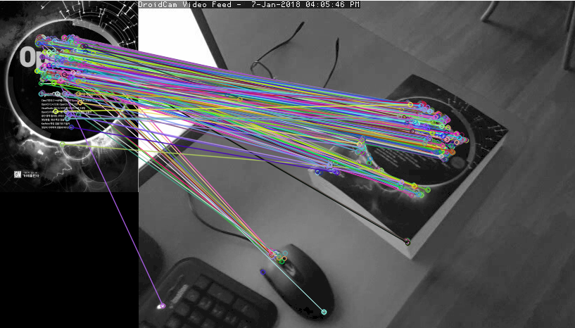
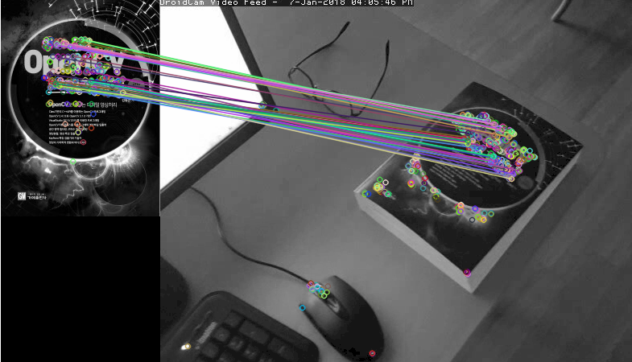

# 코너

해리스 엣지 컴출

코너를 찾는 알고리즘

그레이 영상을 넣고 자동으로 찾아줌

- cv2.cornerHarris(src, blockSize, ksize, k[, dst[, borderType]]) → dst
  - src – Input single-channel 8-bit or floating-point image.
  - dst – Image to store the Harris detector responses. It has the type CV_32FC1 and the same size as src .
  - blockSize – Neighborhood size (see the details on cornerEigenValsAndVecs() ).
  - ksize – Aperture parameter for the Sobel() operator.
  - k – Harris detector free parameter. See the formula below.
  - borderType – Pixel extrapolation method. See borderInterpolate() .

원의면적은 점의 갯수

코너 찾는데 주변픽셀도 고려 

## ORB

> 주변과 방향성을 원으로 표시한 것,
>
> 용도는 파노라마 용에 많이 쓰임
>
> 물체/로고/얼굴 인식할 때 쓰임,
>
> 증강현실

원의 크기가 크다는것은 그만큼 정보량이 있다는 것. 원이 작다는 것은 범위를 벗어나면 다른점으로 인식할 수 있다. 

### 해밍디스턴스

> 1. 고속으로 재는방법
> 2. 비트로 비교해서 같으면 0 다르면 1, 7과 4의 거리를 재면(서로뻄) 비트로 표시하면 100(2진수) 인데 0을 빼면 1이 남게된다 즉 거리는 1로 표기한다. 

