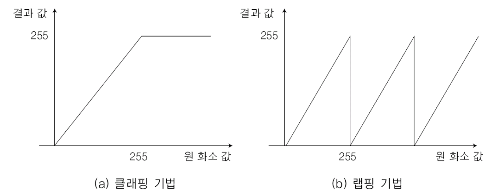
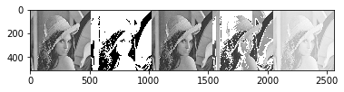
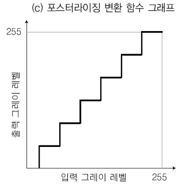
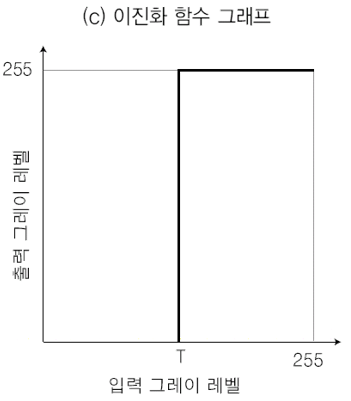
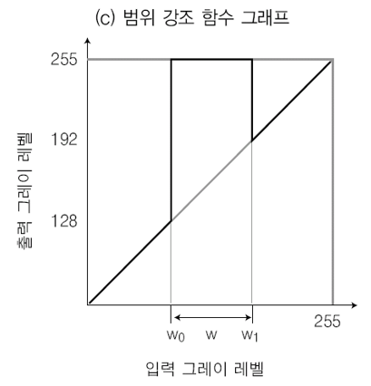
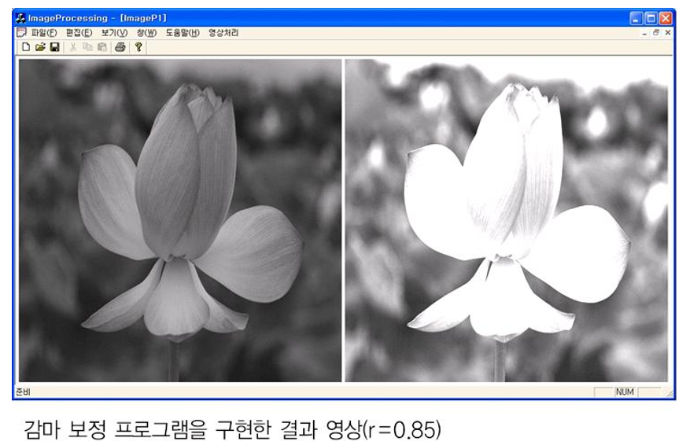

# Digital image processing

## 압축의 종류
### 손실압축

> 데이터를 압축하여 자료를 받는 곳에 압축으로 풀어서 원래의 것과 다르게 보여주는 것을 말하지만 어떠한 부분에서는 충분히 유용한 방식이다. 손실 압축은 특히 스트리밍 미디어와 인터넷 전화 등의 응용 프로그램 안에서 멀티미디어 데이터를 압축하는 데에 가장 많이 사용된다. (오디오, 비디오, 스틸 이미지) 한편, 무손실 압축은 텍스트로 된 파일, 그리고 은행 기록과 같은 데이터 파일에 선호된다.
>
> 이미지는 jpg
>
> 

### 비손실압축

> 데이터 압축의 일종으로 손실 압축의 반대말이다. 원래의 정보를 그대로 보존해야 하기 때문에, 정보 엔트로피의 한계가 그대로 반영된다. 여기에서 정보 엔트로피의 한계란 개별 정보의 확률값에 의하여 계산되는 값이 아닌, 전체 신호의 상관관계를 반영한 한계값이다. 이러한 성질을 이용한 대표적인 압축 방법으로 반복 길이 부호화가 있다.
>
> 일반적으로 파일 데이터 압축에 사용하는 gzip을 비롯한 알고리즘들이 이에 해당한다. 오디오나 이미지 압축에서 사용하는 무손실 압축 기술들은 각각의 신호 특성에 맞추어서 최적화가 된 것으로, 범용성을 가지는 데이터 압축 기술에 비하여 조금 더 압축률을 끌어 올릴 수 있다.
>
> 이미지는 png

## 처리방식

### 화소 점 처리(point processng)

> 점 단위로 화소 값을 변경해서 밝기 조절등을 수행,

#### 문제점

- 결과 값이 화소의 최대값과 최소값을 넘을 수 있음.

#### 해결방안

 1. 클래핑 기법
    - 연산의 결과 값이 최소값보다 작으면 그 결과 값을 최소값으로, 최대값보다 크면 결과 값을 최대값으로 하는 기법 
    - 8비트 그레이 영상의 최소값은 0, 최대값은 255
    - 음수는 0으로 설정하고, 255보다 큰 값은 255로 설정함.
 2. 랩핑 기법
    - 연산의 결과 값이 최소값보다 작으면 그 결과 값을 최소값으로, 최대값보다 크면 최소값부터 최대값까지를 한 주기로 해서 이를 반복하는 기법 
    - 최대값+1은 최소값이 되고, 연산의 결과 값이 최대값+상수 값일 때는 계속 상수 값-1로 설정함.
    - 8비트 그레이 영상의 최소값은 당연히 0이고, 최대값은 255 
    - 음수는 0으로, 255보다 큰 결과 값 256은 0으로, 257은 1로 설정한 후 이런 방식으로 주기를 계속 반복

### LUT

> 1. 색상hue, 채도saturation, 조도brightness를 "수학적으로 정확하게" 조정하여 촬영된 원본 이미지의 RGB값을 새로운 RGB값으로 만들어주는 방법이다.
> 2. lut 함수를 사용하면 픽셀을 돌기전에 밝기가 100일 경우 110으로 리턴할 수 있도록 lut[100] = 110을 리턴
> 3. 만약 lut 함수를 사용하지 않으면 픽셀을 돌면서 밝기가 100인 픽셀 300개가 있다면 100개 각각마다 +10 해서 110으로 결과값 리턴

#### 종류 

1. 포스터라이징

   - 영상에서 화소에 있는 명암 값의 범위를 경계 값으로 축소

   -  경계 값 8개로 8비트 그레이 레벨 영상을 포스터라이징 처리하면, 명암 값 256개가 명암 값 8개로 변경됨.

     

2. 이진화

   - 경계 값을 이용해 값이 두 개만 있는 영상으로 변환해 주는것

   - 보통 그레이 레벨 영상을 이진 영상으로 변환할 때 사용

   -  값이 두 개뿐이라서 영상을 쉽게 분석할 수 있고, 명암 대비가 매우 낮은 영상에서는 배경과 물체를 확실하게 구분할 수 있게 해줌.

     

3. 범위 강조 변환

   - 영상에서 한 부분의 화소는 원 상태를 그대로 유지한 채 일정 범위의 화소만 강조하는 변환 

   - 원하는 부분의 화소 값이 더 커지거나 작아져 다른 부분과 비교해서 더욱 도드라져 보임.

     

4. 감마

   

#### 실습

1. [정규분포 기반 모델 학습 및 리스트 컴프레션, 클래핑](https://github.com/madfalc0n/Image-analysis-and-develope/tree/master/image_processing/20200107/1.1_Normal_distribution.ipynb)
2. [LUT_1](https://github.com/madfalc0n/Image-analysis-and-develope/tree/master/image_processing/20200107/1.2_LUT.ipynb)
3. [LUT_2 및 움직이는 그림(gif)파일 생성](https://github.com/madfalc0n/Image-analysis-and-develope/tree/master/image_processing/20200107/1.3_LUT_lab.ipynb)

### 영역 처리

- 블러링 - 세세한 부분까지 제거해 디지털영상을 흐리게 만듬
- 샤프링 - 

### 기하학 처리 

> 1. 영상 화소의 위치나 화소의 모임인 배열을 변화시키는 것
> 2. 원래 영상에 변화시킴
> 3. 전이학습에서 많이 사용할 거

- 스케일 영상 크기 줄이거나 확대
- 회전하거나 축소

### 프레임처리

> 영상으로 각종 연산을 조합하여 새로운 화소값을 생성

- 산술연산(덧셈, 뺄셈) , 논리연산(AND, OR 등)

## 시각

RGB, CMY(K), HSI, YCrCh, YUV 등이 있음 

하나의 색상(R) 당 2^8이므로 R + G + B 총 2^24 1600만의 컬러

