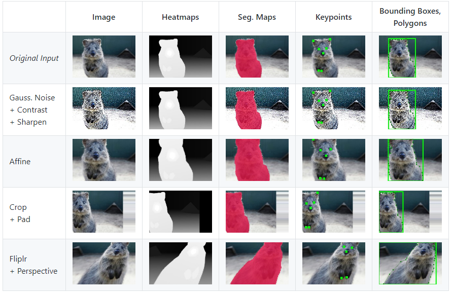

# Imgaug user manual

## Imgaug 란?

이미지를 다루는 딥러닝 모델 경우 데이터 augmentation 기술을 많이 적용할 것이다. `Imgaug`는 이 데이터 augmentation 을 쉽게 하기위해 만들어진 파이썬 모듈이다.

출처 : [깃허브](https://github.com/aleju/imgaug)

해당 모듈에서는 augmentation 통해 만들어진 새로운 이미지들에 대해 bounding box, Keypoints, Segmentation map이 적용된 상태로 저장가능하다. 

## 사용방법

