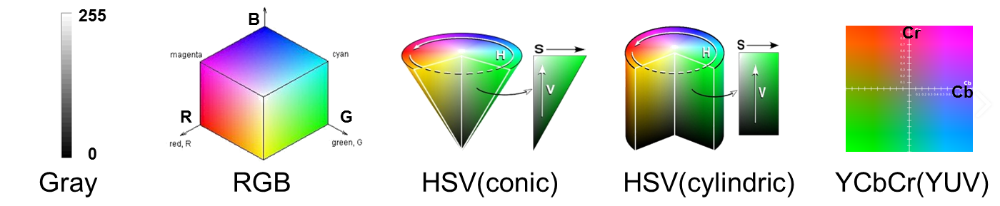

# OpenCV

## 설치

1. 아나콘다 프롬프트에서 `pip install opencv-python` 실행

   ```bash
   (base) C:\Users\student>pip install opencv-python
   Collecting opencv-python
     Downloading https://files.pythonhosted.org/packages/74/41/b01f308ca4a22c8c368ed4ee80ef5318efe2f221cd0024a3a0ee9df6a94d/opencv_python-4.1.2.30-cp37-cp37m-win_amd64.whl (33.0MB)
        |████████████████████████████████| 33.0MB 6.8MB/s
   Requirement already satisfied: numpy>=1.14.5 in c:\programdata\anaconda3\lib\site-packages (from opencv-python) (1.16.5)
   Installing collected packages: opencv-python
   Successfully installed opencv-python-4.1.2.30
   ```


## 사용방법

>  `import cv2` 입력 후 사용


## 색상모델




### RGB

> 기본적인 레드 그린 블루
>
> R, G, B 값 더하고 3으로 나누면흑백이 됨
>
> 각 영역별 최대값은 255, 값이 높을수록 진해짐


### YCrCB 모델

>영상 시스템에서 사용되는 색공간의 일종이다. Y 는 휘도 성분이며 Cb 와 Cr 은 색차 성분이다. YCbCr 은 가끔 YCC 라고 줄여 부르기도 한다. YCbCr 은 절대 색공간 이 아니며 RGB 정보를 인코딩하는 방식의 하나로, 실제로 보이는 이미지의 색은 신호를 디스플레이 하기 위해 사용된 원본 RGB 정보에 의존한다. 따라서 YCbCr 로 표현된 값은 표준 RGB 색상이 사용된 경우거나, 색상을 변환하기 위해 사용할 ICC 프로파일을 첨부한 경우에만 예측할 수 있다.
>
>(신호를 디지털 형식으로 변경하기 위해 스케일링과 오프셋 조정 단계를 거치기 이전의) YCbCr 신호는 YPbPr 이라고 하며, 이것은 감마 보정된 RGB 원본 영상에서 Kb 와 Kr 이라는 두가지 상수를 이용하여 다음과 같은 공식을 통해 얻을 수 있다:


### HSV 모델 

> 1. HSV 색 공간 또는 HSV 모델은 색을 표현하는 하나의 방법이자, 그 방법에 따라 색을 배치하는 방식이다. 색상(Hue), 채도(Saturation), 명도(Value)의 좌표를 써서 특정한 색을 지정한다. 비슷한 것으로 HSL(Lightness), HSI(Intensity) 등이 있다.
>    1. 색상
>       - 색을 지정하는 좌표
>    2. 채도
>       - 명도와 함께 색의 주요한 세가지 속성 중의 하나이다. 색이 보다 선명할수록 **채도**가 높다고 말하며 회색이나 흰색 또는 검정과 같은 무채색에 가까울수록 **채도**가 낮다고 말한다.
>    3. 명도
>       - 색의 밝기
> 2. 피부색만 찾아라고 가정할 경우 사용


## cv2.resize(원본 이미지, 결과 이미지 크기, 보간법)

> 이미지의 사이즈를 변경하게 해주는 함수

```python
r_size = cv2.resize(src, dsize=(800, 640), interpolation=cv2.INTER_AREA)
#dsize는 실제 변경 할 사이즈
r_size2 = cv2.resize(src, dsize=(0, 0), fx=0.4, fy=0.6, interpolation=cv2.INTER_LINEAR)
# 결과 이미지 크기가 (0, 0)으로 크기를 설정하지 않은 경우, fx와 fy를 이용하여 이미지의 비율을 조절 가능
#fx,fy 가 각각 0.4, 0.6인 경우, 원본 이미지 너비와 높이도 0.4, 0.6배로 변경
#결과 이미지 크기와 가로비, 세로비가 모두 설정된 경우, 결과 이미지 크기의 값으로 이미지의 크기가 조절 됨
```

- 사이즈가 변할경우 pixel 사이의 값도 결정을 해주어야 하는데 이 때 사용하는 것이 보간법임.  많이 사용되는 보간법은 사이즈를 줄일 때는 `cv2.INTER_AREA` , 사이즈를 크게할 때는 `cv2.INTER_CUBIC` , `cv2.INTER_LINEAR` 을 사용


## 실습

1. [RGB_test](https://github.com/madfalc0n/Image-analysis-and-develope/tree/master/image_processing/20200106/1.1_rgb_test.ipynb)
2. [Opencv_imgread_BGR_to_RGB](https://github.com/madfalc0n/Image-analysis-and-develope/tree/master/image_processing/https://github.com/madfalc0n/Image-analysis-and-develope/tree/master/image_processing/20200106/1.2_opencv_1_img_open_converting.ipynb)
3. [Opencv_해당영역 색변경(RGB,HSV)](https://github.com/madfalc0n/Image-analysis-and-develope/tree/master/image_processing/20200106/1.3_opencv_2_hsv_lab.ipynb)
4. [Opencv_RGB_HSV_Histogram_lab](https://github.com/madfalc0n/Image-analysis-and-develope/tree/master/image_processing/20200106/1.4_opencv_3_hist_lab.ipynb)
5. [Opencv Chroma key_lab](https://github.com/madfalc0n/Image-analysis-and-develope/tree/master/image_processing/20200106/1.5_opencv_4_chromakey.ipynb)