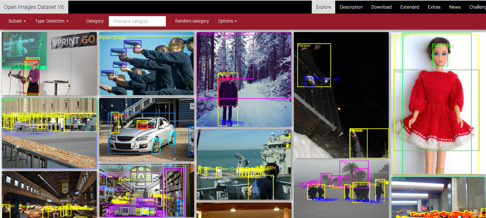
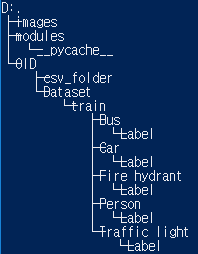
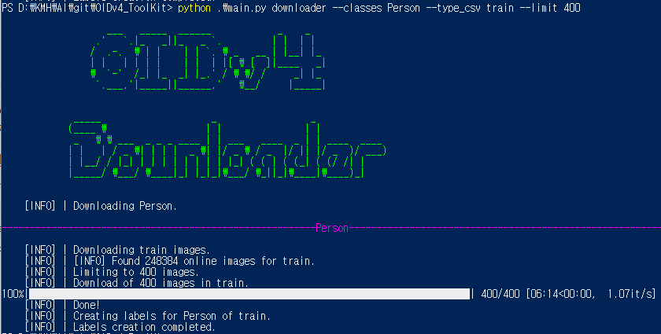

# Open Image dataset 사용방법

open image dataset은 이미지속 객체들에 대해 라벨링이 되어있는 이미지들을 제공하는 사이트이다.

해당사이트는 현재 detection, segmentation, relationships, localized narrative 항목을 제공한다. 

## OIDv4 Toolkit 사용

`OIDv4 Toolkit`의 트리구조는 다음과 같다.

초기에는 OID라는 디렉토리가 없으며 이미지를 다운로드 할 경우 생긴다.

이미지를 다운로드 하는방법은 아래의 순서대로 따라 입력한다. 추가적으로 메뉴얼에 대한 상세내용은[링크](https://github.com/EscVM/OIDv4_ToolKit#10-getting-started)에서 확인 가능하다.

1. `git clone https://github.com/EscVM/OIDv4_ToolKit`을 통해 복제

2. powershell 에서 `OIDv4_Toolkit`디렉토리에서 `pip install -r requirements.txt` 입력하여 필요한 모듈 설치
3. `python .\main.py downloader --classes [클래스명] --type_csv train --limit 400`  을 입력하면 OID에서 제공하는 클래스의 이미지들과 라벨링 정보를 다운로드 한다. 클래스명이 `Person`일 경우 관련된 이미지와 라벨정보를 가져온다.

