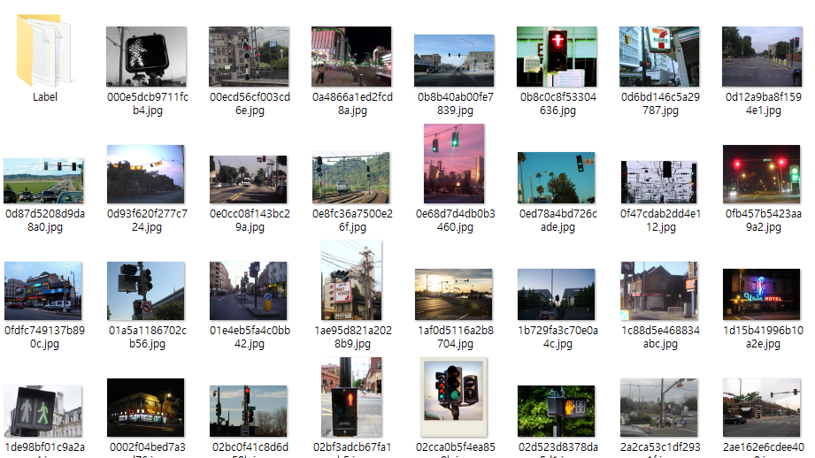
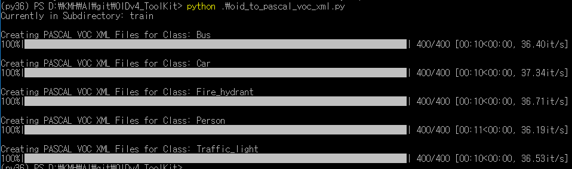

# Open Image dataset 사용방법

open image dataset은 이미지속 객체들에 대해 라벨링이 되어있는 이미지들을 제공하는 사이트이다.


해당사이트는 현재 detection, segmentation, relationships, localized narrative 항목을 제공한다. 


## OIDv4 Toolkit 사용

### 1. 이미지 다운로드

`OIDv4 Toolkit`의 트리구조는 다음과 같다.


초기에는 OID라는 디렉토리가 없으며 이미지를 다운로드 할 경우 생긴다.

이미지를 다운로드 하는방법은 아래의 순서대로 따라 입력한다. 추가적으로 메뉴얼에 대한 상세내용은[링크](https://github.com/EscVM/OIDv4_ToolKit#10-getting-started)에서 확인 가능하다.

1. `git clone https://github.com/EscVM/OIDv4_ToolKit`을 통해 복제

2. powershell 에서 `OIDv4_Toolkit`디렉토리에서 `pip install -r requirements.txt` 입력하여 필요한 모듈 설치
3. `python .\main.py downloader --classes [클래스명] --type_csv train --limit 400`  을 입력하면 OID에서 제공하는 클래스의 이미지들과 라벨링 정보를 다운로드 한다(limit은 이미지 호출 제한 수). 클래스명이 `Person`일 경우 관련된 이미지와 라벨정보를 가져온다.





### 2. 포멧 형식 변경

기존 OID 포멧 형식은 txt 파일로 다음과 같다.

```
name_of_the_class  left  top  right  bottom
Traffic light 246.4 74.24025599999999 813.44 660.48
```

해당 이미지와 라벨에 대한 정보를 YOLO와 같은 특정 프레임워크에 학습시키기 위해서는 저장된 정보에 대한 포멧형식을 변경해야 하는데 우선적으로 VOC 형식으로 변경한다. VOC는 참고로 [PASCAL](http://pascallin2.ecs.soton.ac.uk/) Visual Object Classes 로  파스칼 voc 데이터셋의 포멧 형식이다.

먼저 VOC 형식으로 변환 후 YOLO 형식으로 변환 할 예정이다.

VOC 형식으로 변환되면 XML 파일로 포멧형식이 저장된다. 변환시키기 위하여 아래의 코드를 해당 폴더에서 생성하고 실행하자

- oid_to_pascal_voc_xml.py

```python
import os
from tqdm import tqdm
from sys import exit
import argparse
import cv2
from textwrap import dedent
from lxml import etree

XML_DIR = ''

#os.chdir('Dataset')
os.chdir(os.path.join("OID", "Dataset"))
DIRS = os.listdir(os.getcwd())

for DIR in DIRS:
    if os.path.isdir(DIR):
        os.chdir(DIR)

        print("Currently in Subdirectory:", DIR)
        CLASS_DIRS = os.listdir(os.getcwd()) 
        for CLASS_DIR in CLASS_DIRS:
            if " " in CLASS_DIR:
                os.rename(CLASS_DIR, CLASS_DIR.replace(" ", "_"))
        
        CLASS_DIRS = os.listdir(os.getcwd())
        for CLASS_DIR in CLASS_DIRS:
            #if " " in CLASS_DIR:
            #    os.rename(CLASS_DIR, CLASS_DIR.replace(" ", "_"))
            if os.path.isdir(CLASS_DIR):
                os.chdir(CLASS_DIR)

                print("\n" + "Creating PASCAL VOC XML Files for Class:", CLASS_DIR)
                # Create Directory for annotations if it does not exist yet
                #if not os.path.exists(XML_DIR):
                #    os.makedirs(XML_DIR)

                #Read Labels from OIDv4 ToolKit
                os.chdir("Label")

                #Create PASCAL XML
                for filename in tqdm(os.listdir(os.getcwd())):
                    if filename.endswith(".txt"):
                        filename_str = str.split(filename, ".")[0]


                        annotation = etree.Element("annotation")
                        
                        os.chdir("..")
                        folder = etree.Element("folder")
                        folder.text = os.path.basename(os.getcwd())
                        annotation.append(folder)

                        filename_xml = etree.Element("filename")
                        filename_xml.text = filename_str + ".jpg"
                        annotation.append(filename_xml)

                        path = etree.Element("path")
                        path.text = os.path.join(os.path.dirname(os.path.abspath(filename)), filename_str + ".jpg")
                        annotation.append(path)

                        source = etree.Element("source")
                        annotation.append(source)

                        database = etree.Element("database")
                        database.text = "Unknown"
                        source.append(database)

                        size = etree.Element("size")
                        annotation.append(size)

                        width = etree.Element("width")
                        height = etree.Element("height")
                        depth = etree.Element("depth")

                        img = cv2.imread(filename_xml.text)

                        try:
                            width.text = str(img.shape[1])
                        except AttributeError:
                            #os.chdir("..")
                            os.chdir("Label")
                            continue
                        height.text = str(img.shape[0])
                        depth.text = str(img.shape[2])

                        size.append(width)
                        size.append(height)
                        size.append(depth)

                        segmented = etree.Element("segmented")
                        segmented.text = "0"
                        annotation.append(segmented)

                        os.chdir("Label")
                        label_original = open(filename, 'r')

                        # Labels from OIDv4 Toolkit: name_of_class X_min Y_min X_max Y_max
                        for line in label_original:
                            line = line.strip()
                            l = line.split(' ')
                            
                            class_name_len = len(l) - 4 # 4 coordinates
                            class_name = l[0]
                            for i in range(1,class_name_len):
                                class_name = f"{class_name}_{l[i]}"

                            addi = class_name_len

                            xmin_l = str(int(round(float(l[0+addi]))))
                            ymin_l = str(int(round(float(l[1+addi]))))
                            xmax_l = str(int(round(float(l[2+addi]))))
                            ymax_l = str(int(round(float(l[3+addi]))))
                            
                            obj = etree.Element("object")
                            annotation.append(obj)

                            name = etree.Element("name")
                            name.text = class_name
                            obj.append(name)

                            pose = etree.Element("pose")
                            pose.text = "Unspecified"
                            obj.append(pose)

                            truncated = etree.Element("truncated")
                            truncated.text = "0"
                            obj.append(truncated)

                            difficult = etree.Element("difficult")
                            difficult.text = "0"
                            obj.append(difficult)

                            bndbox = etree.Element("bndbox")
                            obj.append(bndbox)

                            xmin = etree.Element("xmin")
                            xmin.text = xmin_l
                            bndbox.append(xmin)

                            ymin = etree.Element("ymin")
                            ymin.text = ymin_l
                            bndbox.append(ymin)

                            xmax = etree.Element("xmax")
                            xmax.text = xmax_l
                            bndbox.append(xmax)

                            ymax = etree.Element("ymax")
                            ymax.text = ymax_l
                            bndbox.append(ymax)

                        os.chdir("..")

                        #os.chdir(XML_DIR)

                        # write xml to file
                        s = etree.tostring(annotation, pretty_print=True)
                        with open(filename_str + ".xml", 'wb') as f:
                            f.write(s)
                            f.close()

                        #os.chdir("..")
                        os.chdir("Label")

                os.chdir("..")
                os.chdir("..")   
                   
        os.chdir("..")
```




VOC 형식을 다시 YOLO 형식으로 변경해준다. 아래의 코드를 해당 폴더에서 생성하고 실행하자

- voc_to_YOLOv3.py

```python
import xml.etree.ElementTree as ET
from os import getcwd
import os


dataset_train = 'OID\\Dataset\\train\\'
dataset_file = '4_CLASS_test.txt'
classes_file = dataset_file[:-4]+'_classes.txt'


CLS = os.listdir(dataset_train)
classes =[dataset_train+CLASS for CLASS in CLS]
wd = getcwd()


def test(fullname):
    bb = ""
    in_file = open(fullname)
    tree=ET.parse(in_file)
    root = tree.getroot()
    for i, obj in enumerate(root.iter('object')):
        difficult = obj.find('difficult').text
        cls = obj.find('name').text
        if cls not in CLS or int(difficult)==1:
            continue
        cls_id = CLS.index(cls)
        xmlbox = obj.find('bndbox')
        b = (int(xmlbox.find('xmin').text), int(xmlbox.find('ymin').text), int(xmlbox.find('xmax').text), int(xmlbox.find('ymax').text))
        bb += (" " + ",".join([str(a) for a in b]) + ',' + str(cls_id))

        # we need this because I don't know overlapping or something like that
        if cls == 'Traffic_light':
            list_file = open(dataset_file, 'a')
            file_string = str(fullname)[:-4]+'.jpg'+bb+'\n'
            list_file.write(file_string)
            list_file.close()
            bb = ""

    if bb != "":
        list_file = open(dataset_file, 'a')
        file_string = str(fullname)[:-4]+'.jpg'+bb+'\n'
        list_file.write(file_string)
        list_file.close()


for CLASS in classes:
    for filename in os.listdir(CLASS):
        if not filename.endswith('.xml'):
            continue
        fullname = os.getcwd()+'\\'+CLASS+'\\'+filename
        test(fullname)

for CLASS in CLS:
    list_file = open(classes_file, 'a')
    file_string = str(CLASS)+"\n"
    list_file.write(file_string)
    list_file.close()
```

실행하고 나면 2개의 텍스트 파일이 생긴다.

- `4_CLASS_test_classes.txt`
  - 다운 받은 이미지들에 대한 클래스 리스트
- `4_CLASS_test.txt`
  - 이미지들에 대한 클래스 바운딩 박스 정보

