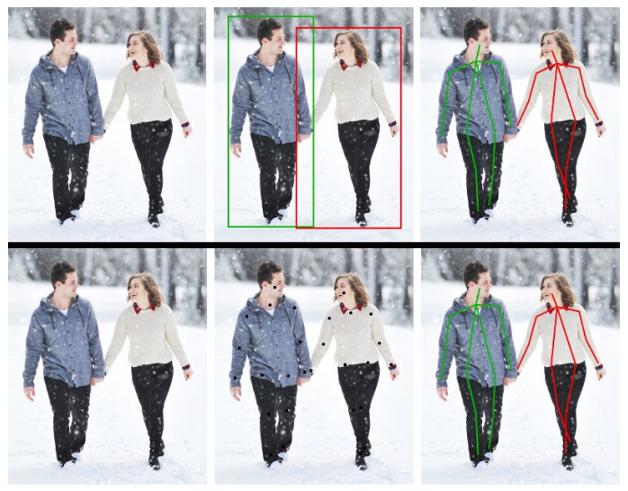

# Pose Estimation

객체의 위치(position)와 방향(orientation)을 찾는 솔루션으로 사람의 신체 관절인 keypoint가 어떻게 구성되어있는지 위치를 측정(localization)하고 추정(estimation)하는 문제이다.

주요 keypoint는 Head, Neck, Sholder, Elbow, Wrist, Hip, Knee, Ankle 이 있음

성능평가는 PCK(Percentage of Correct Keypoint) 지표를 이용

## Pose Estimation의 분류

Pose Estimation 의 종류는 2D/3D Pose Estimation 으로 나뉜다.

### 2D Pose Estimation

### 3D Pose Estimation

## Pose Estimation의 estimation 방식

Estimation 하는 방식에는 TOP-down 방식과 Bottom-up 방식이 있다

### TOP-down

영상에서 사람을 먼저 detection 후 bounding box 내에서 포즈를 추정하는 방식

정확도가 bottom-up 방식에 비해 높고 crop 과정이 필요하다

무엇보다도 큰 문제는 사람을 인식하지 못하면 측정할 수 없다는 것이다. 또한 multi-person일 경우 detection 된 사람마다 포즈를 추정해야하므로 느린 단점이 있다.

### Bottom-up

영상에 포함된 사람의 키포인트를 모두 estimation 후 키포인트간의 상관관계를 분석하여 포즈를 추정하는 방식

detection 과정을 거치지 않으므로 빠르다는 장점이 있고 실시간으로 적용할 수 있다. 문제점은 찾은 관절들을 매칭할 수 있는 조합이 많고 적절하게 매칭하는데 시간이 걸린다는 점이고 정확도를 높이는 것도 힘들다는 것이다. 해당 방식을 통해 실시간으로 구현이 가능하다는 [논문](https://arxiv.org/pdf/1611.08050.pdf)을 참고하면 되겠다.

 

>  위가 Top-down 방식이고 아래가 Bottom-down 방식

