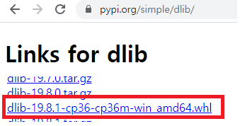

# Face recognition


## 0. 주의사항

다음의 모듈 사용시 파이썬 버전이 일치해야 함

- `dlib` 모듈
  - Linux 환경에서 3.7x 의 파이썬 설치
  - Window 환경에서 3.6 의 파이썬 설치


## 1. 가상환경 및 설치

1. 가상환경 설치

```bash
conda create -n py36 python=3.6 anaconda
```

2. 가상환경 실행 후 모듈 설치(dlib 모듈 제외)
   - pip install opencv-python
   - pip install imutils
   - pip install --no-dependencies face_recognition
   - pip install git+https://github.com/ageitgey/face_recognition_models 

```bash
(base) C:\Users\student>conda activate py36

(py36) C:\Users\student>pip install opencv-python
WARNING: pip is being invoked by an old script wrapper. This will fail in a future
                                            .
                                            .
Successfully installed opencv-python-4.1.2.30

(py36) C:\Users\student>pip install imutils
WARNING: pip is being invoked by an old script wrapper. This will fail in a future version of pip.
                                            .
                                            .
Successfully installed imutils-0.5.3


(py36) C:\Users\student\Downloads>pip install --no-dependencies face_recognition
WARNING: pip is being invoked by an old script wrapper. This will fail in a future version of pip.
                                            .
                                            .
Successfully installed face-recognition-1.2.3

(py36) C:\Users\student\Downloads>
```

3. **dlib(파이썬 3.6버전까지만 지원) 모듈 설치**

- `pip install dlib` 를 실행할 경우 다음의 에러가 발생한다.

```bash
(py36) C:\Users\student>pip install dlib
WARNING: pip is being invoked by an old script wrapper. This will fail in a future version of pip.
Please see https://github.com/pypa/pip/issues/5599 for advice on fixing the underlying issue.
To avoid this problem you can invoke Python with '-m pip' instead of running pip directly.
Collecting dlib
  Downloading dlib-19.19.0.tar.gz (3.2 MB)
     |████████████████████████████████| 3.2 MB 930 kB/s
Building wheels for collected packages: dlib
  Building wheel for dlib (setup.py) ... error
  ERROR: Command errored out with exit status 1:
   command: 'C:\Users\student\.conda\envs\py36\python.exe' -u -c 'import sys, setuptools, tokenize; sys.argv[0] = '"'"'C:\\Users\\student\\AppData\\Local\\Temp\\pip-install-nmi7zthi\\dlib\\setup.py'"'"'; __file__='"'"'C:\\Users\\student\\AppData\\Local\\Temp\\pip-install-nmi7zthi\\dlib\\setup.py'"'"';f=getattr(tokenize, '"'"'open'"'"', open)(__file__);code=f.read().replace('"'"'\r\n'"'"', '"'"'\n'"'"');f.close();exec(compile(code, __file__, '"'"'exec'"'"'))' bdist_wheel -d 'C:\Users\student\AppData\Local\Temp\pip-wheel-amowuwg3'
       cwd: C:\Users\student\AppData\Local\Temp\pip-install-nmi7zthi\dlib\
  Complete output (53 lines):
  running bdist_wheel
  running build
  running build_py
  package init file 'dlib\__init__.py' not found (or not a regular file)
  running build_ext
  Traceback (most recent call last):
    File "C:\Users\student\AppData\Local\Temp\pip-install-nmi7zthi\dlib\setup.py", line 120, in get_cmake_version
      out = subprocess.check_output(['cmake', '--version'])
    File "C:\Users\student\.conda\envs\py36\lib\subprocess.py", line 356, in check_output
      **kwargs).stdout
    File "C:\Users\student\.conda\envs\py36\lib\subprocess.py", line 423, in run
      with Popen(*popenargs, **kwargs) as process:
    File "C:\Users\student\.conda\envs\py36\lib\subprocess.py", line 729, in __init__
      restore_signals, start_new_session)
    File "C:\Users\student\.conda\envs\py36\lib\subprocess.py", line 1017, in _execute_child
      startupinfo)
  FileNotFoundError: [WinError 2] 지정된 파일을 찾을 수 없습니다

  During handling of the above exception, another exception occurred:

  Traceback (most recent call last):
    File "<string>", line 1, in <module>
    File "C:\Users\student\AppData\Local\Temp\pip-install-nmi7zthi\dlib\setup.py", line 261, in <module>
      'Topic :: Software Development',
    File "C:\Users\student\.conda\envs\py36\lib\site-packages\setuptools\__init__.py", line 145, in setup
      return distutils.core.setup(**attrs)
    File "C:\Users\student\.conda\envs\py36\lib\distutils\core.py", line 148, in setup
      dist.run_commands()
    File "C:\Users\student\.conda\envs\py36\lib\distutils\dist.py", line 955, in run_commands
      self.run_command(cmd)
    File "C:\Users\student\.conda\envs\py36\lib\distutils\dist.py", line 974, in run_command
      cmd_obj.run()
    File "C:\Users\student\.conda\envs\py36\lib\site-packages\wheel\bdist_wheel.py", line 192, in run
      self.run_command('build')
    File "C:\Users\student\.conda\envs\py36\lib\distutils\cmd.py", line 313, in run_command
      self.distribution.run_command(command)
    File "C:\Users\student\.conda\envs\py36\lib\distutils\dist.py", line 974, in run_command
      cmd_obj.run()
    File "C:\Users\student\.conda\envs\py36\lib\distutils\command\build.py", line 135, in run
      self.run_command(cmd_name)
    File "C:\Users\student\.conda\envs\py36\lib\distutils\cmd.py", line 313, in run_command
      self.distribution.run_command(command)
    File "C:\Users\student\.conda\envs\py36\lib\distutils\dist.py", line 974, in run_command
      cmd_obj.run()
    File "C:\Users\student\AppData\Local\Temp\pip-install-nmi7zthi\dlib\setup.py", line 129, in run
      cmake_version = self.get_cmake_version()
    File "C:\Users\student\AppData\Local\Temp\pip-install-nmi7zthi\dlib\setup.py", line 125, in get_cmake_version
      "\n*******************************************************************\n")
  RuntimeError:
  *******************************************************************
   CMake must be installed to build the following extensions: dlib
  *******************************************************************

  ----------------------------------------
  ERROR: Failed building wheel for dlib
  Running setup.py clean for dlib
Failed to build dlib
Installing collected packages: dlib
    Running setup.py install for dlib ... error
    ERROR: Command errored out with exit status 1:
     command: 'C:\Users\student\.conda\envs\py36\python.exe' -u -c 'import sys, setuptools, tokenize; sys.argv[0] = '"'"'C:\\Users\\student\\AppData\\Local\\Temp\\pip-install-nmi7zthi\\dlib\\setup.py'"'"'; __file__='"'"'C:\\Users\\student\\AppData\\Local\\Temp\\pip-install-nmi7zthi\\dlib\\setup.py'"'"';f=getattr(tokenize, '"'"'open'"'"', open)(__file__);code=f.read().replace('"'"'\r\n'"'"', '"'"'\n'"'"');f.close();exec(compile(code, __file__, '"'"'exec'"'"'))' install --record 'C:\Users\student\AppData\Local\Temp\pip-record-f9fby_cc\install-record.txt' --single-version-externally-managed --compile --install-headers 'C:\Users\student\.conda\envs\py36\Include\dlib'
         cwd: C:\Users\student\AppData\Local\Temp\pip-install-nmi7zthi\dlib\
    Complete output (55 lines):
    running install
    running build
    running build_py
    package init file 'dlib\__init__.py' not found (or not a regular file)
    running build_ext
    Traceback (most recent call last):
      File "C:\Users\student\AppData\Local\Temp\pip-install-nmi7zthi\dlib\setup.py", line 120, in get_cmake_version
        out = subprocess.check_output(['cmake', '--version'])
      File "C:\Users\student\.conda\envs\py36\lib\subprocess.py", line 356, in check_output
        **kwargs).stdout
      File "C:\Users\student\.conda\envs\py36\lib\subprocess.py", line 423, in run
        with Popen(*popenargs, **kwargs) as process:
      File "C:\Users\student\.conda\envs\py36\lib\subprocess.py", line 729, in __init__
        restore_signals, start_new_session)
      File "C:\Users\student\.conda\envs\py36\lib\subprocess.py", line 1017, in _execute_child
        startupinfo)
    FileNotFoundError: [WinError 2] 지정된 파일을 찾을 수 없습니다

    During handling of the above exception, another exception occurred:

    Traceback (most recent call last):
      File "<string>", line 1, in <module>
      File "C:\Users\student\AppData\Local\Temp\pip-install-nmi7zthi\dlib\setup.py", line 261, in <module>
        'Topic :: Software Development',
      File "C:\Users\student\.conda\envs\py36\lib\site-packages\setuptools\__init__.py", line 145, in setup
        return distutils.core.setup(**attrs)
      File "C:\Users\student\.conda\envs\py36\lib\distutils\core.py", line 148, in setup
        dist.run_commands()
      File "C:\Users\student\.conda\envs\py36\lib\distutils\dist.py", line 955, in run_commands
        self.run_command(cmd)
      File "C:\Users\student\.conda\envs\py36\lib\distutils\dist.py", line 974, in run_command
        cmd_obj.run()
      File "C:\Users\student\.conda\envs\py36\lib\site-packages\setuptools\command\install.py", line 61, in run
        return orig.install.run(self)
      File "C:\Users\student\.conda\envs\py36\lib\distutils\command\install.py", line 545, in run
        self.run_command('build')
      File "C:\Users\student\.conda\envs\py36\lib\distutils\cmd.py", line 313, in run_command
        self.distribution.run_command(command)
      File "C:\Users\student\.conda\envs\py36\lib\distutils\dist.py", line 974, in run_command
        cmd_obj.run()
      File "C:\Users\student\.conda\envs\py36\lib\distutils\command\build.py", line 135, in run
        self.run_command(cmd_name)
      File "C:\Users\student\.conda\envs\py36\lib\distutils\cmd.py", line 313, in run_command
        self.distribution.run_command(command)
      File "C:\Users\student\.conda\envs\py36\lib\distutils\dist.py", line 974, in run_command
        cmd_obj.run()
      File "C:\Users\student\AppData\Local\Temp\pip-install-nmi7zthi\dlib\setup.py", line 129, in run
        cmake_version = self.get_cmake_version()
      File "C:\Users\student\AppData\Local\Temp\pip-install-nmi7zthi\dlib\setup.py", line 125, in get_cmake_version
        "\n*******************************************************************\n")
    RuntimeError:
    *******************************************************************
     CMake must be installed to build the following extensions: dlib
    *******************************************************************

    ----------------------------------------
ERROR: Command errored out with exit status 1: 'C:\Users\student\.conda\envs\py36\python.exe' -u -c 'import sys, setuptools, tokenize; sys.argv[0] = '"'"'C:\\Users\\student\\AppData\\Local\\Temp\\pip-install-nmi7zthi\\dlib\\setup.py'"'"'; __file__='"'"'C:\\Users\\student\\AppData\\Local\\Temp\\pip-install-nmi7zthi\\dlib\\setup.py'"'"';f=getattr(tokenize, '"'"'open'"'"', open)(__file__);code=f.read().replace('"'"'\r\n'"'"', '"'"'\n'"'"');f.close();exec(compile(code, __file__, '"'"'exec'"'"'))' install --record 'C:\Users\student\AppData\Local\Temp\pip-record-f9fby_cc\install-record.txt' --single-version-externally-managed --compile --install-headers 'C:\Users\student\.conda\envs\py36\Include\dlib' Check the logs for full command output.

(py36) C:\Users\student>
```

- pypi.org./simple/dlib에 접속해서 whl 파일을 자신에 맞는 운영체제(나는 파이썬 3.6x , 64비트 운영체제 사용중)로 다운받아야 한다.




- 다운 받은 whl 파일이 있는 경로로 이동 후 `pip install [whl]`을 입력한다.

```bash
(py36) C:\Users\student\Downloads>pip install dlib-19.8.1-cp36-cp36m-win_amd64.whl
WARNING: pip is being invoked by an old script wrapper. This will fail in a future version of pip.
                                            .
                                            .
Successfully installed dlib-19.8.1
```


### 모듈 테스트

- `jupyter notebook` 실행 후 노트북파일 만들고 모듈 실행해보기

  ```python
  from imutils import face_utils
  import numpy as np
  import imutils
  import dlib
  import cv2
  import matplotlib.pyplot as plt
  import face_recognition #pip install git+https://github.com/ageitgey/face_recognition_models 해주어야 함
  import os
  from imutils import paths
  ```


## 2. 얼굴 인식 코드 실행해보기

> [실습코드]()

