## OPEN POSE를 통해 Pose Estimation 구현해보기

최근 가장 인기있는 bottom-up 방식의 포즈 추정방식으로 동작하며 포징 추정시 실시간으로 처리

Multi-person keypoint detection 과 multi-threading written 지원

C++ 전용이지만 파이썬도 사용가능


### 1. 데모버전

[오픈포즈](https://github.com/CMU-Perceptual-Computing-Lab/openpose)에서 제공하는 데모판이 있다. 간단하게 다운로드 하여 소스코드를 실행하면 된다.

윈도우에서 데모버전을 사용하는 방법은 간단하다

1. [최신 데모버전](https://github.com/CMU-Perceptual-Computing-Lab/openpose/releases)을 다운받는다.

2. 압축파일을 풀고 `models/getModels.bat` 를 실행시켜 학습된 모델을 다운 받는다.

   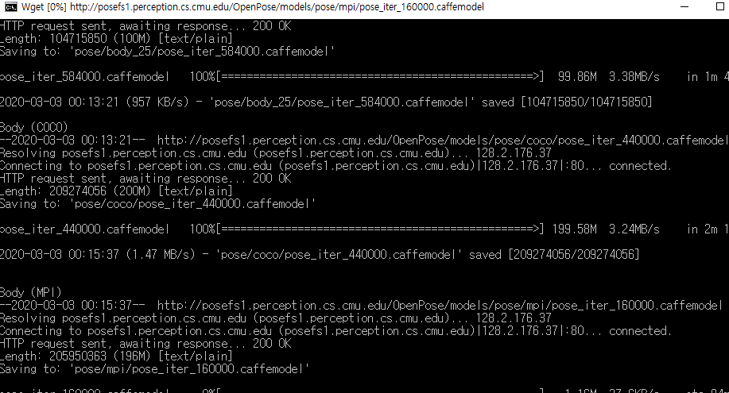

3. poweshell 또는 프롬프트 창을 열고 `openpose` 디렉토리에서 open pose를 실행한다.

   ```bash
   #실행예시
   bin\OpenPoseDemo.exe --video examples\media\video.avi --model_pose COCO
   ```
   뒤에 `--model_pose`는 어떤 모델을 사용할 건지 명시하는 부분이다. 제공하는 모델은 BODY_25, COCO, MPI 를 제공하며 자세한 내용은 [링크](https://github.com/CMU-Perceptual-Computing-Lab/openpose/blob/master/doc/faq.md#difference-between-body_25-vs-coco-vs-mpi)를 통해 확인 가능하다. 요약하자면 COCO > BODY_25 > MPI 순이라고 얘기하는 것 같다. 
   
   > 원문: COCO model will eventually be removed. BODY_25 model is faster, more accurate, and it includes foot keypoints. However, COCO requires less memory on GPU (being able to fit into 2GB GPUs with the default settings) and it runs faster on CPU-only mode. MPI model is only meant for people requiring the MPI-keypoint structure. It is also slower than BODY_25 and far less accurate.


   명령어와 관련하여 좀더 추가적으로 알고싶은사람은 [링크](https://github.com/CMU-Perceptual-Computing-Lab/openpose/blob/master/doc/demo_overview.md#main-flags) 를 통해서 명령어를 확인해보자


4. 실행결과

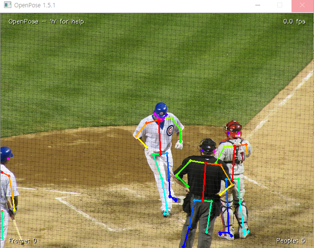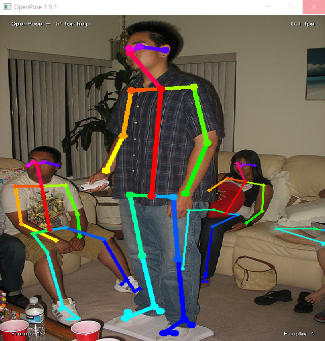

> 실제 데모판을 이용하여 pose estimation 구현한 모습, 테스트 환경의 사양이 너무 딸려서 동영상을 estimation 하는데에는 한계가 있었다.


### 2. TensorFlow + OpenCV 를 이용하여 Pose Estimation 구현해보기

Open Pose에 tensorflow를 사용하여 성능을 향상시킨 [코드](https://github.com/ildoonet/tf-pose-estimation)를 이용하여 Pose Estimation 을 구현해보았다.

[유튜브](https://www.youtube.com/watch?v=nUjGLjOmF7o)에서 제공하는 영상을 참고하여 구현 하였으며 아래의 프레임워크를 설치해야 한다.

- AWS EC2(Ubuntu 16.04.6 LTS)
- python 3.6.10
- tensorflow 1.15.2
- tensorflow-estimator 1.15.1
- opencv-python, pycocotools ...등등


구현 절차는 다음과 같다

1. git clone 을 통해 tf-pose-estimation 가져오기
2. 아나콘다를 통해 가상환경 만들기
3. pose estimation을 구현하기위한 라이브러리 설치(opencv, tensorflow-gpu 등등)
4. 실행해보기

#### 1. git clone을 통해 tf-pose-estimation 가져오기

```bash
$ git clone https://github.com/ildoonet/tf-pose-estimation.git
```


#### 2. 아나콘다를 통해 가상환경 만들기

아나콘다 prompt 열어서 아래의 명령어를 입력

```bash
> conda create -n [생성할가상환경이름] python=3.6 pip
```

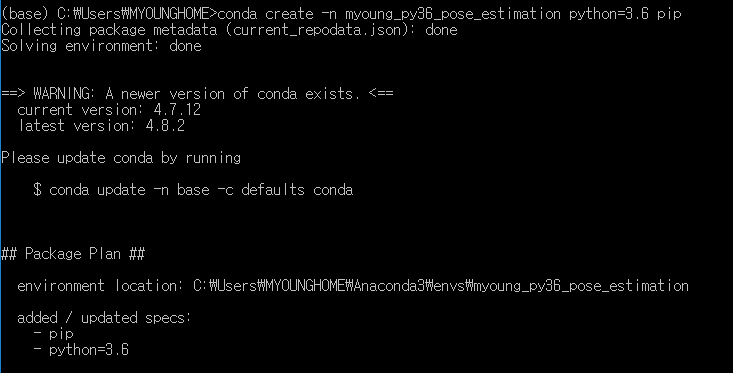

> 이런식으로 좔좔 나오는데 `Proceed ([y]/n) ?` 나오면 y 입력하고 설치한다.


완료되면 생성한 가상환경을 **activate** 하자

- activate [생성한가상환경]

```bash
(base) C:\Users\MYOUNGHOME>activate myoung_py36_pose_estimation

#완료후
(myoung_py36_pose_estimation) C:\Users\MYOUNGHOME>
```


#### 3. Pose estimation 을 구현하기위한 라이브러리 설치

생성한 가상환경에 대해 **activate** 후 라이브러리를 설치하기 앞서 Open Pose 기반으로 만들어 졌다보니 C++ 기반으로 작성되어 있다(tf-pose-estimation은 파이썬으로 코딩되어 있음).  C++ 코드와  연동하기 위해 `C++ Build Tools`를 설치해야 하는데 윈도우와 리눅스 사용자 별로 다르게 작업을 수행해야 한다.

##### 3.1 Window 사용자 C++ build Tools 설치

[링크](https://go.microsoft.com/fwlink/?LinkId=691126)에 접속하여 설치해주면 된다.

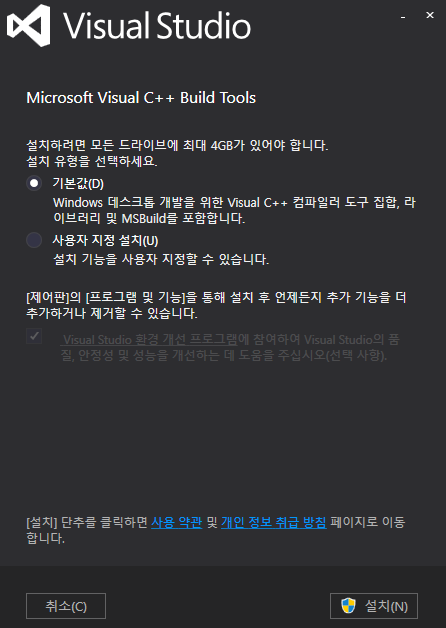

> 설정은 **기본값**으로 두고 설치 진행하면 된다. 설치가 좀 오래걸린다...


##### 3.2 Linux 환경에서 swig를 통한 C++, python 연동

리눅스 사용자일 경우 [swig](https://ko.wikipedia.org/wiki/SWIG)를 통해 C++ 코드를 python과 연결해주어야 한다.

swig는 간략하게 말하면 C나 C++ 코드를 파이썬 등의 다른 언어들과 연결하는데 사용하는 오픈 소스 소프트웨어 도구이다.

설치방법은 [링크](https://github.com/ildoonet/tf-pose-estimation/tree/master/tf_pose/pafprocess)를 통해 메뉴얼 대로 따라 하면 된다. 하지만 나는 가상환경을 이용하였기 때문에 가상환경에 swig 모듈을 설치하였다.

1. `conda install -c anaconda swig` 를 통해 아나콘다에 swig 모듈을 설치
2. `swig -python -c++ pafprocess.i && python3 setup.py build_ext --inplace` 를 입력하면된다.


위 작업이 완료되면 git clone을 통해 받아온 tf-pose-estimation에서 `requirements.txt` 파일을 아래의 명령어 대로 실행하자. 참고로 requirements.txt는 pose estimation 시 필요한 라이브러리 리스트가 작성되어 있다.

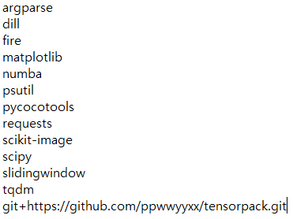

```bash
(myoung_py36_pose_estimation) C:\Users\MYOUNGHOME\Desktop\KMH\etc\tf-pose-estimation>pip install -r requirements.txt
```

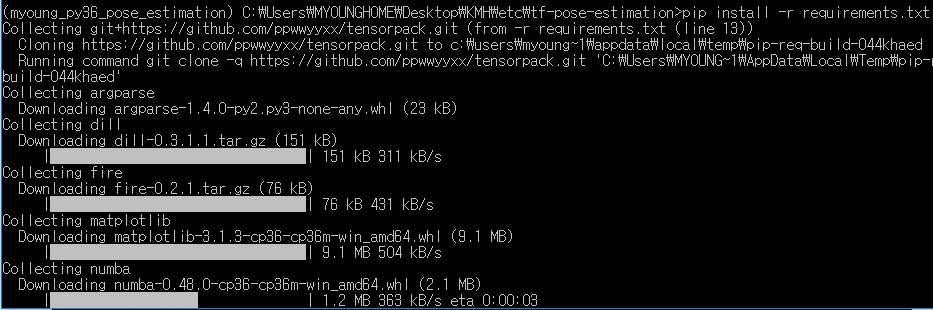

>  특정 라이브러리들에 대해 다운로드가 진행될 것이다.


#### `pycocotools` 라이브러리 설치도중 에러가 난다면?

윈도우 환경에서 pycocotools를 설치할 경우 아마 에러가 날 것이다. 이를 해결해주기 위해  `pip install git+https://github.com/philferriere/cocoapi.git#subdirectory=PythonAPI `을 입력하고 다시  `requirements.txt`를 실행해보자


##### 그 외 발생했던 에러

- No module named 'Cython'

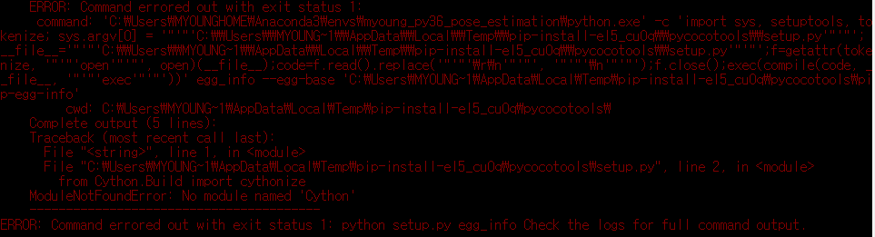

`pip install --upgrade cython` 을 입력 후 다시 시도해보자!

이런 에러가 나는 이유는 아무래도 가상환경을 직접 새로 만들다 보니 기본적으로 제공하는 모듈들이 없으므로 수동으로 설치를 해줘야 한다. 모듈이 없다는 라이브러리들의 정보를 확인후 수동으로 설치해주어야 한다.  


### 4. Pose Estimation 실행시켜보기

`tf-pose-estimation`경로로 이동 후 `run.py`를 실행하면 되는데 아래와 같이 명령어를 입력한다.

```
python run.py --model=mobilenet_v2_large --resize=432x368 --image=./images/people4.PNG
```

run.py를 실행시켜서 images 폴더의 `p1.jpg`라는 사진을 `mobilenet_v2_large`모델을 통해 pose estimation 진행한다는 명령어이다. 모델은 여러가지 사용 가능하며 모델별 성능은 [여기](https://github.com/ildoonet/tf-pose-estimation/blob/master/etcs/experiments.md)에 있다.

실제 이미지들을 통해 실행시켜보면 아래와 같이 각 관절에 대한 위치가 추정됨을 확인할 수 있다.

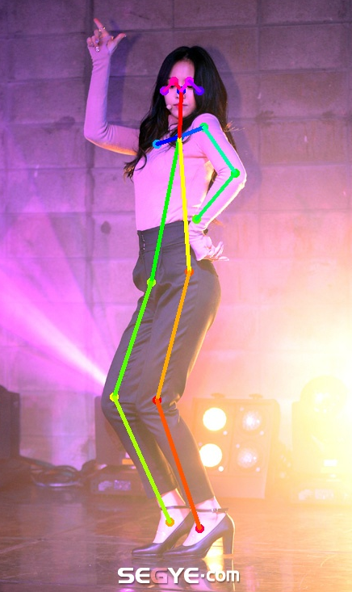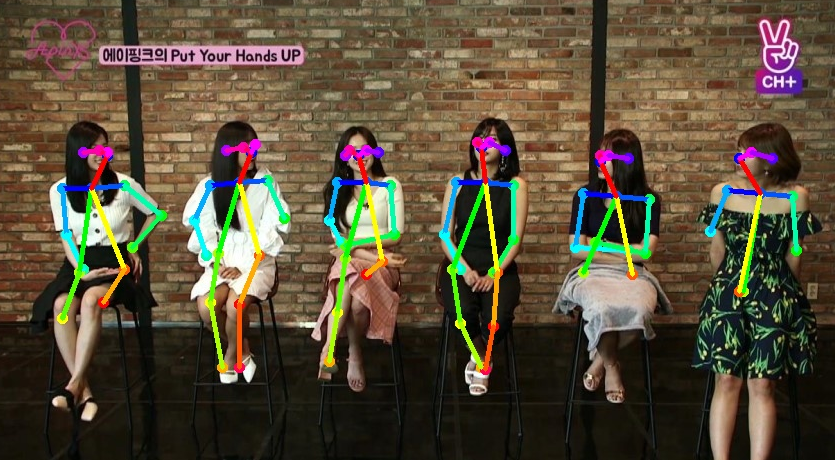


문제점은 항상 정확하지는 않다는 것이며 여러 이미지들을 통해 테스트한 결과로는 화질, 조명 및 모델 성능이 포즈 추정에 영향을 미치는 것 같다.

손들고 있는사람 포즈 추정

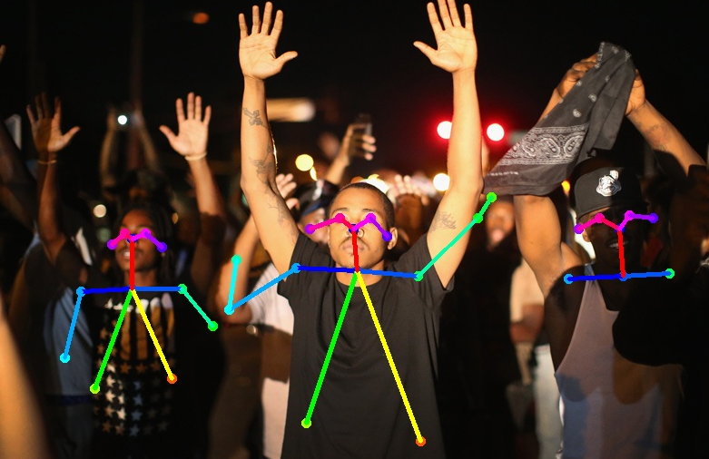

> 얼굴과 몸 부분은 인식이 되지만 팔 부분은 제대로 인식이 되지 않음을 볼 수 있다.


지하철 내 심장마비로 인해 쓰러진 사람

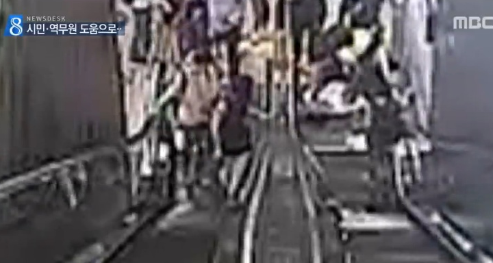

> 화질이 선명하지 않아 추정이 되지 않는다.