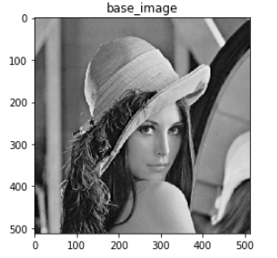
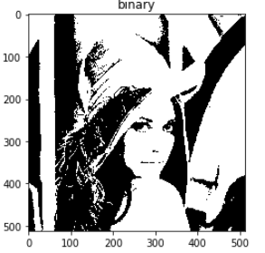
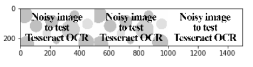
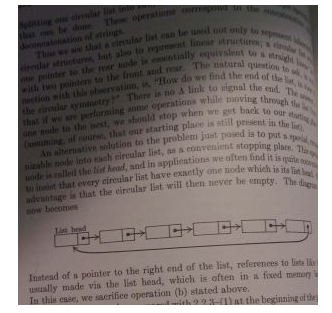
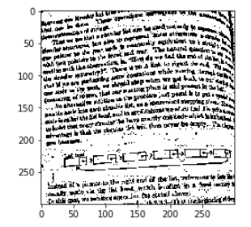
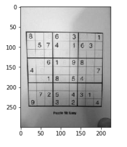
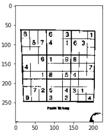
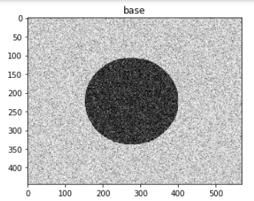
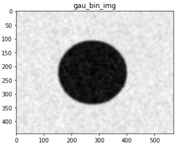

# FILTER 관련 함수

> 이미지에 대한 잡음처리 및 꼭지점을 확보하기 위해 사용되는 함수 리스트


### 주의사항

- 이미지 필터를 적용전에 흑백으로 read  해야 함


### 사전 모듈 호출

```python
import scipy.stats as sp
import numpy as np
import matplotlib.pyplot as plt
from PIL import ImageFont, ImageDraw, Image
import cv2
%matplotlib inline

# 이미지 호출에 따른 흑백 또는 컬러로 출력하는 함수
def imshow(tit,image):
    plt.title(tit)
    if len(image.shape) == 3: #행렬의 크기가 나옴, 컬러영상일경우 3이 나옴
        plt.imshow(cv2.cvtColor(image, cv2.COLOR_BGR2RGB)) #BRG to RGB
    else: # 흑백영상일 경우 2가 나옴
        plt.imshow(image, cmap='gray') #흑백
    plt.show()
    plt.close()
```


### 사용하는 함수 종류

- cv2.imread('이미지명', [0]) 
  
- 0을 입력하게 되면 `흑백`으로 가져옴, 0을 입력하지 않으면 `컬러(RGB)`로 가져옴
  
  
  
- cv2.threshold(이미지,  기준값, 최대값, type )

  > 색상을 이진화 하기 위해 사용

  - **역치값(기준값)** : 색상크기를 0 또는 최대로 변경할 기준값, 예를들어 기준값이 80이고 최대값이 255인 경우, 색상크기가 80이하인 경우 0으로 처리됨

  - **최대값** : 최대값보다 값이 이상인 경우 최대값으로 처리됨

  - 사용예시

    ```python
    thr, mask = cv2.threshold(img, 127, 255, cv2.THRESH_BINARY)
    #thr 은 127이 된다. mask가 이진화된 이미지가 됨
    # 색상크기가 127 이하는 0이되고, 255 이상인경우 255로 적용
    #thr,mask = cv2.threshold(gray, 0, 255, cv2.THRESH_BINARY + cv2.THRESH_OTSU)
    #cv2.THRESH_OTSU는 자동으로 역치값을 평균에 의해 정해준다.
    ```
  ```
    
    
    
    
    
    > 왼쪽이 원본 , 오른쪽이 스레솔드를 이용해 잡음 제거
    
    
  ```

- cv2.adaptiveThreshold(src, maxValue, adaptiveMethod, thresholdType, blockSize, C)

  - 이전 Threshold 함수가 `임계값을 이미지 전체에 적용`한경우이며 해당 함수는 `영역별로 임계값을 적용` 하는것이다.
  - **src** – gray색의 소스이미지
  - **maxValue** – 임계값
  - **adaptiveMethod** – thresholding value를 결정하는 계산 방법
  - **thresholdType** – threshold type
  - **blockSize** – thresholding을 적용할 영역 사이즈
  - **C** – 평균이나 가중평균에서 차감할 값

  ```python
  binary = cv2.adaptiveThreshold(te_img, 255, 
                                 cv2.ADAPTIVE_THRESH_GAUSSIAN_C, 
                                 cv2.THRESH_BINARY, 21, 2)
  # 색상크기가 255이상인 경우 255로 처리
  # 각각 적용할 블록사이즈 21이면 21개씩 처리함
  # 기존 평균에서 2를 차감하여 필터적용, 예로 평균이 80이면 실제 적용되는 값은 78부터이며 78보다 작은 값은 0으로 처리
  ```

  

  

  > 이렇게 바꿀수있따.


- cv2.GaussianBlur(이미지, (X,X), 0 )

  > 이미지에 블러 처리, 잡음제거에 사용

  - `(X,X)` : 필터 사이즈, **홀수**로 넣어야함

  - 사용예시

    ```python
    img_blur = cv2.GaussianBlur(img, (21,21), 0 )
    #필터사이즈를 크게하면 블러가 더 심해진다.
    #뒤에 0은 차이를 잘 모르겠다. Gaussian kernel standard deviation in X direction. 라고 한다.
    ```
    
    
  
- cv2.findContours(image, mode, method[, contours[, hierarchy[, offset]]]) → image, contours, hierarchy

  - image – 8비트 싱글채널 이미지 또는  binary 이미지

  - mode

    > contours를 찾는 방법
    
    - cv2.RETR_EXTERNAL : contours line중 가장 바같쪽 Line만 찾음.
    - cv2.RETR_LIST : 모든 contours line을 찾지만, hierachy 관계를 구성하지 않음.
    - cv2.RETR_CCOMP : 모든 contours line을 찾으며, hieracy관계는 2-level로 구성함.
- cv2.RETR_TREE : 모든 contours line을 찾으며, 모든 hieracy관계를 구성함.
    
- method
  
  >contours를 찾을 때 사용하는 근사치 방법
    
    - cv2.CHAIN_APPROX_NONE : 모든 contours point를 저장.
    - cv2.CHAIN_APPROX_SIMPLE : contours line을 그릴 수 있는 point 만 저장. (ex; 사각형이면 4개 point)
    - cv2.CHAIN_APPROX_TC89_L1 : contours point를 찾는 algorithm
    - cv2.CHAIN_APPROX_TC89_KCOS : contours point를 찾는 algorithm
    
  - Method에 대해서 설명을 하면 아래 예제의 결과에서 처럼 사각형의 contours line을 그릴 때, `cv2.CHAIN_APPROX_NONE` 는 모든 point를 저장하고 `cv2.CHAIN_APPROX_SIMPLE` 는 4개의 point만을 저장하여 메모리를 절약합니다.
  
  - 사용예시

