# FILTER 관련 함수

> 이미지에 대한 잡음처리 및 꼭지점을 확보하기 위해 사용되는 함수 리스트


### 주의사항

- 이미지 필터를 적용전에 흑백으로 read  해야 함


### 사전 모듈 호출

```python
import scipy.stats as sp
import numpy as np
import matplotlib.pyplot as plt
from PIL import ImageFont, ImageDraw, Image
import cv2
%matplotlib inline

# 이미지 호출에 따른 흑백 또는 컬러로 출력하는 함수
def imshow(tit,image):
    plt.title(tit)
    if len(image.shape) == 3: #행렬의 크기가 나옴, 컬러영상일경우 3이 나옴
        plt.imshow(cv2.cvtColor(image, cv2.COLOR_BGR2RGB)) #BRG to RGB
    else: # 흑백영상일 경우 2가 나옴
        plt.imshow(image, cmap='gray') #흑백
    plt.show()
    plt.close()
```


### 사용하는 함수 종류

- cv2.imread('이미지명', [0]) 
  - 0을 입력하게 되면 `흑백`으로 가져옴, 0을 입력하지 않으면 `컬러(RGB)`로 가져옴


- cv2.threshold(이미지,  기준값, 최대값, type )

  > 색상을 이진화 하기 위해 사용

  - **역치값(기준값)** : 색상크기를 0 또는 최대로 변경할 기준값, 예를들어 기준값이 80이고 최대값이 255인 경우, 색상크기가 80이하인 경우 0으로 처리됨

  - **최대값** : 최대값보다 값이 이상인 경우 최대값으로 처리됨

  - 사용예시

    ```python
    thr, mask = cv2.threshold(img, 127, 255, cv2.THRESH_BINARY)
    #thr 은 127이 된다. mask가 이진화된 이미지가 됨
    # 색상크기가 127 이하는 0이되고, 255 이상인경우 255로 적용
    #thr,mask = cv2.threshold(gray, 0, 255, cv2.THRESH_BINARY + cv2.THRESH_OTSU)
    #cv2.THRESH_OTSU는 자동으로 역치값을 평균에 의해 정해준다.
    ```

    
    
    
    
    
    > 왼쪽이 원본 , 오른쪽이 스레솔드를 이용해 잡음 제거
    
  
- cv2.adaptiveThreshold(src, maxValue, adaptiveMethod, thresholdType, blockSize, C)

  - 이전 Threshold 함수가 `임계값을 이미지 전체에 적용`한경우이며 해당 함수는 `영역별로 임계값을 적용` 하는것이다.
  - **src** – gray색의 소스이미지
  - **maxValue** – 임계값
  - **adaptiveMethod** – thresholding value를 결정하는 계산 방법
  - **thresholdType** – threshold type
  - **blockSize** – thresholding을 적용할 영역 사이즈
  - **C** – 평균이나 가중평균에서 차감할 값

  ```python
  binary = cv2.adaptiveThreshold(te_img, 255, 
                                 cv2.ADAPTIVE_THRESH_GAUSSIAN_C, 
                                 cv2.THRESH_BINARY, 21, 2)
  # 색상크기가 255이상인 경우 255로 처리
  # 각각 적용할 블록사이즈 21이면 21개씩 처리함
  # 기존 평균에서 2를 차감하여 필터적용, 예로 평균이 80이면 실제 적용되는 값은 78부터이며 78보다 작은 값은 0으로 처리
  ```

  

  

  > 이렇게 바꿀수있따.


- cv2.GaussianBlur(이미지, (X,X), 0 )

  > 이미지에 블러 처리, 잡음제거에 사용

  - `(X,X)` : 필터 사이즈, **홀수**로 넣어야함

  - 사용예시

    ```python
    img_blur = cv2.GaussianBlur(img, (21,21), 0 )
    #필터사이즈를 크게하면 블러가 더 심해진다.
    #뒤에 0은 차이를 잘 모르겠다. Gaussian kernel standard deviation in X direction. 라고 한다.
    ```
    
    
  


- cv2.medianBlur(src, ksize)
  - 커널과 픽셀의 값들을 정렬 후 평균값을 선택하여 적용
  - src – 1,3,4 channel image. depth가 CV_8U, CV_16U, or CV_32F 이면 ksize는 3또는5, CV_8U이면 더 큰 ksize가능
  - ksize – 1보다 큰 홀수


- cv2.findContours(image, mode, method[, contours[, hierarchy[, offset]]]) → image, contours, hierarchy

  - image – 8비트 싱글채널 이미지 또는  binary 이미지

  - 이미지 가져오기전에 copy 함수 이용해서 가져와야함,, 원본에 영향을 미치는 함수이기 때문

  - mode
  
    > contours를 찾는 방법
    
    - cv2.RETR_EXTERNAL : contours line중 가장 바같쪽 Line만 찾음.
    - cv2.RETR_LIST : 모든 contours line을 찾지만, hierachy 관계를 구성하지 않음.
    - cv2.RETR_CCOMP : 모든 contours line을 찾으며, hieracy관계는 2-level로 구성함.
    - cv2.RETR_TREE : 모든 contours line을 찾으며, 모든 hieracy관계를 구성함.
    
  - method
    
    >contours를 찾을 때 사용하는 근사치 방법
    
      - cv2.CHAIN_APPROX_NONE : 모든 contours point를 저장.
    
      - cv2.CHAIN_APPROX_SIMPLE : contours line을 그릴 수 있는 point 만 저장. (ex; 사각형이면 4개 point)
    
      - cv2.CHAIN_APPROX_TC89_L1 : contours point를 찾는 algorithm
    
      - cv2.CHAIN_APPROX_TC89_KCOS : contours point를 찾는 algorithm
    
  - Method에 대해서 설명을 하면 아래 예제의 결과에서 처럼 사각형의 contours line을 그릴 때, `cv2.CHAIN_APPROX_NONE` 는 모든 point를 저장하고 `cv2.CHAIN_APPROX_SIMPLE` 는 4개의 point만을 저장하여 메모리를 절약.
  
 - cv2.drawContours(image, contours, contourIdx, color[, thickness[, lineType[, hierarchy[, maxLevel[, offset]]]]]) → dst
   
    - contour 그려진 결과를 반환
    - image – 원본 이미지
      contours – contours정보.
      contourIdx – contours list type에서 몇번째 contours line을 그릴 것인지. -1 이면 전체
      color – contours line color
      thickness – contours line의 두께. 음수이면 contours line의 내부를 채움.
    
    - 사용예시
    
      ```python
      contours[0].shape #cv2.CHAIN_APPROX_SIMPLE(4 point)
      (4, 1, 2)
      contours[0].shape #cv2.CHAIN_APPROX_NONE(750 point)
      (750, 1, 2)
      contours, _ = cv2.findContours(binary,cv2.RETR_EXTERNAL, cv2.CHAIN_APPROX_SIMPLE)
    print(contours)
      [array([[[48,  6]],
           [[49,  7]]], dtype=int32)]
      cv2.drawContours(img, coutours, -1, (0, 255, 255), 1) 
      #img에 contours 값 적용, -1은 찾아진 꼭지점 전부 색칠,  맨뒤 값은 꼭지점굵기
      ```

      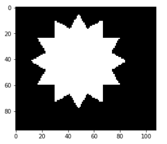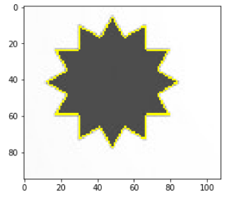


​    

- cv2.arcLength(con,True)

     - `Contour의 둘레 길이`를 구할 수 있습니다. 사각형의 경우는 둘레길이의 합이 됩니다. 아래 함수의 2번째 argument가 `true이면 폐곡선 도형을 만들어 둘레길이`를 구하고, `False이면 시작점과 끝점을 연결하지 않고 둘레 길이`를 구합니다.

     - 사용예시

       ```python
       peri = cv2.arcLength(c, True)
       #c는 contours 요소 중 하나
       ```

       

- cv2.approxPolyDP(curve, epsilon, closed[, approxCurve]) → approxCurve

     - curve – contours point array

     - epsilon – original cuve와 근사치의 최대거리. 최대거리가 클 수록 더 먼 곳의 Point까지 고려하기 때문에 Point수가 줄어듬.

     - closed – 폐곡선 여부

     - 근사치가 적용된 contours point array 반환

     - 사용예시

       ```python
       approx = cv2.approxPolyDP(c, 0.02 * peri, True) 
       #c는 contours의 값 일부, 꼭지점의 개수를 반환한다.
       ```

       

- cv2.putText(img, text, org, font, fontSacle, color)

     - 이미지에 텍스트 추가

     - img – image

     - text – 표시할 문자열

     - org – 문자열이 표시될 위치. 문자열의 bottom-left corner점

     - font – font type. CV2.FONT_XXX

     - fontSacle – Font Size

     - color – fond color

          

- cv2.ellipse(img, center, axes, angle, startAngle, endAngle, color[, thickness[, lineType[, shift]]]) → img

     - 타원 그리기
     - 중심점, 반지름 크기, 색깔, 굵기
     - img – image
     - center – 타원의 중심
     - axes – 중심에서 가장 큰 거리와 작은 거리
     - angle – 타원의 기울기 각
     - startAngle – 타원의 시작 각도
     - endAngle – 타원이 끝나는 각도
     - color – 타원의 색
     - thickness – 선 두께 -1이면 안쪽을 채움

     

- cv2.morphologyEx(src, op, kernel[, dst[, anchor[, iterations[, borderType[, borderValue]]]]]) → dst

     - src – Source image. The number of channels can be arbitrary. The depth should be one of CV_8U, CV_16U, CV_16S, CV_32F` or ``CV_64F.

     - op – Type of a morphological operation that can be one of the following:

          - MORPH_OPEN - an opening operation
          - MORPH_CLOSE - a closing operation
          - MORPH_GRADIENT - a morphological gradient. Dilation과 erosion의 차이.
          - MORPH_TOPHAT - “top hat”. Opeining과 원본 이미지의 차이
          - MORPH_BLACKHAT - “black hat”. Closing과 원본 이미지의 차이

     - kernel – structuring element. cv2.getStructuringElemet() 함수로 만들 수 있음.

     - anchor – structuring element의 중심. default (-1,-1)로 중심점.

     - iterations – erosion and dilation 적용 횟수

     - borderType – Pixel extrapolation method. See borderInterpolate for details.

     - borderValue – Border value in case of a constant border. The default value has a special meaning.

     - 사용예시

          ```python
          #침식 연산자
          dilated = cv2.morphologyEx(binary, cv2.MORPH_DILATE, (3,3), iterations = 8)
          # 이터레이션 수 커질수록 흩어짐
          
          #팽창 연산자, 구멍이 메워짐
          eroded = cv2.morphologyEx(binary, cv2.MORPH_ERODE, (3,3), iterations = 10) 
          #이터레이션 수 커질수록 뭉쳐짐
          
          #개방, 주변잡음 제거후 완만하게, 잔 테두리 제거하기
          opened = cv2.morphologyEx(binary, cv2.MORPH_OPEN,
                cv2.getStructuringElement(cv2.MORPH_ELLIPSE, (5,5)), 
                 iterations = 3 )
          
          #폐쇄, 비어있는 구멍 채운 후 원래사이즈로 복귀 , 구멍메꾸기
          closed = cv2.morphologyEx(binary, cv2.MORPH_CLOSE,
                cv2.getStructuringElement(cv2.MORPH_ELLIPSE, (3,3)), 
                 iterations = 12 )
          ```

          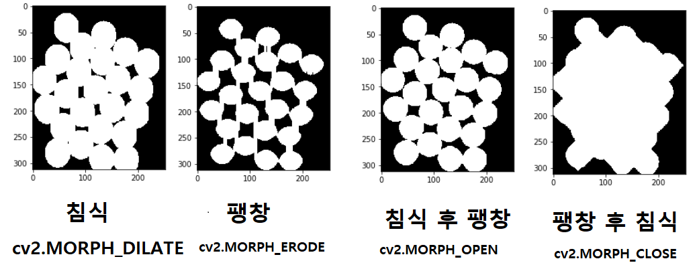


- area = cv2.contourArea(con) 
  - 컨투어의 영역(면적)을 계산, 실수값으로 나옴
  - 사물 탐지할때 사용하면 될듯


- cv2.Canny(원본 이미지, 임계값1, 임계값2, 커널 크기, L2그라디언트) 

  - 많이 쓰는 함수

  - 반환 값은 0 또는 255로 나옴

  - 임계값1은 임계값1 이하에 포함된 가장자리는 가장자리에서 제외합니다.

  - 임계값2는 임계값2 이상에 포함된 가장자리는 가장자리로 간주합니다.

  - 커널 크기는 Sobel 마스크의 Aperture Size를 의미합니다. 포함하지 않을 경우, 자동으로 할당됩니다.

  - L2그라디언트는 L2방식의 사용 유/무를 설정합니다. 사용하지 않을 경우, 자동적으로 L1그라디언트 방식을 사용합니다.

  - L2그라디언트 : (dI/dx)2+(dI/dy)2
    L1그라디언트 : ∥dI/dx∥+∥dI/dy∥

  - 사용예시

    ```python
    edged = cv2.Canny(gray, 10, 250) 
    #외곽선정보 따는거, 가우시안 안쓰면 엣지들이 많이 나옴. 250보다 크면 무조건 엣지를 보겠다. 10보다 작으면 엣지를 안본다
    ```

    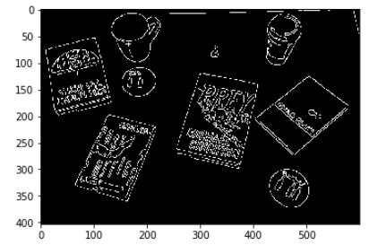


- cv2.circle(img, center, radian, color, thickness)

  - 원그리기

  - img – 그림을 그릴 이미지

  - center – 원의 중심 좌표(x, y)

  - radian – 반지름

  - color – BGR형태의 Color

  - thickness – 선의 두께, -1 이면 원 안쪽을 채움

  - 사용예시

    ```python
    cv2.circle(img, (x, y), int(r), (255, 255, 0), 2)
    # x,y, r(반지름), 색깔, 선굵기(-1은 꽉채움)
    ```

    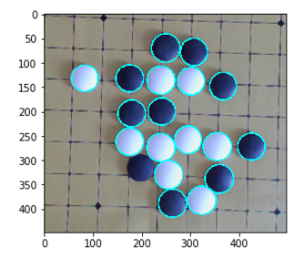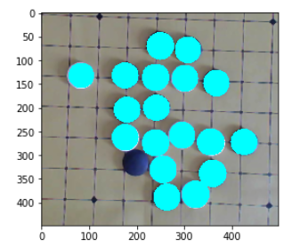
    
    > 왼쪽이 0이상일떄, 오른쪽이 -1일때


- cv2.HoughCircles(image, method, dp, minDist[, circles[, param1[, param2[, minRadius[, maxRadius]]]]]) → circles

  - 원을 찾아주는 전용함수

  - image – 8-bit single-channel image. grayscale image.

  - method – 검출 방법. 

    - 현재는 `HOUGH_GRADIENT(엣지가 있는지 없는지 판단)`가 있음.
    - 캐니엣지가 따로 들어가므로 캐니함수 안써도됨

  - dp

    - dp=1이면 Input Image와 동일한 해상도.(고정으로 씀) 
    - 2일때는 결과를 반으로 줌

  - minDist

    - 검출한 원의 중심과의 최소거리. 
    - 값이 작으면 원이 아닌 것들도 검출이 되고, 너무 크면 원을 놓칠 수 있음.

  - param1

    - 내부적으로 사용하는 canny edge 검출기에 전달되는 Paramter
    - edge threshold low ->  edge가 검출되어 같은 원이 검출됨
    - 에지문턱값으로 불림, 값이 작으면 많이 생성되기 때문에 원이 많이 검출될 
    - 크면 에지가 검출안되기 때문에 원의수도 줄어듬
    - 바둑개수가  검출이 안되면 낮값을 낮춰야 함

  - param2

    - 이 값이 작을 수록 오류가 높아짐. 크면 검출률이 낮아짐.
    - 추정후보지가 원이라고 생각한 수 
    - 크면 정말 원인 애들만 검출하라
    - 작으면 작은 원인 애들도 검출하라

  - minRadius – 원의 최소 반지름.

  - maxRadius – 원의 최대 반지름.

  - 사용예시

    ```python
    circles = cv2.HoughCircles(gray, cv2.HOUGH_GRADIENT, 1, 20, param1=100, param2=30, minRadius=10, maxRadius=50)
    #그레이스케일 이미지 출력
    #cv2.HOUGH_GRADIENT 로 검출하라
    #기존 이미지와 동일한 해상도로 설정하라
    #
    #
    #서로다른 원간에 최소거리를 20으로 설정하라
    #검출된 원의 크기가 10~50 사이만 선정하라
    print(circles) 
  [[[513.5 123.5  26.4]
         :      :     :
      [194.5  49.5  31.4]]]
    #  x좌표   y좌표  반지름
    
    from collections import Counter
    
    def detect_weiqi(img): #하얀색인지 파란색인지 정해주는 함수
        txt = 'black'
        gray = cv2.cvtColor(img, cv2.COLOR_BGR2GRAY)
        _, threshold = cv2.threshold(gray, 100, 255, cv2.THRESH_BINARY)
    
        c = Counter(list(threshold.flatten()))
        if c.most_common()[0][0] != 0:
            txt = 'white'
        return txt, threshold
    
    circles = np.uint16(np.around(circles))
    font = cv2.FONT_HERSHEY_SIMPLEX
    for i in circles[0, :]:
        x, y, r = i    
        cv2.circle(img, (x, y), r, (0, 0, 255), 5)
        crop_img = img[y - r:y + r, x - r:x + r]    
        txt, threshold = detect_weiqi(crop_img) 
        if txt == 'black' :  
            cv2.circle(img, (x, y),int(r*0.7), (0, 0, 0), -1)
        else :
            cv2.circle(img, (x, y), int(r*0.7), (255, 255, 255), -1)         
    imshow("", img)
    ```
    
    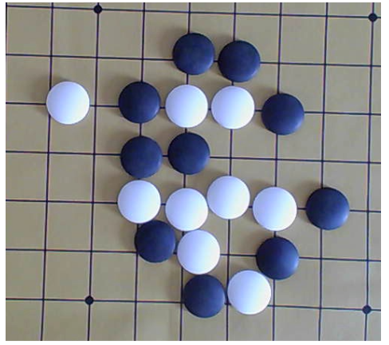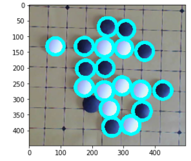


- cv2.getRotationMatrix2D(center, angle, scale) → M

  - 이미지를 회전 시킴

  - center – 이미지의 중심 좌표

  - angle – 회전 각도

  - scale – scale factor(확대율)

  - 값은 다음과 같은 행렬로 나온다.

  - 사용예시

    ```python
  img = cv2.imread("./data/Lena.png")
    height, width = img.shape[:2]
    #print(width,height )
    
    img_center = (width /2, height/2)
    M = cv2.getRotationMatrix2D(img_center, 30, 0.7) # 이미지, 회전각도, 확대배율
    print(M)
    [[  0.60621778   0.35        11.20824764]
     [ -0.35         0.60621778 190.40824764]]
    ```
    
    
    
    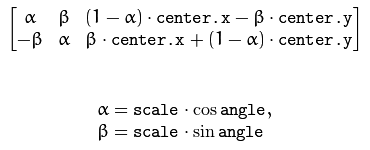 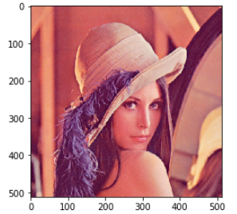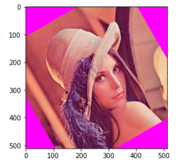


- cv2.flip(img,0) #사진 뒤집기

    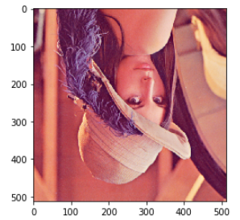


- cv2.warpAffine(src, M, dsize)

  - 이미지의 위치 변경

  - src – Image

  - M – 변환 행렬

  - dsize (tuple) – output image size(ex; (width=columns, height=rows)

  - 사용예시

    ```python
    img = cv2.imread("./data/Lena.png")
    height, width = img.shape[:2]
    print(width,height )
    m = np.float32([
        [1,0,20], 
        [0,1,30]
    #   x,y,크기
    ])
    dst = cv2.warpAffine(img, m , (width, height), borderValue=(255,50,50) )
    imshow('',dst)
    ```

    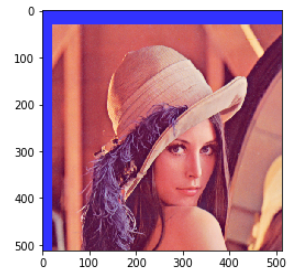


- cv2.getPerspectiveTransform(pts1,pts2)
  
  - 이미지 합체, 해당 점의 4 쌍에서 원근 변환을 계산
  
  - src – 소스 이미지에서 사각형 꼭지점의 좌표.
    dst – 대상 이미지에서 해당 사각형 꼭지점의 좌표.
  
  - 사용예시
  
    ```python
    #좌표순서
    point_list = [[27,179], [611,36], [118,534], [754,325]]
    
    pts1 = np.float32([list(point_list[0]),
                      list(point_list[1]),
                      list(point_list[2]),
                      list(point_list[3])
                      ])
    print(pts1)# 꼭지점 4개
    [[ 27. 179.]
     [611.  36.]
     [118. 534.]
     [754. 325.]]
    
    pts2 = np.float32([ [0,0],[width,0],[0,height],[width,height] ])
    print(pts2) # 0,0 -> 0,x -> y,0 -> x,y 순
    [[  0.    0. ]
     [405.5   0. ]
     [  0.  288.5]
     [405.5 288.5]]
    
    M = cv2.getPerspectiveTransform(pts1,pts2) # 이미지, 회전각도, 확대배율
    print(M)
    [[ 6.11584185e-01 -1.56772284e-01  1.15494658e+01]
     [ 2.26751420e-01  9.26033771e-01 -1.71882333e+02]
     [-1.29571760e-04  4.23781663e-04  1.00000000e+00]]
    ```
  
  
  
- cv2.warpPerspective(img, M , (width,height) )

  - 이미지에 원근 변환을 적용

  - Perspective(원근법) 변환은 직선의 성질만 유지가 되고, 선의 평행성은 유지가 되지 않는 변환입니다. 기차길은 서로 평행하지만 원근변환을 거치면 평행성은 유지 되지 못하고 하나의 점에서 만나는 것 처럼 보입니다.(반대의 변환도 가능)

  - 4개의 Point의 Input값과이동할 output Point 가 필요합니다.

  - 변환 행렬을 구하기 위해서는 `cv2.getPerspectiveTransform()` 함수가 필요하며, `cv2.warpPerspective()` 함수에 변환행렬값을 적용하여 최종 결과 이미지를 얻을 수 있습니다.

  - src – 입력 이미지.

  - dst – 크기 dsize 와 유형이 같은 이미지를 출력합니다 src.

  - M – 3 회 ~ 3 회 변환 행렬.

  - dsize – 출력 이미지의 크기입니다.

  - flags – 보간 방법 ( INTER_LINEAR또는 INTER_NEAREST)과 선택적인 플래그의 

  - WARP_INVERSE_MAP조합 M으로 역변환 ( \ texttt {dst} \ rightarrow \ texttt {src}) 으로 설정 됩니다 .

  - borderMode – 픽셀 외삽 법 ( BORDER_CONSTANT또는 BORDER_REPLICATE).

  - borderValue – 경계가 일정한 경우에 사용되는 값. 기본적으로 0과 같습니다.

  - 사용예시

    ```python
    M = cv2.getPerspectiveTransform(pts1,pts2) # 이미지, 회전각도, 확대배율
    print(M)
    
    #원근법 이미지에 적용
    rotate_img = cv2.warpPerspective(img, M , (width,height) ) 
    imshow(" ", img) #원본 
    imshow('',rotate_img)#적용본
    ```

    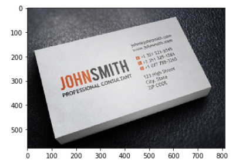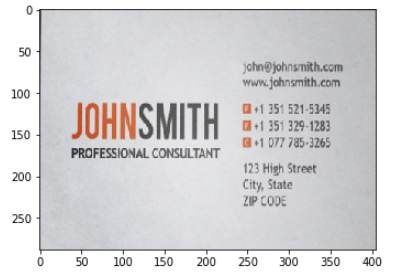
    
    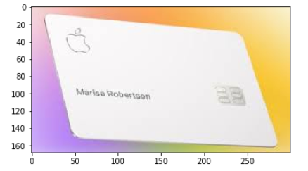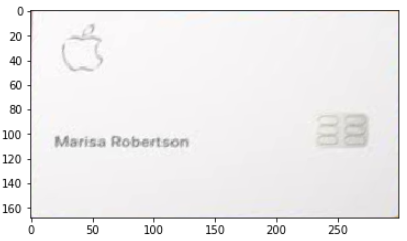

    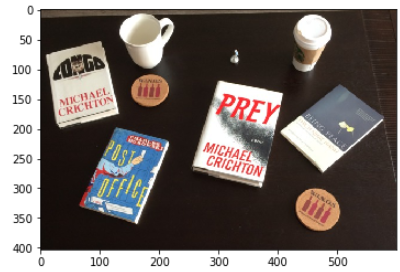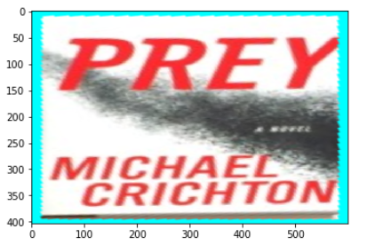


인터플레이스 알고리즘

거꾸로 푸는

작은해상도의 이미지를 큰 해상도로 복사할때 사용