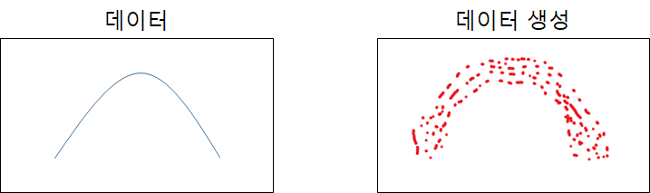
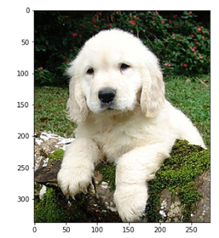
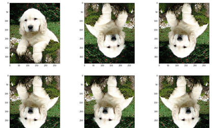

# Augmentation

- 기존 데이터셋을 부풀려서 성능을 더 좋게 만든다는 것



> train 데이터가 부족해서 과적합이 발생할 경우 임의로 생성



> 이런 데이터를



> 이렇게 여러개 생성하여 train 데이터를 늘려서 학습할 수 있따.


## ImageDataGenerator 사용방법

- 아래의 케라스 모듈을 정의 후 다음과 같이 정의한다.

- [케라스 공식문서](https://keras.io/preprocessing/image/) 참조해라, 옵션이 너무 다양하다..

  ```python
  #모델 호출
  from keras.preprocessing.image import ImageDataGenerator
  
  #데이터 생성x
  train_datagen = ImageDataGenerator(rescale=1./255) # 0~ 255 값인 데이터를 0~1로 정규화
          
  
  #ImageDataGenerator 함수 안에 다음과 같이 옵션을 지정하여 데이터를 생성할 수 있다.
  #horizontal_flip 을 True로 설정하여 해당 이미지와 유사한 데이터를 생성한다.
  train_datagen = ImageDataGenerator(rescale=1./255, 
          shear_range=0.2, #전단력, 화면이 반대로
          zoom_range=0.2, #줌 적용
          horizontal_flip=True)  # 수평으로 전환
  
  
  
  
  #데이터 재정의 및 호출방법 정의
  train_generator = train_datagen.flow_from_directory(
          'data/train', # 데이터 경로 지정
          target_size=(24, 24), #작은사이즈로 명시해봐라 #4차원으로 알아서 만들어 주기때문에 reshape 해줄 필요 없다
          batch_size=3, #3개씩 끄집어 내겠다
          class_mode='categorical') #원핫인코딩으로 
  
  ```

  

  


## 실습


데이터 불러와서 평가가 33퍼라면 랜덤이다 즉 학습이 안된다.


어그 적용할 때

기존 네트웍 넣고잉


전체 레이어 프리징 할 때